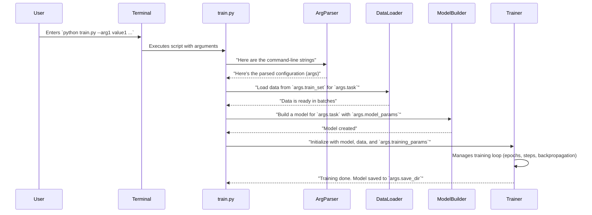

# Chapter 1: Experiment Configuration & Execution (`train.py`)

Welcome to the ATOMICA project! This tutorial series will guide you through the key components of ATOMICA, helping you understand how to use and potentially extend this powerful molecular modeling toolkit.

Let's dive into our very first topic: how we tell ATOMICA what to do, what data to use, and how to learn. This is all managed by a central script called `train.py`.

## What's the Big Idea? The "Mission Control" for Your Experiments

Imagine you're a scientist preparing for an important space mission. You have a rocket (our AI model), fuel (your data), and a target destination (the problem you want to solve, like predicting how strongly a drug molecule binds to a protein). Before launching, you need a control panel to:

*   Tell the rocket which fuel to use.
*   Set the engine power (how fast the model learns).
*   Define the mission duration (how long to train).
*   Specify where to send mission reports (saving results).

In ATOMICA, `train.py` is precisely this "Mission Control" panel. It's a Python script that you run from your terminal, and you give it instructions through command-line arguments. These arguments are like the knobs, dials, and switches on your control panel.

**Our Central Use Case for this Chapter:**
Let's say you want to train a simple model to classify molecules. You need to tell ATOMICA:
1.  Where your training molecule data is located.
2.  What kind of task it is (e.g., classification).
3.  How many learning cycles (epochs) to run.
4.  Where to save the trained model.

`train.py` is how you'll provide all this information!

## Arguments: The Language of `train.py`

`train.py` uses a standard Python library called `argparse` to understand the instructions you give it. Each instruction is an "argument." There are many arguments available, allowing for very flexible experiments. Don't worry, you don't need to know all of them at once! We'll cover the most important ones.

Think of arguments as different settings you can tweak:

*   **Data Arguments:** Specify your datasets.
    *   `--train_set`: Path to your training data file (e.g., a list of molecules and their properties).
    *   `--valid_set`: Path to your validation data file (used to check model performance during training).
    *   `--task`: What kind of job the model needs to do (e.g., `binary_classifier` for yes/no predictions, `pretrain_torsion_masking` for learning molecular structures).

*   **Training Arguments:** Control the learning process.
    *   `--lr` (learning rate): How big of a step the model takes when learning. Too big, it might overshoot; too small, it learns too slowly.
    *   `--max_epoch`: How many times the model will see the entire training dataset.
    *   `--batch_size`: How many molecules the model looks at before updating its knowledge.
    *   `--save_dir`: The folder where your trained models and logs will be saved.

*   **Model Architecture Arguments:** Define the "brain" of your model.
    *   `--atom_hidden_size`: The complexity of how the model "thinks" about each atom.
    *   `--n_layers`: How many processing layers the model has (like layers in a deep cake!).
    *   More on model details in [Core Graph Neural Network (ATOMICA)](05_core_graph_neural_network__atomica__.md).

*   **Hardware & Logging Arguments:**
    *   `--gpus`: Which GPUs (Graphics Processing Units) to use for faster training.
    *   `--use_wandb`: An option to log your experiment details to a cool online dashboard called Weights & Biases.
    *   `--run_name`: A custom name for your experiment run, making it easy to find later.

## Launching Your First "Mission": Using `train.py`

Let's see how you'd tell ATOMICA to run a basic experiment. You typically do this by typing a command in your terminal. This command starts with `python train.py` (or `torchrun train.py` for distributed training) followed by the arguments you want to set.

Here's a simplified example based on one of the project's script files:

```bash
# This is a command you'd run in your terminal
python train.py \
    --train_set path/to/your/training_data.pkl \
    --valid_set path/to/your/validation_data.pkl \
    --task binary_classifier \
    --lr 0.0001 \
    --max_epoch 10 \
    --save_dir ./my_first_model \
    --run_name my_awesome_experiment
```

**What does this command do?**

*   `python train.py`: Tells your computer to run the `train.py` script.
*   `--train_set path/to/your/training_data.pkl`: Specifies the location of the training data. You'd replace `path/to/your/training_data.pkl` with the actual path.
*   `--valid_set path/to/your/validation_data.pkl`: Specifies the validation data.
*   `--task binary_classifier`: Tells the model its job is binary classification.
*   `--lr 0.0001`: Sets the learning rate.
*   `--max_epoch 10`: Instructs the model to train for 10 epochs.
*   `--save_dir ./my_first_model`: Tells ATOMICA to save the results in a folder named `my_first_model` in the current directory.
*   `--run_name my_awesome_experiment`: Gives this specific training run a memorable name.

**What happens when you run this?** (Output)
1.  ATOMICA will start printing messages to your terminal, showing the setup and progress.
2.  It will load your data.
3.  It will build the model according to the task and other parameters.
4.  The training process will begin, iterating through your data for 10 epochs.
5.  Periodically, it will evaluate the model on the validation set.
6.  Finally, it will save the trained model files and any logs into the `./my_first_model` directory.

You won't see numbers as direct output in the terminal usually, but rather status messages, progress bars, and metrics like accuracy or loss. The real "output" is the trained model saved to disk and the logged metrics.

## Under the Hood: What `train.py` Does Step-by-Step

When you execute `train.py`, a sequence of operations kicks off:

1.  **Parse Arguments:** The script first reads all the command-line arguments you provided (like `--lr`, `--train_set`).
2.  **Setup Environment:** It sets up things like random seeds (for reproducibility) and prepares for multi-GPU training if specified.
3.  **Load Data:** Using the `--train_set` and `--valid_set` paths, it loads your molecular data. This involves complex steps detailed in [Dataset Handling & Preprocessing](07_dataset_handling___preprocessing_.md).
4.  **Create Model:** Based on the `--task` and other model-specific arguments (e.g., `--atom_hidden_size`), it constructs the neural network. Different tasks might use different model structures, as you'll see in chapters like [Pre-training Models (DenoisePretrainModel)](02_pre_training_models__denoisepretrainmodel__.md) and [Downstream Task Models & Prediction Heads](03_downstream_task_models___prediction_heads_.md).
5.  **Initialize Trainer:** A `Trainer` object is created. This object is responsible for the actual training loop, optimization, and saving checkpoints. We'll explore this more in [Training Orchestration (Trainer)](09_training_orchestration__trainer_.md).
6.  **Start Training:** The `Trainer` begins the training process, feeding data to the model, calculating errors (loss), and updating the model's parameters.
7.  **Logging & Saving:** Throughout training, metrics are logged (e.g., to the console or Weights & Biases). The best-performing model (and potentially others) are saved to the `--save_dir`.

Here's a simplified view of this flow:



## A Peek at the Code: `train.py` Structure

Let's look at tiny, simplified snippets from `train.py` to see how these ideas translate to code.

**1. Parsing Arguments (`parse()` function):**
This is where all those command-line options are defined.

```python
# train.py (super-simplified snippet from parse())
import argparse

def parse():
    parser = argparse.ArgumentParser(description='ATOMICA Training Script')
    
    # --- Data related ---
    parser.add_argument('--train_set', type=str, required=True, 
                        help='Path to your training dataset')
    parser.add_argument('--task', type=str, required=True,
                        choices=['binary_classifier', 'pretrain_torsion_masking'], # Example choices
                        help='The type of learning task')
    
    # --- Training related ---
    parser.add_argument('--lr', type=float, default=1e-3, 
                        help='Learning rate for the optimizer')
    parser.add_argument('--max_epoch', type=int, default=100,
                        help='Maximum number of training epochs')
    # ... many more arguments are defined here ...
    
    return parser.parse_args()
```
This code sets up `argparse` to expect arguments like `--train_set` and `--lr`. If you provide an argument that's not defined, or miss a `required=True` one, `argparse` will show an error.

**2. The Main Logic (`main()` function):**
This function orchestrates the whole process using the parsed arguments.

```python
# train.py (super-simplified sketch of main())

# (Import statements for datasets, models, trainers would be here)
# from data.dataset import create_dataset # Fictional simplified import
# import models
# import trainers

def main(args): # 'args' contains all parsed command-line arguments
    print(f"Starting experiment: {args.run_name}")
    print(f"Task: {args.task}, Learning rate: {args.lr}")

    # 1. Setup (e.g., random seeds for reproducibility)
    # setup_seed(args.seed) 

    # 2. Load Datasets (Covered in [Dataset Handling & Preprocessing](07_dataset_handling___preprocessing_.md))
    print(f"Loading training data from: {args.train_set}")
    # train_dataset = create_dataset(task=args.task, path=args.train_set)
    # valid_dataset = create_dataset(task=args.task, path=args.valid_set)
    # train_loader = DataLoader(train_dataset, batch_size=args.batch_size)
    # valid_loader = DataLoader(valid_dataset, batch_size=args.batch_size)

    # 3. Create Model (Covered in [Core Graph Neural Network (ATOMICA)](05_core_graph_neural_network__atomica__.md) etc.)
    # model = models.create_model(args) 
    # print(f"Model created with {count_parameters(model)/1e6:.2f}M parameters.")

    # 4. Setup Trainer (Covered in [Training Orchestration (Trainer)](09_training_orchestration__trainer_.md))
    # training_config = trainers.TrainConfig(save_dir=args.save_dir, lr=args.lr, max_epoch=args.max_epoch)
    # trainer = create_trainer(model, train_loader, valid_loader, training_config)
    
    # 5. Start Training!
    print(f"Starting training for {args.max_epoch} epochs...")
    # trainer.train(gpus=args.gpus) 
    
    print("Training complete! Model saved in:", args.save_dir)

if __name__ == '__main__':
    args = parse()  # Get arguments from command line
    # main(args)      # Run the main training logic (commented out for this example)
    print(f"Simulated run with task: {args.task if hasattr(args, 'task') else 'N/A (add --task)'}") 
    # For a real run, you'd uncomment main(args)
```
This `main` function takes the `args` object (which holds all your settings) and uses it to initialize datasets, models, and the trainer, then starts the training.

## Shell Scripts: Your Convenient Launchpad

Often, you'll have many arguments for `train.py`. Typing them all out every time can be tedious. That's why projects like ATOMICA include shell scripts (files usually ending in `.sh`). These scripts are just text files that contain the full `train.py` command along with a pre-defined set of arguments.

For example, the `scripts/train_atomica_ligand.sh` file contains a command like this (simplified):

```bash
#!/bin/bash
# ... (lines starting with #SBATCH are for cluster job schedulers) ...

# The actual command to run train.py:
python train.py \
    --train_set datasets/binder_train.pkl \
    --valid_set datasets/binder_valid.pkl \
    --task binary_classifier \
    --lr 1e-4 \
    --max_epoch 50 \
    --atom_hidden_size 32 \
    # ... many other arguments ...
    --save_dir model_checkpoints \
    --run_name ATOMICA-Ligand
```
You can simply run this script from your terminal (e.g., `bash scripts/train_atomica_ligand.sh`), and it will execute `train.py` with all those specified arguments. This is super handy for repeating experiments or sharing configurations.

## Conclusion: Your Control Panel for Molecular Discovery

You've now learned about `train.py`, the central nervous system of ATOMICA for configuring and launching training experiments. You've seen how it uses command-line arguments to let you customize every aspect of the "mission," from the data and model architecture to training parameters and logging.

Key takeaways:
*   `train.py` is the main entry point for training models.
*   Command-line arguments provide immense flexibility to define your experiment.
*   It orchestrates data loading, model creation, training, and saving.
*   Shell scripts can make running complex configurations much easier.

With this foundation, you're ready to explore more specific parts of ATOMICA. Next, we'll look into a crucial aspect of modern machine learning: pre-training.

Ready to continue? Let's move on to [Chapter 2: Pre-training Models (DenoisePretrainModel)](02_pre_training_models__denoisepretrainmodel__.md).

---

Generated by [AI Codebase Knowledge Builder](https://github.com/The-Pocket/Tutorial-Codebase-Knowledge)