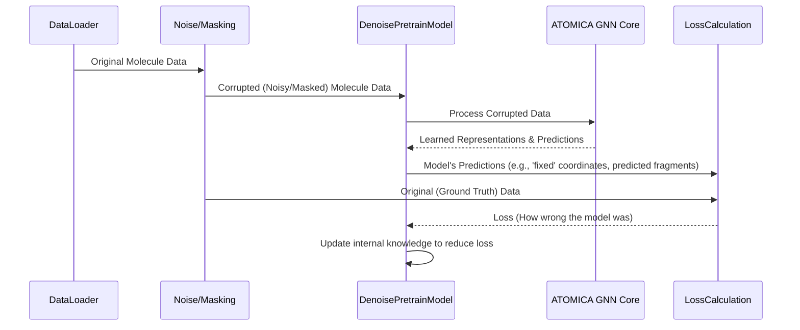

# Chapter 2: Pre-training Models (`DenoisePretrainModel`)

In [Chapter 1: Experiment Configuration & Execution (`train.py`)](01_experiment_configuration___execution___train_py___.md), we learned how to use `train.py` as our mission control to tell ATOMICA what to do. Now, let's explore one of the most powerful strategies ATOMICA uses to understand molecules: **pre-training**.

## What's the Big Idea? Teaching Models the ABCs of Chemistry

Imagine you want to become a chemical engineer. Before you can design a complex chemical plant, you first need to learn the fundamentals: basic physics, chemistry, what atoms are, how they bond, common molecular structures, etc. This foundational knowledge makes learning specialized engineering tasks much easier.

Pre-training in ATOMICA is very similar! Before we ask a model to perform a specific, complex task (like predicting drug effectiveness – we call these "downstream tasks"), we first "pre-train" it. During pre-training, the model learns the fundamental rules and patterns of chemistry and molecular structures from a large amount of general molecular data.

**Our Central Use Case for this Chapter:**
We want our AI model to develop a general "intuition" about molecules. For instance, it should learn:
*   What typical 3D arrangements of atoms look like.
*   How to recognize common chemical groups or fragments even if some information is missing.

This general knowledge, learned through pre-training, will make the model much more effective when we later fine-tune it for a specific task. The primary model type responsible for this in ATOMICA is `DenoisePretrainModel`.

## Self-Supervised Learning: Learning by Puzzles

How does a model learn these fundamentals without a teacher explicitly telling it "this is a carbon atom" or "this bond angle is typical"? It learns through **self-supervised learning**.

Think of it like giving the model a puzzle. We take a piece of molecular data, "mess it up" slightly, and then ask the model to restore it to its original state or fill in missing pieces. Because the model can check its answers against the original, uncorrupted data, it teaches itself!

The main "puzzles" or tasks `DenoisePretrainModel` solves are:

1.  **Denoising Corrupted Coordinates:**
    *   Imagine you have a perfect 3D model of a molecule.
    *   We slightly "shake" or "nudge" the atoms from their original positions (add noise to their coordinates).
    *   The model's job is to look at this "shaken" molecule and predict the original, stable positions of the atoms.
    *   By doing this repeatedly, it learns what realistic 3D structures look like.

    ```mermaid
    graph LR
        A[Original Molecule (Clean 3D Structure)] --> B(Apply Noise);
        B --> C[Noisy Molecule (Atoms Shifted)];
        C --> D{DenoisePretrainModel};
        D --> E[Predicted Original Structure];
        E --> F{Compare with A};
        F --> D -- Feedback: Learn! --> G[Model gets better at predicting clean structures];
    ```

2.  **Identifying Masked Fragments:**
    *   Imagine a molecule is made of several building blocks or "fragments."
    *   We "hide" or "mask" one or more of these fragments.
    *   The model's job is to look at the visible parts of the molecule and predict what the hidden fragment(s) are.
    *   This helps the model learn about common chemical substructures and how they fit together. You'll learn more about fragments in [Molecular Fragmentation and Tokenization](06_molecular_fragmentation_and_tokenization_.md).

    ```mermaid
    graph LR
        H[Original Molecule (e.g., A-B-C fragments)] --> I(Mask a Fragment);
        I --> J[Masked Molecule (e.g., A-MASK-C)];
        J --> K{DenoisePretrainModel};
        K --> L[Predicted Hidden Fragment (e.g., "B")];
        L --> M{Compare with original fragment "B"};
        M --> K -- Feedback: Learn! --> N[Model gets better at identifying fragments];
    ```

By successfully solving these "denoising" and "masking" puzzles, the `DenoisePretrainModel` builds a strong internal understanding of molecular principles.

## Using Pre-training with `train.py`

In Chapter 1, we saw the `--task` argument for `train.py`. To perform pre-training, you'd specify a pre-training task. ATOMICA offers several, for example:

*   `--task pretrain_gaussian`: Focuses on denoising atom coordinates where the "shaking" (noise) is based on a Gaussian distribution.
*   `--task pretrain_torsion_masking`: A more complex task where the model learns to denoise changes in torsion angles (rotations around bonds) *and* identify masked molecular fragments.

You'll also use other arguments to control the "difficulty" of these puzzles, like:
*   `--atom_noise <value>`: How much to "shake" the atom positions.
*   `--torsion_noise <value>`: How much to "twist" the rotatable bonds.
*   `--mask_proportion <value>`: What fraction of molecular fragments to hide.

(We'll dive deeper into how this noise is applied in [Noise Augmentation for Pre-training](08_noise_augmentation_for_pre_training_.md).)

Here's a simplified example of how you might launch a pre-training run:

```bash
# This is a command you'd run in your terminal
python train.py \
    --train_set path/to/your/large_general_molecule_dataset.pkl \
    --task pretrain_torsion_masking \
    --atom_hidden_size 128 \
    --n_layers 4 \
    --torsion_noise 0.3 \
    --mask_proportion 0.15 \
    --lr 0.0001 \
    --max_epoch 50 \
    --save_dir ./my_pretrained_atomica_model \
    --run_name my_first_pretrain_run
```

**What happens when you run this?**
1.  `train.py` parses these arguments.
2.  It loads a large dataset of diverse molecules.
3.  It sets up a `DenoisePretrainModel`.
4.  During training, for each molecule:
    *   The data loader (or a process before it) applies torsion noise and masks some fragments.
    *   The `DenoisePretrainModel` receives this "damaged" molecule.
    *   The model tries to predict the original torsion angles and the identities of the masked fragments.
    *   It compares its predictions to the true, original data and learns from its mistakes.
5.  After many epochs, the model in `./my_pretrained_atomica_model` will have learned general chemical knowledge. This pre-trained model can then be used as a starting point for other, more specific tasks (more on this in [Chapter 3: Downstream Task Models & Prediction Heads](03_downstream_task_models___prediction_heads_.md)).

## Under the Hood: A Glimpse into `DenoisePretrainModel`

Let's briefly look at what happens inside the `DenoisePretrainModel`. You don't need to understand all the details now, but it's good to have a general idea.

**Step-by-Step Flow (Simplified):**

1.  **Receive Data:** The model gets a batch of molecules. These molecules have already been "corrupted" – some atom positions might be off, some torsion angles changed, or some fragments masked. The original, "clean" information is also kept aside to check the model's answers.
2.  **Embed Input:** Atoms and molecular blocks (fragments) are converted into numerical representations (embeddings) that the neural network can understand. (See [Molecular Data Representation (Atom, Block, VOCAB)](04_molecular_data_representation__atom__block__vocab__.md)).
3.  **Core Processing (ATOMICA Encoder):** The heart of the model is the [Core Graph Neural Network (ATOMICA)](05_core_graph_neural_network__atomica__.md) encoder. This network processes the molecular graph, passing information between atoms and blocks, trying to understand the context of the noisy/masked parts.
4.  **Make Predictions:** Based on the processed information, the model makes predictions:
    *   For coordinate/torsion denoising: It predicts the necessary corrections to restore the original geometry.
    *   For masking: It predicts the probability of each possible fragment type for the masked positions.
5.  **Calculate Loss:** The model's predictions are compared to the true, original data. The difference (the "error" or "loss") is calculated. For example, how far off were the predicted atom positions? Was the correct masked fragment identified?
6.  **Learn (Backpropagation):** The model uses this loss to adjust its internal parameters (weights) so that next time, its predictions will be closer to the truth. This learning process is managed by the [Training Orchestration (Trainer)](09_training_orchestration__trainer_.md).

Here's a simplified diagram of this flow:



**A Peek at the Code (`models/pretrain_model.py`):**

The actual code for `DenoisePretrainModel` is quite sophisticated, but let's look at super-simplified snippets to get the gist.

1.  **Initialization (`__init__`):**
    When a `DenoisePretrainModel` is created, it's set up with parameters that define which denoising tasks it should perform and how.

    ```python
    # models/pretrain_model.py (Very Simplified __init__ of DenoisePretrainModel)
    import torch.nn as nn
    from .ATOMICA.encoder import ATOMICAEncoder # Core GNN

    class DenoisePretrainModel(nn.Module):
        def __init__(self, atom_hidden_size, block_hidden_size,
                     # These come from --atom_noise, --torsion_noise etc. in train.py
                     atom_noise=True,       # Should it denoise atom positions?
                     torsion_noise=True,    # Should it denoise torsion angles?
                     num_masked_block_classes=None, # How many types of fragments can be masked?
                     # ... other architecture parameters ...
                     ):
            super().__init__()
            self.atom_noise_active = atom_noise # Store if this task is active
            self.torsion_noise_active = torsion_noise
            self.masking_objective_active = (num_masked_block_classes is not None)

            # The main engine: ATOMICA GNN (Details in [Core Graph Neural Network (ATOMICA)](05_core_graph_neural_network__atomica__.md))
            self.encoder = ATOMICAEncoder(atom_hidden_size, ...) 
            # ... potentially other layers for processing atom-level info ...
            self.top_encoder = ATOMICAEncoder(block_hidden_size, ...) # For block-level info

            if self.masking_objective_active:
                # A layer to predict the type of masked blocks
                self.masked_ffn = nn.Linear(block_hidden_size, num_masked_block_classes)
            # ... other layers to predict noise values for atom/torsion denoising ...
    ```
    This `__init__` method sets up the different parts of the model, including the powerful `ATOMICAEncoder` which does the main graph processing, and specific layers for each pre-training task (like `masked_ffn` for predicting masked fragments).

2.  **Forward Pass (`forward`):**
    The `forward` method defines what happens when the model receives input data. It processes the noisy/masked molecule and calculates the loss.

    ```python
    # models/pretrain_model.py (Very Simplified forward method)
    import torch.nn.functional as F # For loss functions

    class DenoisePretrainModel(nn.Module):
        # ... (init from above) ...

        def forward(self, 
                    Z_perturbed, # Noisy atom coordinates
                    B_original, A_original, # Original block and atom types
                    # ... other inputs like masked indices, true noise values for comparison ...
                    atom_score_truth, # The actual noise added to atoms (ground truth)
                    masked_labels_truth # The actual types of masked blocks (ground truth)
                    ):
            
            # 1. Process atom-level data with the encoder (GNN)
            # `pred_atom_noise` is the model's guess of the noise that was applied
            _, _, _, pred_atom_noise, _ = self.encoder(initial_atom_features, Z_perturbed, ...) 

            # ... (Process block-level data with top_encoder, get block_repr) ...
            # block_repr = self.top_encoder(...)

            # 2. Calculate losses for each active pre-training task
            total_loss = 0.0
            atom_denoising_loss = 0.0
            if self.atom_noise_active:
                # How different is the model's predicted noise from the true noise?
                atom_denoising_loss = F.mse_loss(pred_atom_noise, atom_score_truth)
                total_loss += self.atom_weight * atom_denoising_loss # Weights from args
            
            masking_loss = 0.0
            if self.masking_objective_active:
                # Get predictions for masked blocks using block_repr
                # masked_logits = self.masked_ffn(block_repr[indices_of_masked_blocks])
                # How different are predicted fragment types from true fragment types?
                # masking_loss = F.cross_entropy(masked_logits, masked_labels_truth)
                # total_loss += self.mask_weight * masking_loss # Weights from args
            
            # ... (add torsion_loss if self.torsion_noise_active, etc.) ...

            # Return various values including the total loss to guide learning
            # The Trainer (Chapter 9) uses this loss to update the model
            return {"loss": total_loss, "atom_loss": atom_denoising_loss, ...}
    ```
    In the `forward` method, the model takes the "damaged" molecular data (like `Z_perturbed`), passes it through its encoders, and makes predictions (like `pred_atom_noise` or `masked_logits`). Then, it compares these predictions to the ground truth (e.g., `atom_score_truth`, `masked_labels_truth`) to calculate various losses. These losses tell the model how "wrong" it was, and this information is used to make the model better over time.

The `DenoisePretrainModel` has variants like `DenoisePretrainModelWithBlockEmbedding` which can incorporate additional information about molecular blocks, but the core idea of learning by denoising or unmasking remains the same.

## Conclusion: Building a Strong Foundation

You've now learned about pre-training and the `DenoisePretrainModel` in ATOMICA. This self-supervised learning approach allows our models to learn fundamental chemical and structural properties *before* they are asked to solve specific, specialized problems. It's like sending a student to learn basic science before they tackle advanced engineering.

Key takeaways:
*   **Pre-training** builds a foundational understanding of molecular principles.
*   It uses **self-supervised learning**, primarily through **denoising** (fixing "broken" data) and **unmasking** (filling in missing parts).
*   The `DenoisePretrainModel` is the main ATOMICA component for this.
*   You configure pre-training tasks (e.g., `pretrain_torsion_masking`) and noise levels using `train.py` arguments.
*   The result is a pre-trained model with general chemical "intuition."

This foundational knowledge is incredibly valuable. But how do we use these pre-trained models to solve actual, specific problems, like predicting if a drug will bind to a target protein? That's where "downstream tasks" and "prediction heads" come in.

Let's explore that next in [Chapter 3: Downstream Task Models & Prediction Heads](03_downstream_task_models___prediction_heads_.md).

---

Generated by [AI Codebase Knowledge Builder](https://github.com/The-Pocket/Tutorial-Codebase-Knowledge)