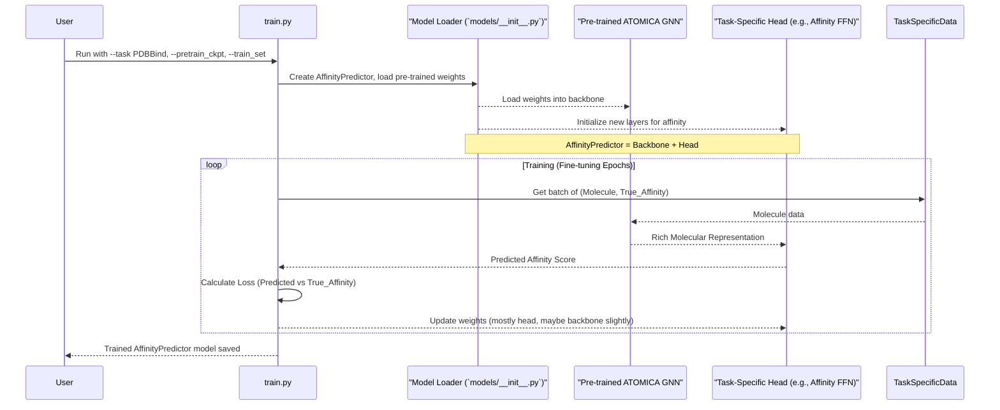

# Chapter 3: Downstream Task Models & Prediction Heads

In [Chapter 2: Pre-training Models (DenoisePretrainModel)](02_pre_training_models__denoisepretrainmodel__.md), we saw how models like `DenoisePretrainModel` learn the fundamental "language" of chemistry through self-supervised tasks. This gives them a broad understanding of molecular structures. But what if we want the model to perform a very specific job, like predicting if a drug will be effective, or classifying molecules as toxic or non-toxic?

This is where **Downstream Task Models** and **Prediction Heads** come into play. They allow us to take the general knowledge from a pre-trained model and specialize it for a particular predictive task.

## What's the Big Idea? Specializing Your Molecular Expert

Think of our pre-trained model from Chapter 2 as a highly educated general scientist. They know a lot about chemistry, physics, and biology – a solid foundation. However, to solve a specific problem, say, designing a new drug for a particular disease, you might need a specialist, like a medicinal chemist.

Downstream task models are like these specialists. We take our "general scientist" (the pre-trained model) and give them some extra, focused training and a specialized "tool" (a prediction head) to excel at a particular job.

**Our Central Use Case for this Chapter:**
Imagine we have a `DenoisePretrainModel` that has learned a lot about general molecular structures. Now, we want to use this knowledge to:
1.  **Predict Binding Affinity:** For a given drug molecule and a target protein, predict how strongly they will bind together. This is often a numerical score (e.g., binding energy).
2.  **Classify Molecules:** For a set of molecules, classify them into categories, for example, "active" or "inactive" against a specific biological target.

These specific jobs are called "downstream tasks."

## Key Concepts: The "Backbone" and the "Head"

To adapt our generalist pre-trained model for a specialist role, we typically use two main components:

1.  **The Pre-trained Backbone:**
    This is the core of our pre-trained model, often the powerful [Core Graph Neural Network (ATOMICA)](05_core_graph_neural_network__atomica__.md) (like `ATOMICAEncoder` inside `DenoisePretrainModel`). Its job is to take a molecule as input and generate a rich, numerical representation (a set of features) that captures its important chemical and structural properties. It has already learned a lot about molecules from the pre-training phase.

2.  **The Prediction Head:**
    This is a small, new set of neural network layers that we add *on top* of the pre-trained backbone.
    *   It takes the rich molecular representation generated by the backbone as its input.
    *   It then transforms this representation into the specific output we need for our task. For example:
        *   For binding affinity prediction, the head might output a single number.
        *   For binary classification (e.g., active/inactive), it might output a score that can be converted into a probability for each class.

    Think of the backbone as a versatile, general-purpose robot arm, and the prediction head as a specialized tool you attach to it. Need to weld? Attach a welding tool. Need to paint? Attach a paint sprayer. The arm (backbone) does the complex movement and positioning, while the tool (head) performs the specific action.

    ```mermaid
    graph TD
        A[Input Molecule] --> B(Pre-trained Backbone - ATOMICA GNN);
        B --> C[Rich Molecular Representation];
        C --> D(Prediction Head - Small Neural Network);
        D --> E[Task-Specific Prediction (e.g., Affinity Score or Class Label)];
    ```

3.  **`PredictionModel` (from `models/prediction_model.py`):**
    In ATOMICA, `PredictionModel` serves as a base class for these downstream task models. It's designed to easily incorporate a pre-trained backbone. It essentially takes the structure of `DenoisePretrainModel` but makes sure that the pre-training objectives (like denoising or masking) are turned off, as we're now focusing on a new predictive task.

4.  **Example Downstream Models:**
    *   **`AffinityPredictor` (from `models/affinity_predictor.py`):** This model is specialized for regression tasks, like predicting binding affinity. Its prediction head is designed to output a continuous numerical value.
    *   **`ClassifierModel` (from `models/classifier_model.py`):** This model is for classification tasks. Its prediction head outputs scores that indicate the likelihood of the input belonging to different classes. ATOMICA also has `MultiClassClassifierModel` for tasks with more than two categories.

## Putting It Together: Fine-Tuning for a Specific Task

The process of training a downstream task model usually involves **fine-tuning**. This means we start with the pre-trained backbone, add the new prediction head, and then continue training the entire system (or sometimes just the head) on a new dataset that is specific to our downstream task.

Here's how you typically do this using `train.py` (from [Chapter 1: Experiment Configuration & Execution (`train.py`)](01_experiment_configuration___execution___train_py___.md)):

1.  **Specify the Task:** Use the `--task` argument to tell ATOMICA what kind of downstream prediction you want to make.
    *   For binding affinity (like in the PDBBind dataset): `--task PDBBind`
    *   For binary classification: `--task binary_classifier`

2.  **Provide Pre-trained Weights:** Use the `--pretrain_ckpt path/to/your/pretrained_model.pth` argument to point to the saved checkpoint file of your pre-trained `DenoisePretrainModel`. This loads the learned "general knowledge."

3.  **Use Task-Specific Data:** Use `--train_set path/to/task_specific_data.pkl` to provide data that is labeled for your specific task. For example, for affinity prediction, this dataset would contain molecules and their known binding affinities. For classification, it would contain molecules and their class labels.

Let's look at a simplified command to fine-tune a model for binding affinity prediction:

```bash
# This is a command you'd run in your terminal
python train.py \
    --task PDBBind \
    --pretrain_ckpt ./my_pretrained_atomica_model/best_model.pth \
    --train_set ./data/task_specific/pdbbind_train_data.pkl \
    --valid_set ./data/task_specific/pdbbind_valid_data.pkl \
    --lr 0.0001 \
    --max_epoch 20 \
    --save_dir ./my_affinity_predictor_model \
    --run_name affinity_prediction_run \
    --atom_hidden_size 128 \
    # ... other relevant arguments for the AffinityPredictor head ...
    --num_pred_layers 3 \
    --pred_hidden_size 64
```

**What happens when you run this?** (Output)
1.  ATOMICA loads the `DenoisePretrainModel` from `./my_pretrained_atomica_model/best_model.pth`. This becomes the backbone.
2.  Because `--task PDBBind` is specified, it knows to create an `AffinityPredictor` model. This involves attaching an affinity prediction head to the backbone.
3.  It loads your task-specific training and validation data (e.g., molecules with their known binding affinities).
4.  The training process (fine-tuning) begins:
    *   The model makes predictions on the task-specific data.
    *   It calculates the error (loss) by comparing its predictions to the true labels.
    *   It adjusts its weights to reduce this error. Primarily, the weights of the new prediction head are updated significantly. The weights of the pre-trained backbone might also be updated, but often with a smaller learning rate to preserve the learned general knowledge.
5.  After training, a new model specialized for affinity prediction is saved in `./my_affinity_predictor_model`. This model can now be used to predict binding affinities for new molecules.

The output in your terminal will show training progress, loss values, and validation metrics. The main "output" is the saved fine-tuned model.

## Under the Hood: From Generalist to Specialist

Let's visualize the information flow during fine-tuning and prediction:

1.  An input molecule (and its target, if applicable) is fed into the system.
2.  The **Pre-trained Backbone** (the core ATOMICA GNN) processes the molecule and generates a rich, high-dimensional vector representing the molecule's features.
3.  This feature vector is passed to the **Prediction Head**.
4.  The Prediction Head, which is a smaller neural network (e.g., a few fully connected layers or FFNs), transforms these features into the final desired output:
    *   For `AffinityPredictor`, it's a single numerical value (the predicted affinity).
    *   For `ClassifierModel`, it's a score (or scores for multi-class) that can be turned into class probabilities.

During fine-tuning, the error between this final output and the true label from the task-specific dataset is used to adjust the weights of both the prediction head and (often to a lesser extent) the backbone.



## A Peek at the Code

Let's look at simplified code snippets to understand how these models are structured.

**1. `models/prediction_model.py` - The Base for Downstream Models**

The `PredictionModel` class is the foundation. It inherits from `DenoisePretrainModel` (our pre-training model from Chapter 2) but is configured for prediction tasks, meaning denoising objectives are turned off.

```python
# models/prediction_model.py (Highly Simplified PredictionModel __init__)
# DenoisePretrainModel is from Chapter 2
from .pretrain_model import DenoisePretrainModel 

class PredictionModel(DenoisePretrainModel):
    def __init__(self, atom_hidden_size, block_hidden_size, ...,
                 atom_noise=False, # Note: these are False by default for prediction
                 translation_noise=False, 
                 rotation_noise=False, 
                 torsion_noise=False, 
                 num_masked_block_classes=None, # No masking prediction either
                 **kwargs):
        super().__init__(
            atom_hidden_size=atom_hidden_size, 
            block_hidden_size=block_hidden_size,
            # Pass all noise/masking flags as effectively off
            atom_noise=atom_noise, translation_noise=translation_noise, 
            rotation_noise=rotation_noise, torsion_noise=torsion_noise,
            num_masked_block_classes=num_masked_block_classes,
            **kwargs
        )
        # Crucially, ensure no pre-training objectives are active
        assert not any([self.atom_noise, self.translation_noise, 
                        self.rotation_noise, self.torsion_noise, 
                        self.masking_objective_active])
```
This ensures that when we create a `PredictionModel`, it uses the core architecture (like the [Core Graph Neural Network (ATOMICA)](05_core_graph_neural_network__atomica__.md) encoders) from `DenoisePretrainModel` but doesn't try to perform any of the pre-training tasks. Its `_load_from_pretrained` class method (not shown here for brevity, but present in the actual file) is responsible for loading the weights from a pre-trained checkpoint into the backbone GNN.

**2. `models/affinity_predictor.py` - For Predicting Numerical Values (Regression)**

`AffinityPredictor` inherits from `PredictionModel` and adds its own prediction head for regression.

```python
# models/affinity_predictor.py (Simplified __init__)
import torch.nn as nn
from .prediction_model import PredictionModel

class AffinityPredictor(PredictionModel):
    def __init__(self, num_affinity_pred_layers, affinity_pred_hidden_size, 
                 affinity_pred_dropout, nonlinearity, **kwargs):
        super().__init__(**kwargs) # Initialize the PredictionModel backbone

        # Define the "prediction head": a Feed-Forward Network (FFN)
        layers = [nonlinearity, nn.Dropout(affinity_pred_dropout), 
                  nn.Linear(self.hidden_size, affinity_pred_hidden_size)]
        # ... (potentially more hidden layers for the head) ...
        layers.extend([nonlinearity, nn.Dropout(affinity_pred_dropout), 
                       nn.Linear(affinity_pred_hidden_size, 1)]) # Final output: 1 number
        self.energy_ffn = nn.Sequential(*layers)
```
Here, `self.hidden_size` comes from the backbone (`PredictionModel`) and represents the size of the rich molecular features. The `self.energy_ffn` is the prediction head, a sequence of layers culminating in a single output neuron for the affinity value.

The `forward` method of `AffinityPredictor` then uses this:
```python
# models/affinity_predictor.py (Simplified forward)
import torch.nn.functional as F

class AffinityPredictor(PredictionModel):
    # ... (__init__ from above) ...
    def forward(self, Z, B, A, block_lengths, lengths, segment_ids, label, **kwargs):
        # 1. Get molecular representations from the backbone
        # super().forward() calls the PredictionModel's forward, which runs the GNN
        return_value_from_backbone = super().forward(
            Z, B, A, block_lengths, lengths, segment_ids
        )
        graph_repr = return_value_from_backbone.graph_repr # Overall molecule representation

        # 2. Pass representation through the prediction head
        predicted_energy = self.energy_ffn(graph_repr).squeeze(-1)

        # 3. Calculate loss against the true label (e.g., binding affinity)
        loss = F.mse_loss(predicted_energy, label) 
        return loss, predicted_energy # Return loss for training and the prediction
```
First, `super().forward(...)` gets the molecular representation from the backbone. Then, this `graph_repr` is fed into `self.energy_ffn` to get the final prediction.

**3. `models/classifier_model.py` - For Predicting Categories (Classification)**

`ClassifierModel` is similar but its head is designed for classification.

```python
# models/classifier_model.py (Simplified __init__)
import torch.nn as nn
from .prediction_model import PredictionModel

class ClassifierModel(PredictionModel):
    def __init__(self, num_pred_layers, pred_hidden_size, 
                 pred_dropout, nonlinearity, **kwargs):
        super().__init__(**kwargs) # Initialize backbone

        # Define the "prediction head" for classification
        layers = [nonlinearity, nn.Dropout(pred_dropout),
                  nn.Linear(self.hidden_size, pred_hidden_size)]
        # ... (potentially more hidden layers) ...
        layers.extend([nonlinearity, nn.Dropout(pred_dropout),
                       nn.Linear(pred_hidden_size, 1)]) # For binary (0 or 1)
        self.classifier_ffn = nn.Sequential(*layers)
```
The `classifier_ffn` is the prediction head. For binary classification, it outputs one value (a logit). For multi-class classification, the last layer would output `num_classes` logits.

The `forward` method then computes a classification loss:
```python
# models/classifier_model.py (Simplified forward)
import torch.nn.functional as F

class ClassifierModel(PredictionModel):
    # ... (__init__ from above) ...
    def forward(self, Z, B, A, block_lengths, lengths, segment_ids, label, **kwargs):
        # 1. Get molecular representations from the backbone
        return_value_from_backbone = super().forward(
            Z, B, A, block_lengths, lengths, segment_ids
        )
        graph_repr = return_value_from_backbone.graph_repr

        # 2. Pass representation through the classification head
        logits = self.classifier_ffn(graph_repr).squeeze(-1) # Raw scores

        # 3. Calculate classification loss (e.g., Binary Cross Entropy)
        loss = F.binary_cross_entropy_with_logits(logits, label)
        return loss, F.sigmoid(logits) # Return loss and probabilities
```

**4. `models/__init__.py` - The Model Factory**

As we saw in [Chapter 1: Experiment Configuration & Execution (`train.py`)](01_experiment_configuration___execution___train_py___.md), `train.py` needs to create the correct model based on the `--task` argument. The `create_model` function in `models/__init__.py` handles this.

```python
# models/__init__.py (Simplified snippet from create_model)
from .affinity_predictor import AffinityPredictor
from .classifier_model import ClassifierModel
# ... other model imports ...

def create_model(args):
    if args.task == 'PDBBind': # For affinity prediction
        add_params = { # Parameters for the AffinityPredictor head
            'num_affinity_pred_layers': args.num_pred_layers, 
            'affinity_pred_hidden_size': args.pred_hidden_size, # ...etc.
        }
        if args.pretrain_ckpt: # If a pre-trained model checkpoint is provided
            print(f"Loading pretrain model from checkpoint {args.pretrain_ckpt}")
            # Load AffinityPredictor and initialize its backbone with pre-trained weights
            model = AffinityPredictor.load_from_pretrained(
                args.pretrain_ckpt, **add_params
            )
        else: # Train from scratch (less common for complex tasks)
            model = AffinityPredictor(atom_hidden_size=args.atom_hidden_size, ...)
        return model

    elif args.task == 'binary_classifier':
        add_params = { # Parameters for the ClassifierModel head
            'num_pred_layers': args.num_pred_layers, # ...etc. 
        }
        if args.pretrain_ckpt:
            model = ClassifierModel.load_from_pretrained(
                args.pretrain_ckpt, **add_params
            )
        # ... (else: create ClassifierModel from scratch) ...
        return model
    
    # elif 'pretrain' in args.task.lower():
    #     # Logic for creating DenoisePretrainModel (from Chapter 2)
    #     ...
    else:
        raise NotImplementedError(f'Model for task {args.task} not implemented')
```
This factory function checks `args.task`. If it's `PDBBind`, it creates an `AffinityPredictor`. If `args.pretrain_ckpt` is given, it calls the `load_from_pretrained` method, which loads the backbone weights from the checkpoint and initializes the new prediction head.

## Conclusion: Tailoring Expertise for Specific Molecular Challenges

You've now seen how ATOMICA leverages pre-trained knowledge for specific "downstream" tasks. By taking a general-purpose pre-trained backbone (like `DenoisePretrainModel`'s core GNN) and attaching a small, task-specific "prediction head," we can create specialized models like `AffinityPredictor` or `ClassifierModel`. This process, called fine-tuning, allows the model to adapt its general understanding to excel at new, specific predictive jobs.

Key takeaways:
*   **Downstream tasks** are specific predictive jobs (e.g., affinity prediction, classification).
*   A **pre-trained backbone** provides rich molecular features.
*   A **prediction head** is a small set of layers added to the backbone to produce task-specific outputs.
*   **`PredictionModel`** is the base for such models, reusing the GNN architecture but without pre-training objectives.
*   **Fine-tuning** on task-specific data adapts the pre-trained model and trains the new head.
*   `train.py` manages this by using `--task` to select the model type and `--pretrain_ckpt` to load the backbone.

Understanding how these models are built and specialized is crucial. But to truly grasp how the backbone (the [Core Graph Neural Network (ATOMICA)](05_core_graph_neural_network__atomica__.md)) works, we first need to understand how ATOMICA represents molecules numerically.

Let's dive into that in the next chapter: [Chapter 4: Molecular Data Representation (Atom, Block, VOCAB)](04_molecular_data_representation__atom__block__vocab__.md).

---

Generated by [AI Codebase Knowledge Builder](https://github.com/The-Pocket/Tutorial-Codebase-Knowledge)