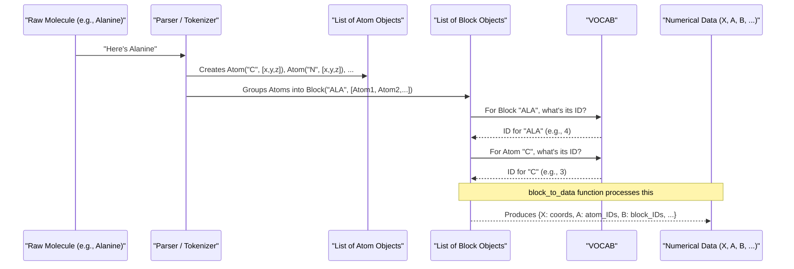

# Chapter 4: Molecular Data Representation (Atom, Block, VOCAB)

Welcome back! In [Chapter 3: Downstream Task Models & Prediction Heads](03_downstream_task_models___prediction_heads_.md), we learned how ATOMICA can specialize pre-trained models for specific predictive jobs like figuring out drug effectiveness. But for any AI model to "understand" a molecule, we first need to translate that molecule from its chemical structure into a language computers speak: numbers.

This chapter dives into how ATOMICA fundamentally represents molecular structures. How do we tell the computer what an atom is, how atoms group together, and how to assign unique numerical IDs to these chemical entities?

## What's the Big Idea? Turning Molecules into LEGO® Instructions

Imagine you want to build a complex LEGO® model. You have:
1.  **Individual LEGO bricks:** These are your smallest pieces (e.g., a red 2x2 brick, a blue 1x4 flat piece).
2.  **Pre-assembled LEGO components:** Sometimes, instructions might have you build a small part first, like a wheel assembly or a small wing, which you then use in a larger structure.
3.  **An instruction manual with a parts list:** This manual not only shows you how to put things together but also has a list of all unique parts, often with a part number. If you need "part #3001 (a red 2x4 brick)," you know exactly what to grab.

ATOMICA represents molecules in a very similar way so that our neural networks can process them:
*   An `Atom` is like an individual LEGO brick.
*   A `Block` is like a pre-assembled LEGO component (e.g., an amino acid in a protein).
*   `VOCAB` is like the instruction manual's parts list, assigning a unique numerical ID to every type of atom and block.

**Our Central Use Case for this Chapter:**
How does ATOMICA take a molecule, say the amino acid Alanine (which is a building block of proteins), and convert it into a set of numbers that a neural network can understand and learn from? We'll explore how `Atom`, `Block`, and `VOCAB` work together to achieve this.

## The Building Blocks: `Atom` and `Block`

Let's look at the fundamental pieces ATOMICA uses to describe a molecule.

### `Atom`: The Smallest LEGO Brick

The most basic unit in ATOMICA's molecular world is the `Atom`. Each `Atom` object holds key information:

*   **Element Type:** Is it a Carbon (C), Oxygen (O), Nitrogen (N), etc.?
*   **3D Coordinates:** Where is this atom located in 3D space (its x, y, z position)?
*   **Atom Name/Position Code (Optional):** Sometimes, especially in proteins, atoms have specific names like 'CA' (alpha-carbon) or 'N' (backbone nitrogen). A position code can further describe its role.

Think of an `Atom` as a single LEGO brick. You know its color (element type) and where you're supposed to place it (3D coordinates).

Here's a highly simplified view of what an `Atom` class might look like in `data/pdb_utils.py`:

```python
# Simplified from data/pdb_utils.py
class Atom:
    def __init__(self, element: str, coordinate: list, atom_name: str = "", pos_code: str = ""):
        self.element = element  # e.g., "C", "O", "N"
        self.coordinate = coordinate  # e.g., [1.0, 2.5, -0.5]
        self.name = atom_name # e.g., "CA" for alpha carbon
        self.pos_code = pos_code # e.g., "B" for beta carbon in an amino acid
    
    def get_element(self):
        return self.element
    
    def get_coord(self):
        return self.coordinate
```
This simple class just stores the element type (like 'C' for Carbon) and its 3D coordinates. An Alanine molecule, for example, would be composed of several such `Atom` objects (3 Carbons, 1 Nitrogen, 2 Oxygens, and some Hydrogens which are often handled specially or implicitly).

### `Block`: Assembling LEGO Bricks into Meaningful Units

Often, atoms don't exist in isolation; they form meaningful groups. In ATOMICA, these groups are called `Block`s. A `Block` is simply a collection of `Atom` objects that represent a larger chemical unit.

What can a `Block` be?
*   **An amino acid residue in a protein:** For example, an Alanine residue, a Glycine residue, etc. The entire Alanine molecule from our use case would be a single `Block`.
*   **A fragment in a small molecule:** If you're dealing with drugs or other small molecules, ATOMICA might first break them down into common chemical fragments (a process called tokenization, which we'll cover in [Molecular Fragmentation and Tokenization](06_molecular_fragmentation_and_tokenization_.md)). Each fragment would be a `Block`.
*   **A single atom:** In some cases, especially for very simple molecules or specific representations, a `Block` might just contain one `Atom`.

Think of a `Block` as a pre-assembled LEGO component. For instance, an Alanine `Block` is made of specific `Atom` "bricks" arranged in a particular way.

Here's a simplified `Block` class definition, inspired by `data/dataset.py`:

```python
# Simplified from data/dataset.py
# from .pdb_utils import Atom # Assuming Atom class is available

class Block:
    def __init__(self, symbol: str, units: list): # 'units' would be a list of Atom objects
        self.symbol = symbol  # e.g., "ALA" for Alanine, or a fragment name
        self.units = units    # A list of Atom objects that make up this block

    def __len__(self):
        return len(self.units) # How many atoms in this block?
```
This `Block` class stores a `symbol` (like "ALA" for Alanine) and a list of `Atom` objects that belong to it.

## The Instruction Manual: `VOCAB`

Now we have `Atom`s and `Block`s. But neural networks don't understand "Carbon" or "Alanine." They need numbers! This is where `VOCAB` comes in.

`VOCAB` (short for Vocabulary) acts like the master parts list in a LEGO instruction manual. It's a comprehensive dictionary that translates all relevant chemical entities into unique numerical IDs.

**What does `VOCAB` map?**
*   **Atom Elements:** Each unique atom element (like 'C', 'H', 'O', 'N', 'S', 'P', etc.) gets a specific integer ID. For example, 'C' might become ID `6`, 'O' might become ID `8`.
*   **Block Types (Symbols):** Each unique block type (like 'ALA' for Alanine, 'GLY' for Glycine, 'BENZENE_FRAG' for a benzene fragment) gets a specific integer ID. For example, 'ALA' might become ID `1`, 'GLY' might become ID `2`.
*   **Special Tokens:** `VOCAB` also defines IDs for special tokens used by the model:
    *   `PAD`: Used for "padding" sequences to the same length.
    *   `MASK`: Used in pre-training tasks to hide parts of the molecule (see [Chapter 2: Pre-training Models (DenoisePretrainModel)](02_pre_training_models__denoisepretrainmodel__.md)).
    *   `UNK`: Represents an "unknown" atom or block type that wasn't in the vocabulary.
    *   `GLB`: Represents a "global" node, often used in graph neural networks to summarize information about the entire molecule or a segment of it.
*   **Atom Position Codes:** In proteins, atoms within a residue often have standard names (N, CA, C, O for backbone; CB, CG, etc. for sidechains). `VOCAB` can also map these position identifiers or categories (e.g. backbone, sidechain, small molecule atom) to numerical IDs.

Here's a conceptual glimpse of how `VOCAB` might store these mappings (simplified from `data/pdb_utils.py`):

```python
# Simplified concept from data/pdb_utils.py
class Vocab:
    def __init__(self):
        self.PAD, self.MASK, self.UNK, self.GLB = '#', '*', '?', '&'
        
        # For Block symbols (e.g., amino acids, fragments)
        self.symbol2idx = {
            self.PAD: 0, self.MASK: 1, self.UNK: 2, self.GLB: 3,
            'ALA': 4, 'GLY': 5, 'SER': 6, # ... and many more amino acids
            # ... and potentially fragment symbols ...
        }
        self.idx2symbol = {v: k for k, v in self.symbol2idx.items()}

        # For Atom elements
        self.atom_pad, self.atom_mask, self.atom_global = 'p', 'm', 'g'
        self.atom2idx = {
            self.atom_pad: 0, self.atom_mask: 1, self.atom_global: 2,
            'C': 3, 'N': 4, 'O': 5, 'S': 6, # ... and other elements
        }
        self.idx2atom = {v: k for k, v in self.atom2idx.items()}
        
        # ... other mappings like for atom positions ...

    def symbol_to_idx(self, symbol_str):
        return self.symbol2idx.get(symbol_str, self.symbol2idx[self.UNK])

    def atom_to_idx(self, atom_element_str):
        return self.atom2idx.get(atom_element_str, self.atom2idx[self.atom_mask]) # Or UNK
```
When the model encounters an Alanine `Block` (symbol "ALA"), `VOCAB.symbol_to_idx('ALA')` would return its numerical ID (e.g., `4`). If it sees a Carbon `Atom`, `VOCAB.atom_to_idx('C')` would return its ID (e.g., `3`).

## Putting It All Together: From Molecule to Numbers

So, how does ATOMICA use `Atom`, `Block`, and `VOCAB` to process a molecule like Alanine for our AI model?

1.  **Parsing the Molecule:** First, the raw molecular data (e.g., from a PDB file for a protein, or a SMILES string for a small molecule) is read and parsed.
2.  **Creating `Atom` Objects:** The parser identifies each atom, creating an `Atom` object with its element type and 3D coordinates.
3.  **Grouping into `Block` Objects:** These `Atom`s are then grouped into `Block`s.
    *   For Alanine (an amino acid), all its constituent atoms (3 Carbons, 1 Nitrogen, 2 Oxygens, plus Hydrogens) would form a single `Block` with the symbol "ALA".
    *   If it were a larger protein, it would be a sequence of such amino acid `Block`s.
    *   If it were a small molecule, it might be tokenized into several fragment `Block`s (see [Molecular Fragmentation and Tokenization](06_molecular_fragmentation_and_tokenization_.md)).
4.  **Conversion to Numerical Data via `VOCAB`:** This is where the magic happens! A function (like `blocks_to_data` in `data/dataset.py`) takes the list of `Block`s and uses `VOCAB` to convert them into numerical arrays that the neural network can digest:
    *   **`X` (Coordinates):** A list (or array) of the 3D coordinates (x, y, z) for *every atom* in all the blocks. These are floating-point numbers, not IDs.
    *   **`A` (Atom Types):** A list of numerical IDs for the element type of *every atom*. Each ID comes from `VOCAB.atom_to_idx()`.
    *   **`B` (Block Types):** A list of numerical IDs for the type of *each block*. Each ID comes from `VOCAB.symbol_to_idx()`.
    *   **`block_lengths`:** A list telling the model how many atoms are in each block. This helps map the sequence of atoms in `A` and `X` back to their parent blocks in `B`.
    *   **`segment_ids` (Optional):** If you're processing multiple molecules together (e.g., a protein and a ligand), this tells the model which block belongs to which molecule.

Let's imagine a simplified `blocks_to_data` process:

```python
# Conceptual function inspired by data/dataset.py
# Assume VOCAB object is globally available or passed as an argument

def blocks_to_numerical_data(list_of_blocks):
    # Initialize lists to store numerical data
    all_atom_coords_X = []
    all_atom_type_IDs_A = []
    all_block_type_IDs_B = []
    all_block_lengths = []

    for block_object in list_of_blocks: # e.g., [Alanine_Block, Glycine_Block, ...]
        # Get the numerical ID for the block type (e.g., "ALA" -> 4)
        block_id = VOCAB.symbol_to_idx(block_object.symbol)
        all_block_type_IDs_B.append(block_id)
        
        all_block_lengths.append(len(block_object.units)) # Number of atoms in this block
        
        for atom_object in block_object.units:
            # Get atom coordinates
            all_atom_coords_X.append(atom_object.get_coord())
            # Get the numerical ID for the atom element (e.g., "C" -> 3)
            atom_id = VOCAB.atom_to_idx(atom_object.get_element())
            all_atom_type_IDs_A.append(atom_id)
            
    return {
        'X': all_atom_coords_X, 
        'A': all_atom_type_IDs_A, 
        'B': all_block_type_IDs_B,
        'block_lengths': all_block_lengths
    }
```
If we processed a single Alanine `Block`, the output might conceptually look like this (actual IDs and number of atoms depend on `VOCAB` and Alanine's specific atoms):

*   `X`: `[[x1,y1,z1], [x2,y2,z2], ..., [xn,yn,zn]]` (coordinates for Alanine's n atoms)
*   `A`: `[id_C, id_C, id_C, id_N, id_O, id_O, ...]` (element IDs for Alanine's atoms)
*   `B`: `[id_ALA]` (the block ID for Alanine)
*   `block_lengths`: `[n]` (number of atoms in the Alanine block)

This numerical data is precisely what the [Core Graph Neural Network (ATOMICA)](05_core_graph_neural_network__atomica__.md) and other models in ATOMICA expect as input.

Here's a diagram showing the flow:



## Why is this Representation Important?

This structured way of representing molecules is crucial:

*   **Machine Readable:** It converts complex chemical structures into a format (numerical arrays) that neural networks can process.
*   **Hierarchical:** It captures information at both the atom level (fine details) and the block level (chemically meaningful groups).
*   **Consistent:** `VOCAB` ensures that the same chemical entity is always represented by the same numerical ID, which is vital for learning.
*   **Flexible:** The `Block` concept can adapt to different types of molecules (proteins, small molecules) and different tokenization strategies.

## Conclusion: The Language of Molecules for AI

You've now learned about the fundamental trinity of molecular data representation in ATOMICA:
*   **`Atom`**: The smallest individual unit with an element type and 3D position (like a single LEGO brick).
*   **`Block`**: A group of atoms forming a chemically relevant unit like an amino acid or a molecular fragment (like a pre-assembled LEGO part).
*   **`VOCAB`**: The master dictionary or "parts list" that translates these atoms, blocks, and special symbols into unique numerical IDs that our AI models can understand.

Together, these components transform molecules from abstract chemical diagrams into concrete numerical data, paving the way for powerful AI-driven molecular analysis and discovery.

Now that we know how molecules are represented as numbers, we're ready to see how the main engine of ATOMICA, its graph neural network, actually "reasons" about these numbers.

Let's move on to [Chapter 5: Core Graph Neural Network (ATOMICA)](05_core_graph_neural_network__atomica__.md).

---

Generated by [AI Codebase Knowledge Builder](https://github.com/The-Pocket/Tutorial-Codebase-Knowledge)