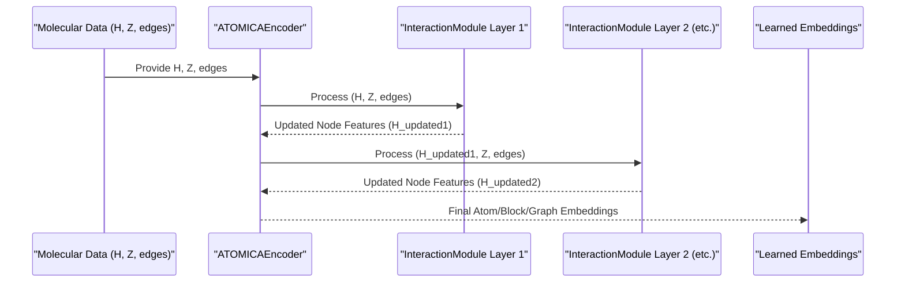

# Chapter 5: Core Graph Neural Network (ATOMICA)

Welcome to Chapter 5! In [Chapter 4: Molecular Data Representation (Atom, Block, VOCAB)](04_molecular_data_representation__atom__block__vocab__.md), we learned how ATOMICA translates molecules into a numerical language that computers can understand, using `Atom`s, `Block`s, and `VOCAB` to generate data like atom coordinates (`X`), atom types (`A`), and block types (`B`).

Now, how does ATOMICA actually *learn* from this numerical data? How does it "see" the 3D structure and "understand" the chemical properties encoded in these numbers? This is where the brain of ATOMICA comes in: its Core Graph Neural Network.

## What's the Big Idea? A 3D Scanner for Molecules

Imagine you have the numerical data for a molecule, say, Alanine, as we discussed in Chapter 4. This data tells us where each atom is in 3D space and what kind of atom it is. But how can an AI model make sense of this raw data to understand the molecule's overall shape, properties, and how it might interact with other molecules?

The **Core Graph Neural Network (GNN)** in ATOMICA is like a sophisticated 3D scanner. It doesn't just look at individual atoms in isolation. Instead, it analyzes how all the atoms are arranged in 3D space, their relationships with each other (like bonds, or just being close by), and their chemical types. From this, it creates a detailed, numerical "fingerprint" or **embedding** of the molecule.

A crucial feature of this "scanner" is that it's **rotation-aware**. If you rotate the molecule in 3D space, its fundamental properties don't change. Our scanner needs to understand this. The fingerprint it creates will either stay the same (if it's a global property like "is this molecule stable?") or rotate in exactly the same way as the molecule (if it's a directional property like "in which direction would this atom be pushed?"). This property is called **SE(3) equivariance/invariance**.

**Our Central Use Case for this Chapter:**
Given the numerical data for Alanine (atom coordinates `X`, atom types `A`, block types `B`), how does the ATOMICA GNN process this to generate a rich, rotation-aware numerical summary (embedding) that captures Alanine's 3D structure and chemical identity? This embedding can then be used for pre-training (as in [Chapter 2: Pre-training Models (DenoisePretrainModel)](02_pre_training_models__denoisepretrainmodel__.md)) or downstream tasks (as in [Chapter 3: Downstream Task Models & Prediction Heads](03_downstream_task_models___prediction_heads_.md)).

## Key Concepts: Building the Molecular Scanner

Let's break down the main ideas behind ATOMICA's GNN:

1.  **Molecules as Graphs:**
    A GNN treats a molecule as a graph.
    *   **Nodes:** Atoms (or sometimes entire blocks) are the nodes of the graph.
    *   **Edges:** Connections between atoms are the edges. These aren't just chemical bonds; they can also represent atoms being close to each other in 3D space.

    ```mermaid
    graph LR
        A[Atom 1 (Node)] --- B[Atom 2 (Node)];
        B --- C[Atom 3 (Node)];
        A --- C;
        subgraph Molecule
            A
            B
            C
        end
        D[Graph Representation]
        Molecule --> D;
    ```

2.  **`ATOMICAEncoder`:**
    This is the main GNN component in ATOMICA, found in `models/ATOMICA/encoder.py`. It's responsible for taking the initial numerical representation of a molecule and processing it to produce powerful embeddings.

3.  **`InteractionModule` Layers:**
    The `ATOMICAEncoder` is built from several stacked `InteractionModule` layers (defined in `models/ATOMICA/atomica.py`). Think of each layer as one pass of the 3D scanner. In each pass, the scanner refines its understanding.

4.  **Message Passing:**
    Inside each `InteractionModule`, atoms "talk" to their neighbors. An atom sends a "message" containing information about itself (its type, current features) to its connected neighbors. Each atom then collects all incoming messages and uses them to update its own features. This allows information to flow across the molecule.

5.  **SE(3) Equivariance/Invariance:**
    This is a fancy term for being "rotation-aware."
    *   **Equivariance:** If a feature is a vector (has direction, like a force acting on an atom), and you rotate the molecule, this vector feature should rotate in exactly the same way.
    *   **Invariance:** If a feature is a scalar (just a number, like the total energy of the molecule), and you rotate the molecule, this scalar feature should *not* change at all.
    ATOMICA's GNN is designed to respect these properties, which is crucial for learning meaningful representations from 3D structures.

6.  **Spherical Harmonics & Tensor Products:**
    How does ATOMICA achieve this SE(3) property? It uses special mathematical tools:
    *   **Spherical Harmonics:** These are functions that can describe 3D directional information (like the direction from one atom to another) in a way that behaves nicely under rotations. Think of them as a sophisticated compass that understands 3D.
    *   **Tensor Products:** These are a special way of combining different types of features (e.g., an atom's scalar features with the spherical harmonics describing its bond directions) while preserving their rotational properties. It's like a mathematically sound way to merge different sensor readings from our 3D scanner.
    You don't need to understand the deep math, just that these are the "magic ingredients" for rotation awareness.

## How ATOMICA's GNN Works: A Bird's-Eye View

The `ATOMICAEncoder` is not something you usually call directly as an end-user. It's a core engine used *inside* other models, like the `DenoisePretrainModel` or `AffinityPredictor`.

*   **Input:** It takes the numerical data we discussed in [Chapter 4: Molecular Data Representation (Atom, Block, VOCAB)](04_molecular_data_representation__atom__block__vocab__.md):
    *   `H`: Initial node features (derived from atom types `A` and block types `B`).
    *   `Z`: Atom coordinates (`X`).
    *   `edges`: Information about which nodes (atoms/blocks) are connected.
    *   `edge_attr`: Features associated with these connections.

*   **Output:** It produces learned numerical vectors (embeddings) that represent:
    *   Each atom or unit.
    *   Each block.
    *   The entire molecule (graph).
    These embeddings are rich in information about the molecule's 3D structure and chemistry, and they are SE(3) equivariant/invariant.

## Under the Hood: The Scanning Process

Let's trace what happens when the `ATOMICAEncoder` processes a molecule, step-by-step (conceptually):

1.  **Graph Construction:** The molecule's atoms (nodes) and their spatial relationships (edges) are defined. Nearby atoms are considered connected.
2.  **Initial Features:** Each atom gets an initial numerical vector (embedding) based on its type (from `VOCAB`).
3.  **Iterative Refinement (`InteractionModule` Layers):**
    *   The data flows through a series of `InteractionModule` layers.
    *   **Inside each `InteractionModule`:**
        a.  **Gather Neighbors:** For each atom, identify its neighbors.
        b.  **Calculate Edge Information:** For each pair of connected atoms:
            *   Determine the vector pointing from one to the other (from their `Z` coordinates).
            *   Describe this direction using **Spherical Harmonics**.
            *   Calculate the distance between them.
        c.  **Form Messages:** Each atom creates "messages" for its neighbors. A message typically combines:
            *   The sending atom's current features.
            *   The receiving atom's current features.
            *   The edge information (distance, direction via spherical harmonics).
            This combination is done using **Tensor Products** to maintain SE(3) properties.
        d.  **Aggregate Messages:** Each atom collects all messages sent to it by its neighbors.
        e.  **Update Features:** Each atom updates its own feature vector based on the aggregated messages. Its "understanding" of its local environment is refined.
4.  **Stacking Layers:** This message passing and update process is repeated across multiple `InteractionModule` layers. With each layer, an atom incorporates information from neighbors further and further away.
5.  **Final Embeddings:** After passing through all layers, the atoms have rich, context-aware feature vectors (embeddings). These can be pooled (e.g., averaged) to get embeddings for blocks or the entire molecule.

Here's a simplified sequence diagram showing the flow:



## A Peek at the Code: `ATOMICAEncoder` and `InteractionModule`

Let's look at highly simplified snippets to see how this is structured.

**1. `ATOMICAEncoder` (from `models/ATOMICA/encoder.py`)**

The `ATOMICAEncoder` essentially sets up and calls the stack of `InteractionModule` layers.

```python
# models/ATOMICA/encoder.py (Super-Simplified ATOMICAEncoder)
import torch.nn as nn
from .atomica import InteractionModule # The core interaction layer

class ATOMICAEncoder(nn.Module):
    def __init__(self, hidden_size, edge_size, n_layers, ...):
        super().__init__()
        # The encoder is primarily an InteractionModule (which itself contains multiple conv layers)
        self.encoder = InteractionModule(
            ns=hidden_size,             # Scalar feature dimension
            nv=hidden_size // 2,        # Vector feature dimension
            num_conv_layers=n_layers,   # How many internal message passing steps
            sh_lmax=2,                  # Max degree of spherical harmonics
            edge_size=edge_size,        # Dimensionality of edge features
            # ... other parameters like dropout, noise prediction flags ...
        )
        # ... (flags for returning noise predictions, covered in Chapter 2 and 8)

    def forward(self, H, Z, batch_id, perturb_mask, edges, edge_attr, ...):
        # H: initial node features (atom/block embeddings)
        # Z: atom coordinates
        # edges: graph connectivity (pairs of atom indices)
        # edge_attr: features for each edge (e.g., type of interaction)
        
        # The InteractionModule does the heavy lifting of SE(3) message passing
        # It can return node representations and, if configured, noise predictions
        output_tuple = self.encoder(H, Z, batch_id, perturb_mask, edges, edge_attr, ...)
        
        block_repr = output_tuple[0] # The first element is usually the node representation
        # Other elements in output_tuple might be predicted noise terms (trans_noise, rot_noise, etc.)
        
        return block_repr # , and potentially other noise-related outputs
```
The `ATOMICAEncoder` takes initial features `H` (often derived from `A` and `B` in Chapter 4), coordinates `Z`, and graph structure (`edges`, `edge_attr`). It passes them to its `self.encoder` (an `InteractionModule`), which performs the sophisticated SE(3) equivariant message passing.

**2. `InteractionModule` (from `models/ATOMICA/atomica.py`)**

This module contains the actual convolutional layers that perform message passing.

```python
# models/ATOMICA/atomica.py (Simplified InteractionModule structure)
import torch
from e3nn import o3 # For spherical harmonics and irreps
from .utils import TensorProductConvLayer, GaussianEmbedding # Key building blocks

class InteractionModule(torch.nn.Module):
    def __init__(self, ns, nv, num_conv_layers, sh_lmax, edge_size, ...):
        super().__init__()
        self.ns, self.nv = ns, nv # Dimensions for scalar and vector features
        self.sh_irreps = o3.Irreps.spherical_harmonics(lmax=sh_lmax)
        self.edge_embedder = GaussianEmbedding(num_gaussians=edge_size, ...) # For edge distances

        conv_layers = []
        for i in range(num_conv_layers):
            # Each conv_layer is a TensorProductConvLayer, which handles SE(3) math
            conv_layers.append(TensorProductConvLayer(...)) # Params define input/output irreps
        self.layers = torch.nn.ModuleList(conv_layers)
        # ... (output FFN, and parts for noise prediction if active) ...

    def forward(self, node_attr, coords, batch_id, perturb_mask, 
                  edges, edge_type_attr, ...): # edge_type_attr from self.edge_embedding_bottom/top
        
        # 1. Calculate basic edge geometry
        edge_src, edge_dst = edges[0], edges[1]
        edge_vec = coords[edge_dst] - coords[edge_src] # Vector from src to dst atom
        edge_length = edge_vec.norm(dim=-1)
        edge_length_embedding = self.edge_embedder(edge_length) # Embed distance

        # 2. Get Spherical Harmonics for edge directions
        edge_sh = o3.spherical_harmonics(self.sh_irreps, edge_vec, normalize=True, ...)

        # 3. Pass through convolutional layers (message passing)
        current_node_features = node_attr # Start with initial features
        for conv_layer_obj in self.layers:
            # Prepare full edge attributes for the TensorProductConvLayer
            # This combines edge length, type, and scalar parts of connected node features
            full_edge_attr = torch.cat(
                (edge_length_embedding, edge_type_attr,
                 current_node_features[edge_src, :self.ns], # Scalar features of source
                 current_node_features[edge_dst, :self.ns]), # Scalar features of destination
                dim=1
            )
            
            # The TensorProductConvLayer performs SE(3) equivariant message passing
            # It updates node features based on neighbors and edge geometry
            update = conv_layer_obj(current_node_features, edges, full_edge_attr, edge_sh)
            current_node_features = current_node_features + update # Simplified update

        # ... (Logic for noise prediction if enabled, using parts of current_node_features)
        # ... (Final feed-forward network (self.out_ffn) to produce output embeddings)
        
        final_node_embeddings = self.out_ffn(current_node_features[:, :self.node_embedding_dim])
        # Return final embeddings and any predicted noise values
        return final_node_embeddings # , potential_noise_outputs...
```
Inside `InteractionModule`:
*   It first computes geometric information about edges: vectors, lengths (embedded by `GaussianEmbedding`), and spherical harmonics (`edge_sh`).
*   Then, it iterates through its `TensorProductConvLayer`s. Each such layer takes the current `node_attr`, the geometric edge information (`edge_sh`, `edge_length_embedding`), and other `edge_type_attr`, and computes updates to the node features. This is the core "message passing" step.

**3. `TensorProductConvLayer` (from `models/ATOMICA/utils.py`)**

This is where the crucial SE(3) equivariant tensor product operation happens. It combines node features with edge spherical harmonics.

```python
# models/ATOMICA/utils.py (Highly Simplified TensorProductConvLayer forward)
from e3nn import o3
from torch_scatter import scatter # For aggregating messages

class TensorProductConvLayer(torch.nn.Module):
    def __init__(self, in_irreps, sh_irreps, out_irreps, n_edge_features, ...):
        super().__init__()
        # Defines how to combine input node features (in_irreps) 
        # and edge spherical harmonics (sh_irreps) to get output features (out_irreps).
        self.tp = o3.FullyConnectedTensorProduct(in_irreps, sh_irreps, out_irreps, ...)
        # A small neural net to process scalar edge features into weights for the tensor product
        self.fc = torch.nn.Linear(n_edge_features, self.tp.weight_numel)
        # ... (normalization layers)

    def forward(self, node_attr, edge_index, edge_attr, edge_sh, ...):
        edge_src, edge_dst = edge_index
        
        # Process scalar edge attributes to get weights for the tensor product
        tp_weights = self.fc(edge_attr)
        
        # The core SE(3) operation:
        # Combines destination node's features (node_attr[edge_dst])
        # with the edge's spherical harmonics (edge_sh),
        # modulated by the computed tensor product weights (tp_weights).
        # This creates "messages" flowing along edges.
        messages = self.tp(node_attr[edge_dst], edge_sh, tp_weights)
        
        # Aggregate messages for each source node (the one receiving messages)
        # 'scatter' sums (or averages) messages arriving at the same node.
        aggregated_messages = scatter(messages, edge_src, dim=0, reduce="mean")
        
        # ... (Optional: add residual connection, apply normalization) ...
        return aggregated_messages # These are the "updates" for node_attr
```
The `TensorProductConvLayer` uses `e3nn` library's `o3.FullyConnectedTensorProduct`. This function mathematically combines the features of a node with the spherical harmonic representation of an edge connecting to another node, in a way that respects 3D rotations. The `self.fc` layer learns to create appropriate "weights" for this combination based on other edge features (like distance or type). Messages from all neighbors are then aggregated (e.g., averaged) to update each node's features.

This layered approach, using these specialized mathematical tools, allows the `ATOMICAEncoder` to build up a deep, geometrically-aware understanding of the input molecule.

## Conclusion: The Engine of Molecular Understanding

You've now journeyed into the heart of ATOMICA: its **Core Graph Neural Network**, primarily the `ATOMICAEncoder`. This powerful engine acts like a 3D scanner, analyzing molecular structures to create rich, rotation-aware digital fingerprints (embeddings).

Key takeaways:
*   Molecules are treated as **graphs** (atoms as nodes, relationships as edges).
*   The `ATOMICAEncoder` uses stacked `InteractionModule` layers for **message passing**.
*   **Spherical Harmonics** and **Tensor Products** are key mathematical tools ensuring **SE(3) equivariance/invariance**, making the model understand 3D geometry and rotations correctly.
*   The output is a set of learned **embeddings** for atoms, blocks, or the whole molecule, encoding its chemical and structural properties.
*   This GNN is the backbone for many models in ATOMICA, including those for pre-training ([Chapter 2: Pre-training Models (DenoisePretrainModel)](02_pre_training_models__denoisepretrainmodel__.md)) and downstream tasks ([Chapter 3: Downstream Task Models & Prediction Heads](03_downstream_task_models___prediction_heads_.md)).

The `ATOMICAEncoder` processes molecules at the level of atoms and blocks. But how are these blocks, especially for diverse small molecules, defined in the first place? That's the topic of our next chapter.

Let's move on to [Chapter 6: Molecular Fragmentation and Tokenization](06_molecular_fragmentation_and_tokenization_.md).

---

Generated by [AI Codebase Knowledge Builder](https://github.com/The-Pocket/Tutorial-Codebase-Knowledge)