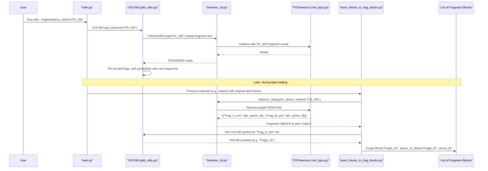

# Chapter 6: Molecular Fragmentation and Tokenization

In [Chapter 5: Core Graph Neural Network (ATOMICA)](05_core_graph_neural_network__atomica__.md), we explored how ATOMICA's GNN processes numerical representations of molecules to understand their 3D structure. We saw that molecules are often represented as sequences of `Block`s (like amino acids in proteins). But what about diverse small molecules, like drugs? How do we represent them in a standardized way for the model to learn common patterns?

This chapter introduces **Molecular Fragmentation and Tokenization**, a system that breaks down complex small molecules into a sequence of simpler, predefined chemical fragments or "tokens."

## What's the Big Idea? Deconstructing Molecules into Standard Parts

Imagine you're trying to understand how various machines work. Instead of looking at each unique machine as a whole, it's often easier to see if they share common components: screws, gears, motors, etc. If you identify these standard components, you can analyze how they are combined to build different machines.

Molecular fragmentation and tokenization in ATOMICA is very similar. Many drugs and other small molecules can be incredibly complex and varied. To help our AI model learn, we "deconstruct" these complex molecules into smaller, more manageable, and recurring chemical units. These units are like "chemical words" or "tokens."

**Our Central Use Case for this Chapter:**
Let's take a common drug molecule, **Aspirin**. How can ATOMICA break down Aspirin into a series of simpler, standard chemical fragments that the model can recognize and learn from, much like how a sentence is broken down into words in natural language processing?

```
Aspirin (complex molecule)  ---Fragmentation--->  [Fragment_A, Fragment_B, Fragment_C] (simpler, standard tokens)
```

This process allows the model to identify and learn patterns from these recurring structural motifs across many different molecules.

## Key Concepts: The "Chemical Dictionary" and the "Chopper"

1.  **Fragmentation:** The general idea of breaking a larger molecule into smaller pieces.
2.  **Tokens:** These are the predefined, simpler chemical fragments that result from fragmentation. Think of them as the "standard components" in our machine analogy, or "words" in our chemical language.
3.  **`TOKENIZER`:** This is the tool that performs the fragmentation. In ATOMICA, it's an instance of `TokenizerWrapper` (from `data/tokenizer/tokenize_3d.py`), which often uses a specific tokenizer engine like `PSTokenizer` (from `data/tokenizer/mol_bpe.py`). This `PSTokenizer` uses a method similar to Byte Pair Encoding (BPE) often found in natural language processing, but adapted for molecules.
4.  **`VOCAB` Integration:** The fragments (tokens) generated by the `TOKENIZER` need to be recognized by the system. As we saw in [Chapter 4: Molecular Data Representation (Atom, Block, VOCAB)](04_molecular_data_representation__atom__block__vocab__.md), `VOCAB` is our master dictionary. When a fragmentation method is chosen, `VOCAB` is updated to include all the unique fragment types produced by that `TOKENIZER` as new symbols with unique numerical IDs.

## How Does This Work in ATOMICA?

This tokenization process is typically configured when you start a training run using `train.py` (see [Chapter 1: Experiment Configuration & Execution (`train.py`)](01_experiment_configuration___execution___train_py___.md)) and happens during the data loading and preprocessing stages.

1.  **Specify Fragmentation Method:**
    You tell ATOMICA which fragmentation method to use via the `--fragmentation_method` argument in `train.py`. For example:
    ```bash
    python train.py \
        --task pretrain_torsion_masking \
        --train_set path/to/your/small_molecule_data.pkl \
        --fragmentation_method PS_300 \
        # ... other arguments ...
    ```
    The `PS_300` refers to a specific pre-learned vocabulary of 300 principal subgraphs (fragments).

2.  **`VOCAB` Loads the Tokenizer:**
    Inside `train.py`, before model creation, `VOCAB.load_tokenizer(args.fragmentation_method)` is called.

    ```python
    # train.py (simplified snippet)
    # ...
    VOCAB.load_tokenizer(args.fragmentation_method) # Loads PS_300 tokenizer
    model = models.create_model(args)
    # ...
    ```
    This step is crucial. `VOCAB.load_tokenizer` (defined in `data/pdb_utils.py`) tells the global `TOKENIZER` object (from `data/tokenizer/tokenize_3d.py`) to load the specified fragment vocabulary (e.g., `ps_vocab_300.txt`). Then, `VOCAB` re-initializes itself to include all these fragment symbols, ensuring each has a unique ID.

    ```python
    # data/pdb_utils.py (Simplified VOCAB.load_tokenizer and __init__)
    # from .tokenizer.tokenize_3d import TOKENIZER # Global tokenizer instance
    
    class Vocab:
        def load_tokenizer(self, method: Optional[str]):
            if method is None:
                return
            TOKENIZER.load(method) # Instructs the global TOKENIZER to load its data
            self.__init__()       # Re-initialize VOCAB to include new fragments

        def __init__(self):
            # ... (PAD, MASK, UNK, GLB, aas, bases, sms are defined) ...
            self.frags = [] # Will be populated with fragment symbols
            if len(TOKENIZER): # If TOKENIZER has loaded a fragment vocabulary
                # Get fragment SMILES from TOKENIZER and add them to VOCAB's list
                for i, smi in enumerate(TOKENIZER.get_frag_smiles()):
                    # Avoid adding single atoms if already in self.sms (elements)
                    # self.frags.append((str(i), smi)) # str(i) is a unique key for the fragment
            # ... (Build symbol2idx, idx2symbol etc. using aas, bases, sms, AND frags) ...
    ```
    Now, `VOCAB` knows about fragment symbols like "Frag123" (an abstract name for a fragment SMILES) and can map them to numerical IDs.

3.  **Molecules are Processed into Fragment `Block`s:**
    During data loading (covered in more detail in [Chapter 7: Dataset Handling & Preprocessing](07_dataset_handling___preprocessing_.md)), small molecules are passed through the tokenization process.
    *   Input: A small molecule (e.g., Aspirin, represented by its SMILES string or 3D atom coordinates).
    *   The `tokenize_3d` function (from `data/tokenizer/tokenize_3d.py`) is called. This function uses the loaded `TOKENIZER` (e.g., `PSTokenizer`) to break the molecule into a list of fragment SMILES strings and the indices of the atoms belonging to each fragment.
    *   The `atom_blocks_to_frag_blocks` utility (from `data/converter/atom_blocks_to_frag_blocks.py`) can then take this output (and the original atoms) and convert it into a list of `Block` objects. Each `Block` now represents a fragment, and its `symbol` is the fragment's SMILES string (or an ID that `VOCAB` recognizes).
    *   Output: For Aspirin, this might be `[Block(symbol="Frag_Acetyl", atoms=[...]), Block(symbol="Frag_Salicylic_Core", atoms=[...])]`. (Actual fragment symbols are from the tokenizer's vocabulary).

    These fragment `Block`s are then treated like any other `Block`s (e.g., amino acids) for subsequent numerical conversion using `VOCAB` (as seen in [Chapter 4: Molecular Data Representation (Atom, Block, VOCAB)](04_molecular_data_representation__atom__block__vocab__.md)).

## Under the Hood: The Tokenization Pipeline

Let's trace how a small molecule gets tokenized:

1.  **Input Molecule:** The process starts with a representation of a small molecule, typically its SMILES string or a list of its atoms and their 3D coordinates.
2.  **Invoke `tokenize_3d`:** This function from `data/tokenizer/tokenize_3d.py` orchestrates the tokenization.
    ```python
    # data/tokenizer/tokenize_3d.py (Highly simplified tokenize_3d)
    # from .mol_bpe import PSTokenizer # Used by TOKENIZER instance
    # TOKENIZER = TokenizerWrapper() # Global instance, initially empty or default

    def tokenize_3d(atoms: List[str], coords: Optional[List[Tuple[float, float, float]]]=None,
                    smiles: Optional[str]=None, bonds: Optional[List[Tuple[int, int, int]]]=None,
                    fragmentation_method: Optional[str]=None): # method is used to load TOKENIZER
        
        tokenizer_engine = TOKENIZER # Uses the globally configured tokenizer
        # ... (logic to build an RDKit molecule from inputs if not already) ...
        # rdkit_mol = Chem.MolFromSmiles(smiles) or build from atoms/coords/bonds
        
        # The core tokenization by the loaded engine (e.g., PSTokenizer)
        # frag_mol is an internal representation holding fragment info
        # frag_mol = tokenizer_engine(rdkit_mol) 
        
        frags_smiles_list = [] # e.g., ['c1ccccc1', 'C(=O)O']
        atom_indices_per_frag = [] # e.g., [[0,1,2,3,4,5], [6,7,8]]
        # for i in frag_mol: 
        #    node = frag_mol.get_node(i)
        #    frags_smiles_list.append(node.smiles)
        #    atom_indices_per_frag.append(list(node.atom_mapping.keys()))
        return frags_smiles_list, atom_indices_per_frag
    ```
    This function prepares the molecule and then calls the active `TOKENIZER` engine.

3.  **`PSTokenizer` Engine (from `data/tokenizer/mol_bpe.py`):**
    If `PS_300` was chosen, `TOKENIZER` would be using `PSTokenizer`. This tokenizer works based on a vocabulary of molecular fragments learned beforehand (e.g., stored in `ps_vocab_300.txt`). It applies a BPE-like algorithm to segment the input molecule into the most frequent known fragments from its vocabulary.

    ```python
    # data/tokenizer/mol_bpe.py (Conceptual PSTokenizer)
    class Tokenizer: # Renamed from PSTokenizer for simplicity here
        def __init__(self, vocab_path):
            # Loads fragment vocabulary (SMILES and their frequencies) from vocab_path
            # self.vocab_dict = {"fragment_smi1": (num_atoms, freq), ...}
            # self.idx2subgraph = ["fragment_smi1", ...]
            pass # Simplified

        def __call__(self, rdkit_mol):
            # Applies BPE-like logic to break rdkit_mol into fragments from self.vocab_dict
            # Returns an internal representation (MolInSubgraph or Molecule object)
            # that contains the list of identified fragments and their atoms.
            # For simplicity, imagine it directly returns:
            # list_of_fragment_nodes = [...] 
            # return list_of_fragment_nodes 
            pass # Simplified
    ```

4.  **Converting to `Block` Objects:**
    The `atom_blocks_to_frag_blocks` function (in `data/converter/atom_blocks_to_frag_blocks.py`) takes the original atom-level information and the output of `tokenize_3d` (fragment SMILES and atom indices) to create `Block` objects.

    ```python
    # data/converter/atom_blocks_to_frag_blocks.py (Simplified)
    # from data.dataset import Block 
    # from data.pdb_utils import VOCAB # To map fragment SMILES to VOCAB symbols

    def atom_blocks_to_frag_blocks(
            initial_atom_blocks: List[Block], # Each block contains one atom initially
            smiles_for_full_molecule: Optional[str]=None,
            fragmentation_method: Optional[str]=None
        ) -> List[Block]:
        
        # 1. Get atoms and coords from initial_atom_blocks
        # atoms_list = [b.units[0].element for b in initial_atom_blocks]
        # coords_list = [b.units[0].coordinate for b in initial_atom_blocks]

        # 2. Call tokenize_3d (as shown before)
        # fragment_smiles_list, atom_indices_per_frag = tokenize_3d(
        #    atoms_list, coords_list, smiles_for_full_molecule, 
        #    fragmentation_method=fragmentation_method
        # )

        new_blocks = []
        # VOCAB already loaded the tokenizer via train.py
        # for frag_smi, group_of_atom_indices in zip(fragment_smiles_list, atom_indices_per_frag):
            # current_fragment_atoms = [initial_atom_blocks[i].units[0] for i in group_of_atom_indices]
            # fragment_symbol_in_vocab = VOCAB.abrv_to_symbol(frag_smi) # frag_smi is an "abrv"
            # block = Block(symbol=fragment_symbol_in_vocab, units=current_fragment_atoms)
            # new_blocks.append(block)
        return new_blocks # List of Block objects, each representing a fragment
    ```
    Each resulting `Block` has a `symbol` corresponding to a fragment SMILES (now known to `VOCAB`) and `units` containing the `Atom` objects that form that fragment.

Here's a simplified sequence diagram of the overall process:



## Why is This Useful?

*   **Manages Complexity:** Breaks down diverse and complex small molecules into a more uniform set of building blocks.
*   **Standardization:** Ensures that common chemical substructures are represented consistently across different molecules.
*   **Pattern Learning:** Allows the AI model to learn the significance of these recurring fragments (tokens) and how they contribute to molecular properties, similar to how NLP models learn from words.
*   **Reduces Vocabulary Size for Atoms:** Instead of an almost infinite combination of atoms in novel structures, the model sees combinations of a finite set of fragments.

## Conclusion: Speaking the Language of Fragments

You've now learned how ATOMICA employs **Molecular Fragmentation and Tokenization** to convert complex small molecules into sequences of simpler, standard chemical "tokens." This involves:

*   A `TOKENIZER` (like `PSTokenizer`) that uses a predefined vocabulary of fragments to break down molecules.
*   `VOCAB` being updated to recognize these fragment tokens and assign them unique IDs.
*   The result is a representation of small molecules as a sequence of `Block` objects, where each block is a fragment.

This "tokenized" representation helps the model to learn common chemical patterns more effectively, especially in large and diverse datasets of small molecules.

This process of preparing data, including tokenization, is part of a larger pipeline. Next, we'll look more broadly at how ATOMICA handles datasets and general preprocessing.

Let's move on to [Chapter 7: Dataset Handling & Preprocessing](07_dataset_handling___preprocessing_.md).

---

Generated by [AI Codebase Knowledge Builder](https://github.com/The-Pocket/Tutorial-Codebase-Knowledge)