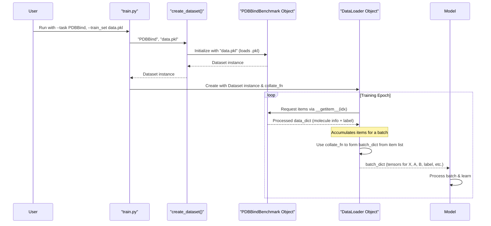

# Chapter 7: Dataset Handling & Preprocessing

In [Chapter 6: Molecular Fragmentation and Tokenization](06_molecular_fragmentation_and_tokenization_.md), we saw how ATOMICA can break down complex small molecules into simpler, standard "tokens." This is one kind of preprocessing. Now, let's zoom out and look at the bigger picture: how does ATOMICA manage the entire journey of molecular data from raw files to the format our AI models need for training or making predictions?

## What's the Big Idea? The "Molecular Kitchen" Preparing Data for AI

Imagine you're cooking a complex dish (training an AI model). You have raw ingredients (molecular data from PDB files, SMILES strings, etc.). Before you can cook, these ingredients need to be:
1.  **Sourced:** Read from their storage (files).
2.  **Cleaned & Chopped:** Processed into a usable format (like our `Atom` and `Block` representations from [Chapter 4: Molecular Data Representation (Atom, Block, VOCAB)](04_molecular_data_representation__atom__block__vocab__.md)).
3.  **Seasoned & Marinated:** Potentially augmented or modified (e.g., adding noise for pre-training, as we'll see in [Chapter 8: Noise Augmentation for Pre-training](08_noise_augmentation_for_pre_training_.md)).
4.  **Portioned:** Grouped into batches to be fed to the "cooker" (our AI model).

In ATOMICA, various "Dataset" classes and related utilities act like specialized chefs and sous-chefs in a molecular kitchen. They handle all these steps, ensuring that the AI model receives high-quality, correctly formatted molecular data.

**Our Central Use Case for this Chapter:**
How does ATOMICA load a set of protein-ligand complexes from a pre-processed `.pkl` file (often generated by scripts like those in `data/process_pdbs.py` or `data/process_QBioLiP_parallel.py`), prepare them for an affinity prediction task, and feed them efficiently to a model like `AffinityPredictor` (from [Chapter 3: Downstream Task Models & Prediction Heads](03_downstream_task_models___prediction_heads_.md))?

## Key Concepts: The Chefs and Their Tools

1.  **Raw Data Sources & Offline Preprocessing:**
    ATOMICA can work with various raw molecular data like PDB files or SMILES strings. However, these are often first processed by specialized scripts (e.g., `data/process_pdbs.py`, `data/process_QBioLiP_parallel.py`, `data/process_csd.py`). These scripts perform initial heavy lifting:
    *   Parsing complex file formats.
    *   Extracting relevant molecular structures (e.g., a protein and its interacting ligand).
    *   Converting them into a preliminary `Atom`/`Block` representation.
    *   Saving this intermediate, structured data into more convenient files like `.pkl` or compressed `.jsonl.gz`.
    This "offline preprocessing" makes the actual training faster as the Dataset classes load already somewhat structured data.

2.  **Dataset Classes (`torch.utils.data.Dataset`): The "Specialized Chefs"**
    These are Python classes that know how to:
    *   Load data from the pre-processed files (like `.pkl`).
    *   Perform any final transformations or augmentations needed for a specific task.
    *   Return a single, processed data item (e.g., a protein-ligand pair ready for the model).
    ATOMICA has several Dataset classes, each tailored for different "recipes" (tasks):
    *   `PDBDataset` (`data/dataset.py`): A general-purpose class for loading PDB-derived structures.
    *   `LabelledPDBDataset` (`data/dataset.py`): For datasets where each structure has a label (e.g., for classification or regression).
    *   `PDBBindBenchmark` (`data/dataset.py`): Specifically for the PDBBind benchmark dataset, which involves protein-ligand binding affinity.
    *   Pre-training Datasets (e.g., `PretrainTorsionDataset`, `PretrainMaskedDataset` from `data/dataset_pretrain.py`): These "chefs" also know how to apply specific kinds of noise or masking for self-supervised learning tasks.
    *   `MixDatasetWrapper` (`data/dataset.py`): Allows combining multiple datasets.

3.  **`VOCAB` and Numerical Conversion:**
    As seen in [Chapter 4: Molecular Data Representation (Atom, Block, VOCAB)](04_molecular_data_representation__atom__block__vocab__.md), `VOCAB` is essential for converting symbolic representations (atom types, block symbols) into numerical IDs. This conversion is a key step within the Dataset classes' preparation process.

4.  **`DataLoader` (`torch.utils.data.DataLoader`): The "Efficient Waiter"**
    Once a Dataset class (the "chef") prepares individual data items ("dishes"), the `DataLoader` takes over. It's like an efficient waiter that:
    *   Collects multiple data items from the Dataset.
    *   Groups them into "batches" (manageable portions).
    *   Can shuffle the data to ensure variety during training.
    *   Can use multiple worker processes to load data in parallel, speeding things up.
    *   Uses a `collate_fn` (often defined within the Dataset class) to specify exactly how individual items should be combined into a batch.

5.  **`create_dataset` in `train.py`:**
    This helper function in `train.py` acts as the "kitchen manager." Based on the `--task` argument you provide (see [Chapter 1: Experiment Configuration & Execution (`train.py`)](01_experiment_configuration___execution___train_py___.md)), it selects and instantiates the correct "chef" (Dataset class).

## Using the "Molecular Kitchen": Datasets in Action

Let's see how this works for our use case: training an `AffinityPredictor` for the PDBBind task.

1.  **Command-Line Instruction:**
    You tell ATOMICA what to do via `train.py`:
    ```bash
    python train.py \
        --train_set path/to/your/pdbbind_train_data.pkl \
        --valid_set path/to/your/pdbbind_valid_data.pkl \
        --task PDBBind \
        --batch_size 32 \
        # ... other arguments for model, training, etc. ...
    ```

2.  **What Happens in `train.py`:**
    *   `train.py` calls `create_dataset(task='PDBBind', path='path/to/your/pdbbind_train_data.pkl')`.
    *   The `create_dataset` function knows that for the `PDBBind` task, it needs to use the `PDBBindBenchmark` "chef."
        ```python
        # train.py (super-simplified snippet from create_dataset)
        from data.dataset import PDBBindBenchmark # For PDBBind task
        # from data.dataset_pretrain import PretrainMaskedTorsionDataset # For others

        def create_dataset(task, path, ...):    
            if task == 'PDBBind':
                # Use the PDBBindBenchmark "chef"
                dataset = PDBBindBenchmark(path) 
            # elif task == 'pretrain_torsion_masking':
                # ...
            # ... (other task-to-dataset mappings) ...
            else:
                raise NotImplementedError(f'Dataset for {task} not implemented!')
            return dataset
        ```
    *   An instance of `PDBBindBenchmark` is created for the training data, and another for the validation data.
    *   `DataLoader`s are then created, wrapping these Dataset objects.
        ```python
        # train.py (simplified DataLoader creation)
        train_dataset = create_dataset(args.task, args.train_set, ...)
        train_loader = DataLoader(train_dataset, 
                                  batch_size=args.batch_size,
                                  shuffle=True, 
                                  collate_fn=train_dataset.collate_fn) 
        # Similar DataLoader for validation_set
        ```

3.  **Output (What the Model Sees):**
    During each step of training, the `train_loader` will provide a batch of preprocessed protein-ligand data to the model. This batch is a dictionary of tensors (e.g., `X` for coordinates, `A` for atom types, `B` for block types, `label` for binding affinity), ready for the [Core Graph Neural Network (ATOMICA)](05_core_graph_neural_network__atomica__.md) to process.

## Under the Hood: A Day in the ATOMICA Kitchen

Let's follow a piece of data from a `.pkl` file to a batch served to the model.

1.  **Offline Prep (The "Farmer's Market"):** Scripts like `data/process_pdbs.py` have already parsed raw PDB files, identified protein-ligand pairs, converted them into `Atom` and `Block` structures, and saved them as a list of dictionaries in a `.pkl` file. Each dictionary might look like: `{'id': '1abc', 'data': data_dict_for_1abc, 'affinity': {'neglog_aff': 7.5}}`. The `data_dict_for_1abc` contains lists for `X`, `A`, `B`, etc., using preliminary numerical IDs or symbols.

2.  **Dataset Initialization (Chef Arrives):**
    When `PDBBindBenchmark(path_to_pkl)` is called:
    *   Its `__init__` method calls `open_data_file(path_to_pkl)` (from `data/dataset.py`), which loads the list of dictionaries from the `.pkl` file.
    *   It stores this list (e.g., as `self.data`).
    *   It also creates `self.indexes` for quick lookup.

3.  **DataLoader Asks for an Item (Order Up!):**
    During training, the `DataLoader` needs to create a batch. It asks the `PDBBindBenchmark` dataset for an item by calling its `__getitem__(idx)` method.

4.  **Dataset `__getitem__` (Chef Prepares a Dish):**
    ```python
    # data/dataset.py (Simplified PDBBindBenchmark __getitem__)
    class PDBBindBenchmark(torch.utils.data.Dataset):
        def __init__(self, data_file_path):
            # self.data is a list of dicts, e.g. {'id':..., 'data':{X,A,B...}, 'affinity':...}
            self.data = open_data_file(data_file_path) 
            # ... (self.indexes setup) ...

        def __len__(self):
            return len(self.data)
        
        def __getitem__(self, idx):
            item = self.data[idx] # Get the pre-loaded dictionary for this index
            processed_data_dict = item['data'] # This already contains X, A, B etc.
            
            # Add the label
            processed_data_dict['label'] = item['affinity']['neglog_aff']
            
            # VOCAB conversion for A and B happens implicitly as they are stored 
            # as numerical IDs by the offline processing scripts.
            # If they were symbols, VOCAB lookup would happen here or in blocks_to_data.
            return processed_data_dict # Return the prepared "dish"
    ```
    The `__getitem__` method retrieves the pre-processed data for the requested index `idx`. For `PDBBindBenchmark`, the data from the `.pkl` file (generated by scripts like `process_pdbs.py`) is largely ready. The `blocks_to_data` function (used by those offline scripts) would have already used `VOCAB` to convert elements and block symbols into numerical IDs. If augmentations were needed (like in pre-training datasets), they would be applied here.

5.  **DataLoader `collate_fn` (Waiter Arranges the Tray):**
    The `DataLoader` receives several such "dishes" (dictionaries) from `__getitem__`. It then uses the `PDBBindBenchmark.collate_fn` to combine them into a single batch (one large dictionary of tensors).
    ```python
    # data/dataset.py (Simplified PDBBindBenchmark collate_fn)
    import torch

    class PDBBindBenchmark(torch.utils.data.Dataset):
        # ... (__init__, __len__, __getitem__) ...
        @classmethod
        def collate_fn(cls, list_of_data_dicts): # list_of_data_dicts is a batch
            keys_to_collate = ['X', 'B', 'A', 'block_lengths', 'segment_ids']
            collated_batch = {}
            
            for key in keys_to_collate:
                # Concatenate lists from each item, then convert to tensor
                concatenated_list = []
                for item_dict in list_of_data_dicts:
                    concatenated_list.extend(item_dict[key])
                collated_batch[key] = torch.tensor(concatenated_list) # Example type
            
            # Handle labels separately (usually just stack them)
            collated_batch['label'] = torch.tensor([d['label'] for d in list_of_data_dicts])
            
            # Store original lengths of 'B' for each item in the batch
            collated_batch['lengths'] = torch.tensor([len(d['B']) for d in list_of_data_dicts])
            return collated_batch
    ```
    This `collate_fn` takes a list of individual data dictionaries (each representing one protein-ligand complex) and intelligently combines their corresponding parts (like all `X` coordinates, all `A` atom types) into single, larger tensors.

6.  **Serving to the Model (Food is Ready!):** The `DataLoader` yields this collated batch to the training loop, which then feeds it to the AI model.

Here's a simplified sequence diagram for this process:



### Special Case: Pre-training Datasets and Augmentations

For pre-training, Dataset classes like `PretrainTorsionDataset` or `PretrainMaskedDataset` (from `data/dataset_pretrain.py`) have a more active `__getitem__` method.
```python
# data/dataset_pretrain.py (Conceptual PretrainTorsionDataset __getitem__)
# import copy
# from utils.noise_transforms import TorsionNoiseTransform # From Chapter 8

class PretrainTorsionDataset(torch.utils.data.Dataset):
    def __init__(self, data_file_path):
        self.data = open_data_file(data_file_path)
        # self.tor_noise_transform = TorsionNoiseTransform(noise_level=0.1) # Example
        # ...

    def __getitem__(self, idx):
        item_from_pkl = self.data[idx]
        # Deepcopy to avoid modifying the original loaded data
        data_to_augment = copy.deepcopy(item_from_pkl['data'])
        
        # Apply noise (augmentation)
        # augmented_data, noise_details = self.tor_noise_transform(data_to_augment, chosen_segment=0)
        # data_to_return = augmented_data
        # data_to_return['tor_score'] = noise_details['score'] # Ground truth noise
        # ... (other noise details)
        # return data_to_return
        return item_from_pkl # Placeholder for actual augmentation logic
```
These "chefs" not only load and format data but also apply on-the-fly augmentations like adding noise to atom coordinates or torsion angles. The details of these noise augmentations are covered in [Chapter 8: Noise Augmentation for Pre-training](08_noise_augmentation_for_pre_training_.md).

### Handling Variable Sizes: `DynamicBatchWrapper`

Molecules come in all shapes and sizes. Putting a few very large molecules and many small ones into the same batch can be inefficient for GPU memory. `DynamicBatchWrapper` (in `data/dataset.py`) is a clever utility that wraps a dataset and tries to create batches where the *total number of atoms (or blocks)* per batch is roughly constant, rather than a fixed number of molecules per batch. This helps in more efficient GPU utilization. You can enable it via `--max_n_vertex_per_gpu` in `train.py`.

## Conclusion: The Well-Oiled Data Pipeline

You've now seen how ATOMICA's "molecular kitchen" works!
*   **Offline scripts** often do initial parsing and structuring of raw molecular data into `.pkl` files.
*   **Dataset classes** (like `PDBBindBenchmark`, `PretrainTorsionDataset`) act as "specialized chefs," loading these pre-processed files, performing final task-specific transformations (including numerical conversion via `VOCAB` and potentially augmentations).
*   **`DataLoader`** then efficiently batches these prepared data items using a `collate_fn` and serves them to the model.
*   The `create_dataset` function in `train.py` selects the right Dataset "chef" based on your task.

This well-organized data handling and preprocessing pipeline is crucial for robust and efficient training of molecular AI models. It ensures that diverse molecular "ingredients" are consistently and correctly prepared for different "computational recipes."

One important "seasoning" technique used by pre-training datasets is noise augmentation. Let's explore that in detail next.

Ready for the next course? Let's move to [Chapter 8: Noise Augmentation for Pre-training](08_noise_augmentation_for_pre_training_.md).

---

Generated by [AI Codebase Knowledge Builder](https://github.com/The-Pocket/Tutorial-Codebase-Knowledge)