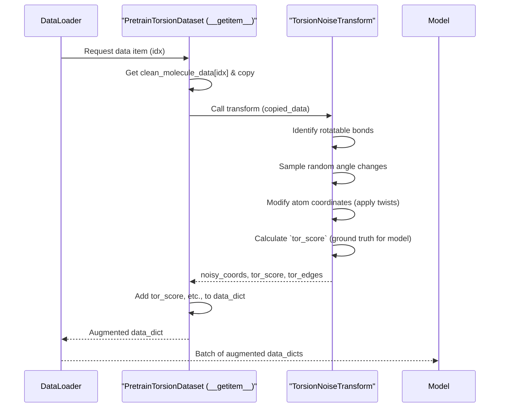

# Chapter 8: Noise Augmentation for Pre-training

Welcome to Chapter 8! In [Chapter 7: Dataset Handling & Preprocessing](07_dataset_handling___preprocessing_.md), we saw how ATOMICA prepares molecular data, getting it ready for our AI models. A crucial part of this preparation, especially for pre-training (which we touched on in [Chapter 2: Pre-training Models (DenoisePretrainModel)](02_pre_training_models__denoisepretrainmodel__.md)), is deliberately making the data a bit "messy" or "noisy." This chapter explains why and how we do that.

## What's the Big Idea? Training with Challenges

Imagine an athlete training for a big competition. A good coach doesn't just let the athlete practice under perfect conditions. Instead, they might introduce specific challenges: running on uneven ground, lifting slightly heavier weights, or practicing in distracting environments. These challenges (the "noise") help the athlete build stronger underlying skills, resilience, and adaptability.

Noise augmentation in ATOMICA's pre-training works on a similar principle. We take our clean molecular data and intentionally apply various forms of "noise" or perturbations to it. The AI model is then tasked with either:
1.  **Reversing the noise:** Trying to predict the original, clean structure from the noisy one.
2.  **Predicting the noise itself:** Figuring out exactly what kind of noise was applied.

By learning to deal with these controlled "imperfections," the model develops a much deeper and more robust understanding of what makes a molecular structure valid and stable. This is a cornerstone of self-supervised learning: the model learns by solving puzzles we create from the data itself.

**Our Central Use Case for this Chapter:**
During pre-training, we want our `DenoisePretrainModel` to learn the fundamental rules of 3D molecular geometry.
*   If we slightly **twist** some of the rotatable bonds in a molecule (torsion noise), can the model predict the original angles?
*   If we randomly **nudge** some atoms from their positions (Gaussian noise), can the model figure out how much they were nudged or restore their original positions?

These "noisy challenges" help the model build an intuition for molecular shapes and forces.

## Key Concepts: The Tools for "Messing Up" Data

1.  **`NoiseTransform` Classes:** These are specialized Python classes found in `utils/noise_transforms.py` that are responsible for applying specific types of noise to molecular data. Think of them as different "challenge generators" for our athlete. ATOMICA uses several:
    *   **`TorsionNoiseTransform`**: This transform focuses on rotatable bonds in a molecule. It randomly changes the torsion angles of these bonds, effectively "twisting" parts of themolecule.
    *   **`GaussianNoiseTransform`**: This transform adds small, random displacements (nudges) to the 3D coordinates of atoms, following a Gaussian (bell curve) distribution.
    *   **`GlobalRotationTransform`**: This rotates an entire molecule segment randomly in 3D space.
    *   **`GlobalTranslationTransform`**: This shifts an entire molecule segment randomly in 3D space without changing its orientation.

2.  **Self-Supervised Objective:** The key is that the model isn't just seeing noisy data; it's also given a target related to that noise.
    *   For example, if `TorsionNoiseTransform` twists a bond by +15 degrees, the model might be asked to predict this "+15 degree" value (or a score derived from it).
    *   If `GaussianNoiseTransform` shifts atoms, the model might be asked to predict the vector of these shifts.

3.  **Integration with Datasets:** As we saw in [Chapter 7: Dataset Handling & Preprocessing](07_dataset_handling___preprocessing_.md), these `NoiseTransform`s are typically used within the `__getitem__` method of pre-training `Dataset` classes (like `PretrainTorsionDataset` or `PretrainAtomDataset` from `data/dataset_pretrain.py`). This means noise is applied "on-the-fly" as data is loaded for each training batch.

## Applying Noise: How It's Used

You, as a user, control the type and amount of noise through command-line arguments when running `train.py` (from [Chapter 1: Experiment Configuration & Execution (`train.py`)](01_experiment_configuration___execution___train_py___.md)).

1.  **Setting Noise Levels in `train.py`:**
    You can specify arguments like:
    *   `--torsion_noise <value>`: Sets the strength (e.g., standard deviation) of the random torsion angle changes.
    *   `--atom_noise <value>`: Sets the strength of Gaussian noise applied to atom coordinates.
    *   `--rotation_noise <value>`: Sets the strength of global rotations.
    *   `--translation_noise <value>`: Sets the strength of global translations.

    Example `train.py` command for pre-training with torsion noise:
    ```bash
    python train.py \
        --task pretrain_torsion_masking \
        --train_set path/to/your/molecule_data.pkl \
        --torsion_noise 0.2 \
        --lr 0.0001 \
        --max_epoch 50 \
        # ... other arguments ...
    ```

2.  **Connecting Arguments to Datasets (`set_noise` function):**
    Inside `train.py`, there's a helper function called `set_noise`. This function takes the parsed command-line arguments and configures the appropriate `Dataset` object.

    ```python
    # train.py (Simplified snippet from set_noise)
    from data.dataset_pretrain import PretrainTorsionDataset # and others

    def set_noise(dataset, args):
        if type(dataset) == PretrainTorsionDataset: # Or PretrainMaskedTorsionDataset
            if args.torsion_noise != 0:
                # Calls a method on the dataset to enable and configure torsion noise
                dataset.set_torsion_noise(args.torsion_noise)
            if args.rotation_noise != 0:
                dataset.set_rotation_noise(args.rotation_noise, args.max_rotation)
            # ... and so on for other noise types ...
        # ... (similar logic for PretrainAtomDataset and args.atom_noise) ...
        return dataset
    ```
    The `dataset.set_torsion_noise(value)` method (defined in `PretrainTorsionDataset`) typically creates an instance of `TorsionNoiseTransform` and stores it.

3.  **Input and Output of a Noisy Data Item:**
    *   **Input (to `__getitem__`):** A "clean" molecular data dictionary (e.g., `{'X': coords, 'A': atom_types, ...}`).
    *   **Output (from `__getitem__` after noise transform):** An "augmented" data dictionary. It will contain:
        *   The modified (noisy) coordinates in `'X'`.
        *   The original atom/block types (`'A'`, `'B'`).
        *   **Crucially, new keys holding the "ground truth" noise values** that the model must learn to predict. For instance:
            *   `'tor_score'`: A numerical score related to the applied torsion changes.
            *   `'tor_edges'`: The edges (bonds) where torsion noise was applied.
            *   `'atom_score'`: Values related to the Gaussian noise shifts on atoms.
            *   `'rot_score'`, `'tr_score'`: Scores for global rotation/translation.

    The model ([Chapter 2: Pre-training Models (DenoisePretrainModel)](02_pre_training_models__denoisepretrainmodel__.md)) will then use these `*_score` values as targets in its loss function.

## Under the Hood: The Noise Application Process

Let's trace how a `TorsionNoiseTransform` might add "wiggles" to a molecule.

1.  **Data Request:** The `DataLoader` asks the `PretrainTorsionDataset` for a data item via its `__getitem__` method.
2.  **Copy Data:** Inside `__getitem__`, the clean molecular data for the requested item is usually deep-copied to avoid altering the original loaded data.
3.  **Transform Call:** The `TorsionNoiseTransform` object (which was initialized with the noise level from `args.torsion_noise`) is called with the copied molecular data.
4.  **Noise Application (`TorsionNoiseTransform.__call__`):**
    a.  Identifies rotatable bonds in the molecule (often based on pre-calculated `torsion_mask` information in the data).
    b.  For each selected rotatable bond, it samples a random angle change (e.g., from a normal distribution with standard deviation `self.tor_sigma`).
    c.  It calls a utility function (like `modify_conformer_torsion_angles`) that mathematically applies these rotations to the relevant atom coordinates. This changes the 3D structure.
    d.  It calculates a "score" based on the applied angle changes. This score (e.g., from `utils.torus.score`) is what the model will try to predict.
5.  **Return Augmented Data:** The `__call__` method returns the modified data (with noisy coordinates) and a dictionary containing the `tor_score` and `tor_edges`.
6.  **Dataset Finalizes:** The `__getitem__` method of the dataset adds these noise-related outputs to the main data dictionary and returns it.

Here's a simplified sequence diagram for this:



## A Peek at the Code: `NoiseTransform` in Action

Let's look at some very simplified code snippets.

**1. `TorsionNoiseTransform` (from `utils/noise_transforms.py`)**

This class applies the torsion noise.

```python
# utils/noise_transforms.py (Highly Simplified TorsionNoiseTransform)
import numpy as np
# from .torus import score as torus_score # For calculating the target score
# from . import modify_conformer_torsion_angles # Utility to change coords

class TorsionNoiseTransform:
    def __init__(self, tor_sigma): # tor_sigma comes from --torsion_noise
        self.tor_sigma = tor_sigma

    def __call__(self, data, chosen_segment): # 'data' is a dict like {'X':..., 'A':...}
        coords = np.array(data['X'])
        # 'torsion_mask' in 'data' tells us which edges are rotatable
        # and which atoms move when a specific edge is rotated.
        # Example: edges_to_rotate = data['torsion_mask'][chosen_segment]['edges']
        # Example: atoms_that_move_masks = data['torsion_mask'][chosen_segment]['mask_rotate']
        
        if edges_to_rotate is None: # No rotatable bonds in this segment
            return data, None, np.empty((2,0), dtype=np.long)

        num_rot_edges = len(edges_to_rotate)
        # Sample random angle changes
        torsion_updates = np.random.normal(0, self.tor_sigma, num_rot_edges)
        
        # Apply these angle changes to the coordinates
        # noisy_coords = modify_conformer_torsion_angles(
        #    coords, edges_to_rotate, atoms_that_move_masks, torsion_updates
        # )
        data['X'] = noisy_coords # Update coordinates in the data dict

        # Calculate the "score" the model needs to predict
        # current_tor_score = torus_score(torsion_updates, self.tor_sigma)
        
        # Return modified data, the score, and which edges were noised
        return data, current_tor_score, edges_to_rotate.T 
```
The key steps are:
*   Getting the list of rotatable bonds (`edges_to_rotate`) from the input `data`.
*   Generating random `torsion_updates` (angle changes).
*   Modifying the 3D `coords` based on these updates.
*   Calculating `current_tor_score`, which the `DenoisePretrainModel` will try to predict.

**2. `GaussianNoiseTransform` (from `utils/noise_transforms.py`)**

This is conceptually simpler: it just adds random vectors to atom coordinates.

```python
# utils/noise_transforms.py (Highly Simplified GaussianNoiseTransform)
import numpy as np
import copy

class GaussianNoiseTransform:
    def __init__(self, sigma): # sigma comes from --atom_noise
        self.sigma = sigma

    def __call__(self, data, chosen_segment):
        original_coords = copy.deepcopy(np.array(data['X']))
        # Get atom indices for the chosen_segment (excluding global/virtual atoms)
        # relevant_atom_indices = ... 

        # Generate random noise (scaled by a random epsilon based on self.sigma)
        noise_vectors = np.random.normal(0, 1, (len(relevant_atom_indices), 3))
        epsilon_scale = np.random.uniform(0.1, self.sigma) # Random strength
        
        # Add noise to coordinates of relevant atoms
        data['X'][relevant_atom_indices] += noise_vectors * epsilon_scale
        
        # The "score" is related to the applied noise (scaled difference)
        atom_noise_score = (original_coords - data['X']) / epsilon_scale
        
        return data, atom_noise_score, epsilon_scale
```
Here, the model will try to predict `atom_noise_score`.

**3. Usage in `PretrainTorsionDataset` (from `data/dataset_pretrain.py`)**

The dataset's `__getitem__` method uses these transforms.

```python
# data/dataset_pretrain.py (Simplified PretrainTorsionDataset __getitem__)
import copy
# from utils.noise_transforms import TorsionNoiseTransform # Loaded in __init__

class PretrainTorsionDataset(torch.utils.data.Dataset):
    def __init__(self, data_file_path, torsion_noise_level):
        self.data = open_data_file(data_file_path) # Load all data
        # If torsion_noise_level > 0, create the transform object
        if torsion_noise_level > 0:
            self.tor_transform = TorsionNoiseTransform(torsion_noise_level)
        else:
            self.tor_transform = None
        # ... (similar for self.rot_transform, self.trans_transform)

    def __getitem__(self, idx):
        item_data_copy = copy.deepcopy(self.data[idx]['data'])
        chosen_segment = np.random.choice([0, 1]) # Pick a segment to noise

        # Initialize scores
        tor_score_val, tor_edges_val = None, np.empty((2,0), dtype=np.long)
        
        if self.tor_transform is not None:
            # Apply torsion noise
            item_data_copy, tor_score_val, tor_edges_val = self.tor_transform(
                item_data_copy, chosen_segment
            )
        
        # ... (apply other active transforms like rotation, translation) ...

        # Add results to the dictionary returned to the DataLoader
        item_data_copy['tor_score'] = tor_score_val
        item_data_copy['tor_edges'] = tor_edges_val
        # ... (add 'rot_score', 'tr_score', 'noisy_segment', etc.) ...
        return item_data_copy
```
The dataset creates transform objects (like `self.tor_transform`) during its initialization if the corresponding noise level is set. Then, in `__getitem__`, it calls these transforms to augment the data and adds the resulting scores (e.g., `tor_score_val`) to the dictionary that will be passed to the model.

## Conclusion: Learning from Imperfection

You've now learned about Noise Augmentation, a key technique ATOMICA uses for self-supervised pre-training. By intentionally adding controlled "noise" to molecular data using `NoiseTransform` classes like `TorsionNoiseTransform` and `GaussianNoiseTransform`, we create challenging puzzles for our AI models. Solving these puzzles – by predicting the nature of the noise or restoring the original structure – helps the models learn robust and meaningful representations of molecular geometry and chemistry.

Key takeaways:
*   Noise augmentation makes pre-training more effective by challenging the model.
*   `NoiseTransform` classes (e.g., `TorsionNoiseTransform`, `GaussianNoiseTransform`) are responsible for applying specific types of noise.
*   These transforms are typically used within pre-training `Dataset` classes.
*   The model learns by trying to predict properties of the applied noise (e.g., `tor_score`, `atom_score`).
*   You control noise types and levels via `train.py` arguments.

This process generates the "noisy" data that the pre-training models learn from. But how is the actual learning process – the training loops, optimization, and saving of models – managed? That's the job of the `Trainer`.

Let's explore this in our next chapter: [Chapter 9: Training Orchestration (Trainer)](09_training_orchestration__trainer__.md).

---

Generated by [AI Codebase Knowledge Builder](https://github.com/The-Pocket/Tutorial-Codebase-Knowledge)