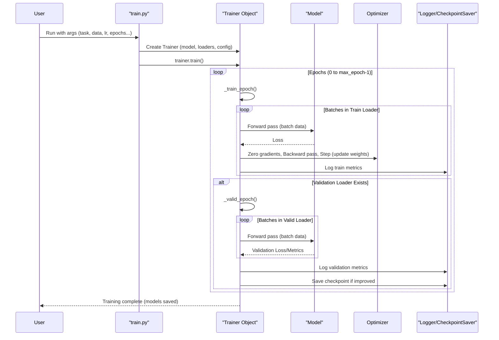

# Chapter 9: Training Orchestration (Trainer)

Welcome to the final chapter of our ATOMICA journey! In [Chapter 8: Noise Augmentation for Pre-training](08_noise_augmentation_for_pre_training_.md), we learned how ATOMICA deliberately "challenges" models with noisy data to help them learn better during pre-training. We've covered how data is prepared, how models are structured, and even how the core GNN works. But what actually *runs* the show? What component takes a model, data, and settings, and then meticulously manages the entire learning process from start to finish?

That's the role of the **Trainer**.

## What's the Big Idea? The "Project Manager" for Model Learning

Imagine you're building a complex piece of machinery (our AI model). You have the blueprints (model architecture), the raw materials (data), and a set of instructions on how to assemble and test it (training parameters like learning rate, number of cycles).

The `Trainer` in ATOMICA is like the **Project Manager** or **Head Coach** for this entire construction and testing process. It's responsible for:
*   Ensuring the "assembly line" (training loop) runs smoothly for the specified number of cycles (epochs).
*   Providing the right "materials" (data batches) to the "workers" (model) at each step.
*   Monitoring the "quality control" (calculating loss, running validation).
*   Adjusting the "machinery settings" (optimizer steps, learning rate changes).
*   Keeping detailed "progress reports" (logging metrics).
*   Saving the best "prototypes" (model checkpoints).

In short, the `Trainer` classes orchestrate the entire training and validation lifecycle of your model.

**Our Central Use Case for this Chapter:**
We have:
1.  An AI model (e.g., an `AffinityPredictor` from [Chapter 3: Downstream Task Models & Prediction Heads](03_downstream_task_models___prediction_heads_.md)).
2.  Training and validation data loaders (from [Chapter 7: Dataset Handling & Preprocessing](07_dataset_handling___preprocessing_.md)).
3.  A set of training instructions (e.g., learn for 50 epochs, use a learning rate of 0.0001, save the results in `./my_model_dir`).

How does ATOMICA use a `Trainer` to take these components and execute the training process, ultimately producing a trained model?

## Key Concepts: The Manager's Toolkit

1.  **`abs_trainer.Trainer` (The Base Blueprint):**
    Located in `trainers/abs_trainer.py`, this is the fundamental blueprint or base class for all trainers in ATOMICA. It defines the common structure and core logic that all trainers must implement or inherit, like the main training loop, validation process, and checkpoint saving.

2.  **Specific Trainer Classes (The Specialists):**
    Different tasks or model types might need slightly different training procedures or ways to calculate metrics. So, ATOMICA has specialized trainers that inherit from `abs_trainer.Trainer`:
    *   `AffinityTrainer` (`trainers/affinity_trainer.py`): For models predicting continuous values like binding affinity.
    *   `ClassifierTrainer` (`trainers/affinity_trainer.py`): For binary classification models.
    *   `MultiClassClassifierTrainer` (`trainers/affinity_trainer.py`): For multi-class classification.
    *   `PretrainTrainer`, `PretrainMaskingNoisingTrainer` (`trainers/pretrain_trainer.py`): For various pre-training tasks, handling specific loss components like noise prediction or masked token prediction.
    *   `MaskingTrainer` (`trainers/masking_trainer.py`): For models focused on masked token prediction.
    *   `ProtInterfaceTrainer` (`trainers/prot_interface_trainer.py`): For protein interface prediction tasks.

3.  **`TrainConfig` (The Project Plan):**
    Also found in `trainers/abs_trainer.py`, `TrainConfig` is a simple class (like a data container) that holds all the important settings for a training run:
    *   `save_dir`: Where to save models and logs.
    *   `lr`: The learning rate.
    *   `max_epoch`: Total number of training epochs.
    *   `patience`: For early stopping (how many epochs to wait without improvement before stopping).
    *   `grad_clip`: A value to prevent gradients from becoming too large (exploding).
    *   ...and other parameters like warmup settings.

    ```python
    # trainers/abs_trainer.py (Simplified TrainConfig)
    class TrainConfig:
        def __init__(self, save_dir, lr, max_epoch, patience=-1, grad_clip=None, **kwargs):
            self.save_dir = save_dir
            self.lr = lr
            self.max_epoch = max_epoch
            self.patience = patience if patience > 0 else max_epoch # Default to max_epoch
            self.grad_clip = grad_clip
            # ... other initializations ...
            self.__dict__.update(kwargs) # Store any additional parameters
    ```
    This `TrainConfig` object is passed to the Trainer when it's created.

4.  **Core Responsibilities of a Trainer:**
    *   **Setup Optimizers:** An optimizer (e.g., AdamW) is what actually updates the model's weights based on the calculated errors (loss). The Trainer initializes this.
    *   **Setup Learning Rate Schedulers:** A scheduler can adjust the learning rate during training (e.g., decrease it over time). The Trainer sets this up.
    *   **Training Loop:** Iterates through epochs and, within each epoch, through batches of training data.
    *   **Loss Calculation:** For each batch, it feeds the data to the model, gets the model's predictions, and calculates the loss (how wrong the model was).
    *   **Backpropagation:** It tells PyTorch to calculate gradients (how each model weight contributed to the loss) and then tells the optimizer to update the weights.
    *   **Validation Loop:** Periodically, it runs the model on a separate validation dataset to check how well it's generalizing.
    *   **Logging:** It records important metrics (like loss, accuracy, learning rate) to the console and potentially to tools like TensorBoard or Weights & Biases (WandB).
    *   **Saving Checkpoints:** It saves the model's state (weights) to disk, usually keeping track of the best-performing model on the validation set.
    *   **Multi-GPU Handling (Briefly):** Trainers in ATOMICA are designed to work with PyTorch's DistributedDataParallel for training on multiple GPUs, though the details are abstracted away for the user.

## Using the Trainer: Launching the Learning Process

You don't usually create a `Trainer` object directly by calling its constructor (e.g., `MyTrainer(...)`). Instead, the `train.py` script (from [Chapter 1: Experiment Configuration & Execution (`train.py`)](01_experiment_configuration___execution___train_py___.md)) has a helper function to do this for you.

1.  **`create_trainer` in `train.py`:**
    This function acts like a dispatcher. Based on the type of model you're using (which is determined by `args.task`), it chooses and instantiates the correct `Trainer` specialist.

    ```python
    # train.py (Simplified snippet from create_trainer)
    # import models # From Chapter 3, etc.
    # import trainers # From trainers directory

    def create_trainer(model, train_loader, valid_loader, config, resume_state=None):
        model_type = type(model)
        if model_type == models.AffinityPredictor:
            trainer = trainers.AffinityTrainer(model, train_loader, valid_loader, config)
        elif model_type == models.ClassifierModel:
            trainer = trainers.ClassifierTrainer(model, train_loader, valid_loader, config)
        elif model_type == models.DenoisePretrainModel:
            # Logic to choose between PretrainTrainer or PretrainMaskingNoisingTrainer
            # based on model.masking_objective
            if model.masking_objective:
                trainer = trainers.PretrainMaskingNoisingTrainer(model, ...)
            else:
                trainer = trainers.PretrainTrainer(model, ...)
        # ... other elif blocks for other model types ...
        else:
            raise NotImplementedError(f'Trainer for {model_type} not implemented!')
        return trainer
    ```
    So, if your `model` is an `AffinityPredictor`, `create_trainer` will give you an `AffinityTrainer`.

2.  **Setting up `TrainConfig` and Calling `trainer.train()` in `train.py`:**
    The `main()` function in `train.py` first gathers all your command-line arguments (`args`). It then creates a `TrainConfig` object from these arguments and calls `create_trainer`. Finally, it kicks off the entire process by calling the `train()` method of the instantiated trainer.

    ```python
    # train.py (Simplified snippet from main())
    # args = parse() # Get command-line arguments
    # model = models.create_model(args)
    # train_loader, valid_loader = # ... create DataLoaders ...

    # 1. Create the "Project Plan" (TrainConfig)
    config = trainers.TrainConfig(
        save_dir=args.save_dir, lr=args.lr, max_epoch=args.max_epoch,
        patience=args.patience, grad_clip=args.grad_clip,
        # ... other parameters from args ...
    )

    # 2. Get the "Project Manager" (Trainer)
    trainer = create_trainer(model, train_loader, valid_loader, config)
    
    # 3. Start the project!
    trainer.train(gpus=args.gpus, local_rank=args.local_rank, use_wandb=args.use_wandb)
    ```

**Input & Output:**
*   **Input to `Trainer` (via `create_trainer` and `TrainConfig`):**
    *   The `model` to be trained.
    *   The `train_loader` providing training data batches.
    *   The `valid_loader` (optional) providing validation data batches.
    *   The `config` object with all training settings (LR, epochs, save directory, etc.).
*   **Output of `trainer.train()`:**
    *   Trained model checkpoints saved to the `config.save_dir`.
    *   Log files (e.g., TensorBoard, WandB logs if enabled) in `config.save_dir`.
    *   Messages printed to your console showing training progress, loss values, and validation metrics.

## Under the Hood: A Day in the Life of a Trainer

When `trainer.train(...)` is called, a carefully orchestrated sequence of events begins. Let's follow the general flow, managed by the base `abs_trainer.Trainer` class:

1.  **Initialization (`__init__` in `abs_trainer.Trainer`):**
    *   Stores the `model`, `train_loader`, `valid_loader`, and `config`.
    *   Calls `self.get_optimizer()` to create an optimizer (e.g., AdamW). Specific trainers can override this to define their preferred optimizer.
    *   Calls `self.get_scheduler()` to create a learning rate scheduler. Again, specific trainers can customize this.
    *   Sets up logging (e.g., directory for saving, versioning).
    *   Initializes tracking variables (current epoch, global step, best validation metric).

2.  **The Main `train()` Method (in `abs_trainer.Trainer`):**
    This is the conductor of the orchestra.
    *   Sets up the model for training (e.g., `model.to(device)`).
    *   Handles distributed training setup if multiple GPUs are used.
    *   **Epoch Loop:** Iterates from `epoch = 0` to `config.max_epoch - 1`.
        *   Calls `self._train_epoch(device)` to train for one full pass over the training data.
        *   Calls `self._valid_epoch(device)` to evaluate the model on the validation data.
        *   Updates epoch count, checks for early stopping based on `patience` and validation performance.
        *   If `patience` runs out, breaks the loop.

3.  **`_train_epoch(device)` Method (One Pass Over Training Data):**
    *   Sets the model to training mode (`self.model.train()`).
    *   Notifies the `train_loader`'s sampler if distributed training is active (to ensure data is shuffled correctly across GPUs).
    *   **Batch Loop:** Iterates through batches provided by `self.train_loader`.
        *   Moves the current `batch` of data to the correct `device` (GPU/CPU).
        *   Calls `self.train_step(batch, self.global_step)`. This is a method that specific trainers (like `AffinityTrainer`) implement to define how a single training step is performed for their specific model/task. It typically involves:
            *   Feeding the `batch` to `self.model` to get predictions and `loss`.
            *   Logging training loss and other batch-level metrics.
        *   `self.optimizer.zero_grad()`: Clears any old gradients.
        *   `loss.backward()`: Calculates new gradients.
        *   `torch.nn.utils.clip_grad_norm_()` (if `config.grad_clip` is set): Clips gradients to prevent them from exploding.
        *   `self.optimizer.step()`: Updates the model's weights using the gradients.
        *   Increments `self.global_step`.
        *   If a batch-wise learning rate scheduler is used (`self.sched_freq == 'batch'`), calls `self.scheduler.step()`.
    *   If an epoch-wise scheduler is used (`self.sched_freq == 'epoch'`), calls `self.scheduler.step()` after the batch loop.

4.  **`_valid_epoch(device)` Method (One Pass Over Validation Data):**
    *   If `self.valid_loader` is `None`, it might just save the current model and skip validation.
    *   Sets the model to evaluation mode (`self.model.eval()`). This is important as some layers (like Dropout, BatchNorm) behave differently during training and evaluation.
    *   Disables gradient calculations (`with torch.no_grad():`).
    *   **Batch Loop:** Iterates through batches from `self.valid_loader`.
        *   Moves `batch` to `device`.
        *   Calls `self.valid_step(batch, self.valid_global_step)`. Similar to `train_step`, this is implemented by specific trainers. It gets predictions and calculates validation metrics (e.g., validation loss, accuracy, RMSE).
        *   Aggregates predictions and true labels from all validation batches.
    *   Calculates overall validation metrics from the aggregated results (e.g., average loss, overall RMSE, AUROC).
    *   Logs these validation metrics (e.g., to console, WandB).
    *   **Checkpointing:**
        *   Saves the current model state (e.g., `epochX_stepY.ckpt` and `.pt` weight files).
        *   Compares the current `valid_metric` with `self.best_valid_metric`.
        *   If the current model is better (or if top-k saving is enabled), it calls `self._maintain_topk_checkpoint()` and `self._maintain_topk_weights()` to save it and potentially remove older, worse checkpoints.
        *   Updates `self.best_valid_metric` and resets `self.patience` if the model improved. Otherwise, decrements `self.patience`.

Here's a simplified sequence diagram:



## A Peek at the Code

Let's glance at some simplified code snippets to see these ideas in action.

**1. Base Trainer: `abs_trainer.Trainer`**

```python
# trainers/abs_trainer.py (Highly simplified Trainer class structure)
import torch
import os
from tqdm import tqdm # For progress bars
# from torch.utils.tensorboard import SummaryWriter # For logging

class Trainer:
    def __init__(self, model, train_loader, valid_loader, config):
        self.model = model
        self.train_loader = train_loader
        self.valid_loader = valid_loader
        self.config = config
        self.optimizer = self.get_optimizer() # May be overridden by child
        sched_config = self.get_scheduler(self.optimizer) # May be overridden
        self.scheduler = sched_config['scheduler']
        self.sched_freq = sched_config['frequency']
        
        self.epoch = 0
        self.global_step = 0
        self.best_valid_metric = float('inf') if config.metric_min_better else -float('inf')
        self.patience = config.patience
        # ... other initializations like model_dir, writer ...

    def get_optimizer(self): # Default optimizer
        return torch.optim.Adam(self.model.parameters(), lr=self.config.lr)

    def get_scheduler(self, optimizer): # Default scheduler (example)
        return {'scheduler': torch.optim.lr_scheduler.StepLR(optimizer, step_size=1, gamma=0.9), 
                'frequency': 'epoch'}

    def train(self, device_ids, local_rank, use_wandb=False, use_raytune=False):
        # ... setup device, model.to(device), distributed training wrappers ...
        # self.writer = SummaryWriter(self.config.save_dir) # If main process
        
        for _epoch_idx in range(self.config.max_epoch):
            self.epoch = _epoch_idx # Actually, trainer.epoch might be loaded from checkpoint
            # print_log(f'epoch{self.epoch} starts')
            self._train_epoch("cuda" if device_ids[0] != -1 else "cpu") # Simplified device
            self._valid_epoch("cuda" if device_ids[0] != -1 else "cpu")
            
            if self.patience <= 0:
                # print_log("Early stopping.")
                break
            self.epoch +=1 # increment epoch after finishing current one

    def _train_epoch(self, device):
        self.model.train() # Set model to training mode
        # for batch_idx, batch in tqdm(enumerate(self.train_loader), ...):
            # batch = self.to_device(batch, device)
            # loss_or_loss_obj = self.train_step(batch, self.global_step) # train_step is in child
            # self.optimizer.zero_grad()
            # loss_to_backward = loss_or_loss_obj if isinstance(loss_or_loss_obj, torch.Tensor) else loss_or_loss_obj.loss
            # loss_to_backward.backward()
            # if self.config.grad_clip: torch.nn.utils.clip_grad_norm_(...)
            # self.optimizer.step()
            # self.global_step += 1
            # if self.sched_freq == 'batch' and self.scheduler: self.scheduler.step()
        # if self.sched_freq == 'epoch' and self.scheduler: self.scheduler.step()
        pass # Actual loop is more complex

    def _valid_epoch(self, device):
        if self.valid_loader is None: return
        self.model.eval() # Set model to evaluation mode
        # all_preds, all_labels, all_losses = [], [], []
        # with torch.no_grad():
            # for batch in tqdm(self.valid_loader, ...):
                # batch = self.to_device(batch, device)
                # loss_or_metrics, preds = self.valid_step(batch, self.valid_global_step) # valid_step is in child
                # all_losses.append(...)
                # all_preds.append(preds.cpu())
                # all_labels.append(batch['label'].cpu())
        # valid_metric = # ... calculate overall metric from all_losses/all_preds/all_labels ...
        # print_log(f'Validation metric: {valid_metric}')
        # self._maintain_topk_checkpoint(valid_metric, save_path)
        # ... update patience ...
        pass # Actual loop is more complex

    # train_step and valid_step are usually implemented by child classes
    def train_step(self, batch, batch_idx): # Example, must be overridden
        raise NotImplementedError
    
    def valid_step(self, batch, batch_idx): # Example, must be overridden
        raise NotImplementedError

    # ... helper methods like _is_main_proc, to_device, _maintain_topk_checkpoint ...
```
This base `Trainer` sets up the main loops and checkpointing logic. Child trainers will override `get_optimizer`, `get_scheduler`, `train_step`, and `valid_step` to tailor the process.

**2. A Specific Trainer: `AffinityTrainer`** (from `trainers/affinity_trainer.py`)
This trainer is for regression tasks like predicting binding affinity.

```python
# trainers/affinity_trainer.py (Simplified AffinityTrainer)
# from .abs_trainer import Trainer
# import torch.optim
# from torch.optim.lr_scheduler import LambdaLR
# from math import exp, log

class AffinityTrainer(Trainer):
    def __init__(self, model, train_loader, valid_loader, config):
        # ... (initialization related to learning rate decay) ...
        self.log_alpha = log(config.final_lr / config.lr) / (config.max_epoch * config.step_per_epoch)
        super().__init__(model, train_loader, valid_loader, config)

    def get_optimizer(self): # Custom optimizer
        return torch.optim.AdamW(self.model.parameters(), lr=self.config.lr, weight_decay=1e-3)

    def get_scheduler(self, optimizer): # Custom scheduler (exponential decay)
        lr_lambda = lambda step: exp(self.log_alpha * (step + 1))
        scheduler = LambdaLR(optimizer, lr_lambda=lr_lambda)
        return {'scheduler': scheduler, 'frequency': 'batch'}

    def share_step(self, batch, batch_idx, val=False): # Used by train_step and valid_step
        # Calls the model's forward pass (defined in AffinityPredictor, Chapter 3)
        loss, pred = self.model(
            Z=batch['X'], B=batch['B'], A=batch['A'], # Input data
            # ... other necessary batch keys ...
            label=batch['label'] # Ground truth affinity
        )
        # self.log(f'Loss/{("Validation" if val else "Train")}', loss, batch_idx, val)
        return loss, pred # Return loss and predictions

    def train_step(self, batch, batch_idx):
        loss, _ = self.share_step(batch, batch_idx, val=False)
        return loss # Just need loss for backpropagation

    def valid_step(self, batch, batch_idx):
        return self.share_step(batch, batch_idx, val=True) # Need loss and preds for metrics

    # _valid_epoch will then use predictions and labels to calculate RMSE, Pearson, etc.
```
The `AffinityTrainer` defines its own optimizer (`AdamW`) and a specific learning rate scheduler. Its `share_step` method shows how it calls the model (which would be an `AffinityPredictor`) and gets the loss and predictions.

**3. Pre-training Trainer: `PretrainMaskingNoisingTrainer`** (from `trainers/pretrain_trainer.py`)
This trainer handles models like `DenoisePretrainModel` that have multiple loss components (e.g., for atom denoising, torsion denoising, masked block prediction).

```python
# trainers/pretrain_trainer.py (Simplified PretrainMaskingNoisingTrainer)
# from .pretrain_trainer import PretrainTrainer # It inherits from PretrainTrainer

class PretrainMaskingNoisingTrainer(PretrainTrainer): # Or directly from Trainer
    # get_optimizer, get_scheduler might be inherited or overridden

    def share_step(self, batch, batch_idx, val=False):
        # Calls DenoisePretrainModel's forward pass (Chapter 2)
        # which returns an object containing multiple loss components.
        loss_obj = self.model(
            Z=batch['X'], B=batch['B'], A=batch['A'],
            # ... coordinates, types ...
            receptor_segment=batch.get('noisy_segment'), # Info about noisy parts
            atom_score=batch.get('atom_score'),   # Ground truth for atom noise
            tr_score=batch.get('tr_score'),       # Ground truth for translation noise
            rot_score=batch.get('rot_score'),     # Ground truth for rotation noise
            tor_score=batch.get('tor_score'),     # Ground truth for torsion noise
            masked_blocks=batch.get('masked_blocks'), # Info about masked blocks
            masked_labels=batch.get('masked_labels')  # True labels for masked blocks
            # ... other inputs ...
        )
        # log individual losses if self.use_wandb and self._is_main_proc():
        #   wandb.log({'train_atom_loss': loss_obj.atom_loss.item()}, ...)
        #   wandb.log({'train_masked_loss': loss_obj.masked_loss.item()}, ...)
        return loss_obj # Return the whole object containing total loss and components

    def train_step(self, batch, batch_idx):
        loss_obj = self.share_step(batch, batch_idx, val=False)
        # The actual loss for backpropagation is loss_obj.loss
        # The base Trainer's _train_epoch will handle loss_obj.loss.backward()
        return loss_obj # Or just loss_obj.loss, depending on base class handling

    def valid_step(self, batch, batch_idx):
        loss_obj = self.share_step(batch, batch_idx, val=True)
        # _valid_epoch would use loss_obj.loss for overall validation metric
        # and potentially loss_obj.pred_blocks vs batch['masked_labels'] for accuracy
        return loss_obj
```
The `share_step` here shows how it passes all the necessary ground truth noise scores and masking information from the batch to the pre-training model. The model's `forward` method (from [Chapter 2: Pre-training Models (DenoisePretrainModel)](02_pre_training_models__denoisepretrainmodel__.md)) calculates the combined loss, which is then used for backpropagation.

## Conclusion: Your Automated Training Conductor

You've now seen how ATOMICA's `Trainer` classes act as sophisticated project managers for the entire AI model learning process. They take a model, data, and configuration, and then meticulously handle everything from setting up optimizers and schedulers to running training and validation loops, logging metrics, and saving the best models.

Key takeaways:
*   The `Trainer` (with `abs_trainer.Trainer` as a base) orchestrates the entire training and validation lifecycle.
*   Specific trainers (e.g., `AffinityTrainer`, `PretrainTrainer`) are tailored for different model types and tasks.
*   `TrainConfig` holds all crucial training settings.
*   The `Trainer` manages epochs, batches, loss calculation, backpropagation, metric logging, and model checkpointing.
*   The `create_trainer` function in `train.py` intelligently selects the appropriate trainer for your specified task.

With the `Trainer` managing the learning process, you can focus on defining your experiments, preparing your data, and designing your models, knowing that ATOMICA has a robust system to handle the intricate details of training them effectively.

This concludes our tutorial series on the core components of ATOMICA. We hope this journey has given you a solid understanding of how this powerful toolkit works, from high-level experiment configuration all the way down to the nuts and bolts of its neural networks and training procedures. Happy modeling!

---

Generated by [AI Codebase Knowledge Builder](https://github.com/The-Pocket/Tutorial-Codebase-Knowledge)