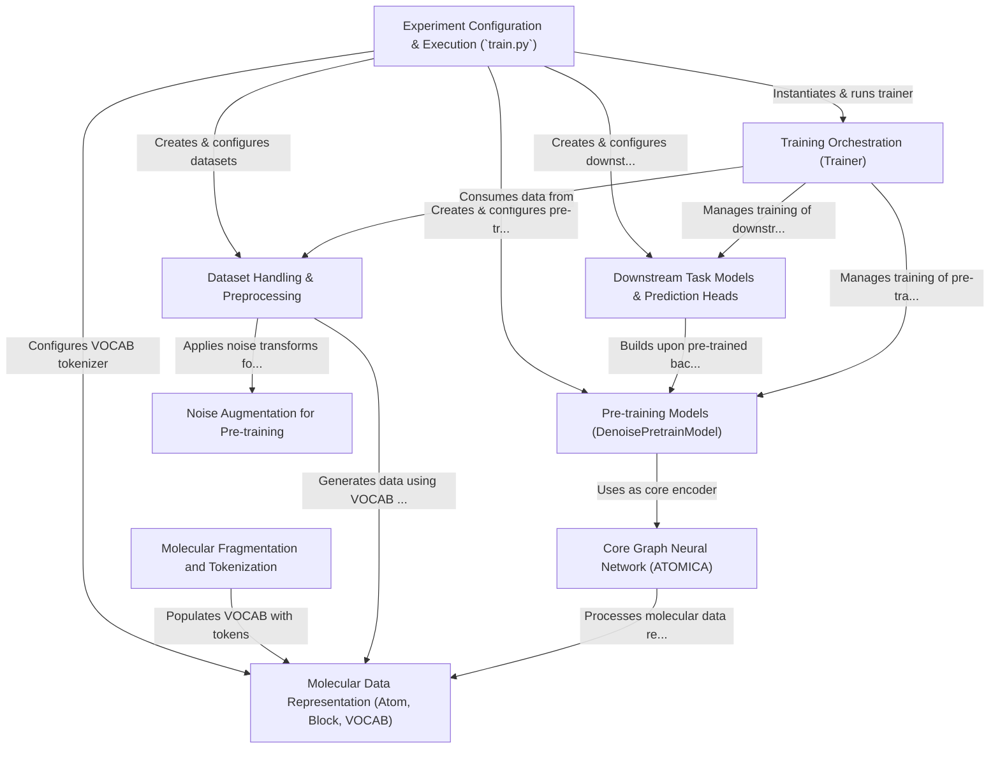

# Tutorial: ATOMICA

ATOMICA is a software project for **3D molecular modeling** using *Graph Neural Networks (GNNs)*.
Its core is an **SE(3)-equivariant GNN** architecture designed to learn meaningful representations of molecules directly from their 3D atomic coordinates.
The project emphasizes *self-supervised pre-training*, where the model learns fundamental chemical and structural principles by tasks like denoising corrupted molecular inputs or predicting masked fragments.
These powerful **pre-trained models** can then be adapted (*fine-tuned*) for various **downstream predictive tasks**, such as determining protein-ligand binding affinity or classifying molecular properties.

**Source Repository:** [https://github.com/mims-harvard/ATOMICA.git](https://github.com/mims-harvard/ATOMICA.git)

## Chapters

1. [Experiment Configuration & Execution (`train.py`)
](01_experiment_configuration___execution___train_py___.md)
2. [Pre-training Models (DenoisePretrainModel)
](02_pre_training_models__denoisepretrainmodel__.md)
3. [Downstream Task Models & Prediction Heads
](03_downstream_task_models___prediction_heads_.md)
4. [Molecular Data Representation (Atom, Block, VOCAB)
](04_molecular_data_representation__atom__block__vocab__.md)
5. [Core Graph Neural Network (ATOMICA)
](05_core_graph_neural_network__atomica__.md)
6. [Molecular Fragmentation and Tokenization
](06_molecular_fragmentation_and_tokenization_.md)
7. [Dataset Handling & Preprocessing
](07_dataset_handling___preprocessing_.md)
8. [Noise Augmentation for Pre-training
](08_noise_augmentation_for_pre_training_.md)
9. [Training Orchestration (Trainer)
](09_training_orchestration__trainer__.md)

---

Generated by [AI Codebase Knowledge Builder](https://github.com/The-Pocket/Tutorial-Codebase-Knowledge)