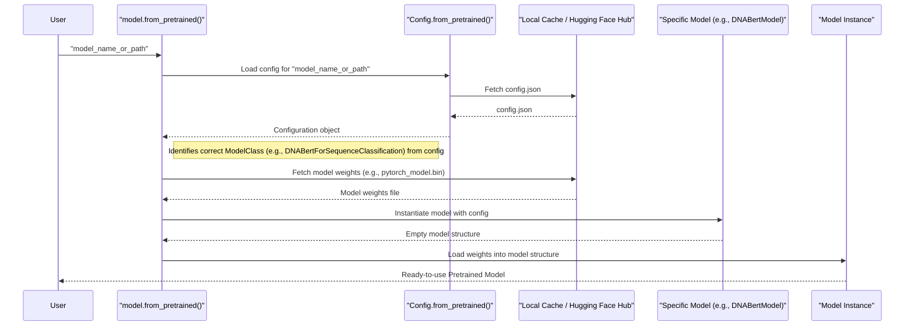

# Chapter 2: Pretrained Model (`PreTrainedModel` / `TFPreTrainedModel`)

Welcome back! In [Chapter 1: Tokenizer (`PreTrainedTokenizer` & `DNATokenizer`)](01_tokenizer___pretrainedtokenizer_____dnatokenizer___.md), we learned how to break down DNA sequences into "k-mers" and convert them into numbers (tokens) that our DNABERT model can understand. Now that we have our input ready, it's time to meet the "brain" of our operation: the DNABERT model itself!

This chapter introduces `PreTrainedModel` (for PyTorch users) and `TFPreTrainedModel` (for TensorFlow users). These are fundamental classes in the Hugging Face Transformers library, and DNABERT models are built using them.

## What's a `PreTrainedModel` and Why Do We Need It?

Imagine you want to build a super-sophisticated DNA analysis machine. Instead of starting from scratch every single time, what if you had a master blueprint? This blueprint would define:
*   How to assemble the machine from standard parts.
*   How to load pre-assembled, high-performance components (like an engine that's already been expertly tuned).
*   How to save your custom designs or modifications.

That's exactly what `PreTrainedModel` (and its TensorFlow counterpart `TFPreTrainedModel`) does for neural network models like DNABERT!

**The Problem It Solves:**
Modern neural network models are complex, with millions or even billions of parameters (the "settings" they learn). Training these models from scratch requires huge amounts of data and computing power. `PreTrainedModel` provides a way to:
1.  **Easily load models** that have already been trained by experts on massive datasets (like a vast library of DNA sequences). This means you get a powerful, "smart" model right out of the box.
2.  **Easily save your models**, whether you've trained them from scratch or fine-tuned a pre-trained one on your specific task.
3.  **Provide a consistent way** to interact with different models, even if their internal architectures (like BERT, ALBERT, or DNABERT) vary.

These classes are the foundational base for almost all models in the Transformers library. Specific models like `BertModel`, `AlbertModel`, or our own `DNABertModel` are all derived from this "master blueprint." They inherit core functionalities for loading configurations (the model's structural plan) and weights (the learned knowledge).

## Key Functionalities: Loading and Saving Models

The two most important features you'll use from `PreTrainedModel` are:
1.  `from_pretrained()`: To load a model.
2.  `save_pretrained()`: To save a model.

Let's see them in action!

### 1. `from_pretrained()`: Your Gateway to Powerful Models

This is the magic wand that lets you load a pre-trained model with just one line of code. Suppose you want to load a DNABERT model that's been pre-trained for classifying DNA sequences (e.g., predicting if a DNA sequence has a certain function).

**Use Case:** You have a DNA sequence, and you want to use a DNABERT model (pre-trained on millions of DNA sequences) to predict if this sequence contains a promoter region.

First, you'd tokenize your sequence as we learned in [Chapter 1: Tokenizer (`PreTrainedTokenizer` & `DNATokenizer`)](01_tokenizer___pretrainedtokenizer_____dnatokenizer___.md). Then, you load the model:

```python
from transformers import AutoModelForSequenceClassification # A generic way to load models for sequence classification

# Let's assume "zhihan1996/DNABERT-2-117M" is a pre-trained DNABERT model
# suitable for sequence classification tasks.
# This model identifier tells Transformers where to find the model's configuration and weights.
model_name_or_path = "zhihan1996/DNABERT-2-117M" # Or a local path like "./my_dnabert_model/"

# Load the pre-trained DNABERT model
# This will download the model if it's not already cached locally.
try:
    model = AutoModelForSequenceClassification.from_pretrained(model_name_or_path)
    print(f"Successfully loaded model: {model_name_or_path}")
except Exception as e:
    print(f"Could not load model. This might be because the model is not on Hugging Face Hub or path is incorrect.")
    print(f"For this tutorial, we'll proceed with a conceptual understanding.")
    # In a real scenario, ensure the model name/path is correct and you have internet or local files.
```

**Explanation:**
*   `AutoModelForSequenceClassification`: This is a handy class that automatically figures out the correct model architecture (like DNABERT, BERT, etc.) from the `model_name_or_path` and loads it with a sequence classification "head" (the part of the model that makes the final prediction).
*   `from_pretrained(model_name_or_path)`: This powerful class method does all the heavy lifting:
    *   It finds the model's configuration file (we'll learn about this in [Chapter 3: Model Configuration (`PretrainedConfig`)](03_model_configuration___pretrainedconfig___.md)).
    *   It finds the model's pre-trained weights (the learned parameters).
    *   It downloads them if they are not in your local cache.
    *   It then builds the model structure and loads these weights into it.
*   `model`: This variable now holds your ready-to-use DNABERT model!

You can replace `"zhihan1996/DNABERT-2-117M"` with the path to a model you've downloaded or trained yourself, like `"./my_saved_dnabert/"`.

If you are using DNABERT, you might also use a specific DNABERT model class directly if you know it, for example:
```python
# from transformers import BertForSequenceClassification # DNABERT often uses BERT architecture
# For a specific DNABERT model, it might be something like:
# from path.to.dnabert.modeling_dnabert import DNABertForSequenceClassification
# model = DNABertForSequenceClassification.from_pretrained("zhihan1996/DNABERT-2-117M")
```
Using `AutoModelFor...` is often easier as it infers the type.

### 2. `save_pretrained()`: Storing Your Fine-Tuned or Trained Models

After you've trained or fine-tuned a model (perhaps you adapted a general DNABERT model for a very specific DNA feature prediction), you'll want to save your work.

**Use Case:** You've fine-tuned a DNABERT model on your private dataset of DNA sequences known to bind to a specific protein. You want to save this specialized model for later use or to share it.

```python
# Assuming 'model' is a DNABERT model you've loaded and possibly fine-tuned
save_directory = "./my_finetuned_dnabert"

# Save the model and its configuration
# model.save_pretrained(save_directory) # This line would run if 'model' was loaded successfully

print(f"Model would be saved to: {save_directory}")
# If you run this, it will create:
# - my_finetuned_dnabert/config.json (the model's architecture settings)
# - my_finetuned_dnabert/pytorch_model.bin (the model's weights, if using PyTorch)
#   or my_finetuned_dnabert/tf_model.h5 (if using TensorFlow)
```

**Explanation:**
*   `model.save_pretrained(save_directory)`: This method saves:
    *   The model's configuration (its blueprint) as a `config.json` file.
    *   The model's weights (its learned knowledge) as `pytorch_model.bin` (for PyTorch) or `tf_model.h5` (for TensorFlow).
*   Now, you (or someone else) can easily load this exact model using `from_pretrained(save_directory)`!

## Under the Hood: How `from_pretrained()` Works

Let's peek behind the curtain of the `from_pretrained()` method. It's quite smart!



**Step-by-Step Breakdown:**

1.  **Get Configuration**:
    *   `from_pretrained()` first needs to understand the model's architecture (how many layers? how big are they? etc.).
    *   It calls the `from_pretrained()` method of the model's associated [Model Configuration (`PretrainedConfig`)](03_model_configuration___pretrainedconfig___.md) class.
    *   This looks for a `config.json` file. If `model_name_or_path` is a name like `"zhihan1996/DNABERT-2-117M"`, it checks the Hugging Face Model Hub. If it's a local path, it looks in that directory.
    *   This `config.json` contains all the settings for the model's structure.

2.  **Identify Model Class**:
    *   The configuration often specifies the type of model (e.g., "bert", "albert"). Based on this (and if you used an `AutoModel` class), `from_pretrained` figures out the correct Python class for the model (e.g., `BertForSequenceClassification` or a DNABERT-specific equivalent).

3.  **Instantiate Model**:
    *   An empty shell of the model is created using the configuration from step 1 and the class from step 2. At this point, the model has the right structure but doesn't "know" anything yet (its weights are usually random).

4.  **Download/Locate Weights**:
    *   `from_pretrained()` then looks for the model's weights file. This is typically `pytorch_model.bin` (for PyTorch) or `tf_model.h5` (for TensorFlow).
    *   Again, it searches the Hugging Face Model Hub or the local path. If found online and not in your local cache, it downloads the file. These files can be quite large!

5.  **Load Weights into Model**:
    *   The downloaded/located weights are carefully loaded into the corresponding layers of the model structure created in step 3. This is like fitting the pre-assembled, expertly-tuned engine into your machine's chassis.

6.  **Return Model**:
    *   The fully assembled, "knowledgeable" model is returned to you.

All of this happens seamlessly with that one `from_pretrained()` call! The base `PreTrainedModel` class (found in `src/transformers/modeling_utils.py` for PyTorch, and `TFPreTrainedModel` in `src/transformers/modeling_tf_utils.py` for TensorFlow) defines this core `from_pretrained` logic.

For example, in `src/transformers/modeling_utils.py` (PyTorch's `PreTrainedModel`):
```python
# Simplified concept from PreTrainedModel.from_pretrained
class PreTrainedModel(torch.nn.Module):
    config_class = None # Will be set by subclasses like BertConfig
    base_model_prefix = "" # e.g. "bert" for BertModel

    def __init__(self, config, *inputs, **kwargs):
        super().__init__()
        self.config = config
        # ... more initialization ...

    @classmethod
    def from_pretrained(cls, pretrained_model_name_or_path, *model_args, **kwargs):
        config = kwargs.pop("config", None)
        # ... (lots of logic to handle cache, downloads, paths) ...

        # 1. Load configuration
        if not isinstance(config, PretrainedConfig):
            # config_class is defined in specific models e.g. BertConfig
            # This will load/download config.json
            config, model_kwargs = cls.config_class.from_pretrained(
                pretrained_model_name_or_path,
                # ... other args ...
                **kwargs # Pass through other kwargs
            )
        # ...

        # 2. & 3. Instantiate model from configuration
        model = cls(config, *model_args, **model_kwargs) # Calls __init__ of the specific model class

        # 4. & 5. Load model weights
        # ... (logic to find and load weights file like pytorch_model.bin) ...
        # state_dict = torch.load(resolved_archive_file, map_location="cpu")
        # model.load_state_dict(state_dict)
        # ... (error handling, reporting missing/unexpected keys) ...

        return model
```
This shows the general flow: get config, create model instance, load weights. The actual code is more complex to handle many scenarios, but this is the gist.

## `PreTrainedModel` vs. Specific Model Architectures

It's important to understand the hierarchy:

*   **`PreTrainedModel` / `TFPreTrainedModel`**:
    *   These are the **abstract base classes** (the "master blueprint").
    *   They provide the `from_pretrained` and `save_pretrained` methods and other shared utilities.
    *   They don't define a specific neural network architecture themselves.
    *   You typically don't create an instance of `PreTrainedModel` directly.

*   **Specific Architecture Base Models (e.g., `BertModel`, `AlbertModel`)**:
    *   These classes *inherit* from `PreTrainedModel` (or `TFPreTrainedModel`).
    *   They define the core layers of a particular architecture (e.g., the stack of Transformer encoder layers for BERT).
    *   Example: `AlbertModel` in `src/transformers/modeling_albert.py` inherits from `AlbertPreTrainedModel`, which in turn inherits from `PreTrainedModel`.
    ```python
    # From src/transformers/modeling_albert.py
    # class AlbertPreTrainedModel(PreTrainedModel):
    #     config_class = AlbertConfig
    #     # ...
    #
    # class AlbertModel(AlbertPreTrainedModel):
    #     def __init__(self, config):
    #         super().__init__(config)
    #         self.embeddings = AlbertEmbeddings(config)
    #         self.encoder = AlbertTransformer(config)
    #         # ... more layers ...
    ```

*   **Task-Specific Models (e.g., `BertForSequenceClassification`, `DNABertForMaskedLM`)**:
    *   These classes also inherit from their respective `XXXPreTrainedModel` (and thus from `PreTrainedModel`).
    *   They take a base architecture model (like `BertModel`) and add one or more layers on top for a specific task (e.g., a classification layer for sequence classification, or a language modeling head).
    *   These are often the models you'll interact with directly using `from_pretrained`.
    *   DNABERT provides such models tailored for genomic tasks.

So, when you call `SomeDNABertModel.from_pretrained(...)`, you're using functionality provided by the base `PreTrainedModel` class, but you get an instance of `SomeDNABertModel` which includes all the specific DNABERT layers and the learned weights.

## PyTorch vs. TensorFlow

The Transformers library provides parallel support for PyTorch and TensorFlow.
*   `PreTrainedModel` (in `modeling_utils.py`) is the base for PyTorch models.
*   `TFPreTrainedModel` (in `modeling_tf_utils.py`) is the base for TensorFlow Keras models.

They serve the exact same purpose and offer a very similar API (`from_pretrained`, `save_pretrained`). If you're using DNABERT with PyTorch, you'll be working with models derived from `PreTrainedModel`. If you're using TensorFlow, it will be `TFPreTrainedModel`. The good news is that the concepts are identical!

## Conclusion

You've now unlocked the secret to easily accessing and managing powerful neural network models! You understand that:
*   `PreTrainedModel` (and `TFPreTrainedModel`) is like a master blueprint for models in the Transformers library.
*   The `from_pretrained()` method is your primary tool to load expertly trained models like DNABERT, ready for action.
*   The `save_pretrained()` method lets you store your custom-trained or fine-tuned models.
*   Specific models like DNABERT variants are built upon this blueprint, inheriting its powerful loading and saving capabilities.

With the ability to load a model and prepare data using a tokenizer, we're getting very close to actually using DNABERT! But what exactly is inside that `config.json` file that `from_pretrained` uses? That's what we'll explore next.

Next up: [Model Configuration (`PretrainedConfig`)](03_model_configuration___pretrainedconfig___.md)

---

Generated by [AI Codebase Knowledge Builder](https://github.com/The-Pocket/Tutorial-Codebase-Knowledge)