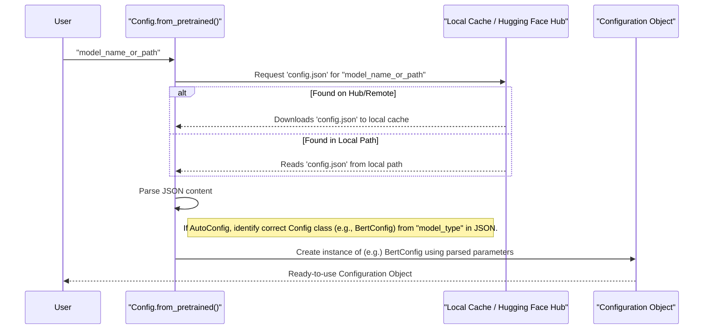

# Chapter 3: Model Configuration (`PretrainedConfig`)

Welcome to Chapter 3! In [Chapter 2: Pretrained Model (`PreTrainedModel` / `TFPreTrainedModel`)](02_pretrained_model___pretrainedmodel_____tfpretrainedmodel___.md), we saw how to load a pre-trained DNABERT model, which is like getting a fully-assembled, smart machine ready to analyze DNA. We mentioned that when you load a model, it first looks at a "configuration file." This chapter dives into what that configuration is all about!

Imagine you're baking a complex cake (our DNABERT model). Before you even start mixing ingredients, you need a detailed **recipe**. This recipe tells you:
*   How many layers should the cake have?
*   How much of each ingredient (flour, sugar, etc.) do you need for each part?
*   What temperature should the oven be?
*   What type of frosting should it have?

Without a clear recipe, every cake you bake might turn out different, or you might not even know how to start!

## What is a `PretrainedConfig`? The Model's Recipe!

In the world of Hugging Face Transformers and DNABERT, the `PretrainedConfig` class (and its friends like `BertConfig`, `AlbertConfig`) acts as this detailed recipe or specification sheet for a particular model.

It's a Python object that stores all the crucial **hyperparameters** and **architectural details** that define the structure of a model. Think of it as the blueprint for constructing the model. These details include:

*   `vocab_size`: How many unique k-mers (or words, for text models) does the model know? This is linked to the [Tokenizer (`PreTrainedTokenizer` & `DNATokenizer`)](01_tokenizer___pretrainedtokenizer_____dnatokenizer___.md).
*   `hidden_size`: How "wide" are the model's internal layers? (e.g., 768 or 1024). This determines the size of the vectors representing our DNA k-mers.
*   `num_hidden_layers`: How "deep" is the model? (e.g., 6, 12, or 24 layers). More layers can often learn more complex patterns.
*   `num_attention_heads`: In Transformer models (which DNABERT is based on), how many "attention heads" are in each layer? These help the model focus on different parts of the DNA sequence.
*   `intermediate_size`: The size of a "feed-forward" layer within each Transformer block.
*   `hidden_act`: The activation function used in the model (e.g., "gelu" or "relu").

**Why is this so important?**
1.  **Consistency:** When you want to create a model, you first define or load its configuration. This configuration then guides how the model's structure is built, ensuring that models are instantiated consistently every time. If you load a model called "DNABERT-3mer-small", its configuration ensures you get the *exact* small architecture designed for 3-mers.
2.  **Reproducibility:** If you share your model's configuration, others can recreate the same model architecture.
3.  **Understanding Model Architecture:** By looking at the configuration, you can understand the size and complexity of a model.

DNABERT models, often being based on the BERT architecture, typically use a configuration class like `BertConfig` (which itself is a specialized version of the base `PretrainedConfig`).

## How to Use `PretrainedConfig` with DNABERT

Let's explore how you'd typically interact with a model's configuration.

### 1. Loading a Configuration from a Pre-trained DNABERT Model

When you use `from_pretrained()` to load a model (as shown in [Chapter 2: Pretrained Model (`PreTrainedModel` / `TFPreTrainedModel`)](02_pretrained_model___pretrainedmodel_____tfpretrainedmodel___.md)), the configuration is automatically loaded. But you can also load *just* the configuration.

DNABERT models are often based on the BERT architecture. So, we can use `BertConfig` (or `AutoConfig` for a more general approach).

```python
from transformers import BertConfig, AutoConfig

# Let's use a conceptual DNABERT model identifier.
# In a real scenario, this would be something like "zhihan1996/DNABERT-2-117M"
# or a local path to your downloaded model files.
model_name_or_path = "zhihan1996/DNABERT-2-117M" # Example

try:
    # Option 1: Using AutoConfig (generally recommended)
    print(f"Loading configuration for {model_name_or_path} using AutoConfig...")
    auto_config = AutoConfig.from_pretrained(model_name_or_path)
    print("AutoConfig loaded successfully!")

    # Option 2: Using a specific config class (if you know the model type)
    # DNABERT often uses a BERT-like architecture.
    print(f"\nLoading configuration for {model_name_or_path} using BertConfig...")
    bert_config = BertConfig.from_pretrained(model_name_or_path)
    print("BertConfig loaded successfully!")

except Exception as e:
    print(f"Could not load config. Error: {e}")
    print("For this tutorial, we'll simulate a config.")
    # Simulate a BertConfig if loading fails (e.g. no internet/model not found)
    bert_config = BertConfig(
        vocab_size=4101, # Example for 6-mers (4^6 + 5 special tokens)
        hidden_size=768,
        num_hidden_layers=12,
        model_type="bert"
    )
    auto_config = bert_config # Use the simulated one for AutoConfig too
```

**Explanation:**
*   `AutoConfig.from_pretrained(model_name_or_path)`: This is a smart way to load configurations. It looks at the `config.json` file within the model directory (either locally or on the Hugging Face Hub) and figures out the correct specific configuration class to use (like `BertConfig`, `AlbertConfig`, etc.).
*   `BertConfig.from_pretrained(model_name_or_path)`: If you know your DNABERT model is based on BERT, you can use `BertConfig` directly.
*   Both methods read the `config.json` file associated with the `model_name_or_path`.

### 2. Inspecting a Configuration

Once you have a configuration object, you can easily look at its parameters:

```python
# Let's assume 'auto_config' was loaded successfully from the previous step
# or use our simulated bert_config
loaded_config = auto_config # or bert_config

print(f"\n--- Configuration Details for {model_name_or_path} ---")
print(f"Model type: {loaded_config.model_type}")
print(f"Vocabulary size: {loaded_config.vocab_size}")
print(f"Number of hidden layers: {loaded_config.num_hidden_layers}")
print(f"Hidden size: {loaded_config.hidden_size}")
print(f"Number of attention heads: {loaded_config.num_attention_heads}")
# For DNABERT, some specific configs might exist in its BertConfig
# These were added in the DNABERT project's BertConfig
# (see src/transformers/configuration_bert.py in DNABERT project)
if hasattr(loaded_config, 'rnn'):
    print(f"RNN type (for DNABERT- elokuva): {getattr(loaded_config, 'rnn', 'N/A')}")
```
**Example Output (will vary based on the actual model):**
```
--- Configuration Details for zhihan1996/DNABERT-2-117M ---
Model type: bert
Vocabulary size: 4101
Number of hidden layers: 12
Hidden size: 768
Number of attention heads: 12
```
This tells you key architectural details. For example, `vocab_size=4101` often corresponds to 6-mer models (since 4<sup>6</sup> = 4096, plus 5 special tokens like `[CLS]`, `[SEP]`, etc., makes 4101). This is crucial information that links back to how your [Tokenizer (`PreTrainedTokenizer` & `DNATokenizer`)](01_tokenizer___pretrainedtokenizer_____dnatokenizer___.md) should be set up.

### 3. Creating a Configuration From Scratch

While you'll usually load configurations for pre-trained models, you can also define one from scratch if you're designing a new model.

```python
from transformers import BertConfig

# Define a new configuration for a smaller BERT-like model
my_custom_config = BertConfig(
    vocab_size=69,          # For 3-mers (4^3 + 5 special tokens)
    hidden_size=256,        # Smaller hidden dimensions
    num_hidden_layers=4,    # Fewer layers
    num_attention_heads=4,  # Fewer attention heads
    intermediate_size=1024, # Size of the feed-forward layer
    # You can specify many other parameters too!
)

print("\n--- My Custom Configuration ---")
print(f"Vocabulary size: {my_custom_config.vocab_size}")
print(f"Number of hidden layers: {my_custom_config.num_hidden_layers}")
```
**Output:**
```
--- My Custom Configuration ---
Vocabulary size: 69
Number of hidden layers: 4
```
This `my_custom_config` object could then be used to initialize a new model from scratch (though that's a more advanced topic beyond just the configuration).

### 4. Saving a Configuration

If you've modified a configuration or created a new one, you can save it:

```python
# Assuming 'my_custom_config' from the previous step
save_directory = "./my_dnabert_config_files"

# Create the directory if it doesn't exist
import os
os.makedirs(save_directory, exist_ok=True)

my_custom_config.save_pretrained(save_directory)
print(f"\nConfiguration saved to: {save_directory}")
```
This will create a `config.json` file inside the `./my_dnabert_config_files` directory.

**What's in `my_dnabert_config_files/config.json`?**
It will be a JSON file looking something like this:
```json
{
  "architectures": null,
  "attention_probs_dropout_prob": 0.1,
  "hidden_act": "gelu",
  "hidden_dropout_prob": 0.1,
  "hidden_size": 256,
  "initializer_range": 0.02,
  "intermediate_size": 1024,
  "layer_norm_eps": 1e-12,
  "max_position_embeddings": 512,
  "model_type": "bert", // This tells us it's a BERT-like architecture
  "num_attention_heads": 4,
  "num_hidden_layers": 4,
  "pad_token_id": 0,
  "type_vocab_size": 2,
  "vocab_size": 69
  // ... other parameters ...
}
```
This file is the portable "recipe" for your model's architecture.

## Under the Hood: How Configuration Loading Works

When you call `ConfigClass.from_pretrained("some_model_id")` or `AutoConfig.from_pretrained("some_model_id")`:



1.  **Locate `config.json`**: The method determines the path to the `config.json` file.
    *   If `model_name_or_path` is an identifier like `"zhihan1996/DNABERT-2-117M"`, it looks on the Hugging Face Model Hub. If found, it might download it to a local cache directory (e.g., `~/.cache/huggingface/transformers/`).
    *   If it's a local path like `"./my_dnabert_model/"`, it looks for `config.json` directly in that folder.
2.  **Read and Parse**: The `config.json` file (which is just text in JSON format) is read.
3.  **Instantiate Config Object**:
    *   The JSON content is parsed into a Python dictionary.
    *   If you used `AutoConfig`, it inspects the `"model_type"` field in the JSON (e.g., `"bert"`, `"albert"`) to determine the correct specific configuration class to use (like `BertConfig` or `AlbertConfig`).
    *   An instance of this configuration class is created, filled with the parameters from the JSON file.
    *   Any additional keyword arguments you passed to `from_pretrained` (e.g., `output_attentions=True`) will override the values from the `config.json` file.

## The `PretrainedConfig` Class Family

The Hugging Face Transformers library has a hierarchy of configuration classes:

*   **`PretrainedConfig`**: This is the base class for all model configurations. It lives in `src/transformers/configuration_utils.py`. It defines common attributes and methods like `save_pretrained`, `from_pretrained`, `to_dict`, etc.
    ```python
    # From src/transformers/configuration_utils.py (conceptual)
    class PretrainedConfig(object):
        model_type = "" # Overridden by subclasses

        def __init__(self, vocab_size=50257, hidden_size=768, **kwargs):
            self.vocab_size = vocab_size
            self.hidden_size = hidden_size
            # ... many other common attributes ...
            for key, value in kwargs.items():
                setattr(self, key, value)

        @classmethod
        def from_pretrained(cls, pretrained_model_name_or_path, **kwargs):
            # ... (logic to find and load config.json) ...
            # config_dict = cls._dict_from_json_file(resolved_config_file)
            # return cls.from_dict(config_dict, **kwargs)
            pass # Simplified

        def save_pretrained(self, save_directory):
            # ... (logic to save self.to_dict() as json to config.json) ...
            pass # Simplified
    ```

*   **Specific Configs (e.g., `BertConfig`, `AlbertConfig`)**: These classes inherit from `PretrainedConfig` and are tailored for specific model architectures. For example, `BertConfig` (from `src/transformers/configuration_bert.py`) defines default values and parameters specific to BERT-like models.
    ```python
    # From src/transformers/configuration_bert.py (conceptual)
    # class BertConfig(PretrainedConfig):
    #     model_type = "bert" # Identifies this as a BERT configuration
    #
    #     def __init__(
    #         self,
    #         vocab_size=30522, # Default for original BERT
    #         hidden_size=768,
    #         num_hidden_layers=12,
    #         num_attention_heads=12,
    #         # ... other BERT-specific defaults ...
    #         # DNABERT project adds its own params here too:
    #         split=10, # Example of a DNABERT-specific param
    #         **kwargs
    #     ):
    #         super().__init__(vocab_size=vocab_size, hidden_size=hidden_size, **kwargs)
    #         self.num_hidden_layers = num_hidden_layers
    #         self.num_attention_heads = num_attention_heads
    #         self.split = split
    #         # ...
    ```
    DNABERT models, particularly those based on BERT, will use a `BertConfig`. The DNABERT project's version of `configuration_bert.py` even includes additional parameters relevant to some DNABERT variants (like `split`, `rnn`, `num_rnn_layer` which might be used by specialized DNABERT architectures).

## Why is `PretrainedConfig` Crucial for `PreTrainedModel`?

As we saw in [Chapter 2: Pretrained Model (`PreTrainedModel` / `TFPreTrainedModel`)](02_pretrained_model___pretrainedmodel_____tfpretrainedmodel___.md), when you call `SomeModelClass.from_pretrained("model_id")`:
1.  It **first** loads the model's `PretrainedConfig` (as described above).
2.  Then, this configuration object is used to **build the actual model architecture** layer by layer. For instance, `config.num_hidden_layers` tells the model how many Transformer layers to create, and `config.hidden_size` tells it how large each layer should be.
3.  Finally, the pre-trained weights (the `pytorch_model.bin` or `tf_model.h5` file) are loaded into this newly constructed architecture.

So, the configuration is the essential first step to ensure the model structure correctly matches the saved weights!

## Conclusion

You've now learned about the vital role of `PretrainedConfig` – the recipe or blueprint for our DNABERT models!
*   It stores all the hyperparameters and architectural details.
*   It ensures models are built consistently and reproducibly.
*   You can load existing configurations using `YourConfigClass.from_pretrained()` or `AutoConfig.from_pretrained()`.
*   You can inspect, modify, and save configurations.
*   The `config.json` file is the portable representation of this recipe.
*   `PretrainedConfig` is essential for `PreTrainedModel` to correctly instantiate a model before loading its weights.

With a tokenizer to prepare our DNA data (Chapter 1) and an understanding of how models and their configurations are loaded (Chapters 2 and 3), we're getting closer to actually processing DNA data. Next, we'll look at how to prepare DNA sequences into the specific formats DNABERT expects as input.

Next up: [Data Processors & Input Formatting](04_data_processors___input_formatting_.md)

---

Generated by [AI Codebase Knowledge Builder](https://github.com/The-Pocket/Tutorial-Codebase-Knowledge)