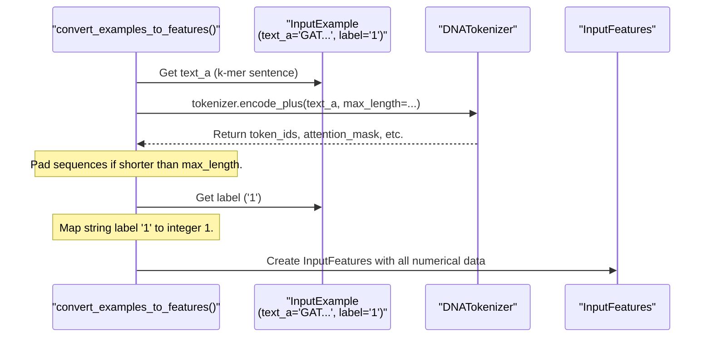

# Chapter 4: Data Processors & Input Formatting

Welcome to Chapter 4! In [Chapter 3: Model Configuration (`PretrainedConfig`)](03_model_configuration___pretrainedconfig___.md), we learned about the "recipe" or blueprint (`PretrainedConfig`) that defines our DNABERT model's architecture. Now that we know how to define a model and load its pre-trained version ([Chapter 2: Pretrained Model (`PreTrainedModel` / `TFPreTrainedModel`)](02_pretrained_model___pretrainedmodel_____tfpretrainedmodel___.md)), and how to turn DNA into k-mer tokens ([Chapter 1: Tokenizer (`PreTrainedTokenizer` & `DNATokenizer`)](01_tokenizer___pretrainedtokenizer_____dnatokenizer___.md)), it's time to tackle how we get our raw DNA data into a format the model can actually use for training or making predictions.

**What problem do Data Processors & Input Formatting solve?**

Imagine you're a chef (our DNABERT model) who needs to cook a complex dish. Your ingredients (DNA sequences and their associated labels, like "promoter" or "not promoter") might come from various suppliers (different file formats like CSV, TSV, FASTA) and in different states (raw DNA, already processed sequences). You can't just throw these varied ingredients into your cooking pot! You need a meticulous preparation process to turn them into consistent, ready-to-cook "meal kits."

This is exactly what **Data Processors and Input Formatting** do. They are a collection of scripts and classes responsible for:
1.  Loading data from various sources (e.g., TSV files containing DNA sequences and labels).
2.  Transforming this raw data into a standardized, intermediate format (called `InputExample`).
3.  Further converting these `InputExample`s into the final, numerical format (called `InputFeatures`) that the DNABERT model directly consumes.

Think of these as the "data preparation chefs" in our DNABERT kitchen. They take raw ingredients from different dataset files and meticulously prepare them into consistent `InputFeatures` (the "meal kits") for the main cooking process (model training or evaluation).

Our main goal is to convert our raw DNA data (like "GATTACA" and its label "promoter") into something like this, which the model understands:

*   `input_ids`: A list of numbers representing the tokenized DNA (e.g., `[2, 6, 11, 20, 22, 14, 3, 0, ...]`).
*   `attention_mask`: A list of 1s and 0s telling the model which tokens to pay attention to.
*   `token_type_ids`: (For some models) a list identifying different segments, usually all 0s for single DNA sequences.
*   `label`: A number representing the category (e.g., `1` for "promoter").

This final "meal kit" is called an `InputFeatures` object. Let's see how we get there!

## The Journey: From Raw DNA to `InputFeatures`

The transformation from raw data to `InputFeatures` usually happens in a few stages:

```mermaid
graph LR
    A[Raw Data File <br/> (e.g., CSV/TSV with <br/> raw DNA & labels)] --> B(Preprocessing Scripts <br/> e.g., `process_csv.py`);
    B -- Converts raw DNA to k-mer sentences --> C[Intermediate File <br/> (e.g., `train.tsv` with <br/> k-mer sentences & labels)];
    C --> D{DataProcessor Class <br/> (e.g., `DnaPromProcessor`)};
    D -- Reads file, creates --> E[List of `InputExample` objects];
    E --> F{Conversion Function <br/> (e.g., `glue_convert_examples_to_features`) <br/> + <br/> [Tokenizer](01_tokenizer___pretrainedtokenizer_____dnatokenizer___.md)};
    F -- Tokenizes, pads, maps labels --> G[List of `InputFeatures` objects <br/> (Model-ready!)];
```

Let's break down each stage.

### Stage 1: From Raw DNA Sequences to K-mer Sentences (Often using Preprocessing Scripts)

Often, your initial dataset might contain raw DNA sequences, not the k-mer sentences that our `DNATokenizer` expects (as we learned in [Chapter 1: Tokenizer (`PreTrainedTokenizer` & `DNATokenizer`)](01_tokenizer___pretrainedtokenizer_____dnatokenizer___.md)).

For example, you might have a CSV file `raw_data.csv`:
```csv
dna_sequence,is_promoter
GATTACA,1
AGCTAGCT,0
```

The DNABERT project includes helper scripts in the `examples/data_process_template/` directory (like `process_csv.py`, `process_finetune_data.py`, `process_690.py`) that handle this first step. These scripts often:
1.  Read your raw data files (CSV, TSV, FASTA, etc.).
2.  Use a function like `get_kmer_sentence` (which we saw in Chapter 1, defined in `examples/data_process_template/process_pretrain_data.py`) to convert each raw DNA sequence into a k-mer sentence (e.g., "GAT ATT TTA TAC ACA" for "GATTACA" with k=3).
3.  Write these k-mer sentences and their corresponding labels into new, standardized files (usually TSV format, like `train.tsv` or `dev.tsv`).

Let's look at a simplified concept from `examples/data_process_template/process_csv.py`:
```python
# Simplified concept from examples/data_process_template/process_csv.py
# (Assumes get_kmer_sentence is available, as shown in Chapter 1)
# def get_kmer_sentence(sequence, k): ...

# Imagine raw_lines = [["GATTACA", "1"], ["AGCTAGCT", "0"]]
# k_value = 3
# output_file_writer = csv.writer(open("train.tsv", "w"), delimiter='\t')
# output_file_writer.writerow(["sequence", "label"]) # Header

for raw_line in raw_lines: # Pseudo-code for reading input CSV
    raw_dna = raw_line[0]
    label = raw_line[1]
    kmer_sent = get_kmer_sentence(raw_dna, k_value) # "GAT ATT TTA TAC ACA"
    # output_file_writer.writerow([kmer_sent, label])
```
After this step, we'd have a file like `train.tsv`:
```tsv
sequence	label
GAT ATT TTA TAC ACA	1
AGC GCT CTA	0
```
This file, containing k-mer sentences, is now ready for the next stage. This is like doing the initial chopping of vegetables.

### Stage 2: From K-mer Sentence Files to `InputExample`s (Using `DataProcessor` classes)

Now that we have our data in a file with k-mer sentences (like `train.tsv` above), we use a **`DataProcessor`** class. Its job is to read this file and convert each row into a simple Python object called an `InputExample`.

**What is an `InputExample`?**
An `InputExample` is a standard container defined in `src/transformers/data/processors/utils.py`. It simply holds:
*   `guid`: A unique ID for the example (e.g., "train-0").
*   `text_a`: The first text sequence (for us, this will be the k-mer sentence).
*   `text_b`: An optional second text sequence (used for sequence-pair tasks, often `None` for DNA classification).
*   `label`: The label associated with the sequence(s) (e.g., "1", "0").

```python
# From src/transformers/data/processors/utils.py
class InputExample(object):
    def __init__(self, guid, text_a, text_b=None, label=None):
        self.guid = guid
        self.text_a = text_a
        self.text_b = text_b
        self.label = label
    # ... (repr, to_dict, to_json_string methods) ...
```

**`DataProcessor` Classes:**
The Hugging Face Transformers library (and DNABERT) provides a base `DataProcessor` class (also in `src/transformers/data/processors/utils.py`). For specific tasks or datasets, we create specialized processors that inherit from this base.

DNABERT includes processors like `DnaPromProcessor` (for promoter prediction) or `DnaSpliceProcessor` in `src/transformers/data/processors/glue.py`. These know how to read TSV files formatted for DNA tasks.

Here's a simplified `DnaPromProcessor` concept:
```python
# Simplified concept of DnaPromProcessor from src/transformers/data/processors/glue.py
# (Actual class in glue.py is more complete)
from transformers.data.processors.utils import DataProcessor, InputExample
import csv
import os

class MyDnaProcessor(DataProcessor):
    def get_train_examples(self, data_dir):
        """Gets InputExamples for the train set."""
        return self._create_examples(
            self._read_tsv(os.path.join(data_dir, "train.tsv")), "train")

    def get_labels(self):
        """Gets the list of labels for this data set."""
        return ["0", "1"] # Example: Non-promoter, Promoter

    def _create_examples(self, lines, set_type):
        """Creates examples from the lines read from a TSV file."""
        examples = []
        for (i, line) in enumerate(lines):
            if i == 0: continue # Skip header row
            guid = f"{set_type}-{i}"
            text_a = line[0] # This is our k-mer sentence from the TSV
            label = line[1]  # This is the label from the TSV
            examples.append(
                InputExample(guid=guid, text_a=text_a, text_b=None, label=label)
            )
        return examples

# How you might use it:
# processor = MyDnaProcessor()
# Assume 'my_dna_data_dir' contains 'train.tsv' with k-mer sentences
# input_examples = processor.get_train_examples("my_dna_data_dir/")

# input_examples[0] might look like:
# InputExample(guid='train-0', text_a='GAT ATT TTA TAC ACA', text_b=None, label='1')
```
So, the `DataProcessor` reads our `train.tsv` (which has k-mer sentences) and turns each line into an `InputExample` object. This is like taking the pre-chopped vegetables and arranging them neatly on a plate with a recipe card.

### Stage 3: From `InputExample`s to `InputFeatures` (Tokenization and Final Formatting)

We're almost there! We have a list of `InputExample`s, but the model needs numbers, not text. This is where the [Tokenizer (`PreTrainedTokenizer` & `DNATokenizer`)](01_tokenizer___pretrainedtokenizer_____dnatokenizer___.md) from Chapter 1 comes back into play, along with a helper function to manage the conversion.

**What is an `InputFeatures`?**
An `InputFeatures` object (defined in `src/transformers/data/processors/utils.py`) holds all the numerical data that the model actually takes as input:
*   `input_ids`: The numerical IDs of the tokens (k-mers), including special tokens like `[CLS]` and `[SEP]`.
*   `attention_mask`: A mask (0s and 1s) to indicate which tokens are real and which are padding.
*   `token_type_ids`: Segment IDs (often all 0s for single sequence tasks).
*   `label`: The numerical version of the label.

```python
# From src/transformers/data/processors/utils.py
class InputFeatures(object):
    def __init__(self, input_ids, attention_mask=None, token_type_ids=None, label=None):
        self.input_ids = input_ids
        self.attention_mask = attention_mask
        self.token_type_ids = token_type_ids
        self.label = label
    # ... (repr, to_dict, to_json_string methods) ...
```

**The Conversion Function:**
A function like `glue_convert_examples_to_features` (found in `src/transformers/data/processors/glue.py`) orchestrates this final conversion. It takes:
*   A list of `InputExample` objects.
*   A tokenizer (e.g., `DNATokenizer`).
*   `max_length` (maximum sequence length for padding/truncation).
*   The list of possible labels (e.g., `["0", "1"]`).
*   `output_mode` (e.g., "classification").

For each `InputExample`, this function will:
1.  Use the `tokenizer.encode_plus()` method on `example.text_a` (the k-mer sentence). This gives `input_ids`, `attention_mask`, and `token_type_ids`.
2.  Pad or truncate these sequences to `max_length`.
3.  Convert the string `example.label` (e.g., "1") into a numerical index (e.g., `1`).
4.  Bundle all this numerical data into an `InputFeatures` object.

```python
# Conceptual usage of glue_convert_examples_to_features
from transformers import DNATokenizer
# Assume glue_convert_examples_to_features is imported from transformers.data.processors.glue
# Assume input_examples = [InputExample(guid='train-0', text_a='GAT ATT TTA TAC ACA', label='1')]
# Assume processor = MyDnaProcessor() from the previous step

# tokenizer = DNATokenizer.from_pretrained("dna3") # Or your specific k-mer model
# max_seq_len = 128 # Max length for model input
# label_list = processor.get_labels() # ["0", "1"]
# output_mode = "classification"

# features = glue_convert_examples_to_features(
#     input_examples,
#     tokenizer,
#     max_length=max_seq_len,
#     label_list=label_list,
#     output_mode=output_mode,
#     pad_on_left=False, # Standard padding on the right
#     pad_token=tokenizer.convert_tokens_to_ids([tokenizer.pad_token])[0],
#     pad_token_segment_id=0
# )

# features[0] might look like (conceptually):
# InputFeatures(
#  input_ids=[2, 6, 11, 20, 22, 14, 3, 0, ..., 0], # Padded to 128
#  attention_mask=[1, 1, 1, 1, 1, 1, 1, 0, ..., 0], # Mask for padding
#  token_type_ids=[0, 0, 0, 0, 0, 0, 0, 0, ..., 0],
#  label=1  # Numerical label
# )
```
Now we have our `InputFeatures` – the perfectly prepared "meal kits" ready for the DNABERT model!

## Under the Hood: A Closer Look

Let's quickly peek at what happens inside these components.

**Inside a `DataProcessor` (e.g., `MyDnaProcessor`):**
*   `_read_tsv(file_path)`: This is usually a simple function that opens the TSV file, reads it line by line, and splits each line by the tab character.
*   `_create_examples(lines, set_type)`: This method iterates through the lines (parsed by `_read_tsv`). For each line, it extracts the k-mer sentence (e.g., from the first column) and the label (e.g., from the second column) and creates an `InputExample` instance.

**Inside `glue_convert_examples_to_features` (or similar function):**
This function is the core of the final formatting. Here's a simplified flow for one `InputExample`:


The key operations are:
1.  **Tokenization**: `tokenizer.encode_plus()` converts the k-mer sentence into `input_ids`, adds special tokens (`[CLS]`, `[SEP]`), and generates `attention_mask` and `token_type_ids`.
2.  **Padding/Truncation**: Ensures all `input_ids` (and corresponding masks) are of the same `max_length`. Shorter sequences are padded (usually with ID 0), and longer ones are truncated.
3.  **Label Mapping**: Converts string labels (like "0", "1" or "promoter", "non-promoter") into integer indices that the model can use for loss calculation.

## The "Data Preparation Chef" Analogy Revisited

Let's tie it all together with our chef analogy:
*   **Raw Data Files (CSV, FASTA with raw DNA):** These are your bulk, unprocessed ingredients delivered by various suppliers. Some DNA might be whole chromosomes, some might be short reads.
*   **Preprocessing Scripts (`examples/data_process_template/*.py`):** These are your initial kitchen assistants. They take the raw DNA, wash it, and use a tool like `get_kmer_sentence` (our specialized k-mer dicer from Chapter 1) to chop the DNA into k-mer sentences. They then package these k-mer sentences and labels into standardized containers (our `train.tsv` files).
*   **`DataProcessor` (e.g., `DnaPromProcessor`):** This is your sous-chef. They take the containers of pre-diced k-mer sentences (`train.tsv`) and carefully lay out each sample's ingredients (k-mer sentence, label) onto an `InputExample` "recipe card."
*   **`glue_convert_examples_to_features()` function & `DNATokenizer`:** This is the head chef with their expert tokenizer tool. They take each `InputExample` recipe card.
    *   The `DNATokenizer` further processes the k-mer sentence, converting k-mers into numerical IDs and adding special seasoning tokens (`[CLS]`, `[SEP]`).
    *   The head chef then ensures each serving is the same size (`padding`), converts textual labels to numbers, and packages everything neatly into an `InputFeatures` "meal kit."
*   **`InputFeatures`:** The final, ready-to-cook meal kits, perfectly portioned and formatted for the main DNABERT model (the "oven" or "analyzer machine").

## Conclusion

Phew! That was a detailed look at how DNABERT prepares its data. You now understand:
*   The goal is to convert diverse raw DNA data into a standardized `InputFeatures` format.
*   This often involves multiple stages:
    1.  Preprocessing scripts convert raw DNA to k-mer sentences and save them (e.g., to TSV files).
    2.  `DataProcessor` classes read these k-mer sentence files and create `InputExample` objects.
    3.  A conversion function (like `glue_convert_examples_to_features`), along with a `DNATokenizer`, transforms `InputExample`s into numerical `InputFeatures` by tokenizing, padding, and mapping labels.
*   `InputExample` is an intermediate, human-readable representation, while `InputFeatures` contains the numerical data the model directly uses.

This careful data preparation is crucial for successfully training and evaluating DNABERT models. With our data prepped, we might wonder if there's an easier way to run a standard task like classification from start to finish. That's where Pipelines come in!

Next up: [Pipelines](05_pipelines_.md)

---

Generated by [AI Codebase Knowledge Builder](https://github.com/The-Pocket/Tutorial-Codebase-Knowledge)