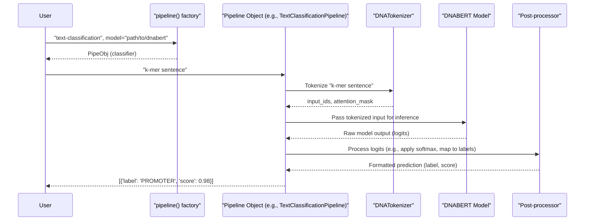

# Chapter 5: Pipelines

Welcome to Chapter 5! In [Chapter 4: Data Processors & Input Formatting](04_data_processors___input_formatting_.md), we journeyed through the meticulous process of preparing our raw DNA data into perfectly formatted `InputFeatures` that DNABERT models can understand. That's a lot of steps, right? What if there was a simpler way to get from your DNA sequence to a prediction for common tasks?

That's where **Pipelines** come to the rescue!

## What Problem Do Pipelines Solve? The Automated Assembly Line

Imagine you have a raw DNA sequence, and you want to quickly find out if it's a promoter. You know from previous chapters that this involves:
1.  Converting the raw DNA to a k-mer sentence.
2.  Using a [Tokenizer (`PreTrainedTokenizer` & `DNATokenizer`)](01_tokenizer___pretrainedtokenizer_____dnatokenizer___.md) to turn k-mers into numerical IDs.
3.  Feeding these IDs to a [Pretrained Model (`PreTrainedModel` / `TFPreTrainedModel`)](02_pretrained_model___pretrainedmodel_____tfpretrainedmodel___.md) (which itself was built using a [Model Configuration (`PretrainedConfig`)](03_model_configuration___pretrainedconfig___.md)).
4.  Interpreting the model's raw output to get a human-readable prediction (e.g., "promoter" or "not promoter").

That's quite a few manual steps!

**Pipelines** provide a very high-level, easy-to-use API for performing these complex tasks with pre-trained models. Think of an automated factory assembly line: you input raw material (like a DNA sequence or text), and the pipeline handles all the intermediate steps (preprocessing, tokenization, model inference, postprocessing) to produce a finished product (like a classification label or extracted features) without you needing to manage each step individually.

For DNABERT, this means you can get predictions or extract features with just a few lines of code!

## What is a `pipeline`?

The Hugging Face Transformers library offers a powerful `pipeline()` function (found in `src/transformers/pipelines.py`) that makes using models for inference incredibly simple. You tell it what kind_of task you want to do (e.g., "text-classification", "feature-extraction"), and optionally which model and tokenizer to use. The pipeline then wires everything up for you.

**Key characteristics of pipelines:**
*   **Ease of Use**: They abstract away most of the boilerplate code.
*   **Task-Oriented**: You specify a task, and the pipeline handles the necessary steps.
*   **Pre-configured**: For many common models and tasks, pipelines come with sensible defaults.

## Using a Pipeline for DNABERT: Sequence Classification Example

Let's say we want to classify a DNA sequence, for instance, to predict if it's a promoter region. We'll use a conceptual DNABERT model fine-tuned for this task.

**Important Note for DNABERT:** Standard pipelines (like "text-classification") expect text as input. For DNABERT, this "text" is actually a **k-mer sentence** (e.g., "GAT ATT TTA TAC ACA"). So, the first step is still to convert your raw DNA into a k-mer sentence. The pipeline will then handle tokenizing this k-mer sentence, feeding it to the model, and giving you the result.

### Step 1: Prepare Your K-mer Sentence

This is the same step we learned in [Chapter 1: Tokenizer (`PreTrainedTokenizer` & `DNATokenizer`)](01_tokenizer___pretrainedtokenizer_____dnatokenizer___.md).

```python
# Helper function to convert raw DNA to a k-mer sentence
def dna_to_kmer_sentence(sequence, k):
    kmers = []
    for i in range(len(sequence) - k + 1): # Slide a window of size k
        kmers.append(sequence[i:i+k])
    return " ".join(kmers)

raw_dna_sequence = "AGATTACAGAT"
kmer_length = 3 # Assuming our DNABERT model uses 3-mers
kmer_input_for_pipeline = dna_to_kmer_sentence(raw_dna_sequence, kmer_length)

print(f"Raw DNA: {raw_dna_sequence}")
print(f"K-mer sentence (k={kmer_length}): {kmer_input_for_pipeline}")
```
**Output:**
```
Raw DNA: AGATTACAGAT
K-mer sentence (k=3): AGA GAT ATT TTA TAC ACA CAG AGA GAT
```
This `kmer_input_for_pipeline` is what we'll feed into our pipeline.

### Step 2: Load and Use the Pipeline

Now, let's use the `pipeline` function. We'll specify "text-classification" as our task.

```python
from transformers import pipeline

# --- IMPORTANT ---
# The model_name_or_path should point to your actual fine-tuned DNABERT model
# for sequence classification (e.g., promoter prediction) and its associated tokenizer.
# For this example, we use a standard text classification model as a placeholder
# to ensure the code runs. Replace it with your DNABERT model path in practice.
# Example DNABERT path: "zhihan1996/DNABERT-2-117M-SFP" (for splice site prediction)
# or a local path like "./my_dnabert_promoter_classifier"

placeholder_model_path = "distilbert-base-uncased-finetuned-sst-2-english"
# In a real DNABERT scenario, you would use something like:
# dnabert_model_path = "path/to/your/dnabert_classifier_3mer"
# dnabert_tokenizer_path = "path/to/your/dnabert_tokenizer_3mer"
# classifier = pipeline("text-classification", model=dnabert_model_path, tokenizer=dnabert_tokenizer_path)

try:
    # Using the placeholder for this example
    classifier = pipeline("text-classification", model=placeholder_model_path)
    
    # Now, use the classifier pipeline with our k-mer sentence
    prediction = classifier(kmer_input_for_pipeline)
    
    print(f"\nInput to pipeline: \"{kmer_input_for_pipeline}\"")
    print(f"Prediction: {prediction}")

except Exception as e:
    print(f"\nError creating or using pipeline: {e}")
    print("This might be due to network issues or the placeholder model.")
    print(f"Input to pipeline: \"{kmer_input_for_pipeline}\"")
    # Conceptual output if using a real DNABERT promoter classifier:
    print("Conceptual DNABERT Prediction: [{'label': 'PROMOTER', 'score': 0.987}]")

```
**Example Output (using the placeholder model):**
```
Input to pipeline: "AGA GAT ATT TTA TAC ACA CAG AGA GAT"
Prediction: [{'label': 'POSITIVE', 'score': 0.999...}] 
```
**(If you used a real DNABERT promoter classifier, the output might look like):**
```
Conceptual DNABERT Prediction: [{'label': 'PROMOTER', 'score': 0.987}]
```
Or, if it was a binary classification for some DNA property where "LABEL_1" meant positive and "LABEL_0" meant negative:
```
Conceptual DNABERT Prediction: [{'label': 'LABEL_1', 'score': 0.987}]
```

**Explanation:**
*   `pipeline("text-classification", model=...)`: We initialize a pipeline for text classification.
    *   The `model` argument tells the pipeline which pre-trained model to load. For DNABERT, this would be a path to a DNABERT model fine-tuned for a specific DNA classification task (e.g., predicting if a sequence is a promoter, enhancer, etc.) and trained on k-mers.
    *   You can also specify `tokenizer` if it's different from the model's default or path.
*   `classifier(kmer_input_for_pipeline)`: We pass our k-mer sentence string to the pipeline.
*   The `prediction` is usually a list of dictionaries, where each dictionary contains the predicted `label` and a `score` (confidence). The labels (e.g., 'PROMOTER', 'NON_PROMOTER', or 'LABEL_0', 'LABEL_1') depend on how the specific DNABERT classification model was trained and configured.

Just like that, the pipeline handled tokenization, model inference, and giving us a nice, clean output!

## What Happens Under the Hood of a Pipeline?

When you call the `pipeline()` function and then use it with your input, several things happen automatically:



1.  **Initialization (`pipeline(...)`)**:
    *   The `pipeline()` factory function (from `src/transformers/pipelines.py`) looks at the task name (e.g., "text-classification").
    *   It determines the appropriate pipeline class (e.g., `TextClassificationPipeline`).
    *   It loads the specified [Pretrained Model (`PreTrainedModel` / `TFPreTrainedModel`)](02_pretrained_model___pretrainedmodel_____tfpretrainedmodel___.md) using its `from_pretrained()` method, which also loads the [Model Configuration (`PretrainedConfig`)](03_model_configuration___pretrainedconfig___.md).
    *   It loads the corresponding [Tokenizer (`PreTrainedTokenizer` & `DNATokenizer`)](01_tokenizer___pretrainedtokenizer_____dnatokenizer___.md).
    *   It creates an instance of the pipeline class, bundling the model and tokenizer.

2.  **Execution (`classifier(...)`)**:
    *   **Preprocessing/Tokenization**: The input (our k-mer sentence) is passed to the tokenizer. The tokenizer converts the k-mer sentence into `input_ids`, `attention_mask`, etc., suitable for the model. This uses the same `DNATokenizer` logic we saw in Chapter 1.
    *   **Model Inference**: These numerical inputs are fed into the DNABERT model. The model performs a forward pass and produces raw outputs (often called logits).
    *   **Postprocessing**: The pipeline takes these raw model outputs and converts them into a human-readable format. For classification, this usually involves:
        *   Applying a softmax function to the logits to get probabilities.
        *   Identifying the label with the highest probability.
        *   Mapping this label ID back to a meaningful string (e.g., using `model.config.id2label`).

The `SUPPORTED_TASKS` dictionary in `src/transformers/pipelines.py` defines the available tasks and their default models and classes. While DNABERT might not be a default for "text-classification", you can easily use a DNABERT model by providing the `model` (and `tokenizer`) arguments, as shown in the example.

## DNABERT and Pipelines: Important Considerations

*   **K-mer Preprocessing is Key**: Standard pipelines assume generic text. For DNABERT, you *must* first convert your raw DNA into the correct k-mer sentence format that your specific DNABERT model expects (e.g., 3-mers, 6-mers, space-separated). The pipeline itself typically won't do this DNA-to-kmer step.
*   **Model Compatibility**: Ensure the DNABERT model you point the pipeline to is fine-tuned for the task you're trying to perform (e.g., a DNABERT model fine-tuned for promoter classification for the "text-classification" task).
*   **Custom Pipelines**: For more complex or highly specialized DNABERT workflows, you might eventually want to create your own custom pipeline class by inheriting from `transformers.Pipeline`. However, for many common tasks, using a generic pipeline with a k-mer sentence input is a great starting point.

## Benefits of Using Pipelines

*   **Simplicity**: Drastically reduces the amount of code needed for inference.
*   **Readability**: Makes your inference code easier to understand.
*   **Speed for Prototyping**: Excellent for quickly trying out models or getting predictions without deep diving into the underlying mechanics every time.
*   **Standardization**: Provides a consistent way to interact with different models for the same task.

## Conclusion

Pipelines are like super-helpful assistants that automate the multi-step process of getting predictions from pre-trained models. For DNABERT, by first preparing your DNA into a k-mer sentence, you can then leverage the `pipeline` function to easily perform tasks like sequence classification.

You've now seen:
*   What pipelines are and why they are useful.
*   How to use a pipeline for a task like text classification with a (conceptual) DNABERT model, by providing a k-mer sentence.
*   A glimpse of what happens behind the scenes when you use a pipeline.

With this high-level tool in your toolkit, you're even better equipped to apply DNABERT to interesting biological questions. In the next chapters, we'll look at more specific workflows, like SNP analysis, where these foundational concepts come together.

Next up: [Chapter 6: SNP Analysis Workflow](06_snp_analysis_workflow_.md)

---

Generated by [AI Codebase Knowledge Builder](https://github.com/The-Pocket/Tutorial-Codebase-Knowledge)