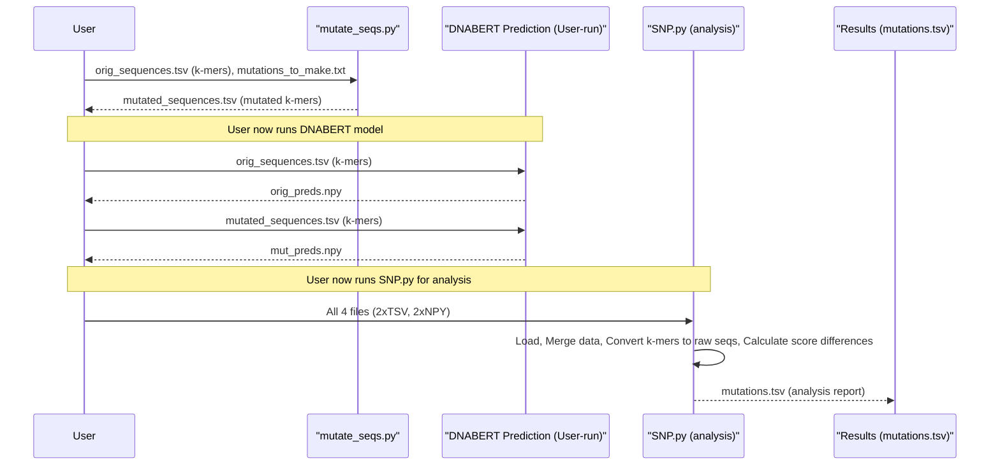

# Chapter 6: SNP Analysis Workflow

Welcome to Chapter 6! In [Chapter 5: Pipelines](05_pipelines_.md), we saw how pipelines can simplify the process of getting predictions from DNABERT. Now, we're going to explore a more specialized "geneticist's toolkit" within DNABERT: the **SNP Analysis Workflow**. This workflow helps us understand how tiny changes in DNA, called Single Nucleotide Polymorphisms (SNPs), can affect what our DNABERT model predicts.

## What's an SNP, and Why Analyze It?

Imagine DNA as a very long instruction manual written with only four letters: A, T, C, and G. A **Single Nucleotide Polymorphism (SNP)** (pronounced "snip") is like a single-letter typo in this manual. For example, a sequence might usually be `GATTACA` at a certain position in the genome, but in some individuals, it might be `GATT**G**CA` – the 'A' has changed to a 'G'.

**Why do we care about these "typos"?**
Sometimes, a single SNP can have a big impact. It might change how a gene works, affect an individual's susceptibility to a disease, or alter how they respond to medication. If we're using DNABERT to predict, say, whether a DNA sequence is a "promoter" (a region that helps turn genes on), we'd want to know if a common SNP changes that prediction. Does the "typo" make the model think the promoter is stronger, weaker, or gone entirely?

The SNP Analysis Workflow in DNABERT provides scripts and utilities to help answer these questions. It's designed to:
1.  Create "mutated" DNA sequences based on a list of SNPs you provide.
2.  Help you compare DNABERT's predictions on the original sequences versus the mutated ones.
3.  Quantify the impact of these SNPs on the model's output.

Let's dive into how this toolkit works!

## The SNP Analysis Toolkit: Key Scripts

The core of this workflow revolves around two main Python scripts typically found in the `SNP/` directory of the DNABERT project:
1.  `mutate_seqs.py`: This script is like a DNA editor. It takes your original DNA sequences and a list of desired mutations (SNPs) and generates new DNA sequences containing these specific changes.
2.  `SNP.py`: This script is the analyst. After you've used DNABERT to get predictions for both your original and mutated sequences, `SNP.py` compares these predictions to highlight how much each SNP changed the model's output.

You'll also encounter helper functions from `motif/motif_utils.py`, like `seq2kmer` (to convert raw DNA to k-mer sentences) and `kmer2seq` (to convert k-mer sentences back to raw DNA), which are used by these scripts. Remember from [Chapter 1: Tokenizer (`PreTrainedTokenizer` & `DNATokenizer`)](01_tokenizer___pretrainedtokenizer_____dnatokenizer___.md) that DNABERT models work with k-mer sentences.

## The Workflow: Step-by-Step

Let's walk through a typical SNP analysis using these tools. Imagine we want to see how a specific SNP affects DNABERT's prediction for a promoter sequence.

**Overall Flow:**
```mermaid
graph TD
    A[1. Your Original Sequences <br/> (k-mer format, e.g., `orig_sequences.tsv`)] --> B;
    B[2. Your SNP List <br/> (e.g., `mutations_to_make.txt`)] --> C{3. `mutate_seqs.py`};
    C --> D[4. Mutated Sequences File <br/> (k-mer format, e.g., `mutated_sequences.tsv`)];
    
    subgraph "5. DNABERT Prediction (User-run)"
        A --> E[Run DNABERT Model];
        E --> F[Original Predictions <br/> (e.g., `orig_preds.npy`)];
        D --> G[Run DNABERT Model];
        G --> H[Mutated Predictions <br/> (e.g., `mut_preds.npy`)];
    end

    F --> I{6. `SNP.py`};
    H --> I;
    A --> I;
    D --> I;
    I --> J[7. SNP Impact Report <br/> (e.g., `analysis_results.tsv`)];
```

### Step 1: Prepare Your Original Sequences

You'll start with a file containing your DNA sequences. For DNABERT, these are typically in a TSV (Tab-Separated Values) file, where one column has the DNA sequences already converted into **k-mer sentences**. This is the format our `DataProcessor` (from [Chapter 4: Data Processors & Input Formatting](04_data_processors___input_formatting_.md)) would prepare.

Let's say you have `orig_sequences.tsv`:
```tsv
sequence	label
GAT ATT TTA TAC ACA	1
AAA CCC GGG TTT	0
...
```
The `label` column might indicate if it's a promoter (1) or not (0). The `mutate_seqs.py` script will primarily focus on the `sequence` column.

### Step 2: Define Your SNPs (The Mutation File)

Next, you need to tell `mutate_seqs.py` which sequences to change and how. This is done using a "mutation file," often a simple text file. Let's look at the format, similar to `SNP/example_mut_file.txt`:

`mutations_to_make.txt`:
```tsv
#idx	start	end	allele
0	2	3	G
1	1	2	A
```
*   `idx`: The 0-based line number (index) of the sequence in your `orig_sequences.tsv` file you want to mutate (ignoring the header line of `orig_sequences.tsv`). So, `0` refers to the first data sequence ("GAT ATT TTA TAC ACA").
*   `start`: The 0-based starting position *in the raw DNA sequence* (not the k-mer sentence) where the change begins.
*   `end`: The 0-based ending position *in the raw DNA sequence*. For a single base change, `end` will be `start + 1`.
*   `allele`: The new nucleotide(s) to insert. For a SNP, this is a single letter (A, T, C, or G).

**Example Breakdown:**
*   `0	2	3	G`: For the first sequence in `orig_sequences.tsv` (index 0), change the nucleotide at raw DNA position 2 (the 3rd base) to 'G'. If the original raw sequence was "GATTACA", its 3rd base is 'T' (G-A-**T**-T-A-C-A). This line says to change it to 'G', resulting in "GAGTACA".
*   `1	1	2	A`: For the second sequence (index 1), change the nucleotide at raw DNA position 1 (the 2nd base) to 'A'.

### Step 3: Generate Mutated Sequences with `mutate_seqs.py`

Now, you run the `mutate_seqs.py` script. It will:
1.  Read your `orig_sequences.tsv`.
2.  For each sequence, convert the k-mer sentence back to a raw DNA sequence (using `kmer2seq`).
3.  Apply the mutations specified in `mutations_to_make.txt` to these raw DNA sequences.
4.  Convert the newly mutated raw DNA sequences back into k-mer sentences (using `seq2kmer`).
5.  Save these mutated k-mer sentences into a new output file (e.g., `mutated_sequences.tsv`).

**Conceptual Command:**
```bash
python SNP/mutate_seqs.py \
    orig_sequences.tsv \
    ./output_mutated_dir \
    --mut_file mutations_to_make.txt \
    --k 3 # Specify the k-mer length used
```
*   `orig_sequences.tsv`: Your input file from Step 1.
*   `./output_mutated_dir`: Directory where the output `dev.tsv` (containing mutated k-mer sequences) will be saved.
*   `--mut_file mutations_to_make.txt`: Your SNP list from Step 2.
*   `--k 3`: The k-mer length your model uses (e.g., 3 for 3-mers, 6 for 6-mers).

The output file (e.g., `./output_mutated_dir/dev.tsv`) will look similar to your input `orig_sequences.tsv` but with the k-mer sentences reflecting the mutations. It will also include an `index` column linking back to the original sequence index.

`./output_mutated_dir/dev.tsv`:
```tsv
sequence	label	index
GAG AGT GTT TTA TAC ACA	0	0  # Mutated from "GAT ATT TTA TAC ACA"
AAG AAC ACC CCC GGG TTT	0	1  # Mutated from "AAA CCC GGG TTT"
...
```
(Note: The `label` in the output of `mutate_seqs.py` is often a placeholder and not used by the downstream `SNP.py` script, which relies on the predictions.)

**Under the Hood of `mutate_seqs.py`'s `mutate` function:**
The core mutation logic is in a function, often also named `mutate`, within `mutate_seqs.py` or imported.
```python
# Simplified concept of the mutate function
def mutate(raw_sequence, start_pos, end_pos, new_allele):
    # raw_sequence is like "GATTACA"
    # start_pos is an int, e.g., 2
    # end_pos is an int, e.g., 3
    # new_allele is a string, e.g., "G"
    
    prefix = raw_sequence[:start_pos]
    suffix = raw_sequence[end_pos:]
    mutated_seq = prefix + new_allele + suffix
    return mutated_seq # e.g., "GAGTACA"

# mutate_seqs.py would then convert this raw mutated_seq 
# back to a k-mer sentence using seq2kmer.
```

### Step 4: Get DNABERT Predictions

This is a crucial step that **you perform using the main DNABERT prediction scripts/tools**, not `SNP.py` or `mutate_seqs.py` themselves.
You need to run your trained DNABERT model (e.g., a promoter classifier) on:
1.  Your **original** k-mer sequences (`orig_sequences.tsv`). This will produce a file of prediction scores, typically a NumPy array file (e.g., `orig_preds.npy`). Each score usually represents the model's confidence that the sequence belongs to the positive class (e.g., probability of being a promoter).
2.  Your **mutated** k-mer sequences (the output from `mutate_seqs.py`, e.g., `./output_mutated_dir/dev.tsv`). This will produce another prediction scores file (e.g., `mut_preds.npy`).

You would use the standard DNABERT inference pipeline for this, like the one you might use for evaluating a fine-tuned model, as discussed in earlier chapters or project examples. For example, if you used a [Pipeline](05_pipelines_.md), you'd feed it the k-mer sentences from both files.

### Step 5: Analyze Impact with `SNP.py`

Once you have your original sequences, mutated sequences, and their respective prediction files (`orig_preds.npy`, `mut_preds.npy`), you can use `SNP.py` to compare them.

**Conceptual Command:**
```bash
python SNP/SNP.py \
    --orig_seq_file orig_sequences.tsv \
    --orig_pred_file orig_preds.npy \
    --mut_seq_file ./output_mutated_dir/dev.tsv \
    --mut_pred_file mut_preds.npy \
    --save_file_dir ./snp_analysis_results
```
*   `--orig_seq_file`: Your original k-mer sequences TSV.
*   `--orig_pred_file`: Path to the `.npy` file with predictions for original sequences.
*   `--mut_seq_file`: The mutated k-mer sequences TSV (output of `mutate_seqs.py`).
*   `--mut_pred_file`: Path to the `.npy` file with predictions for mutated sequences.
*   `--save_file_dir`: Directory where the analysis output (e.g., `mutations.tsv`) will be saved.

**What `SNP.py` does:**
1.  Loads the original sequences and their prediction scores.
2.  Loads the mutated sequences and their prediction scores.
3.  Converts k-mer sentences in both files back to raw DNA sequences (using `utils.kmer2seq`) for easier interpretation in the output.
4.  Merges this information based on the sequence index.
5.  Calculates the difference between the original prediction score and the mutated prediction score for each SNP.
6.  Saves a detailed report, typically `mutations.tsv`.

**Inside `SNP.py` (Simplified Logic):**
```python
import pandas as pd
import numpy as np
# Assume motif_utils.kmer2seq is available

# 1. Load original data
orig_data = pd.read_csv("orig_sequences.tsv", sep='\t')
orig_preds = np.load("orig_preds.npy")
orig_data['orig_raw_seq'] = orig_data['sequence'].apply(kmer2seq) # kmer to raw
orig_data['orig_pred_score'] = orig_preds
orig_data['idx'] = orig_data.index # Add index for merging

# 2. Load mutated data
mut_data = pd.read_csv("./output_mutated_dir/dev.tsv", sep='\t')
mut_preds = np.load("mut_preds.npy")
mut_data['mut_raw_seq'] = mut_data['sequence'].apply(kmer2seq) # kmer to raw
mut_data['mut_pred_score'] = mut_preds
# mut_data already has an 'index' column from mutate_seqs.py

# 3. Merge
# Select relevant columns before merging
merged_df = pd.merge(
    orig_data[['idx', 'orig_raw_seq', 'orig_pred_score']],
    mut_data[['idx', 'mut_raw_seq', 'mut_pred_score']],
    on='idx'
)

# 4. Calculate impact
merged_df['score_difference'] = merged_df['mut_pred_score'] - merged_df['orig_pred_score']
# The actual SNP.py might calculate other metrics like 'logOR' (log odds ratio)

# 5. Save report
# merged_df.to_csv("./snp_analysis_results/mutations.tsv", sep='\t', index=False)
print("Analysis complete. Report saved.")
```

The output `mutations.tsv` file will give you a clear table showing each original sequence, its mutated version, their respective prediction scores, and the difference, allowing you to see which SNPs had the biggest impact on DNABERT's predictions.
Columns like `diff` or `logOR` in the actual output `mutations.tsv` help quantify this impact. For example, a large positive `score_difference` might mean the SNP increased the model's prediction score (e.g., made it more likely to be a promoter), while a large negative difference means the opposite.

## Understanding the "Under the Hood" Sequence

Let's visualize the interaction of these components:



This workflow allows you to systematically test the effect of specific genetic variations on your DNABERT model's interpretations.

## Conclusion

The SNP Analysis Workflow is a powerful part of the DNABERT toolkit. You've learned:
*   What SNPs are and why studying their impact on model predictions is important.
*   The roles of `mutate_seqs.py` (to create sequences with SNPs) and `SNP.py` (to analyze prediction differences).
*   The step-by-step process: preparing original sequences and SNP lists, generating mutated sequences, obtaining model predictions for both sets, and finally using `SNP.py` to compare and report the impact.
*   That this workflow relies on k-mer representations for model input but often involves converting to/from raw DNA sequences for mutation and interpretation.

By understanding how single base changes affect DNABERT's outputs, researchers can gain deeper insights into the sequence features the model has learned and how genetic variations might influence biological functions as interpreted by the model.

Next, we'll explore another exciting workflow: how to find and visualize important patterns (motifs) that DNABERT learns from DNA sequences!

Next up: [Motif Analysis & Visualization Workflow](07_motif_analysis___visualization_workflow_.md)

---

Generated by [AI Codebase Knowledge Builder](https://github.com/The-Pocket/Tutorial-Codebase-Knowledge)