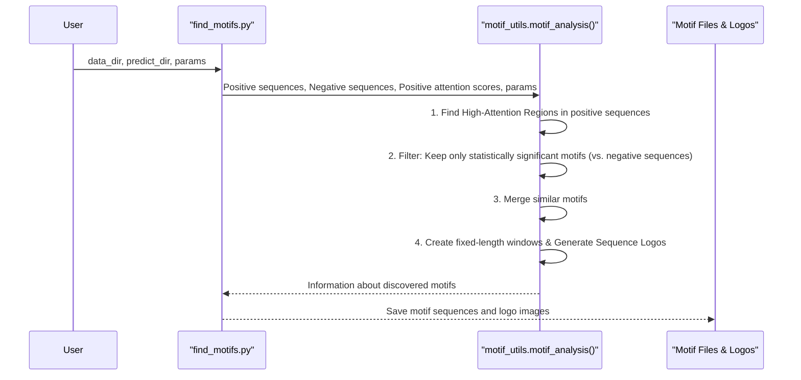

# Chapter 7: Motif Analysis & Visualization Workflow

Welcome to the final chapter of our DNABERT journey! In [Chapter 6: SNP Analysis Workflow](06_snp_analysis_workflow_.md), we explored how to investigate the impact of single-letter DNA changes using DNABERT. Now, we're going to zoom out a bit and learn how to discover and visualize important DNA patterns, or "motifs," that DNABERT identifies as significant.

## What's a Motif, and Why Look for It?

Imagine you're teaching a student (our DNABERT model) to read DNA sequences and identify specific regions, like "promoters" (which help turn genes on). After the student has learned from many examples, you might ask: "What parts of the DNA text did you find most important for recognizing a promoter?" The student might highlight certain short phrases or words that frequently appear in promoters. In DNA, these important "phrases" are called **motifs**.

**The Problem This Workflow Solves:**
DNABERT, especially when using its "attention mechanism," acts like that student. It "pays more attention" to certain parts of a DNA sequence when making a prediction. The Motif Analysis & Visualization Workflow helps us:
1.  **Identify** which k-mers (short DNA words) the model focuses on.
2.  **Extract** these high-attention regions from many DNA sequences.
3.  **Statistically validate** if these regions form meaningful patterns (motifs) that are common in, say, promoter sequences compared to non-promoter sequences.
4.  **Visualize** these motifs, often as "sequence logos," giving us a picture of these important functional elements.

Think of it as using a special magnifying glass (the attention mechanism) over DNA. The parts of the DNA that the model "pays most attention to" for making a prediction are highlighted. This workflow helps us find and understand these highlighted patterns.

## Key Idea: Attention Scores - The Model's "Focus"

At the heart of this workflow are **attention scores**. When a DNABERT model processes a k-mer sentence (as we learned in [Chapter 1: Tokenizer (`PreTrainedTokenizer` & `DNATokenizer`)](01_tokenizer___pretrainedtokenizer_____dnatokenizer___.md)), its attention mechanism assigns scores indicating how much importance or "focus" each k-mer receives relative to other k-mers in the sequence, particularly when making a decision.

To get these attention scores, you need to ensure your DNABERT model is loaded with the `output_attentions=True` setting. This can be done when loading the model using `from_pretrained()` from [Chapter 2: Pretrained Model (`PreTrainedModel` / `TFPreTrainedModel`)](02_pretrained_model___pretrainedmodel_____tfpretrainedmodel___.md), or by setting it in the model's [Model Configuration (`PretrainedConfig`)](03_model_configuration___pretrainedconfig___.md).

### Visualizing Attention on a Single Sequence

The `examples/visualize.py` script in DNABERT can help you see these attention scores for a single DNA sequence. It takes a DNA sequence, converts it to k-mers, feeds it to the model, and then can plot the attention scores.

Let's imagine what `visualize.py` does conceptually:

```python
# Conceptual: How visualize.py might get attention for one sequence
from transformers import BertModel, DNATokenizer
# from process_pretrain_data import get_kmer_sentence # (Helper from Chapter 1)

# 1. Load Model (ensure output_attentions=True) and Tokenizer
# model_path = "path/to/your/dnabert_model_with_attentions"
# tokenizer_name = "dna3" # For 3-mers
# model = BertModel.from_pretrained(model_path, output_attentions=True)
# tokenizer = DNATokenizer.from_pretrained(tokenizer_name)

# 2. Prepare k-mer sentence
# raw_dna = "TGCCTGGCTTTT"
# kmer_sentence = get_kmer_sentence(raw_dna, k=3) # "TGC GCC CCT CTG TGG GGC GCT CTT TTT"

# 3. Get model outputs, including attentions
# inputs = tokenizer.encode_plus(kmer_sentence, return_tensors='pt')
# outputs = model(**inputs)
# attention_scores_all_layers = outputs.attentions # This is a tuple of tensors

# 4. Process and visualize (e.g., sum attention for CLS token to each k-mer)
# (visualize.py does more complex processing here to get per-kmer scores)
# print("Attention scores would be processed and plotted.")
```
This script would then typically generate a heatmap showing which k-mers (or individual bases after processing) received higher attention from the model for that specific sequence. This gives you a first glimpse into the model's "focus."

## The Motif Discovery Workflow with `find_motifs.py`

While `visualize.py` is great for one sequence, `motif/find_motifs.py` is the power tool for discovering motifs across a whole dataset. It systematically analyzes attention scores from many sequences to find recurring, significant patterns.

**Inputs for `find_motifs.py`:**
1.  `--data_dir`: A directory containing your data, typically a `dev.tsv` file. This TSV file should have at least two columns:
    *   `sequence`: The DNA sequence in **k-mer sentence** format.
    *   `label`: A label (e.g., 1 for positive sequences like promoters, 0 for negative).
    Example `dev.tsv`:
    ```tsv
    sequence	label
    GAT ATT TTA TAC ACA	1
    AAA CCC GGG TTT	0
    TGC GCC CCT CTG TGG	1
    ```
2.  `--predict_dir`: A directory containing two crucial files generated from running your DNABERT model (with `output_attentions=True`) on the sequences in `dev.tsv`:
    *   `atten.npy`: A NumPy array file storing the attention scores for each sequence. Each row corresponds to a sequence, and values represent attention on its k-mers.
    *   `pred_results.npy`: A NumPy array file storing the model's prediction scores (e.g., the probability of being class 1) for each sequence.

**Key Parameters for `find_motifs.py`:**
*   `--window_size`: The desired final length of the motifs to be extracted (e.g., 24 bases).
*   `--min_len`: Minimum length of a contiguous high-attention region to be considered initially (e.g., 5 bases).
*   `--pval_cutoff`: Statistical significance threshold (p-value or FDR) to decide if a motif is enriched (e.g., 0.005).
*   `--min_n_motif`: Minimum number of times a motif must appear to be kept (e.g., 3).
*   `--save_file_dir`: Directory where results (motif files, sequence logos) will be saved.

**Outputs from `find_motifs.py`:**
*   **Text files for each motif**: For example, `motif_GATTACA_10.txt` (where GATTACA is part of the consensus and 10 is the number of instances). Each file lists the actual DNA segments (of `window_size`) that constitute instances of that motif.
*   **Sequence logo images (`.png`)**: For example, `motif_GATTACA_10_weblogo.png`. A sequence logo is a graphical representation of a motif, showing the conservation of nucleotides at each position.

**Conceptual Command:**
```bash
python motif/find_motifs.py \
    --data_dir ./my_dataset_with_kmers/ \
    --predict_dir ./my_model_predictions_and_attentions/ \
    --window_size 24 \
    --pval_cutoff 0.005 \
    --save_file_dir ./motif_results/
```
This command tells the script to look for motifs in your dataset, using the provided attention scores and prediction results, and save the findings in `./motif_results/`.

## Under the Hood: How Motifs Are Found

The `find_motifs.py` script uses helper functions from `motif/motif_utils.py`, primarily the `motif_analysis` function, to perform its magic. Here's a simplified overview of the steps involved:



Let's briefly look at these steps, which happen within `motif_utils.motif_analysis()`:

### Step 1: Finding High-Attention Regions
For each "positive" sequence (e.g., a known promoter), the script looks at its corresponding attention scores.
The `find_high_attention` function in `motif_utils.py` identifies contiguous stretches of DNA bases where the attention scores are consistently above a certain threshold (e.g., above the mean score for that sequence). These are initial candidate motif regions.

```python
# Conceptual: motif_utils.find_high_attention
# score = np.array([0.1, 0.2, 0.8, 0.9, 0.7, 0.3, 0.1]) # Example attention per base
# min_len_threshold = 3

# condition = (score > np.mean(score)) # Example: score > 0.44
# contiguous_indices = contiguous_regions(condition, len_thres=min_len_threshold)
# print(contiguous_indices) # e.g., [[2, 5]] meaning bases at index 2,3,4
```
This function effectively highlights parts of the DNA that the model "looked at" intensely.

### Step 2: Statistical Validation (Hypergeometric Test)
Not all high-attention regions are necessarily meaningful motifs. Some might appear by chance.
The `motifs_hypergeom_test` function (and its wrapper `filter_motifs`) in `motif_utils.py` performs a statistical test (hypergeometric test). For each candidate motif (a specific DNA sequence from a high-attention region):
*   It counts how many times this motif appears in the positive sequences (e.g., promoters).
*   It counts how many times it appears in the negative sequences (e.g., non-promoters).
*   It then calculates a p-value: What's the probability of seeing this motif so often in positive sequences purely by chance, given its frequency in the whole dataset?

Motifs with a p-value below a cutoff (e.g., `args.pval_cutoff`) are considered statistically significant – they are likely truly enriched in the positive sequences.

### Step 3: Merging Similar Motifs
Sometimes, the process might find slightly different but very similar high-attention sequences that are actually part of the same underlying motif (e.g., "GATTACA" and "GATTAGA").
The `merge_motifs` function in `motif_utils.py` uses sequence alignment to group together these similar candidate motifs into a single, more representative motif.

### Step 4: Creating Fixed-Length Windows and Visualization
Once significant motifs are identified and merged:
1.  **Windowing (`make_window` in `motif_utils.py`):** For each instance of a discovered motif, the script extracts a fixed-length DNA segment (e.g., `args.window_size` like 24 bases) centered around the high-attention core. This ensures all instances of a motif used for visualization are the same length. These sequences are saved to text files.
2.  **Sequence Logo Generation:** For each final motif, all its fixed-length instances are collected. The `Bio.motifs` library from Biopython is then used to create a **sequence logo**.

    ```python
    # Conceptual: Generating a weblogo (simplified from motif_utils.py)
    from Bio import motifs
    from Bio.Seq import Seq
    
    # motif_instances = ["TATAAG", "TATAAA", "TATAAC", "TATGAA"] # Example instances
    # bio_seqs = [Seq(s) for s in motif_instances]
    # m = motifs.create(bio_seqs)
    
    # This would save a PNG image of the sequence logo
    # m.weblogo("my_motif_logo.png", format='png_print')
    # print("Sequence logo generated!")
    ```
    A sequence logo graphically shows the frequency of each nucleotide (A, C, G, T) at each position within the motif. Taller letters mean those bases are more common at that position. This provides a powerful visual summary of the discovered pattern.

## Putting It All Together

The Motif Analysis & Visualization workflow is a powerful way to peer "inside the mind" of DNABERT. By combining attention scores with statistical analysis, it helps uncover the DNA patterns that the model considers important for its predictions.

This workflow typically involves:
1.  Training a DNABERT model for a specific task (e.g., promoter classification) and ensuring it outputs attention scores.
2.  Running this model on your dataset to get predictions (`pred_results.npy`) and attention scores (`atten.npy`).
3.  Using `find_motifs.py` with these files and your sequence data (`dev.tsv`) to discover and visualize motifs.

The discovered motifs can then be compared to known biological motifs or used to form new hypotheses about DNA regulation.

## Conclusion

Congratulations on completing this journey through DNABERT's core concepts and workflows! You've learned about:
*   How DNA is tokenized into k-mers for the model ([Chapter 1: Tokenizer (`PreTrainedTokenizer` & `DNATokenizer`)](01_tokenizer___pretrainedtokenizer_____dnatokenizer___.md)).
*   Loading and configuring DNABERT models ([Chapter 2: Pretrained Model (`PreTrainedModel` / `TFPreTrainedModel`)](02_pretrained_model___pretrainedmodel_____tfpretrainedmodel___.md) and [Chapter 3: Model Configuration (`PretrainedConfig`)](03_model_configuration___pretrainedconfig___.md)).
*   Preparing data and using pipelines for inference ([Chapter 4: Data Processors & Input Formatting](04_data_processors___input_formatting_.md) and [Chapter 5: Pipelines](05_pipelines_.md)).
*   Specialized workflows like SNP analysis ([Chapter 6: SNP Analysis Workflow](06_snp_analysis_workflow_.md)) and now, Motif Analysis.

In this chapter, you saw how DNABERT's attention mechanism can be leveraged to go beyond just predictions and into the realm of discovering meaningful biological patterns (motifs). By identifying and visualizing these motifs, we can gain deeper insights into how the model "understands" DNA sequences and what features it uses to perform its tasks.

We hope this tutorial has provided you with a solid foundation for using and understanding DNABERT. Happy exploring the world of DNA with deep learning!

---

Generated by [AI Codebase Knowledge Builder](https://github.com/The-Pocket/Tutorial-Codebase-Knowledge)