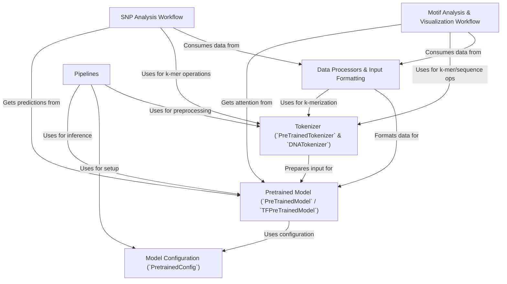

# Tutorial: DNABERT

The `DNABERT` project provides **pre-trained models** (Abstraction 0) based on the *BERT architecture*, specifically adapted for analyzing *DNA sequences*. It includes `DNATokenizer` (Abstraction 2) for converting DNA strings into *k-mers* (model-readable tokens), and various **Data Processors** (Abstraction 3) to load and format diverse DNA datasets for training or evaluation. The project features specialized workflows like **SNP Analysis** (Abstraction 5) to assess the impact of genetic variations on model predictions, and **Motif Analysis** (Abstraction 6) to identify and visualize significant DNA patterns using model attention. High-level **Pipelines** (Abstraction 4) offer an easy interface for common tasks, all guided by **Model Configurations** (Abstraction 1) that define the specific architecture and hyperparameters of each DNABERT variant.

**Source Repository:** [https://github.com/jerryji1993/DNABERT](https://github.com/jerryji1993/DNABERT)

## Chapters

1. [Tokenizer (`PreTrainedTokenizer` & `DNATokenizer`)
](01_tokenizer___pretrainedtokenizer_____dnatokenizer___.md)
2. [Pretrained Model (`PreTrainedModel` / `TFPreTrainedModel`)
](02_pretrained_model___pretrainedmodel_____tfpretrainedmodel___.md)
3. [Model Configuration (`PretrainedConfig`)
](03_model_configuration___pretrainedconfig___.md)
4. [Data Processors & Input Formatting
](04_data_processors___input_formatting_.md)
5. [Pipelines
](05_pipelines_.md)
6. [SNP Analysis Workflow
](06_snp_analysis_workflow_.md)
7. [Motif Analysis & Visualization Workflow
](07_motif_analysis___visualization_workflow_.md)

---

Generated by [AI Codebase Knowledge Builder](https://github.com/The-Pocket/Tutorial-Codebase-Knowledge)