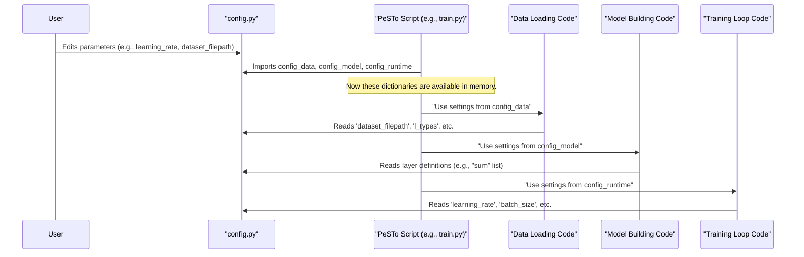

# Chapter 1: Model Configuration System

Welcome to the PeSTo tutorial! We're excited to help you get started. In this first chapter, we'll explore PeSTo's **Model Configuration System**.

## What's the Big Deal with Configuration?

Imagine you're a scientist (or a chef!) running an experiment (or baking a cake!). You have many ingredients and settings:
*   What raw materials (data) are you using?
*   How are you preparing these materials (data processing parameters)?
*   What kind of equipment (neural network architecture) are you using?
*   How long do you run the experiment (training time), at what intensity (learning rate), and in what batches (batch size)?

If you change any of these, your final result (the trained model, or the cake) might be different. Keeping track of all these settings can be a headache! If you get a great result, you'll want to know exactly how you did it so you can do it again (reproducibility). If something goes wrong, you'll want to see what settings you used.

This is where PeSTo's Model Configuration System comes in. It's like a **central control panel** or a **master recipe book** for your entire experiment. It allows you to:
1.  Define all your settings in one place.
2.  Easily adjust these settings.
3.  Ensure your experiments are reproducible.

PeSTo uses simple Python dictionaries to store all these settings. Let's see how!

## The Configuration Files: Your Experiment's DNA

In PeSTo, configurations are primarily managed through Python files that define dictionaries. The main configuration file you'll often interact with is typically found at `model/config.py`.

These dictionaries are usually named:
*   `config_data`: For settings related to your input data.
*   `config_model`: For settings defining the architecture of your neural network.
*   `config_runtime`: For settings related to how the model is trained.
*   `config_dataset`: (Found in files like `processing/build_dataset.py`) For settings specific to constructing a new dataset.

Let's look at what kinds of things go into these dictionaries.

### 1. `config_data`: What Are We Working With?

This dictionary tells PeSTo about your data.

```python
# Snippet from model/config.py
config_data = {
    'dataset_filepath': "datasets/contacts_rr5A_64nn_8192.h5", # Path to your main dataset
    'max_size': 8192,  # Max number of atoms in a structure to consider
    'l_types': ['ALA', 'GLY', 'VAL', ...], # Types of molecules on one side (e.g., proteins)
    'r_types': [ # Types of molecules on the other side for interaction
        ['ALA', 'GLY', ...], # e.g., protein-protein
        ['DA', 'DT', ...],   # e.g., protein-DNA
    ],
    # ... other data-related settings
}
```
*   `'dataset_filepath'`: This is crucial! It's the path to your processed dataset file (we'll learn more about dataset construction in the [Processed Dataset Construction (HDF5)](04_processed_dataset_construction__hdf5_.md) chapter).
*   `'max_size'`: A parameter to filter out very large molecules if needed.
*   `'l_types'` and `'r_types'`: These define the types of molecules (like amino acids for proteins, or nucleotides for DNA/RNA) that your model will focus on for predicting interactions. (The actual values are often populated using `categ_to_resnames` from `src.data_encoding` for convenience, but they resolve to lists of molecule identifiers).

### 2. `config_model`: Building the Brain

This dictionary defines the structure of your neural network – how many layers, how big they are, etc. This is where you design the "brain" that will learn from your data.

```python
# Snippet from model/config.py
config_model = {
    "em": {'N0': 30, 'N1': 32}, # Parameters for an "embedding" layer
    "sum": [ # A list defining a sequence of "summation" layers
        {'Ns': 32, 'Nh': 2, 'Nk': 3, 'nn': 8},
        {'Ns': 32, 'Nh': 2, 'Nk': 3, 'nn': 8},
        # ... many more similar layer definitions ...
        {'Ns': 32, 'Nh': 2, 'Nk': 3, 'nn': 64},
    ],
    "spl": {'N0': 32, 'N1': 32, 'Nh': 4}, # Parameters for a "splitting" layer
    "dm": {'N0': 32, 'N1': 32, 'N2': 5}   # Parameters for a "decision making" layer
}
```
*   `"em"`, `"sum"`, `"spl"`, `"dm"`: These keys represent different parts or types of layers in the [PeSTo Neural Network Model](03_pesto_neural_network_model_.md).
*   Inside each, parameters like `'N0'`, `'N1'`, `'Ns'`, `'Nh'` define the sizes and characteristics of these layers. For example, `'Ns'` could be the number of features in a layer, and `len(config_model["sum"])` tells you how many "sum" layers there are.

Don't worry about what each parameter means right now. The key takeaway is that the model's architecture is fully specified here.

### 3. `config_runtime`: Running the Show

This dictionary controls how the training process happens.

```python
# Snippet from model/config.py
config_runtime = {
    'run_name': 'my_experiment_v1', # A name for your current experiment
    'output_dir': 'save',          # Where to save results (like trained models)
    'reload': True,                # Whether to try and load a previous model state
    'device': 'cuda',              # 'cuda' for GPU, 'cpu' for CPU
    'num_epochs': 100,             # How many times to cycle through the training data
    'batch_size': 1,               # How many samples to process at once
    'learning_rate': 1e-5,         # How quickly the model adapts during training
    # ... other runtime settings
}
```
*   `'run_name'`: Giving your experiment a unique name is good practice.
*   `'num_epochs'`: More epochs mean more training, but too many can lead to overfitting.
*   `'learning_rate'`: A critical parameter. Too high, and the model might not learn; too low, and it might learn too slowly.
*   `'batch_size'`: Affects memory usage and training dynamics.

### 4. `config_dataset`: Preparing Your Ingredients

When you're starting from raw data (like PDB files of protein structures) and need to prepare it for PeSTo, there's another configuration dictionary, often found in scripts like `processing/build_dataset.py`.

```python
# Snippet from processing/build_dataset.py
config_dataset = {
    "r_thr": 5.0,  # Distance threshold in Angstroms to define a "contact"
    "max_num_atoms": 8192, # Similar to max_size, for filtering during dataset creation
    "molecule_ids": ['GLU', 'LEU', ...], # List of known molecule IDs
    "pdb_filepaths": "data/all_biounits/*/*.pdb*.gz", # Pattern to find raw PDB files
    "dataset_filepath": "data/datasets/contacts_rr5A_64nn_8192_wat.h5", # Output path
}
```
This dictionary guides the [Processed Dataset Construction (HDF5)](04_processed_dataset_construction__hdf5_.md) process. It specifies where to find raw data, how to process it (e.g., the `r_thr` for contact definition), and where to save the processed HDF5 file.

## How Do You Use It? The Control Panel in Action!

Let's say you want to run an experiment and you think the default `learning_rate` of `1e-5` in `config_runtime` is too slow. You want to try `1e-4`.

1.  **Open the file**: Go to `model/config.py`.
2.  **Find the setting**: Locate `config_runtime` and the `learning_rate` key.
    ```python
    # model/config.py
    # ... other configs ...

    config_runtime = {
        'run_name': 'i_v4_1_some_date_time',
        'output_dir': 'save',
        'reload': True,
        'device': 'cuda',
        'num_epochs': 100,
        'batch_size': 1,
        'log_step': 1024,
        'eval_step': 1024*8,
        'eval_size': 1024,
        'learning_rate': 1e-5, # <-- The line to change!
        'pos_weight_factor': 0.5,
        'comment': "",
    }
    ```
3.  **Change the value**:
    ```python
    # model/config.py (after your change)
    # ...
    config_runtime = {
        # ... other settings ...
        'learning_rate': 1e-4, # <-- Changed!
        # ...
    }
    # ...
    ```
4.  **Save the file and run your experiment**: PeSTo will now use `1e-4` as the learning rate.

It's that simple! By changing values in these dictionaries, you control the entire experiment.

## Reproducibility: Remembering Your Recipe

One of the best things about this system is **reproducibility**. When PeSTo trains a model and saves it (often in a directory like `model/save/my_experiment_v1_timestamp/`), it also saves a copy of the `config.py` file that was used for that specific training run!

For example, you might see files like:
*   `model/save/i_v3_0_2021-05-27_14-27/config.py`
*   `model/save/i_v4_1_2021-09-07_11-21/config.py`

These `config.py` files are snapshots. If you look inside `model/save/i_v3_0_2021-05-27_14-27/config.py`, you'll see the exact settings used to produce the model saved in that `i_v3_0_2021-05-27_14-27` directory. This is incredibly useful for:
*   Remembering how you got a particular result.
*   Sharing your settings with others.
*   Re-running an experiment exactly as before.
*   Comparing different experiments by looking at their config files. For example, the `config_model` in `i_v3_0.../config.py` has 16 "sum" layers, while `i_v4_1.../config.py` has 32 "sum" layers. This difference in model architecture is clearly recorded.

## Under the Hood: How PeSTo Uses These Configurations

You don't need to know the deep internals to use PeSTo, but a little insight can be helpful.

When a PeSTo script (like for training or data processing) starts, it typically imports these configuration dictionaries. Different parts of the PeSTo system then read the values they need from these dictionaries.

Here's a simplified flow:



Essentially, `config.py` acts as a shared source of truth for all parameters. The [Training and Evaluation Orchestrator](02_training_and_evaluation_orchestrator_.md) will use `config_runtime` to manage the training epochs and batching. The [PeSTo Neural Network Model](03_pesto_neural_network_model_.md) will be constructed based on `config_model`. And data handling, including [Feature Engineering & Encoding](05_feature_engineering___encoding_.md) and [Structure Preprocessing](06_structure_preprocessing_.md), will be guided by `config_data` and `config_dataset`.

The `datetime` import often seen at the top of `config.py` files is used to automatically generate unique timestamps for `run_name`s, helping to keep experiment outputs organized.

```python
# From model/config.py
from datetime import datetime # Used for timestamping run names

# define run name tag
tag = datetime.now().strftime("_%Y-%m-%d_%H-%M") # e.g., "_2023-10-27_15-30"

config_runtime = {
    'run_name': 'my_experiment' + tag, # Results in 'my_experiment_2023-10-27_15-30'
    # ...
}
```

This simple mechanism of using Python dictionaries makes PeSTo flexible and easy to configure.

## Conclusion

You've now learned about PeSTo's Model Configuration System!
*   It uses **Python dictionaries** (`config_data`, `config_model`, `config_runtime`, `config_dataset`) as a central place for all experiment settings.
*   These settings cover everything from data paths and processing parameters to neural network architecture and training options.
*   Modifying these settings is as easy as editing a Python dictionary.
*   This system is key to **reproducibility**, as configurations are saved alongside trained models.

You're now equipped with the knowledge of how to tell PeSTo *what* to do and *how* to do it.

In the next chapter, we'll dive into the [Training and Evaluation Orchestrator](02_training_and_evaluation_orchestrator_.md), which takes these configurations and manages the actual process of training your model and seeing how well it performs.

---

Generated by [AI Codebase Knowledge Builder](https://github.com/The-Pocket/Tutorial-Codebase-Knowledge)