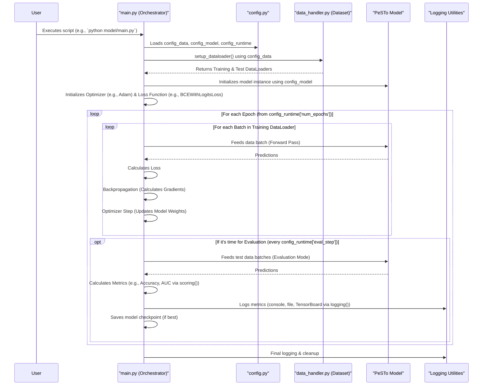

# Chapter 2: Training and Evaluation Orchestrator

In [Chapter 1: Model Configuration System](01_model_configuration_system_.md), we learned how PeSTo uses configuration files (like `model/config.py`) as a "master recipe book" to define all the settings for our machine learning experiments. We know *what* ingredients to use (`config_data`), *what* our "PeSTo brain" should look like (`config_model`), and *how* the overall process should run (`config_runtime`).

But how do we actually start the cooking? How do we take these configurations and put them into action to train a model and see how well it learns?

That's where the **Training and Evaluation Orchestrator** comes in. Think of it as the "factory manager" for our PeSTo project. This manager, primarily the `model/main.py` script, takes all the instructions from our configuration files and diligently carries out the entire machine learning workflow.

## What Does the Factory Manager Do?

Imagine you want to teach a new "PeSTo brain" (our model) to recognize patterns in protein interactions. The factory manager (`main.py`) handles this entire process:

1.  **Gets the Raw Materials Ready**: It prepares the data, loading it in manageable batches that the model can process. This involves using the `Dataset` class from `model/data_handler.py` which, as we'll see in the [Processed Dataset Construction (HDF5)](04_processed_dataset_construction__hdf5_.md) chapter, reads our specially prepared HDF5 dataset.
2.  **Builds and Prepares the "Brain"**: It initializes the [PeSTo Neural Network Model](03_pesto_neural_network_model_.md) according to the specifications in `config_model` and sets up the tools (like an "optimizer") needed to teach it.
3.  **Runs the "Teaching" Assembly Line (Training Loop)**:
    *   It feeds batches of data to the model.
    *   The model makes predictions.
    *   It calculates how "wrong" the model's predictions are using a "loss function" (e.g., `BCEWithLogitsLoss` for binary yes/no predictions).
    *   It then figures out how to adjust the model's internal connections to make it less wrong next time (this is called "backpropagation").
    *   It updates the model's connections (weights) using the optimizer.
    *   This cycle repeats many times, for many batches of data, over several "epochs" (passes through the entire training dataset).
4.  **Conducts "Quality Checks" (Evaluation)**: Periodically, it takes a break from teaching and tests the model on a separate set of data (the "test set") that the model hasn't seen during training. This helps to see how well the model is generalizing its knowledge. It uses specific "scoring metrics" (like accuracy, precision, etc.) to measure performance.
5.  **Keeps Detailed Records (Logging and Saving)**:
    *   It logs all important information: how the training is progressing, the loss values, and the scores from evaluation. This is often written to the console and to files (sometimes for visualization tools like TensorBoard).
    *   It saves "checkpoints" of the model – snapshots of the model's learned state. This is crucial so we don't lose progress and so we can save the best-performing version of our model.

In essence, `main.py` orchestrates the entire learning journey of our PeSTo model.

## A Glimpse Inside `model/main.py`

Let's look at the main parts of the `model/main.py` script and how it uses the configurations from `config.py`.

### 1. Setting the Stage: Imports and Configurations

At the very beginning, `main.py` imports necessary libraries and, crucially, our configuration dictionaries from `config.py`:

```python
# Snippet from model/main.py
import os
import torch as pt # PyTorch, the deep learning framework PeSTo uses
# ... other imports ...

from config import config_data, config_model, config_runtime # Our settings!
from data_handler import Dataset, collate_batch_data # For loading data
from model import Model # The PeSTo neural network architecture
# ...
```
This makes `config_data`, `config_model`, and `config_runtime` available for the script to use.

### 2. Preparing the Data: `setup_dataloader()`

The orchestrator needs to feed data to the model. The `setup_dataloader` function is responsible for this. It takes the `config_data` and information about which specific data samples to use (e.g., a list of training samples).

```python
# Simplified from model/main.py
def setup_dataloader(current_config_data, sids_selection_filepath):
    dataset = Dataset(current_config_data['dataset_filepath']) # Uses HDF5 path

    # Apply various filters based on current_config_data:
    # e.g., max_size, min_num_res, interface_types
    # m = select_by_sid(...) & select_by_max_ba(...) ...
    # dataset.update_mask(m) # Apply the combined filter

    dataset.set_types(current_config_data['l_types'], current_config_data['r_types'])

    dataloader = pt.utils.data.DataLoader(
        dataset,
        batch_size=config_runtime['batch_size'], # How many samples per batch
        shuffle=True, # Mix up the data order
        collate_fn=collate_batch_data # Custom function to combine samples into a batch
    )
    return dataloader
```
*   It creates a `Dataset` object, pointing to our HDF5 file (specified in `config_data['dataset_filepath']`).
*   It applies filters based on `config_data` (like `'max_size'`, `'l_types'`, `'r_types'`) to select the relevant data.
*   It then wraps this `Dataset` in a PyTorch `DataLoader`, which will provide data in batches of size `config_runtime['batch_size']`.
*   Two data loaders are typically created: one for training (`dataloader_train`) and one for testing (`dataloader_test`).

```python
# Inside the main train() function in model/main.py
dataloader_train = setup_dataloader(config_data, config_data['train_selection_filepath'])
dataloader_test = setup_dataloader(config_data, config_data['test_selection_filepath'])
```
Now, `dataloader_train` is ready to serve batches of training data, and `dataloader_test` for evaluation data.

### 3. Initializing the Model, Optimizer, and Loss Function

Next, the "PeSTo brain" itself ([PeSTo Neural Network Model](03_pesto_neural_network_model_.md)) is built, along with the tools to train it:

```python
# Inside the main train() function in model/main.py
device = pt.device(config_runtime['device']) # 'cuda' for GPU, 'cpu' for CPU

model = Model(config_model) # Create model using architecture from config_model
model = model.to(device)    # Send the model to the chosen device (GPU/CPU)

# The optimizer helps the model learn by adjusting its weights
optimizer = pt.optim.Adam(model.parameters(), lr=config_runtime["learning_rate"])

# The criterion (loss function) measures how wrong the model's predictions are
criterion = pt.nn.BCEWithLogitsLoss(reduction="none")
```
*   `Model(config_model)` creates an instance of our neural network, configured by `config_model`.
*   `model.to(device)` moves the model to the GPU if available (specified in `config_runtime['device']`), for faster training.
*   `pt.optim.Adam` is a popular optimization algorithm. It uses the `learning_rate` from `config_runtime`.
*   `pt.nn.BCEWithLogitsLoss` is a loss function suitable for binary classification tasks (predicting yes/no, 0/1), which is common in interaction prediction.

### 4. The Training Loop: Teaching the Model

This is where the main action happens. The training loop iterates for a number of `epochs` (defined in `config_runtime['num_epochs']`). In each epoch, it processes the entire training dataset in batches.

```python
# Simplified training loop from model/main.py's train() function

for epoch in range(config_runtime['num_epochs']):
    model.train() # Tell the model it's in "training mode"

    for batch_train_data in tqdm(dataloader_train): # Loop through batches
        # tqdm is a utility to show a progress bar

        # A. Get data onto the device (GPU/CPU)
        # X, ids_topk, q, M, y = [data.to(device) for data in batch_train_data]

        # B. Clear old gradients
        optimizer.zero_grad()

        # C. Forward Pass: Get model's prediction
        # z = model.forward(X, ids_topk, q, M)
        # dloss = criterion(z, y) # Calculate loss (how wrong)
        # These steps are often wrapped in a helper like eval_step in PeSTo:
        losses_batch, _, _ = eval_step(model, device, batch_train_data, criterion, ...)

        # D. Backward Pass: Calculate how to adjust weights
        loss = pt.sum(losses_batch) # Combine losses if there are multiple
        loss.backward()

        # E. Optimizer Step: Update model weights
        optimizer.step()

        # ... (Periodically log training progress) ...
        # ... (Periodically evaluate on the test set - see next section) ...
```
Let's break down the core steps for each batch:
*   `model.train()`: Puts the model in training mode (some layers behave differently during training vs. evaluation).
*   `optimizer.zero_grad()`: Resets any gradients calculated from the previous batch.
*   **Forward Pass**: The data batch is fed to `model.forward(...)`. The model outputs its predictions (`z`). The `criterion` (loss function) then compares these predictions (`z`) to the true answers (`y`) to calculate the `loss`. PeSTo uses an `eval_step` helper function for this.
*   `loss.backward()`: This is the magic of **backpropagation**. PyTorch automatically calculates how much each model weight contributed to the error (the "gradients").
*   `optimizer.step()`: The optimizer uses these gradients and the `learning_rate` to adjust the model's weights, hopefully making the model better.

### 5. Evaluation: Checking the Model's Knowledge

Periodically (controlled by `config_runtime['eval_step']`), the orchestrator pauses training to evaluate the model on the test set:

```python
# Simplified evaluation block from model/main.py's train() function

if (global_step + 1) % config_runtime["eval_step"] == 0:
    model.eval() # Tell the model it's in "evaluation mode"
    test_results = []

    with pt.no_grad(): # Disable gradient calculations for speed and correctness
        for batch_test_data in dataloader_test: # Loop through test batches
            # Similar to training: get predictions and calculate loss
            losses, y_true, y_pred_probs = eval_step(model, device, batch_test_data, ...)
            test_results.append([losses.cpu(), y_true.cpu(), y_pred_probs.cpu()])
            # ... (limit number of evaluation batches if 'eval_size' is set) ...

    scores = scoring(test_results) # Calculate performance metrics (ACC, AUC, etc.)
    logging(logger, writer, scores, global_step, ..., "test") # Log the scores

    # ... (Save the model if it's the best one seen so far) ...
    model.train() # Switch back to training mode
```
*   `model.eval()`: Puts the model in evaluation mode.
*   `pt.no_grad()`: Tells PyTorch not to calculate gradients, as they are not needed for evaluation and it saves memory/computation.
*   The model makes predictions on the `dataloader_test`.
*   The `scoring()` function (from `model/main.py`, uses helpers from `src.scoring.py`) takes the true labels and predicted probabilities and computes various metrics like accuracy, precision, recall, AUC, etc. (defined in `bc_score_names`).
*   These `scores` are then logged.

### 6. Logging and Saving Models

Throughout the training and evaluation, the orchestrator logs information and saves model checkpoints.

```python
# Snippets from model/main.py related to logging and saving

# Initialization (typically near the start of train())
from src.logger import Logger
from torch.utils.tensorboard import SummaryWriter

logger = Logger(output_path, 'train') # Custom logger for text logs
writer = SummaryWriter(os.path.join(output_path, 'tb')) # For TensorBoard logs

# During training/evaluation logging (inside logging() function call)
# logger.print(...) prints to console and file
# writer.add_scalar(...) writes data for TensorBoard

# Saving a checkpoint periodically (e.g., after logging training stats)
model_filepath_ckpt = os.path.join(output_path, 'model_ckpt.pt')
pt.save(model.state_dict(), model_filepath_ckpt)

# Saving the best model (based on evaluation loss)
if min_loss >= scores['loss']: # scores['loss'] is the evaluation loss
    min_loss = scores['loss']
    model_filepath_best = os.path.join(output_path, 'model.pt')
    logger.print(f"> saving best model at {model_filepath_best}")
    pt.save(model.state_dict(), model_filepath_best)
```
*   PeSTo uses its own `Logger` (from `src.logger.py`) for text-based logs and PyTorch's `SummaryWriter` to create logs viewable with TensorBoard (a great tool for visualizing training).
*   `pt.save(model.state_dict(), filepath)` saves the learned parameters (weights) of the model.
    *   `model_ckpt.pt`: A frequently saved checkpoint, allowing you to resume training if it's interrupted.
    *   `model.pt`: Saved only when the model achieves a new best score on the evaluation set.

## How to Run the Orchestrator

Typically, you run the `main.py` script from your terminal, within the `model/` directory (or by specifying the path to it):

```bash
cd path/to/your/PeSTo/project/model
python main.py
```

When it runs, you'll see output in your console showing:
*   The configurations being used.
*   The model architecture.
*   Progress bars for training epochs.
*   Logged metrics for training and testing steps (loss, accuracy, etc.).

The script will also create an output directory (usually `model/save/your_run_name_timestamp/` based on `config_runtime['output_dir']` and `config_runtime['run_name']`). Inside this directory, you'll find:
*   Log files (`train.log`, `train.dat`).
*   TensorBoard logs (in a `tb` subdirectory).
*   Saved model files (`model_ckpt.pt`, `model.pt`).
*   A copy of the `config.py` used for that run, ensuring reproducibility!

## The Orchestration Flow: A Bird's-Eye View

Here's a simplified sequence of how the orchestrator coordinates everything:



This diagram shows `main.py` as the central coordinator, interacting with the configuration, data handling, the model itself, and logging utilities to manage the entire workflow.

## Conclusion

The Training and Evaluation Orchestrator (`main.py`) is the heart of the PeSTo learning process. It's the "factory manager" that:
*   Reads your experiment's "recipe" from the [Model Configuration System](01_model_configuration_system_.md).
*   Prepares and feeds data using `Dataset` and `DataLoader`.
*   Initializes and manages the [PeSTo Neural Network Model](03_pesto_neural_network_model_.md).
*   Runs the iterative training loop: forward pass, loss calculation, backpropagation, and weight updates.
*   Periodically evaluates the model's performance on unseen test data.
*   Keeps detailed logs and saves model checkpoints for reproducibility and future use.

Understanding this orchestrator is key to running your own experiments and training PeSTo models effectively.

In the next chapter, we'll take a closer look at the "brain" itself: the [PeSTo Neural Network Model](03_pesto_neural_network_model_.md), to understand its architecture and how it makes predictions.

---

Generated by [AI Codebase Knowledge Builder](https://github.com/The-Pocket/Tutorial-Codebase-Knowledge)