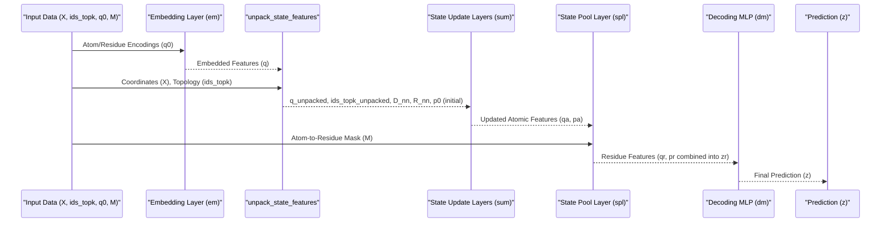

# Chapter 3: PeSTo Neural Network Model

In the [previous chapter](02_training_and_evaluation_orchestrator_.md), we saw how the "factory manager" (`main.py`) orchestrates the training and evaluation of our PeSTo models. It takes the recipe from our configuration files and manages the entire learning process. But what exactly is this "PeSTo brain" that's doing the learning?

This chapter dives into the heart of PeSTo: the **PeSTo Neural Network Model**. This is the core predictive engine that learns to identify complex patterns from protein structural data, for example, to predict whether two protein residues will interact.

## What is the PeSTo Neural Network Model?

Imagine you're trying to teach a computer to look at a 3D picture of a protein and guess which parts are important for its function or how it might interact with other molecules. The PeSTo Neural Network Model is like a highly specialized information processing pipeline designed for this task.

It's built using PyTorch (a popular deep learning library) and is technically a `nn.Module`. This means it's a collection of "layers," each performing a specific transformation on the data, all working together to make a final prediction.

Think of it like an assembly line:
1.  Raw materials (protein structure information) go in one end.
2.  They pass through several processing stations (layers).
3.  A final product (the prediction) comes out the other end.

## The Inputs: What the Model "Sees"

Before the model can predict anything, it needs information about the protein. The key inputs are:

*   **Atom Coordinates (`X`)**: The 3D positions (x, y, z) of each atom in the protein. This tells the model the protein's shape.
*   **Topology (`ids_topk`)**: Information about which atoms are "neighbors" to each other. This helps the model understand local atomic environments.
*   **Atom/Residue Type Encodings (`q`)**: Numerical representations of what kind of atom (e.g., Carbon, Nitrogen) or amino acid residue (e.g., Alanine, Glycine) we're looking at.
*   **Atom-to-Residue Mask (`M`)**: A map that tells the model which atoms belong to which amino acid residue. This is important because PeSTo often makes predictions at the residue level.

These inputs are carefully prepared by processes we'll explore in later chapters, such as [Feature Engineering & Encoding](05_feature_engineering___encoding_.md) and [Structure Preprocessing](06_structure_preprocessing_.md).

## The Model's Architecture: A Tour of the "Processing Stations"

The PeSTo model has a specific architecture, meaning its layers are arranged in a particular way. Let's meet the main components:

1.  **Embedding Layer (`em`) - The Translator**:
    *   **Purpose**: Raw input features (like atom types) are often just categories. This layer "translates" these categorical features into rich numerical vectors (called embeddings) that the network can work with more effectively. It helps the model learn meaningful representations for different atom or residue types.
    *   **Analogy**: Imagine you have a list of ingredients for a recipe (e.g., "flour," "sugar," "egg"). The embedding layer is like a food scientist who describes each ingredient by its chemical properties, texture potential, and flavor profile using a set of numbers.

2.  **State Update Layers (`sum`) - The Atomic "Gossip Network"**:
    *   **Purpose**: This is a series of special layers where information at the atomic level is refined. Each atom "looks" at its neighbors, considers their current states (features) and their geometric relationships (distances, orientations), and updates its own state. This process is repeated through several `StateUpdateLayer`s, allowing information to "flow" or "propagate" across the local atomic environment.
    *   **Analogy**: Think of atoms in a protein as people in a room. In each `StateUpdateLayer`, every person talks to their immediate neighbors, sharing what they've learned and updating their own understanding based on these conversations. After a few rounds of these "gossip" sessions, each person has a much better idea of what's happening in their local vicinity.

3.  **State Pool Layer (`spl`) - The Residue "Team Captain"**:
    *   **Purpose**: Predictions in PeSTo are often made at the residue level (a residue is a small group of connected atoms, like an amino acid). After the `StateUpdateLayer`s have refined the features for each atom, the `StatePoolLayer` intelligently aggregates these atomic features into a single set of features for each residue.
    *   **Analogy**: Imagine each amino acid residue is a sports team, and the atoms are its players. The `StatePoolLayer` is like the team captain who summarizes the overall strength, strategy, and current status of their team based on the individual states of all its players.

4.  **Decoding MLP (`dm`) - The "Decision Maker"**:
    *   **Purpose**: This is a standard Multi-Layer Perceptron (a type of neural network). It takes the aggregated residue-level features from the `StatePoolLayer` and makes the final prediction. For example, it might output a score indicating the likelihood that a residue is involved in an interaction.
    *   **Analogy**: After the team captain (`spl`) has presented their summary, the `Decoding MLP` is like the head coach who takes this summary and makes the final call: "Based on this, what's our game plan?" or "Is this team likely to win?"

## Building the Model: Using the Configuration

As we learned in [Chapter 1: Model Configuration System](01_model_configuration_system_.md), the exact structure of these layers (how many, how big, etc.) is defined in the `config_model` dictionary within `model/config.py`.

Here's a simplified example of how `config_model` relates to the layers:
```python
# Snippet from model/config.py
config_model = {
    "em": {'N0': 30, 'N1': 32}, # Settings for the Embedding Layer
    "sum": [ # A list defining several State Update Layers
        {'Ns': 32, 'Nh': 2, 'Nk': 3, 'nn': 8}, # Settings for 1st SUM layer
        {'Ns': 32, 'Nh': 2, 'Nk': 3, 'nn': 8}, # Settings for 2nd SUM layer
        # ... more sum layers ...
    ],
    "spl": {'N0': 32, 'N1': 32, 'Nh': 4}, # Settings for State Pool Layer
    "dm": {'N0': 32, 'N1': 32, 'N2': 5}   # Settings for Decoding MLP
}
```
*   `config_model["em"]` provides parameters for the `EmbeddingLayer`.
*   `config_model["sum"]` is a list, where each item is a dictionary of parameters for one `StateUpdateLayer`. The number of items in this list determines how many `sum` layers are stacked.
*   `config_model["spl"]` configures the `StatePoolLayer`.
*   `config_model["dm"]` configures the `DecodingMLP`.

## The `Model` Class: Code Implementation

In PeSTo, the neural network is defined as a Python class, typically named `Model`, found in `model/model.py`. This class inherits from `pt.nn.Module`, which is the base class for all neural network modules in PyTorch.

### `__init__`: Constructing the Layers

The `__init__` method of the `Model` class is where the layers we discussed are actually created and initialized, using the parameters from `config_model`.

```python
# Simplified from model/model.py
import torch as pt
from src.model_operations import StateUpdateLayer, StatePoolLayer # Layer definitions

class Model(pt.nn.Module):
    def __init__(self, config): # 'config' here is our config_model
        super(Model, self).__init__()

        # 1. Embedding Layer (em)
        self.em = pt.nn.Sequential(
            pt.nn.Linear(config['em']['N0'], config['em']['N1']), # Input size N0, output N1
            pt.nn.ELU(), # Activation function
            # ... more linear and activation layers ...
            pt.nn.Linear(config['em']['N1'], config['em']['N1']),
        )

        # 2. State Update Layers (sum)
        # Creates a sequence of StateUpdateLayer modules
        self.sum = pt.nn.Sequential(
            *[StateUpdateLayer(params) for params in config['sum']]
        )

        # 3. State Pool Layer (spl)
        self.spl = StatePoolLayer(
            config['spl']['N0'], config['spl']['N1'], config['spl']['Nh']
        )

        # 4. Decoding MLP (dm)
        self.dm = pt.nn.Sequential(
            pt.nn.Linear(2 * config['dm']['N0'], config['dm']['N1']), # Input size (2*N0)
            pt.nn.ELU(),
            # ... more layers ...
            pt.nn.Linear(config['dm']['N1'], config['dm']['N2']), # Output size N2
        )
```
*   `super(Model, self).__init__()`: This is standard PyTorch practice to correctly initialize the base `nn.Module`.
*   `self.em`: An embedding module is created. `pt.nn.Linear` creates a fully connected layer. `pt.nn.ELU` is an activation function that helps the network learn non-linear patterns. The sizes `N0` and `N1` come from `config['em']`.
*   `self.sum`: This line uses a list comprehension to create multiple `StateUpdateLayer` instances, one for each set of parameters in `config['sum']`. These are then wrapped in `pt.nn.Sequential`, meaning data will pass through them one after another. The `StateUpdateLayer` itself is a custom module defined in `src/model_operations.py`.
*   `self.spl`: A `StatePoolLayer` is created using parameters from `config['spl']`. This is also a custom module from `src/model_operations.py`.
*   `self.dm`: A decoding MLP is created. Note the input to the first linear layer `2 * config['dm']['N0']`. This is because it will later receive two types of features concatenated together. The final `config['dm']['N2']` often corresponds to the number of output classes (e.g., 1 for a binary interaction prediction score).

### `forward`: The Information Flow

The `forward` method defines how data actually flows through the network when you pass input to it. It takes the prepared inputs (`X`, `ids_topk`, `q0`, `M`) and passes them sequentially through the layers defined in `__init__`.

```python
# Simplified from model/model.py
# (Continuing the Model class)
    def forward(self, X, ids_topk, q0, M):
        # 1. Encode initial features with Embedding Layer
        q = self.em.forward(q0) # q0 are the raw type encodings

        # Helper function to prepare geometric info (distances, relative positions)
        # and a 'sink' node (a technical detail for the graph operations)
        from src.model_operations import unpack_state_features
        q_unpacked, ids_topk_unpacked, D_nn, R_nn = unpack_state_features(X, ids_topk, q)

        # Initial 'state vectors' (another type of feature, often starts as zeros)
        p0 = pt.zeros((q_unpacked.shape[0], X.shape[1], q.shape[1]), device=X.device)

        # 2. Process through State Update Layers
        # (q_unpacked, p0, ids_topk_unpacked, D_nn, R_nn) is a tuple of inputs for sum
        qa, pa, _, _, _ = self.sum.forward(
            (q_unpacked, p0, ids_topk_unpacked, D_nn, R_nn)
        )
        # qa, pa are the updated atomic scalar and vector features

        # 3. Aggregate atomic features to residue features with State Pool Layer
        # We skip the 'sink' node (qa[1:], pa[1:]) for pooling
        qr, pr = self.spl.forward(qa[1:], pa[1:], M)
        # qr, pr are the residue-level scalar and vector features

        # 4. Make final prediction with Decoding MLP
        # Concatenate residue scalar features (qr) and the norm (length) of vector features (pr)
        zr = pt.cat([qr, pt.norm(pr, dim=1)], dim=1)
        z = self.dm.forward(zr) # Final prediction output

        return z
```
Let's trace the data:
1.  `q = self.em.forward(q0)`: The initial atom/residue type encodings `q0` are passed through the embedding layer `self.em` to get richer feature vectors `q`.
2.  `unpack_state_features(...)`: This utility function (from `src/model_operations.py`) takes the atom coordinates `X`, neighbor information `ids_topk`, and embedded features `q`. It calculates things like distances (`D_nn`) and relative position vectors (`R_nn`) between neighboring atoms. It also adds a special "sink" node, which is a common technique in graph neural networks.
3.  `p0 = pt.zeros(...)`: An initial set of "vector features" (`p`) is created, usually starting as all zeros. These features, along with the "scalar features" (`q`), represent the state of each atom.
4.  `qa, pa, ... = self.sum.forward(...)`: The scalar features (`q_unpacked`), vector features (`p0`), and geometric information (`ids_topk_unpacked`, `D_nn`, `R_nn`) are passed through the sequence of `StateUpdateLayer`s (`self.sum`). This produces updated atomic features `qa` (scalar) and `pa` (vector).
5.  `qr, pr = self.spl.forward(qa[1:], pa[1:], M)`: The updated atomic features `qa` and `pa` (excluding the sink node, hence `[1:]`) are fed into the `StatePoolLayer` (`self.spl`), along with the atom-to-residue mask `M`. This layer aggregates them into residue-level features `qr` and `pr`.
6.  `zr = pt.cat(...)`: The scalar residue features `qr` are concatenated with the magnitude (norm) of the vector residue features `pr`. This combined feature vector `zr` represents each residue.
7.  `z = self.dm.forward(zr)`: This final residue representation `zr` is passed to the decoding MLP (`self.dm`) to produce the model's output `z` (e.g., an interaction score).

## A Peek Inside the Custom Layers (`src/model_operations.py`)

The `StateUpdateLayer` and `StatePoolLayer` are custom-built for PeSTo and contain the specialized logic for processing structural data. They are defined in `src/model_operations.py`. While their internal details are complex, involving concepts like attention mechanisms (ways for the model to weigh the importance of different pieces of information), here's the gist:

*   **`StateUpdateLayer` (contains `StateUpdate` operation)**:
    *   **Goal**: To refine an atom's features based on its local neighborhood.
    *   **How (Simplified)**: For each atom, it looks at its `nn` nearest neighbors (defined in `config_model['sum'][layer_idx]['nn']`). It considers the features of these neighbors, their distances, and relative orientations. Using learnable transformations and attention, it computes an "update" to the central atom's scalar (`q`) and vector (`p`) features. This allows atoms to become "aware" of their chemical and geometric environment. The "sink" node helps handle boundary conditions or global information exchange in a structured way.

*   **`StatePoolLayer`**:
    *   **Goal**: To combine features from all atoms belonging to a single residue into one representative set of features for that residue.
    *   **How (Simplified)**: It uses an attention mechanism. For each residue, it looks at all its constituent atoms. It calculates "attention scores" that determine how much each atom should contribute to the final residue representation. Then, it computes a weighted sum of the atomic features (`qa`, `pa`) to get the residue features (`qr`, `pr`).

The `unpack_state_features` function is also crucial. It pre-computes geometric information like:
*   `R_nn`: Displacement vectors from an atom to its neighbors.
*   `D_nn`: Distances to these neighbors.
This geometric context is vital for the `StateUpdateLayer`s to learn spatially aware representations.

## Visualizing the Information Flow

Here's a simplified diagram showing how data flows through the PeSTo model:



This pipeline, from raw atomic data to a final residue-level prediction, is what the [Training and Evaluation Orchestrator](02_training_and_evaluation_orchestrator_.md) trains by adjusting the learnable parameters within each layer.

## Conclusion

The PeSTo Neural Network Model is a sophisticated architecture designed to learn from complex protein structural data. You've learned that:

*   It takes atom coordinates, topology, type encodings, and atom-to-residue masks as input.
*   It's composed of several key stages:
    *   An **Embedding Layer (`em`)** to create rich feature representations.
    *   A series of **State Update Layers (`sum`)** to refine atomic features based on local environments.
    *   A **State Pool Layer (`spl`)** to aggregate atomic features into residue-level features.
    *   A **Decoding MLP (`dm`)** to make the final prediction.
*   The specific configuration of these layers is controlled by `config_model` (from [Chapter 1: Model Configuration System](01_model_configuration_system_.md)).
*   The model is implemented as a PyTorch `nn.Module` in `model/model.py`, with custom operations like `StateUpdateLayer` and `StatePoolLayer` defined in `src/model_operations.py`.
*   The `forward` method defines the path data takes through these layers to generate a prediction.

This model is the "brain" that the orchestrator trains. But for this brain to learn, it needs well-prepared food (data). In the next chapter, we'll look at how this data is prepared and stored efficiently in [Chapter 4: Processed Dataset Construction (HDF5)](04_processed_dataset_construction__hdf5_.md).

---

Generated by [AI Codebase Knowledge Builder](https://github.com/The-Pocket/Tutorial-Codebase-Knowledge)