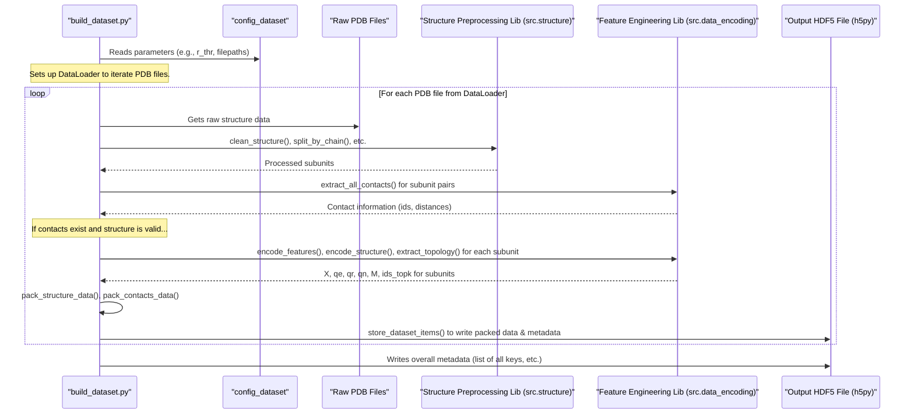

# Chapter 4: Processed Dataset Construction (HDF5)

Welcome to Chapter 4! In [Chapter 3: PeSTo Neural Network Model](03_pesto_neural_network_model_.md), we explored the "brain" of PeSTo – the neural network architecture that learns from protein data. But for this brain to learn effectively, it needs a large amount of well-organized, easily accessible "food" – and that's where our processed dataset comes in.

Imagine you want to teach PeSTo to predict which parts of different proteins interact. You might have thousands of raw protein structure files (PDB files). Each file describes one protein, but they're all in a somewhat raw format, and loading and processing them one by one during training would be incredibly slow.

This chapter explains how PeSTo takes all those individual protein structures, extracts the important information, and compiles it into a single, large, highly structured "encyclopedia" called an HDF5 file. This process is **Processed Dataset Construction**.

## What's the Big Deal with an HDF5 File?

Think of an HDF5 file as a super-organized digital filing cabinet or a massive, indexed encyclopedia.
*   **Hierarchical Data Format (HDF5)**: It's a file format designed to store and organize large amounts of scientific data.
*   **Structure**: It can hold data in a folder-like structure (called "groups") and store various types of data (like tables of numbers, text, etc. as "datasets").
*   **Efficiency**: It's great for handling large numerical arrays (which is what protein features become) and allows for "lazy loading" – meaning our program can read only the parts of the file it needs at any moment, without loading the entire massive file into memory.

For PeSTo, this HDF5 file becomes the **single source of truth** for all the preprocessed data the model will train on. It contains everything needed: atom coordinates, feature encodings, neighborhood information, and the "answers" (target labels, like contact information) for many, many protein structures.

## Key Ingredients of Our Protein Encyclopedia

To build this HDF5 encyclopedia, we need to extract specific pieces of information from each raw protein structure. This involves steps covered in more detail in later chapters like [Structure Preprocessing](06_structure_preprocessing_.md) and [Feature Engineering & Encoding](05_feature_engineering___encoding_.md). For now, let's see what gets stored:

*   **`X` (Atom Coordinates)**: The 3D (x, y, z) positions of every atom. This defines the protein's shape.
*   **`qe`, `qr`, `qn` (Feature Encodings)**: Numerical representations (often one-hot encodings) of:
    *   `qe`: Element type for each atom (e.g., Carbon, Nitrogen, Oxygen).
    *   `qr`: Residue type for each atom (e.g., Alanine, Glycine).
    *   `qn`: Atom name within its residue (e.g., CA for alpha-carbon).
*   **`ids_topk` (Topology Information)**: For each atom, the indices of its `k` nearest neighbor atoms. This helps the model understand local atomic environments.
*   **`M` (Residue Masks)**: A map indicating which atoms belong to which amino acid residue. PeSTo often makes predictions at the residue level.
*   **`Y` (Target Labels - Contacts)**: A matrix indicating which pairs of residues are in contact (e.g., based on a distance threshold). This is what the model often tries to predict.
*   **`ctype` (Contact Types)**: Information about the types of molecules involved in the contacts (e.g., protein-protein, protein-ligand).

All these pieces of data, for hundreds or thousands of protein structures, are systematically organized and stored in the HDF5 file.

## The Building Process: `processing/build_dataset.py`

PeSTo uses a script, typically `processing/build_dataset.py`, to construct this HDF5 file. This script is guided by a configuration dictionary, `config_dataset`, which we first encountered in the [Chapter 1: Model Configuration System](01_model_configuration_system_.md).

Let's look at a snippet of what `config_dataset` might contain:
```python
# Snippet from processing/build_dataset.py
config_dataset = {
    "r_thr": 5.0,  # Distance threshold in Angstroms to define a "contact"
    "max_num_atoms": 8192, # Max atoms per structure to process
    "max_num_nn": 64,      # Number of nearest neighbors for ids_topk
    "molecule_ids": ['GLU', 'LEU', ...], # List of known molecule types
    "pdb_filepaths": "data/all_biounits/*/*.pdb*.gz", # Pattern to find raw PDB files
    "dataset_filepath": "data/datasets/contacts_rr5A_64nn_8192.h5", # Output HDF5 path
}
```
This configuration tells the script:
*   Where to find the raw PDB files (`"pdb_filepaths"`).
*   How to define a contact (`"r_thr"`).
*   How many neighbors to consider (`"max_num_nn"`).
*   Where to save the final HDF5 encyclopedia (`"dataset_filepath"`).

The `build_dataset.py` script then iterates through each PDB file specified, processes it, and adds its information to the HDF5 file.

### A Step-by-Step Assembly Line

Imagine an assembly line for creating entries in our protein encyclopedia:

1.  **Pick a Protein**: The script picks a raw PDB file.
2.  **Clean and Prepare**: The PDB file is read (using tools from [Protein Structure Representation & IO](07_protein_structure_representation___io_.md)) and then cleaned up (e.g., removing unwanted molecules, standardizing atom names). This is part of [Structure Preprocessing](06_structure_preprocessing_.md).
3.  **Identify Subunits**: If the protein has multiple chains (polypeptides), they are often treated as separate "subunits."
4.  **Extract Features**: For each relevant subunit, the script calculates all the necessary features we listed earlier (`X`, `qe`, `qr`, `qn`, `M`, `ids_topk`). This is the core of [Feature Engineering & Encoding](05_feature_engineering___encoding_.md).
5.  **Find Contacts (Targets)**: The script identifies which residues from different subunits (or within the same subunit, depending on the task) are in "contact" based on the `r_thr` distance. This generates our `Y` labels and `ctype` information.
6.  **Pack the Data**: The extracted features and contact information, which are usually in the form of PyTorch tensors or NumPy arrays, are "packed." This means they are converted to efficient NumPy array formats, and their original shapes are recorded. Some features, like one-hot encodings, can be stored sparsely (only storing the positions of '1's) to save space.
7.  **Store in HDF5**: Using the `h5py` library, the script carefully writes this packed data into the HDF5 file. Each protein subunit and its interactions get their own "section" (group) within the file, making it easy to find later.

### Packing Data for HDF5: An Example

The functions `pack_structure_data` and `pack_contacts_data` in `build_dataset.py` handle the conversion of in-memory data (like PyTorch tensors) to a format suitable for HDF5.

Here's a simplified idea of what `pack_structure_data` does:
```python
# Simplified: packing structure data for HDF5
def pack_structure_data(X_tensor, qe_tensor, M_tensor, ids_topk_tensor):
    # Convert PyTorch tensors to NumPy arrays, specify data types
    packed_data = {
        'X': X_tensor.cpu().numpy().astype(np.float32),
        'ids_topk': ids_topk_tensor.cpu().numpy().astype(np.uint16),
        # Store sparse features (like one-hot qe, M) as indices of non-zero elements
        'qe': pt.stack(pt.where(qe_tensor > 0.5), dim=1).cpu().numpy().astype(np.uint16),
        'M': pt.stack(pt.where(M_tensor), dim=1).cpu().numpy().astype(np.uint16),
    }
    # Store original shapes as metadata for reconstruction later
    shapes_info = {
        'qe_shape': qe_tensor.shape,
        'M_shape': M_tensor.shape,
    }
    return packed_data, shapes_info
```
*   `X_tensor.cpu().numpy().astype(np.float32)`: Atom coordinates are converted to NumPy arrays of floating-point numbers.
*   `pt.stack(pt.where(qe_tensor > 0.5), dim=1)`: For a one-hot encoded tensor like `qe_tensor` (where each row has one '1' indicating the element type), `pt.where` finds the coordinates of these '1's. `pt.stack` then converts these coordinates into an `N x D` array (e.g., `N_atoms x 2` for `qe`, storing `[atom_index, element_type_index]`). This sparse representation saves a lot of space compared to storing the full matrix of zeros and ones.
*   `shapes_info`: The original dimensions of these features (e.g., how many element types there were in `qe`) are saved. This is crucial for correctly reconstructing the full feature matrix when reading the data later.

### The Structure Inside the HDF5 Encyclopedia

The `build_dataset.py` script organizes the HDF5 file very methodically. Think of it like this:

```
my_dataset.h5 (The main encyclopedia file)
|
|-- data/  (A "folder" for all structural and contact data)
|   |-- structures/ (Subfolder for individual protein subunit data)
|   |   |-- PDB_GROUP/PDB_ID/BIOUNIT_ID/CHAIN_ID/  (Path to a specific subunit)
|   |   |   |-- X          (Dataset: atom coordinates as a NumPy array)
|   |   |   |-- qe         (Dataset: sparsely stored element encodings)
|   |   |   |-- qr         (Dataset: sparsely stored residue encodings)
|   |   |   |-- qn         (Dataset: sparsely stored atom name encodings)
|   |   |   |-- M          (Dataset: sparsely stored atom-to-residue mask)
|   |   |   |-- ids_topk   (Dataset: neighbor atom indices)
|   |   |   (This group also has "attributes" like qe_shape, M_shape, etc.)
|   |   |
|   |   |-- ... (more subunits for other proteins) ...
|   |
|   |-- contacts/ (Subfolder for interaction data between pairs of subunits)
|   |   |-- PDB_GROUP/PDB_ID/BIOUNIT_ID/CHAIN_A/CHAIN_B/ (Path for contacts A-B)
|   |   |   |-- Y          (Dataset: sparsely stored contact map)
|   |   |   (This group also has "attributes" like Y_shape, ctype)
|   |   |
|   |   |-- ... (more interacting pairs) ...
|
|-- metadata/ (A "folder" for overall information about the encyclopedia)
    |-- keys           (Dataset: List of all structure paths, e.g., "PDB_GROUP/PDB_ID/...")
    |-- sizes          (Dataset: Number of residues for each structure in 'keys')
    |-- ckeys          (Dataset: List of all contact paths)
    |-- ctypes         (Dataset: Types of contacts)
    |-- mids           (Dataset: List of all molecule IDs like 'ALA', 'GLY', 'MG')
    |-- std_elements   (Dataset: Standard element names used for encoding)
    |-- std_resnames   (Dataset: Standard residue names used for encoding)
    |-- std_names      (Dataset: Standard atom names used for encoding)
```
This clear, hierarchical structure makes it efficient to find and load data for any specific protein or interaction when it's time to train the model.

## Under the Hood: The `build_dataset.py` Workflow

Let's visualize the general process flow within `build_dataset.py`:



### Key Functions in Action

1.  **Main Loop**: The script iterates through PDB files (often using a PyTorch `DataLoader` with `StructuresDataset` from `src.dataset.py` for efficient file reading).

    ```python
    # Simplified main loop from build_dataset.py
    # hf is an open h5py.File object for the output HDF5
    # dataloader provides (raw_structure_data, pdb_filepath)
    for raw_structure, pdb_filepath in tqdm(dataloader):
        # ... (basic checks: structure loaded? not too big?) ...

        # 1. Preprocess: clean, tag, split into subunits
        # These functions are from src.structure (see Chapter 6)
        structure = clean_structure(raw_structure)
        structure = tag_hetatm_chains(structure)
        subunits = split_by_chain(structure)
        # ... (filter non-atomic, remove duplicates, check >1 subunit) ...

        # 2. Extract contacts between all pairs of subunits
        # This uses r_thr from config_dataset (see Chapter 5)
        contacts = extract_all_contacts(subunits, config_dataset['r_thr'], device)
        # ... (skip if no contacts found) ...

        # 3. Pack features and contact data for HDF5 storage
        # This calls encode_features, encode_structure, extract_topology (Chapter 5)
        # and then pack_structure_data, pack_contacts_data internally
        structures_data, contacts_data = pack_dataset_items(
            subunits, contacts, config_dataset['molecule_ids'], ...
        )

        # 4. Store the packed data into the HDF5 file
        # pdbid, bid are parsed from pdb_filepath
        metadata_for_this_pdb = store_dataset_items(
            hf, pdbid, bid, structures_data, contacts_data
        )
        # ... (collect all metadata_for_this_pdb to save at the end) ...
    ```

2.  **Storing Data with `store_dataset_items` and `save_data`**: The `store_dataset_items` function orchestrates the creation of groups in the HDF5 file and calls `save_data` (from `src.dataset.py`) to actually write the data.

    ```python
    # Simplified: store_dataset_items from build_dataset.py
    def store_dataset_items(hf_file, pdbid, biounit_id, structures_data, contacts_data):
        # ... (loop through subunits (cid0) that have contacts) ...
        for cid0 in contacts_data:
            # Create a unique path (key) in HDF5 for this subunit's structure
            struct_h5_path = f"data/structures/{pdbid}/{biounit_id}/{cid0}"
            h5_group_for_structure = hf_file.create_group(struct_h5_path)

            # Save structure data (X, qe, M, etc.) and its shape attributes
            # structures_data[cid0] is a tuple: (packed_data_dict, shapes_info_dict)
            save_data(h5_group_for_structure,
                      attrs=structures_data[cid0][1],  # shapes_info
                      **structures_data[cid0][0])      # packed_data (X, qe, M...)

            # ... (loop through contacting partners (cid1) of cid0) ...
            for cid1 in contacts_data[cid0]:
                contact_h5_path = f"{struct_h5_path}/{cid1}" # Path for this specific interaction
                h5_group_for_contact = hf_file.create_group(contact_h5_path)
                # Save contact data (Y) and its attributes (Y_shape, ctype)
                save_data(h5_group_for_contact,
                          attrs=contacts_data[cid0][cid1][1], # Y_shape, ctype
                          **contacts_data[cid0][cid1][0])     # Y (packed)
        # ... (return list of metadata entries for this PDB) ...
    ```

    The `save_data` helper function is quite simple:
    ```python
    # From src.dataset.py
    def save_data(h5py_group, attrs={}, **data_arrays):
        # Store each data array (X, Y, qe, etc.) as an HDF5 "dataset" within the group
        for name, array in data_arrays.items():
            h5py_group.create_dataset(name, data=array, compression="lzf") # lzf for compression
        # Save metadata (like original shapes) as "attributes" of the HDF5 group
        for attr_name, attr_value in attrs.items():
            h5py_group.attrs[attr_name] = attr_value
    ```

## How This Encyclopedia is Used During Training

Once this HDF5 file is built, the [Training and Evaluation Orchestrator](02_training_and_evaluation_orchestrator_.md) uses it to feed data to the model. The `Dataset` class in `model/data_handler.py` is responsible for reading this HDF5 file.

*   It first reads the global `metadata` (like the list of all `keys` and `mids`).
*   When the training loop asks for a specific protein (e.g., `dataset[i]`), the `Dataset` class:
    1.  Looks up the `key` (path) for the i-th protein in the HDF5 file.
    2.  Opens the HDF5 file (if not already open).
    3.  Navigates to the appropriate group (e.g., `data/structures/PDB_ID/CHAIN_A/`).
    4.  Loads only the necessary arrays (`X`, `qe`, `M`, `ids_topk`, and `Y` for contacts).
    5.  Crucially, for sparsely stored features (like `qe`, `M`, `Y`), it uses the stored indices and shape attributes to reconstruct the full dense PyTorch tensors that the model expects.

The `load_sparse_mask` function (from `src.dataset.py`) is key for reconstructing these features:
```python
# From src.dataset.py - Reconstructing a sparse feature matrix
def load_sparse_mask(h5py_group, feature_key): # e.g., feature_key = 'qe' or 'M'
    # Get the original dense shape stored as an attribute
    original_shape = tuple(h5py_group.attrs[feature_key + '_shape'])
    # Create an empty tensor of zeros with the original shape
    reconstructed_tensor = pt.zeros(original_shape, dtype=pt.float)
    # Load the stored indices (coordinates of the '1's)
    # These are N_nonzero x D, e.g., for qe: N_atoms x 2 (atom_idx, feature_idx)
    indices = pt.from_numpy(np.array(h5py_group[feature_key]).astype(np.int64))

    # Populate the tensor: tensor[row_idx, col_idx] = 1.0
    # For features like qe, M, Y: indices[:,0] are "row" coordinates, indices[:,1] are "column" coordinates.
    # For a 2D one-hot feature (e.g. qe: N_atoms x N_element_types),
    # indices will be N_atoms x 2, where indices[i,0]=i, indices[i,1]=element_type_for_atom_i
    # The scatter_ method correctly reconstructs this:
    # It sets reconstructed_tensor[indices[i,0], indices[i,1]] = 1.0 for all i
    # The '1' in scatter_(1,...) specifies that indices[:,1] (and subsequent columns in indices[:,1:])
    # refers to dimension 1 of reconstructed_tensor.
    # The indices for dimension 0 are implicitly taken from the first column of 'indices', i.e., indices[:,0].
    reconstructed_tensor.scatter_(1, indices[:, 1:], 1.0) # For N_dim > 2, this generalizes

    return reconstructed_tensor
```
This efficient "on-demand" loading and reconstruction is vital for handling very large protein datasets without overwhelming computer memory.

## Conclusion

You've now learned how PeSTo transforms raw protein structure data into a highly organized and efficient HDF5 dataset! This "protein encyclopedia":
*   Consolidates data from many protein structures into a single file.
*   Stores crucial information: atom coordinates (`X`), various feature encodings (`qe`, `qr`, `qn`), topology (`ids_topk`), residue masks (`M`), and target contact labels (`Y`, `ctype`).
*   Uses sparse storage for efficiency, saving space and time.
*   Is structured hierarchically, making it easy for the `data_handler` to load specific pieces of data quickly during model training.

This processed dataset is the foundation upon which the [PeSTo Neural Network Model](03_pesto_neural_network_model_.md) learns. But what exactly are these features like `qe` and `qr`, and how are they derived from the raw protein structure? We'll dive into that in the next chapter: [Feature Engineering & Encoding](05_feature_engineering___encoding_.md).

---

Generated by [AI Codebase Knowledge Builder](https://github.com/The-Pocket/Tutorial-Codebase-Knowledge)