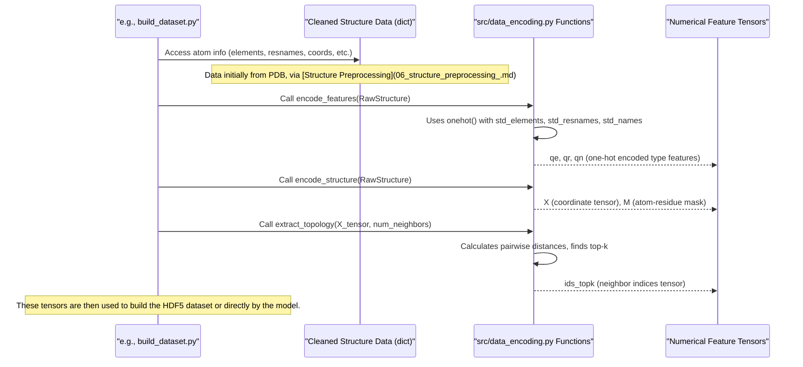

# Chapter 5: Feature Engineering & Encoding

Welcome to Chapter 5! In [Chapter 4: Processed Dataset Construction (HDF5)](04_processed_dataset_construction__hdf5_.md), we learned how PeSTo builds a massive, organized "encyclopedia" (an HDF5 file) of protein data. This encyclopedia is crucial for training our models efficiently. But how do we get the raw information from a protein structure – like its shape and what atoms it's made of – into a format that this encyclopedia can store and, more importantly, that our [PeSTo Neural Network Model](03_pesto_neural_network_model_.md) can understand?

That's where **Feature Engineering & Encoding** comes in. Think of a protein structure as a complex blueprint. An engineer can't just hand a blueprint to a robot and expect it to build something. The engineer first needs to:
1.  Identify key parts and materials on the blueprint.
2.  Take precise measurements (like lengths, angles, types of materials).
3.  Write down these measurements and material codes in a standardized numerical table.

Similarly, feature engineering and encoding is the critical step of converting the "blueprint" of a cleaned protein structure (which includes atomic coordinates, residue types, atom names, etc.) into numerical representations (features) suitable for machine learning. The PeSTo AI, like the robot, needs these standardized numbers to learn.

This chapter will explore how PeSTo, primarily using functions in `src/data_encoding.py`, performs this transformation.

## What Are "Features" in a Protein Context?

When we talk about "features" of a protein for machine learning, we mean specific, measurable properties that describe it. For PeSTo, these typically include:

*   **Atomic Coordinates (`X`)**: The 3D (x, y, z) position of every atom. This tells the model the protein's exact shape.
*   **Atom Types (`qe`)**: What chemical element each atom is (e.g., Carbon, Oxygen, Nitrogen).
*   **Residue Types (`qr`)**: What type of amino acid (or nucleic acid) each atom belongs to (e.g., Alanine, Glycine, Guanine).
*   **Atom Names within Residues (`qn`)**: The specific name of an atom within its residue (e.g., 'CA' for Alpha Carbon, 'N' for backbone Nitrogen).
*   **Atom-to-Residue Mapping (`M`)**: Which atoms belong to which residue. This is important because PeSTo often thinks about residues as a whole.
*   **Local Geometry/Topology (`ids_topk`)**: Information about which atoms are close to each other (nearest neighbors). This helps the model understand the local environment around each atom.

Our goal is to convert all this information into numbers.

## Why "Encoding"? Computers Speak Numbers!

Machine learning models, at their core, are mathematical functions. They don't understand "Carbon" or "Alanine" directly. They understand numbers. Encoding is the process of converting these categorical descriptions (like atom or residue names) into numerical values.

A common method PeSTo uses is **one-hot encoding**. Imagine you have three types of amino acids: Alanine, Glycine, Valine.
*   Alanine could be represented as `[1, 0, 0]`
*   Glycine as `[0, 1, 0]`
*   Valine as `[0, 0, 1]`

Each amino acid gets a unique vector where only one position is "hot" (set to 1), and all others are 0. This tells the model that these are distinct categories without implying any order or ranking between them.

## PeSTo's Feature Engineering Toolkit: `src/data_encoding.py`

The primary tools for this conversion process in PeSTo are found in the `src/data_encoding.py` file. Let's explore the main functions.

### 1. Knowing Our Building Blocks: Standard Vocabularies

Before we can encode anything, we need a defined list of all possible atom types, residue types, etc., that our model should know. These are like the official vocabulary lists. `src/data_encoding.py` defines these:

```python
# Snippet from src/data_encoding.py
std_elements = np.array(['C', 'O', 'N', 'S', ...]) # List of known elements
std_resnames = np.array(['LEU', 'GLU', 'ALA', ...]) # List of known residue names
std_names = np.array(['CA', 'N', 'C', 'O', 'CB', ...]) # List of known atom names within residues

config_encoding = {'std_elements': std_elements, 
                   'std_resnames': std_resnames, 
                   'std_names': std_names}
```
*   `std_elements`: A list of chemical element symbols (e.g., 'C' for Carbon, 'O' for Oxygen).
*   `std_resnames`: A list of standard residue names (e.g., 'ALA' for Alanine, 'G' for Guanine).
*   `std_names`: A list of standard atom names found within these residues (e.g., 'CA' for Alpha Carbon).
*   `config_encoding`: This dictionary bundles these lists together, and it's actually saved as metadata in the HDF5 file (as seen in [Chapter 4](04_processed_dataset_construction__hdf5_.md)) so we always know how the features were encoded.

If an atom or residue encountered in a PDB file isn't in these standard lists, it's usually mapped to a special "unknown" category (like 'X' for elements, 'UNX' for residues, 'UNK' for atom names).

### 2. One-Hot Encoding: The `onehot` Helper and `encode_features`

The `onehot` function in `src/data_encoding.py` is a utility that takes an array of items (like atom names from a structure) and one of the standard vocabulary lists, and produces the one-hot encoded numerical matrix.

```python
# Simplified concept of onehot from src/data_encoding.py
def onehot(items_from_structure, standard_vocabulary):
    # For each item, find its position in the standard_vocabulary
    # Create a matrix of zeros
    # Place a '1' at the correct position for each item
    # If an item is not in vocabulary, mark it in a special "unknown" column
    # ... implementation details ...
    # Example: items_from_structure = ['C', 'N'], standard_vocabulary = ['N', 'C', 'O']
    # Output might be: [[0, 1, 0], [1, 0, 0]] (assuming 'X' column is implicit or handled)
    pass
```
This `onehot` function is then used by `encode_features` to generate the actual feature tensors `qe`, `qr`, and `qn`.

```python
# Snippet from src/data_encoding.py
def encode_features(structure, device=pt.device("cpu")):
    # 'structure' is a dictionary holding protein data (like NumPy arrays)
    # structure['element'] contains element names for each atom, e.g., ['C', 'O', 'N', ...]
    # structure['resname'] contains residue names for each atom, e.g., ['ALA', 'ALA', 'GLY', ...]
    # structure['name'] contains atom names for each atom, e.g., ['N', 'CA', 'C', ...]

    # Encode element types
    qe_np = onehot(structure['element'], std_elements) # Returns a NumPy array
    qe = pt.from_numpy(qe_np.astype(np.float32)).to(device) # Convert to PyTorch tensor

    # Encode residue types
    qr_np = onehot(structure['resname'], std_resnames)
    qr = pt.from_numpy(qr_np.astype(np.float32)).to(device)

    # Encode atom names
    qn_np = onehot(structure['name'], std_names)
    qn = pt.from_numpy(qn_np.astype(np.float32)).to(device)

    return qe, qr, qn
```
*   **Input**: A `structure` dictionary. This dictionary is the output of the [Structure Preprocessing](06_structure_preprocessing_.md) steps and contains NumPy arrays like `structure['element']`, `structure['resname']`, and `structure['name']`.
*   **Process**: For each type of feature (element, residue name, atom name), it calls `onehot` with the corresponding data from the `structure` and the standard vocabulary list. The results are converted to PyTorch tensors.
*   **Output**: Three PyTorch tensors:
    *   `qe`: One-hot encoded element types for each atom. Shape: `(num_atoms, num_std_elements + 1)`.
    *   `qr`: One-hot encoded residue types for each atom. Shape: `(num_atoms, num_std_resnames + 1)`.
    *   `qn`: One-hot encoded atom names for each atom. Shape: `(num_atoms, num_std_names + 1)`.
    (The `+1` in the dimension is for the "unknown" category).

### 3. Capturing 3D Shape and Residue Grouping: `encode_structure`

This function handles two things: getting the atomic coordinates into a tensor and creating a mapping that tells us which atoms belong to which residue.

```python
# Snippet from src/data_encoding.py
def encode_structure(structure, device=pt.device("cpu")):
    # 'structure' dictionary also contains:
    # structure['xyz']: NumPy array of atom coordinates, shape (num_atoms, 3)
    # structure['resid']: NumPy array of residue IDs for each atom, e.g., [1, 1, 1, 2, 2, ...]

    # Convert coordinates to a PyTorch tensor
    if isinstance(structure['xyz'], pt.Tensor): # Check if already a tensor
        X = structure['xyz'].to(device)
    else:
        X = pt.from_numpy(structure['xyz'].astype(np.float32)).to(device)

    # Create the Atom-to-Residue Mask (M)
    if isinstance(structure['resid'], pt.Tensor):
        resids_tensor = structure['resid'].to(device)
    else:
        resids_tensor = pt.from_numpy(structure['resid']).to(device)

    # Get unique residue IDs present in this structure
    unique_resids = pt.unique(resids_tensor)
    # M will be True if atom 'i' belongs to unique residue 'j'
    M = (resids_tensor.unsqueeze(1) == unique_resids.unsqueeze(0))
    # M shape: (num_atoms, num_unique_residues_in_this_structure)

    return X, M
```
*   **Input**: The same `structure` dictionary.
*   **Process**:
    *   It converts the `structure['xyz']` (a NumPy array of coordinates) into a PyTorch tensor `X`.
    *   It takes `structure['resid']` (which assigns a numerical ID to each residue, e.g., all atoms of the first residue have ID 1, second residue ID 2, etc.). It then creates a boolean matrix `M`. `M[i, j]` is `True` if atom `i` belongs to the `j`-th unique residue in the structure, and `False` otherwise. This mask is crucial for the [PeSTo Neural Network Model](03_pesto_neural_network_model_.md) to pool atomic information into residue-level information.
*   **Output**:
    *   `X`: A PyTorch tensor of atom coordinates. Shape: `(num_atoms, 3)`.
    *   `M`: A PyTorch boolean tensor mapping atoms to residues. Shape: `(num_atoms, num_unique_residues)`.

### 4. Understanding Local Neighborhoods: `extract_topology`

Proteins are not just a bag of atoms; their local arrangement matters. `extract_topology` calculates which atoms are "neighbors" to each other.

```python
# Snippet from src/data_encoding.py
def extract_topology(X, num_nn): # num_nn is number of nearest neighbors to find
    # X is the tensor of atom coordinates (num_atoms, 3)

    # 1. Calculate all pairwise distances between atoms
    # R_ij = X_i - X_j (displacement vectors)
    R = X.unsqueeze(0) - X.unsqueeze(1) # Shape: (num_atoms, num_atoms, 3)
    # D_ij = ||R_ij|| (Euclidean distances)
    D = pt.norm(R, dim=2) # Shape: (num_atoms, num_atoms)

    # (Technical detail: Add a large value to self-distances to avoid picking self as neighbor)
    D = D + pt.max(D) * (D < 1e-2).float() # D < 1e-2 identifies diagonal (self-distances)

    # 2. Find the 'num_nn' nearest neighbors for each atom
    knn = min(num_nn, D.shape[0]) # Ensure we don't ask for more neighbors than atoms
    # pt.topk finds the k smallest values (and their indices) along a dimension
    D_topk, ids_topk = pt.topk(D, knn, dim=1, largest=False)
    # D_topk: distances to k nearest neighbors. Shape: (num_atoms, knn)
    # ids_topk: indices of these k nearest neighbors. Shape: (num_atoms, knn)

    # (The full function also returns R_topk (displacement vectors to neighbors),
    # and the full D and R matrices, but ids_topk is often the primary output used)
    return ids_topk, D_topk, R_topk, D, R # R_topk etc. are useful for advanced models
```
*   **Input**:
    *   `X`: The tensor of atom coordinates (output from `encode_structure`).
    *   `num_nn`: How many nearest neighbors to find for each atom (e.g., 64, often set in `config_dataset['max_num_nn']`).
*   **Process**:
    1.  It calculates the distance from every atom to every other atom, creating a distance matrix `D`.
    2.  For each atom, it then finds the `num_nn` atoms that are closest to it (excluding itself).
*   **Output**:
    *   `ids_topk`: A tensor containing the indices of the `num_nn` nearest neighbors for each atom. Shape: `(num_atoms, num_nn)`. This tells the model which atoms are in the immediate vicinity of any given atom.
    *   (Also `D_topk`, `R_topk`, etc., which are distances and displacement vectors to these neighbors).

### 5. Identifying Contacts (Target Labels): `extract_all_contacts`

While the features above (`X`, `q_`, `M`, `ids_topk`) describe the input structure itself, PeSTo often aims to predict interactions, like which residues from two different protein chains are "in contact." The `src/data_encoding.py` file also contains a function `extract_all_contacts` for this.

```python
# Simplified concept from src/data_encoding.py
def locate_contacts(xyz_i, xyz_j, r_thr, device=pt.device("cpu")):
    # xyz_i: coordinates of atoms in structure i
    # xyz_j: coordinates of atoms in structure j
    # r_thr: distance threshold (e.g., 5 Angstroms) to define a contact

    # Calculate distances between all atoms in i and all atoms in j
    # Find pairs of atoms (one from i, one from j) closer than r_thr
    # Return indices of these contacting atoms and their distances
    pass

def extract_all_contacts(subunits, r_thr, device=pt.device("cpu")):
    # 'subunits' is a dictionary of structures (one per chain/subunit)
    # 'r_thr' comes from config_dataset['r_thr']

    contacts_dict = {}
    # Loop through all pairs of subunits (cid_i, cid_j)
        # ids_i, ids_j, d_ij = locate_contacts(subunits[cid_i]['xyz'], subunits[cid_j]['xyz'], ...)
        # Store these atom-level contacts
    return contacts_dict
```
This function takes a collection of subunits (e.g., different chains of a protein complex), and a distance threshold (`r_thr` from `config_dataset`). It then identifies all pairs of atoms (from different subunits) that are closer than this threshold. This information is then used in `processing/build_dataset.py` (by the `contacts_types` and `pack_contacts_data` functions) to generate the target contact matrix `Y` which is stored in the HDF5 file. While `Y` is what the model *predicts*, its generation is part of preparing the dataset.

## How These Tools Are Used: A Glimpse into `processing/build_dataset.py`

In [Chapter 4: Processed Dataset Construction (HDF5)](04_processed_dataset_construction__hdf5_.md), we saw the `build_dataset.py` script which creates the HDF5 file. Inside this script, particularly in the `pack_dataset_items` function, these encoding tools from `src/data_encoding.py` are called:

```python
# Simplified from pack_dataset_items in processing/build_dataset.py

# For each subunit 's0' (a structure dictionary) that we need to process:
s0 = subunits[cid0] # Get the structure data for subunit cid0

# 1. Encode categorical features (element, residue, atom name)
qe0, qr0, qn0 = encode_features(s0, device=device) # Returns one-hot tensors

# 2. Encode coordinates and atom-to-residue mask
X0, M0 = encode_structure(s0, device=device) # Returns X and M tensors

# 3. Extract local topology (nearest neighbors)
ids0_topk = extract_topology(X0, config_dataset['max_num_nn'])[0] # Get just ids_topk

# The tensors X0, qe0, qr0, qn0, M0, ids0_topk are then passed to
# pack_structure_data() to be converted to NumPy and prepared for HDF5 storage.
```
This shows the pipeline: raw-ish structural data (`s0`) is fed into these encoding functions, and out come the numerical tensors ready to be saved or used by the model.

## Under the Hood: The Encoding Flow

Let's visualize the overall process for a single protein structure:



This "assembly line" efficiently transforms symbolic and geometric protein information into a language the machine learning model can digest.

## Conclusion

Feature engineering and encoding is a cornerstone of preparing data for PeSTo. You've learned that:

*   It's about converting raw protein structural information (atomic coordinates, atom/residue types) into numerical **features** that machine learning models can process.
*   PeSTo uses functions in `src/data_encoding.py` for this:
    *   `encode_features`: Creates one-hot encoded tensors (`qe`, `qr`, `qn`) for atom, residue, and atom name types, based on predefined vocabularies (`std_elements`, etc.).
    *   `encode_structure`: Converts atomic coordinates to a tensor (`X`) and creates an atom-to-residue mapping tensor (`M`).
    *   `extract_topology`: Determines the local neighborhood for each atom by finding its nearest neighbors (`ids_topk`).
    *   `extract_all_contacts`: Helps identify interacting atoms to generate target labels (`Y`), which is also a critical "feature" for supervised learning.
*   These numerical features are the direct inputs that the [PeSTo Neural Network Model](03_pesto_neural_network_model_.md) uses to learn and make predictions.

But where does the "cleaned protein structure" (the input to these encoding functions) come from? The next chapter, [Chapter 6: Structure Preprocessing](06_structure_preprocessing_.md), will detail how PeSTo takes raw PDB files and cleans them up to prepare them for this feature engineering stage.

---

Generated by [AI Codebase Knowledge Builder](https://github.com/The-Pocket/Tutorial-Codebase-Knowledge)