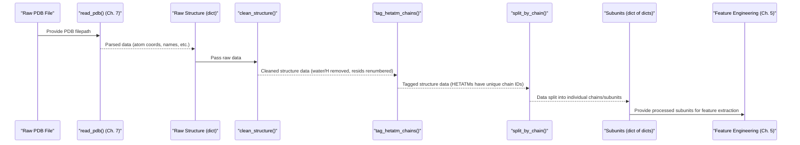

# Chapter 6: Structure Preprocessing

Welcome to Chapter 6! In [Chapter 5: Feature Engineering & Encoding](05_feature_engineering___encoding_.md), we learned how PeSTo converts information from a protein structure into numerical features that our AI model can understand. But before we can even start extracting those features, the "raw blueprint" – the protein structure file (often a PDB file) – needs some serious tidying up.

Imagine you're given a very old, messy, hand-drawn architectural blueprint. It might have coffee stains, scribbled notes, parts that are smudged, and sections that aren't clearly labeled. Before you can take precise measurements (our "features"), you'd need to:
*   Erase the coffee stains (remove unwanted molecules like water).
*   Clarify smudged lines (handle ambiguous atom positions).
*   Make sure all room numbers are sequential and clear (renumber residues consistently).
*   Separate different buildings or floors if they are on the same sheet (prepare individual protein chains).

This "tidying up" process for protein structures is what **Structure Preprocessing** is all about. It ensures our data is clean, standardized, and well-organized before we move on to more complex analyses.

## Why Do We Need to Preprocess Structures?

Raw protein structure files, like those from the Protein Data Bank (PDB), can be quite messy for a computer program to handle directly:

*   **Extra Stuff**: They often include many water molecules that were present during the experiment but aren't part of the protein itself. They also list all hydrogen atoms, which we might want to ignore for certain types of analysis.
*   **Ambiguity**: Sometimes, an atom might be found in slightly different positions in the crystal structure. These are called "alternate locations." We usually need to pick just one position.
*   **Inconsistent Labeling**: Amino acid residues (the building blocks of proteins) might have non-sequential numbers, or the numbering might restart for different chains. This can be confusing for algorithms.
*   **Complex Assemblies**: A PDB file might describe a large complex with multiple protein chains, ligands (small molecules bound to the protein), and ions. We often need to separate these into individual components or "subunits" for analysis.

Structure preprocessing tackles these issues, making the data much easier to work with.

## PeSTo's Cleaning Crew: Functions in `src/structure.py`

PeSTo provides a set of tools, primarily located in the `src/structure.py` file, to perform these cleaning and standardization tasks. The most important functions we'll look at are:

*   `clean_structure()`: Handles the initial cleanup like removing water and hydrogens, and renumbering residues.
*   `tag_hetatm_chains()`: Deals with non-protein molecules (HETATMs like ligands or ions), often assigning them unique chain identifiers.
*   `split_by_chain()`: Separates a structure into its individual chains or subunits.

Let's see how these are used.

## The Preprocessing Pipeline in Action

Typically, when PeSTo processes a raw PDB file (we'll see how PDB files are read in [Chapter 7: Protein Structure Representation & IO](07_protein_structure_representation___io_.md)), it passes the data through a series of these preprocessing steps. This happens within the `processing/build_dataset.py` script we discussed in [Chapter 4: Processed Dataset Construction (HDF5)](04_processed_dataset_construction__hdf5_.md).

Here's a simplified view of the flow:

```python
# Simplified from processing/build_dataset.py
# 'raw_structure' is a dictionary loaded from a PDB file

# 1. Basic cleaning: remove water, hydrogens, renumber residues
#    (This function is from src/structure.py)
cleaned_structure = clean_structure(raw_structure)

# 2. Handle HETATM chains: give unique IDs to ligands/ions
#    (This function is also from src/structure.py)
tagged_structure = tag_hetatm_chains(cleaned_structure)

# 3. Split into individual chains/subunits
#    (Also from src/structure.py)
subunits = split_by_chain(tagged_structure)

# 'subunits' is now a dictionary. Each item is a cleaned, individual 
# chain/molecule, ready for feature engineering (Chapter 5).
# e.g., subunits['A'] would be chain A's data.
```
This `subunits` dictionary, containing neatly processed individual components, is then what gets passed to the feature engineering functions we saw in [Chapter 5: Feature Engineering & Encoding](05_feature_engineering___encoding_.md).

There are also other optional filtering steps like `filter_non_atomic_subunits` (to remove things that are just single, isolated atoms that aren't part of a larger molecule) and `remove_duplicate_tagged_subunits` (to clean up if `tag_hetatm_chains` creates multiple entries for nearly identical small molecules).

## Under the Hood: A Closer Look at the Cleaning Functions

Let's explore what some of these key functions do internally.

### 1. `clean_structure`: The First Pass Cleanup

This function is like the first round of decluttering your blueprint.

*   **Removing Unwanted Atoms**:
    *   It looks for atoms belonging to water molecules (residue name "HOH" or "DOD").
    *   It looks for hydrogen ("H") or deuterium ("D") atoms.
    *   By default (if `rm_wat=True`), it removes these atoms. If you choose to keep water (`rm_wat=False`), it instead assigns a special residue ID (like -999) to water molecules so they can be treated differently later.
    *   This is done by creating a "mask" – a list of True/False values indicating which atoms to keep – and then applying this mask to all data fields (coordinates, atom names, etc.).

    ```python
    # Simplified part of clean_structure from src/structure.py
    def clean_structure(structure, rm_wat=True):
        # Identify water molecules
        m_wat = (structure["resname"] == "HOH") 
        # Identify Hydrogen and Deuterium atoms
        m_h = (structure["element"] == "H")
        m_d = (structure["element"] == "D")
        # ... (m_hwat for heavy water) ...

        if rm_wat:
            # Mask to keep atoms that are NOT water, H, or D
            keep_mask = ((~m_wat) & (~m_h) & (~m_d) & ...)
        else:
            # Keep water, but mark its residues
            structure["resid"][m_wat] = -999 
            keep_mask = ((~m_h) & (~m_d) & ...) # Just remove H, D

        # Apply the mask: keep only selected atoms for all data fields
        cleaned_structure = {
            key: data_array[keep_mask] 
            for key, data_array in structure.items()
        }
        # ... (residue renumbering follows) ...
        return cleaned_structure
    ```
    This step ensures we focus on the main biomolecules.

*   **Consistent Residue Renumbering**:
    *   PDB files might have residue numbers like 1, 2, 5, 6 (a gap) or 1A, 1B (insertion codes).
    *   `clean_structure` renumbers all residues sequentially within each chain (e.g., 1, 2, 3,...).
    *   It determines a "new residue" boundary whenever the chain ID changes, the original residue number changes, or an insertion code (`icode`) appears.

    ```python
    # Simplified residue renumbering logic in clean_structure
    # (operates on the 'cleaned_structure' from above)
    
    # Get arrays for chain names, original residue numbers, and insertion codes
    chain_names = cleaned_structure["chain_name"]
    original_res_ids = cleaned_structure["resid"]
    insertion_codes = cleaned_structure["icode"] # e.g., 'A', 'B', or empty

    # Calculate where these properties change from one atom to the next
    # np.diff(arr) gives differences between consecutive elements
    # np.sign(...) gives -1, 0, or 1. np.abs(...) makes it 0 or 1.
    # A '1' means a change occurred.
    # We add a [0] at the beginning because diff reduces array length by 1.
    new_chain_starts = np.abs(np.sign(np.concatenate(
        [[0], np.diff(np.unique(chain_names, return_inverse=True)[1])])
    ))
    new_resid_starts = np.abs(np.sign(np.concatenate(
        [[0], np.diff(original_res_ids)])
    ))
    new_icode_starts = np.abs(np.sign(np.concatenate(
        [[0], np.diff(np.unique(insertion_codes, return_inverse=True)[1])])
    ))
    
    # If any of these change, it's effectively a new residue boundary
    is_new_residue_boundary = new_chain_starts + new_resid_starts + new_icode_starts
    
    # Cumulatively sum these '1's (boundaries) to get new sequential IDs
    # np.sign ensures multiple changes at once still count as one boundary
    sequential_res_ids = np.cumsum(np.sign(is_new_residue_boundary)) + 1
    cleaned_structure['resid'] = sequential_res_ids
    
    # Original insertion codes are no longer needed after renumbering
    cleaned_structure.pop("icode") 
    return cleaned_structure
    ```
    This step makes sure residue IDs are simple and predictable.

### 2. `tag_hetatm_chains`: Giving Ligands Their Own Identity

HETATMs are "hetero atoms" – things that aren't standard amino acids or nucleic acids, like ligands, ions, or cofactors. They might share a chain ID with a protein or have none. This function helps give them clearer identities.

*   **How it works**:
    *   It finds all atoms marked as HETATMs (where `structure['het_flag'] == "H"`).
    *   It looks at the (now renumbered) `resid` for these HETATMs.
    *   It then creates a new, more specific chain ID for these HETATMs. Typically, it takes the HETATM's original chain ID and appends a unique number based on changes in its residue ID. For example, if a ligand on chain 'A' spans multiple original residues (or there are multiple distinct ligands on chain 'A'), they might get tagged as `A:0`, `A:1`, etc.

    ```python
    # Simplified from src/structure.py - tag_hetatm_chains
    def tag_hetatm_chains(structure):
        is_hetatm_mask = (structure['het_flag'] == "H")
        if not np.any(is_hetatm_mask): # No HETATMs to tag
            return structure

        hetatm_original_cids = structure['chain_name'][is_hetatm_mask]
        hetatm_resids = structure['resid'][is_hetatm_mask]

        # Find where HETATM residue IDs change to group them
        # This gives an index like 0,0,0,1,1,2,2,2 for consecutive HETATMs
        hetatm_group_indices = np.cumsum(np.abs(np.sign(
            np.concatenate([[0], np.diff(hetatm_resids)])
        )))

        # Create new chain IDs: e.g., "A" + ":" + "0" -> "A:0"
        new_hetatm_cids = [
            f"{orig_cid}:{group_idx}" for orig_cid, group_idx
            in zip(hetatm_original_cids, hetatm_group_indices)
        ]

        # Update the chain_name array in the structure
        all_chain_names = structure['chain_name'].copy().astype('<U10') # Ensure string type and size
        all_chain_names[is_hetatm_mask] = new_hetatm_cids
        structure['chain_name'] = np.array(list(all_chain_names)).astype(str)
        return structure
    ```
    This helps separate ligands and other HETATMs into their own logical units for easier analysis later.

### 3. `split_by_chain`: Separating the Team Members

After all the cleaning and tagging, a structure might still contain multiple distinct molecular chains (e.g., different protein subunits, or a protein and its tagged ligand). `split_by_chain` divides the structure into a collection of these individual chains.

*   **How it works**:
    *   It finds all the unique chain names present in `structure['chain_name']` (which now includes the tagged HETATM chains).
    *   For each unique chain name, it creates a new, smaller `structure` dictionary containing only the atoms belonging to that chain.
    *   The result is a dictionary where keys are chain IDs (e.g., "A", "B", "A:0") and values are the corresponding structure data.

    ```python
    # Simplified from src/structure.py - split_by_chain
    def split_by_chain(structure):
        subunits_dict = {}
        all_chain_names_in_structure = structure["chain_name"]
        unique_chain_ids = np.unique(all_chain_names_in_structure)

        for chain_id in unique_chain_ids:
            # Create a mask to select atoms belonging to this chain_id
            is_this_chain_mask = (all_chain_names_in_structure == chain_id)
            
            # Create a new dictionary for this chain's data
            chain_data = {}
            for key, full_array in structure.items():
                if key == "chain_name": # Don't need 'chain_name' inside individual chain
                    continue
                chain_data[key] = full_array[is_this_chain_mask]
            
            subunits_dict[chain_id] = chain_data
        return subunits_dict
    ```
    This step is crucial because PeSTo often analyzes interactions *between* different chains, or processes individual chains for feature extraction.

## The Overall Preprocessing Workflow

Let's visualize how a raw PDB file goes through these preprocessing stages before features are extracted:



This pipeline ensures that the data fed into the [Feature Engineering & Encoding](05_feature_engineering___encoding_.md) stage is standardized and organized, making the subsequent steps more reliable and efficient.

## Conclusion

Structure preprocessing is a vital first step in working with protein structures in PeSTo. It's like meticulously preparing your ingredients before cooking a complex meal. You've learned that:

*   Raw PDB files often need **cleaning and standardization**.
*   PeSTo uses functions in `src/structure.py` to:
    *   **Remove unwanted molecules** like water and (optionally) hydrogens using `clean_structure`.
    *   **Renumber residues consistently** also within `clean_structure`.
    *   **Assign unique chain identifiers to HETATMs** (ligands, ions) using `tag_hetatm_chains`.
    *   **Separate the structure into individual chains/subunits** using `split_by_chain`.
*   This preprocessing ensures that the data is well-organized and standardized, ready for the creation of numerical features.

But how does PeSTo actually read the initial data from a PDB file to create that first `raw_structure` dictionary? That's what we'll explore in the next chapter: [Chapter 7: Protein Structure Representation & IO](07_protein_structure_representation___io_.md).

---

Generated by [AI Codebase Knowledge Builder](https://github.com/The-Pocket/Tutorial-Codebase-Knowledge)