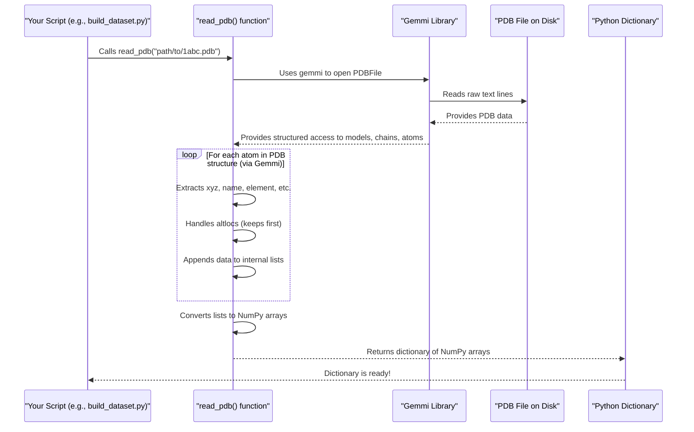

# Chapter 7: Protein Structure Representation & IO

Welcome to the final chapter in our core PeSTo tutorial series! In [Chapter 6: Structure Preprocessing](06_structure_preprocessing_.md), we saw how PeSTo takes a "raw" in-memory representation of a protein structure and cleans it up, preparing it for feature extraction. But how does that initial "raw" representation get created? How does PeSTo take a standard protein structure file, like a PDB file, and load it into the computer's memory so the program can start working with it?

That's exactly what this chapter, **Protein Structure Representation & IO (Input/Output)**, is all about. Think of it like having a physical blueprint of a protein. Before you can do anything with it digitally (like clean it up or measure parts), you first need to scan it and get it into your computer in a structured format. This chapter explains PeSTo's "digital scanner and parser."

## What's the Big Deal? From File to Usable Data

Proteins are complex 3D molecules. Scientists determine their structures and store this information in standard file formats, most famously the **PDB (Protein Data Bank) format**. A PDB file is essentially a text file that lists all the atoms in a protein, their 3D coordinates (x, y, z positions), what elements they are, which amino acid residue they belong to, which chain they are part of, and more.

Imagine a PDB file is like a very long, detailed list of all the tiny parts needed to build a super complex LEGO model, along with where each part goes.

```
# Simplified PDB file lines:
# ATOM      1  N   MET A   1      23.400  12.100   5.600 ...
# ATOM      2  CA  MET A   1      24.100  11.800   6.300 ...
# (Record type, Atom#, Atom Name, Residue Name, Chain, Residue#, X, Y, Z coords)
```

While this file is human-readable (sort of!), a computer program needs this information in a more organized, in-memory data structure to efficiently work with it. PeSTo's goal here is to:
1.  Read a PDB file.
2.  Extract all the essential atomic details.
3.  Store these details in a structured Python dictionary.

This dictionary then becomes the starting point for all subsequent processing steps, like the [Structure Preprocessing](06_structure_preprocessing_.md) we've already discussed.

## The In-Memory Blueprint: A Python Dictionary

PeSTo transforms the information from a PDB file into a Python dictionary. This dictionary acts as PeSTo's internal, digital representation of the protein structure. Each key in the dictionary typically corresponds to a specific piece of atomic information, and its value is usually a NumPy array holding that information for all atoms in the structure.

Here are the main "fields" or keys you'll find in this dictionary:

*   `'xyz'`: A NumPy array where each row contains the (x, y, z) coordinates of an atom. Shape: `(N_atoms, 3)`.
*   `'name'`: A NumPy array of atom names (e.g., 'CA' for alpha-carbon, 'OXT' for C-terminal oxygen). Shape: `(N_atoms,)`.
*   `'element'`: A NumPy array of element symbols for each atom (e.g., 'C', 'N', 'O', 'S'). Shape: `(N_atoms,)`.
*   `'resname'`: A NumPy array of residue names (e.g., 'ALA' for Alanine, 'HIS' for Histidine, 'HOH' for water). Shape: `(N_atoms,)`.
*   `'resid'`: A NumPy array of residue sequence numbers (integers indicating the position of the residue in its chain). Shape: `(N_atoms,)`.
*   `'het_flag'`: A NumPy array indicating if an atom belongs to a standard amino acid/nucleic acid ('A' for ATOM) or a "hetero" group like a ligand or ion ('H' for HETATM). Shape: `(N_atoms,)`.
*   `'chain_name'`: A NumPy array of chain identifiers (e.g., 'A', 'B'). PeSTo's reader often appends the PDB model number to this (e.g., 'A:0' for chain A from model 0). Shape: `(N_atoms,)`.
*   `'icode'`: A NumPy array for insertion codes (e.g., 'A', 'B', often empty). These are used in PDB files to handle insertions in sequence numbering. Shape: `(N_atoms,)`.

Think of this dictionary as a neatly organized digital spreadsheet, where each column represents a property (like element type) and each row corresponds to an atom.

## The Parser: `read_pdb()` from `src/structure_io.py`

The main tool PeSTo uses for this "scanning and parsing" job is the `read_pdb()` function, located in the `src/structure_io.py` file.

Here's how you might use it:

```python
# Assuming you have a PDB file named "1abc.pdb" in a "data" folder
from src.structure_io import read_pdb # Import the function

pdb_filepath = "data/1abc.pdb"
raw_structure_dictionary = read_pdb(pdb_filepath)

# Now, raw_structure_dictionary holds all the atomic info!
# For example, to get the coordinates of the first atom:
# first_atom_xyz = raw_structure_dictionary['xyz'][0]
# print(f"Coordinates of the first atom: {first_atom_xyz}")

# To see how many atoms were read:
# num_atoms = len(raw_structure_dictionary['xyz'])
# print(f"Read {num_atoms} atoms from the file.")
```
*   **Input**: The `read_pdb()` function takes one main argument: the file path to your PDB file (e.g., `"data/1abc.pdb"`).
*   **Output**: It returns the Python dictionary we described, filled with NumPy arrays of atomic data.

This `raw_structure_dictionary` is precisely the kind of input that the `clean_structure()` function (from [Chapter 6: Structure Preprocessing](06_structure_preprocessing_.md)) expects.

## Under the Hood: How `read_pdb()` Works Its Magic

Parsing PDB files can be tricky due to their specific format and potential quirks. PeSTo doesn't do this entirely from scratch; it gets help from a specialized library.

### The Expert Librarian: `gemmi`

PeSTo uses a powerful external Python library called **`gemmi`**. Think of `gemmi` as an expert librarian who specializes in reading and understanding various crystallographic and structural biology file formats, including PDB files. `gemmi` handles the low-level details of interpreting the text in a PDB file.

### The Step-by-Step Parsing Process

Here's a simplified walkthrough of what `read_pdb()` does internally, using `gemmi`:

1.  **Open and Read**: `gemmi` opens the PDB file specified by `pdb_filepath`.
2.  **Iterate Through Structure**: `gemmi` allows PeSTo to systematically go through the PDB structure:
    *   First, by "models" (PDB files can contain multiple models, especially for NMR structures).
    *   Then, within each model, by "chains" (e.g., protein chain A, chain B).
    *   Then, within each chain, by "residues" (e.g., Alanine, Glycine).
    *   Finally, within each residue, by individual "atoms."
3.  **Extract Atom Details**: For every atom found, `read_pdb()` extracts the necessary information:
    *   3D coordinates (`x`, `y`, `z`)
    *   Atom name (e.g., "CA", "N")
    *   Element type (e.g., "C", "N")
    *   Residue name (e.g., "ALA")
    *   Residue sequence number
    *   Chain name (to which PeSTo appends the model ID, like "A:0")
    *   Whether it's a standard atom ("ATOM") or a "hetero" atom ("HETATM")
    *   Any insertion code ("icode")
4.  **Handle Alternate Locations (Altlocs)**: Sometimes, an atom in a crystal structure might exist in more than one slightly different position. These are called "alternate locations." `read_pdb()` typically keeps only the *first* alternate location it encounters for any given atom and ignores the others to ensure a single position per atom.
5.  **Collect Data in Lists**: As it extracts data for each atom, `read_pdb()` appends these values to temporary Python lists (e.g., a list for all x-coordinates, a list for all atom names, etc.).
6.  **Convert to NumPy Arrays**: Once all atoms have been processed, these lists are converted into efficient NumPy arrays.
7.  **Pack into Dictionary**: Finally, these NumPy arrays are put into the output dictionary, with the standard keys (`'xyz'`, `'name'`, etc.).

### Visualizing the Process

Here's a simplified sequence diagram:



### A Peek at the Code (`src/structure_io.py`)

Let's look at a simplified and broken-down version of the `read_pdb` function to see these steps in action.

**1. Setup and Initialization:**
```python
import gemmi      # The PDB parsing library
import numpy as np # For numerical arrays

def read_pdb(pdb_filepath):
    doc = gemmi.read_pdb(pdb_filepath) # Gemmi reads the file

    # Prepare empty lists to store data for each atom
    atom_xyz, atom_name, atom_element = [], [], []
    residue_name, seq_id, het_flag = [], [], []
    chain_name, icodes, altloc_memory = [], [], []
    # ...
```
This part imports necessary libraries, defines the function, and uses `gemmi` to load the PDB file into a `doc` object. Empty lists are created to collect atomic properties.

**2. Iterating Through Atoms and Extracting Data:**
```python
    # (Continuing read_pdb function)
    for model_id, model in enumerate(doc):      # Loop through models
        for atom_obj in model.all():            # Loop through all atoms in model
            
            # Handle alternate locations: keep only the first one seen
            if atom_obj.atom.has_altloc():
                # Create a unique key for the atom (chain_resnum_atomname)
                key = f"{atom_obj.chain.name}_{atom_obj.residue.seqid.num}_{atom_obj.atom.name}"
                if key in altloc_memory:
                    continue # Skip if we've already stored this atom's altloc
                else:
                    altloc_memory.append(key)

            # Extract and store data for the current atom
            pos = atom_obj.atom.pos
            atom_xyz.append([pos.x, pos.y, pos.z])
            atom_name.append(atom_obj.atom.name)
            atom_element.append(atom_obj.atom.element.name)
            # ... and so on for residue_name, seq_id, het_flag ...
            chain_name.append(f"{atom_obj.chain.name}:{model_id}") # Chain + Model ID
            icodes.append(atom_obj.residue.seqid.icode.strip())
    # ...
```
This is the core loop. It iterates over each atom (`atom_obj`) provided by `gemmi`. It includes logic to handle alternate locations (`has_altloc`) by only processing the first encountered form of an atom. For each atom, it appends its properties to the respective lists. Note how `chain_name` includes the `model_id`.

**3. Packing Data into the Final Dictionary:**
```python
    # (Continuing read_pdb function)
    # Convert lists to NumPy arrays and create the dictionary
    structure_data = {
        'xyz': np.array(atom_xyz, dtype=np.float32),
        'name': np.array(atom_name),
        'element': np.array(atom_element),
        'resname': np.array(residue_name),
        'resid': np.array(seq_id, dtype=np.int32),
        'het_flag': np.array(het_flag),
        'chain_name': np.array(chain_name),
        'icode': np.array(icodes),
    }
    return structure_data
```
Finally, all the collected lists are converted into NumPy arrays and packed into the dictionary, which is then returned.

## The Output Dictionary: A Quick Recap

So, after calling `raw_structure_dict = read_pdb("1abc.pdb")`, you get a dictionary like this (conceptual view):

```python
# raw_structure_dict = {
#   'xyz': np.array([[23.4, 12.1, 5.6], [24.1, 11.8, 6.3], ...]), # N_atoms x 3 floats
#   'name': np.array(['N', 'CA', 'C', ...]),                     # N_atoms strings
#   'element': np.array(['N', 'C', 'C', ...]),                  # N_atoms strings
#   'resname': np.array(['MET', 'MET', 'GLY', ...]),            # N_atoms strings
#   'resid': np.array([1, 1, 2, ...], dtype=int32),             # N_atoms integers
#   'het_flag': np.array(['A', 'A', 'H', ...]),                 # N_atoms chars ('A' or 'H')
#   'chain_name': np.array(['A:0', 'A:0', 'B:0', ...]),         # N_atoms strings
#   'icode': np.array(['', '', 'A', ...])                        # N_atoms strings
# }
```
This structured dictionary is the fundamental way PeSTo initially represents protein data in memory, ready for the next steps in the pipeline.

## Conclusion

You've now reached the end of our PeSTo tutorial series and learned about the very first step in PeSTo's data processing pipeline: **Protein Structure Representation & IO**.

*   You understand that PeSTo needs to read raw protein structure data (typically from PDB files) into the computer's memory.
*   The `read_pdb()` function in `src/structure_io.py` is PeSTo's tool for this, using the `gemmi` library.
*   It parses the PDB file atom by atom, extracts key information (coordinates, atom/residue names, chain info, etc.), and handles details like alternate locations.
*   The result is a standardized Python dictionary where keys map to NumPy arrays of atomic data. This dictionary is the "raw material" that then flows into [Structure Preprocessing (Chapter 6)](06_structure_preprocessing_.md), followed by [Feature Engineering & Encoding (Chapter 5)](05_feature_engineering___encoding_.md), and eventually the construction of the [Processed Dataset Construction (HDF5) (Chapter 4)](04_processed_dataset_construction__hdf5__.md) that feeds the [PeSTo Neural Network Model (Chapter 3)](03_pesto_neural_network_model_.md).

With this chapter, we've completed our journey from configuring a model and orchestrating its training all the way down to how the very first pieces of structural data are read and prepared. You now have a comprehensive overview of the key components and the data flow within the PeSTo project! We hope this tutorial helps you in your work with PeSTo.

---

Generated by [AI Codebase Knowledge Builder](https://github.com/The-Pocket/Tutorial-Codebase-Knowledge)