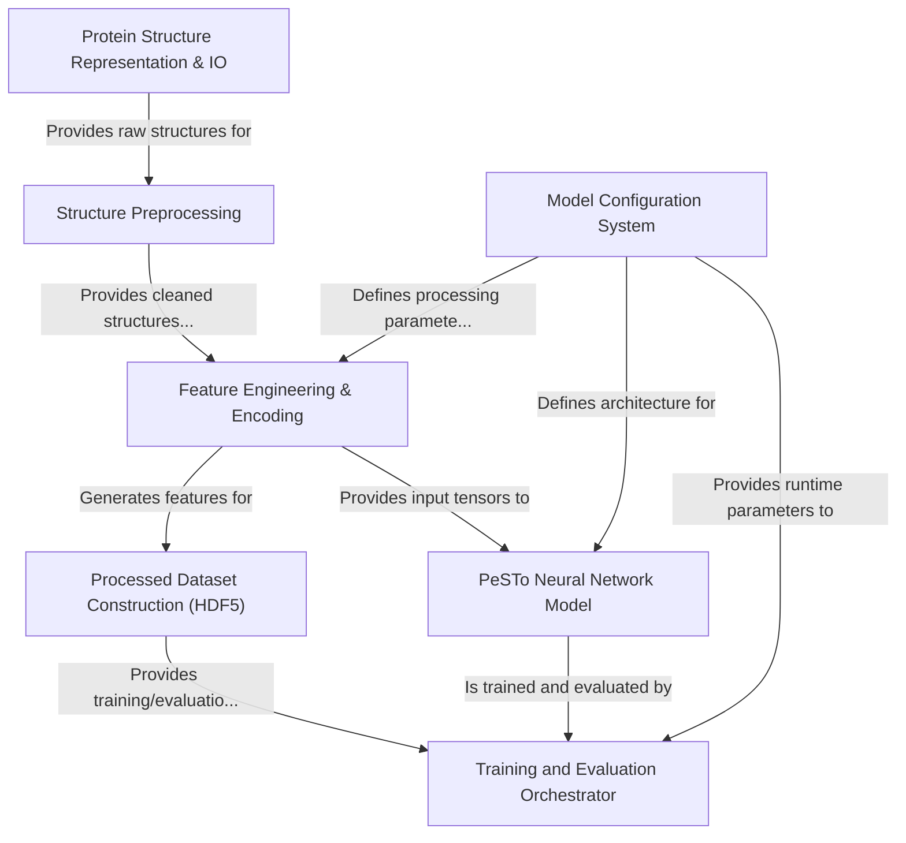

# Tutorial: PeSTo

PeSTo is a project for **predicting protein interaction interfaces** using a *deep learning approach*.
It processes 3D protein structures from PDB files, cleans them, and then converts them into *numerical features* suitable for machine learning.
These features are stored in an HDF5 dataset. A **configurable PyTorch neural network** is trained on this dataset to identify patterns indicative of protein binding sites.
The system includes tools for managing model configurations, and an orchestrator handles the training and evaluation workflow.

**Source Repository:** [https://github.com/LBM-EPFL/PeSTo.git](https://github.com/LBM-EPFL/PeSTo.git)

## Chapters

1. [Model Configuration System
](01_model_configuration_system_.md)
2. [Training and Evaluation Orchestrator
](02_training_and_evaluation_orchestrator_.md)
3. [PeSTo Neural Network Model
](03_pesto_neural_network_model_.md)
4. [Processed Dataset Construction (HDF5)
](04_processed_dataset_construction__hdf5__.md)
5. [Feature Engineering & Encoding
](05_feature_engineering___encoding_.md)
6. [Structure Preprocessing
](06_structure_preprocessing_.md)
7. [Protein Structure Representation & IO
](07_protein_structure_representation___io_.md)

---

Generated by [AI Codebase Knowledge Builder](https://github.com/The-Pocket/Tutorial-Codebase-Knowledge)