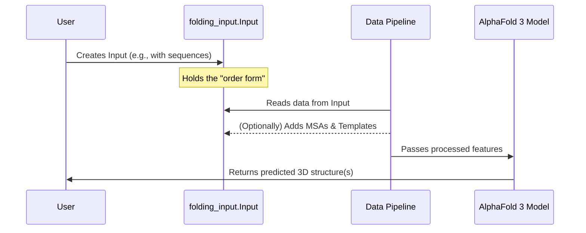

# Chapter 1: Folding Input (`folding_input.Input`)

Welcome to the AlphaFold 3 tutorial! If you've ever wondered how scientists can predict the 3D shapes of complex molecules like proteins, DNA, and RNA, you're in the right place. AlphaFold 3 is a cutting-edge AI model that does just that.

In this first chapter, we'll explore the very first step in using AlphaFold 3: telling it *what* you want to predict. This is done using something called the **Folding Input**, or more specifically, the `folding_input.Input` object in the code.

## What's the Big Deal About `folding_input.Input`?

Imagine you're ordering a custom-built model car. You can't just say "build me a car." You need to provide details: Is it a sports car or a truck? What color should it be? Does it have a spoiler?

Similarly, AlphaFold 3 needs a detailed "order form" to know what molecular structure you want it to predict. The `folding_input.Input` object is exactly that: **your request to the AlphaFold 3 model**.

You use it to specify:
*   All the molecules involved (proteins, DNA, RNA, small molecules called ligands).
*   Their sequences (e.g., the string of amino acids for a protein).
*   Any other information you might already have, like known related sequences (Multiple Sequence Alignments or MSAs) or similar known structures (templates).

AlphaFold 3 takes this "order form" and uses its powerful AI to generate a 3D structure.

## A Simple Example: Predicting a Single Protein

Let's say you want to predict the structure of a small protein. The most basic piece of information you need is its amino acid sequence. Here's how you might prepare your `folding_input.Input` using Python:

```python
# First, we need to import the necessary tools from alphafold3
from alphafold3.common import folding_input

# Let's define a simple, made-up protein sequence
my_protein_sequence = "MAGAASPCPSPLPFLCLFLWLTLSAGSGALAVLPPTRA"

# Next, we create a "ProteinChain" object.
# Think of a chain as one continuous part of your molecular complex.
protein_chain_A = folding_input.ProteinChain(
    id="A",  # A unique name or letter for this chain, like 'A' or 'ProteinX'
    sequence=my_protein_sequence
)

# Now, we create the main Folding Input "order form"
my_prediction_request = folding_input.Input(
    name="my_first_protein_prediction", # Give your prediction job a name
    chains=[protein_chain_A],          # A list of all the chains involved
    rng_seeds=[42]                     # A number to help make predictions reproducible
)

# Let's see what we've created
print(f"Prediction Job Name: {my_prediction_request.name}")
print(f"Number of chains: {len(my_prediction_request.chains)}")
print(f"Sequence of chain '{my_prediction_request.chains[0].id}': {my_prediction_request.chains[0].sequence}")
```

When you run this code, it doesn't predict a structure yet. It just prepares the "order form." The output would be:

```
Prediction Job Name: my_first_protein_prediction
Number of chains: 1
Sequence of chain 'A': MAGAASPCPSPLPFLCLFLWLTLSAGSGALAVLPPTRA
```

This `my_prediction_request` object is what you'd then pass on to the next stages of AlphaFold 3.

## What's Inside the "Order Form"? Key Components

The `folding_input.Input` object is more than just a sequence. It's a container for all the information AlphaFold 3 might need. Let's break down its main parts:

*   **`name` (str)**: A descriptive name for your prediction job (e.g., "my_protein_prediction").
*   **`chains` (list)**: This is a list of all the individual molecular components you want to model. Each item in the list is a specific type of chain object:
    *   `ProteinChain`: Represents a protein, defined by its amino acid sequence.
    *   `RnaChain`: Represents an RNA molecule, defined by its nucleotide sequence (A, U, C, G).
    *   `DnaChain`: Represents a DNA molecule, defined by its nucleotide sequence (A, T, C, G).
    *   `Ligand`: Represents a small molecule (not a polymer like protein or DNA). For example, a drug molecule binding to a protein. How these ligands are precisely defined will be covered in the [Chemical Component Dictionary (CCD) Handling (`chemical_components.Ccd`)](02_chemical_component_dictionary__ccd__handling___chemical_components_ccd___.md) chapter.
    *   And others for modified residues, etc.

*   **`rng_seeds` (list of int)**: These are random number generator seeds. AlphaFold 3 has some random elements in its process. Using a specific seed helps make the prediction reproducible. You can provide multiple seeds if you want AlphaFold 3 to try slightly different starting points, potentially giving you a few different structural predictions to consider.

### Optional, But Powerful Additions:

While sequences are fundamental, you can also provide more information in your `folding_input.Input` if you have it:

*   **MSAs (Multiple Sequence Alignments)**: For proteins and RNA, you can provide MSAs. An MSA is a collection of sequences from different organisms that are similar to your target sequence. This evolutionary information helps AlphaFold 3 understand which parts of the sequence are important and conserved. We'll dive deeper into this in the [MSA Representation (`msa.Msa`)](04_msa_representation___msa_msa___.md) chapter.
    *   For `ProteinChain`, these are `unpaired_msa` and `paired_msa`.
    *   For `RnaChain`, this is `unpaired_msa`.

*   **Templates**: If you know of any experimentally determined 3D structures that are similar to your target molecule(s), you can provide them as templates. AlphaFold 3 can use these as a starting hint. Learn more in the [Template Representation (`templates.Templates`)](05_template_representation___templates_templates___.md) chapter.
    *   For `ProteinChain`, this is the `templates` attribute.

If you don't provide MSAs or templates, AlphaFold 3's [Data Pipeline (`WholePdbPipeline`)](03_data_pipeline___wholepdbpipeline___.md) (which we'll cover soon!) will try to find them for you by searching through large biological databases.

## How is `folding_input.Input` Used?

Once you've created your `folding_input.Input` object, it becomes the starting point for the AlphaFold 3 machinery. Typically, it's first passed to the **Data Pipeline**. This pipeline processes your input, searches for MSAs and templates (if you didn't provide them), and prepares all the features the core AlphaFold 3 model needs.

Here's a simplified view of how it fits in:



This diagram shows that `folding_input.Input` is a crucial data carrier at the beginning of the process.

## Under the Hood: A Peek at the Structure

The `folding_input.Input` and its associated chain objects (like `ProteinChain`, `RnaChain`) are typically implemented as Python `dataclasses`. Dataclasses are a convenient way to create classes that are primarily used to store data.

You don't need to know the exact code, but here's a conceptual idea of what it might look like (simplified):

```python
# This is a conceptual, simplified representation.
# Actual class definitions are in alphafold3/common/folding_input.py

# @dataclass  # Python's way to easily make a data-holding class
# class ProteinChain:
#     id: str
#     sequence: str
#     unpaired_msa: str | None = None  # Optional: path to or content of MSA file
#     paired_msa: str | None = None    # Optional: path to or content of paired MSA file
#     templates: list[Template] | None = None # Optional: list of template objects

# @dataclass
# class RnaChain:
#     id: str
#     sequence: str
#     # ... other RNA specific fields

# @dataclass
# class Ligand:
#     id: str
#     smiles: str # A string representation of the ligand's chemical structure
#     # ... other ligand specific fields

# @dataclass
# class Input:
#     name: str
#     chains: list[ProteinChain | RnaChain | DnaChain | Ligand] # Can hold a mix of chain types
#     rng_seeds: list[int]
#     # Potentially other fields like interchain_affinities for interactions, etc.
#     # Fields for user_ccd (Custom Chemical Component Dictionary)
#     # Fields for symmetry, etc.
```

The key takeaway is that `folding_input.Input` is a structured way to hold all the necessary information for AlphaFold 3 to understand your prediction request. It's designed to be flexible enough to handle simple single-chain predictions or complex multi-molecule assemblies.

## Conclusion

You've now learned about the `folding_input.Input` object – the essential "order form" you use to tell AlphaFold 3 what molecular structure you want to predict. It holds information about the molecules (proteins, DNA, RNA, ligands), their sequences, and optionally, any MSAs or templates you might have.

This `Input` object is the very first step in the journey of predicting a 3D structure.

In the next chapter, we'll delve into something that's particularly important when dealing with ligands or non-standard parts of proteins/RNA: the [Chemical Component Dictionary (CCD) Handling (`chemical_components.Ccd`)](02_chemical_component_dictionary__ccd__handling___chemical_components_ccd___.md). This dictionary helps AlphaFold 3 understand the chemical properties of all the building blocks it might encounter.

---

Generated by [AI Codebase Knowledge Builder](https://github.com/The-Pocket/Tutorial-Codebase-Knowledge)