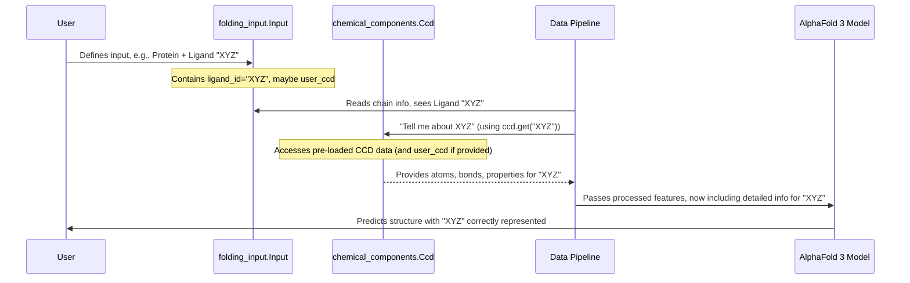

# Chapter 2: Chemical Component Dictionary (CCD) Handling (`chemical_components.Ccd`)

In [Chapter 1: Folding Input (`folding_input.Input`)](01_folding_input___folding_input_input___.md), we learned how to tell AlphaFold 3 *what* molecular structure we want to predict. We saw that this "order form" can include not just standard proteins, DNA, or RNA, but also other small molecules called ligands.

But how does AlphaFold 3 know what a "ligand" actually *is*? If you tell it to model a protein interacting with, say, a glucose molecule, how does it understand the shape, atoms, and bonds of glucose? That's where the Chemical Component Dictionary (CCD) comes in.

## What's the Big Deal with the CCD?

Imagine you're building a complex LEGO model that includes not just standard bricks (like amino acids or nucleotides) but also some very specific, unique pieces (like a tiny steering wheel or a custom-shaped window). You'd need a special parts list that describes these unique pieces in detail: how many studs they have, their exact shape, what they're made of.

The Chemical Component Dictionary (CCD) is exactly that for AlphaFold 3. It's like a detailed **encyclopedia or "chemical cookbook"** for all the non-standard molecules AlphaFold 3 might encounter. These include:
*   **Ligands**: Small molecules that bind to proteins or nucleic acids (e.g., drugs, vitamins, metal ions).
*   **Modified residues**: Amino acids or nucleotides that have been chemically altered.
*   **Cofactors**: Molecules that help proteins do their job.

For each of these "special parts," the CCD provides crucial information:
*   What atoms it contains (e.g., Carbon, Oxygen, Nitrogen).
*   How these atoms are connected (the bonds).
*   Other chemical properties (like its formula or name).

Without this detailed information, AlphaFold 3 wouldn't be able to accurately represent these molecules or predict how they fit into the larger structure.

The `chemical_components.Ccd` class in AlphaFold 3 is our way to access and use this encyclopedia.

## The `chemical_components.Ccd` Class: Your Chemistry Encyclopedia

The `chemical_components.Ccd` class acts as an interface to the vast amount of data stored in the CCD. When AlphaFold 3 needs to understand a specific small molecule (identified by a unique code, like "GLC" for glucose or "HEM" for heme), it consults this `Ccd` object.

Think of `chemical_components.Ccd` as the librarian who can quickly fetch the right page from the chemical encyclopedia.

### A Simple Example: Looking Up Glucose

Let's see how you can use this class to get information about a common molecule like glucose (chemical ID: "GLC").

```python
# Import the necessary tools
from alphafold3.constants import chemical_components

# Load the default Chemical Component Dictionary.
# This is usually done once.
ccd_data_manager = chemical_components.cached_ccd()

# Let's try to find the entry for Glucose ("GLC")
glucose_id = "GLC"
glucose_entry = ccd_data_manager.get(glucose_id)

if glucose_entry:
    print(f"Successfully found the entry for {glucose_id}!")
    # Each entry is a dictionary-like object containing many details.
    # Let's get its official name and formula.
    # Note: Values are often lists, so we take the first item [0].
    official_name = glucose_entry.get('_chem_comp.name', ['Unknown'])[0]
    formula = glucose_entry.get('_chem_comp.formula', ['Unknown'])[0]
    print(f"  Official Name: {official_name}")
    print(f"  Formula: {formula}")
else:
    print(f"Could not find an entry for {glucose_id} in the CCD.")
```

If you run this, you'd see something like:

```
Successfully found the entry for GLC!
  Official Name: D-GLUCOSE
  Formula: C6 H12 O6
```

This shows that the `ccd_data_manager` (our `Ccd` object) successfully retrieved the "encyclopedia page" for GLC and we could pull out specific details like its name and chemical formula.

### Easier Access with `ComponentInfo`

The raw CCD entries can be quite detailed and use specific naming conventions from the mmCIF format (the standard format for macromolecular data). To make it easier to get common information, AlphaFold 3 provides a helper: `ComponentInfo`.

```python
from alphafold3.constants import chemical_components

ccd_data_manager = chemical_components.cached_ccd()
glucose_id = "GLC"

# Use a helper function to get a structured ComponentInfo object
component_info = chemical_components.component_name_to_info(
    ccd=ccd_data_manager,
    res_name=glucose_id
)

if component_info:
    print(f"Details for {glucose_id} using ComponentInfo:")
    print(f"  Name: {component_info.name}")
    print(f"  Type: {component_info.type}") # e.g., 'SACCHARIDE'
    print(f"  Formula: {component_info.formula}")
    print(f"  Weight: {component_info.formula_weight}")
else:
    print(f"{glucose_id} not found.")
```

This code gives a similar output but in a more directly accessible way:

```
Details for GLC using ComponentInfo:
  Name: D-GLUCOSE
  Type: D-SACCHARIDE
  Formula: C6 H12 O6
  Weight: 180.156
```

The `ComponentInfo` object neatly packages some of the most frequently needed details from the CCD entry.

## What Kind of Information is Stored?

A CCD entry for a molecule is rich with data. Here are a few key types of information you'll find (these often correspond to fields starting with `_chem_comp.` or `_chem_comp_atom.`):

*   **`_chem_comp.id`**: The unique 3-letter code (e.g., "GLC", "ATP").
*   **`_chem_comp.name`**: The full chemical name (e.g., "D-GLUCOSE").
*   **`_chem_comp.type`**: The general chemical type (e.g., "SACCHARIDE", "L-PEPTIDE LINKING", "NON-POLYMER").
*   **`_chem_comp.formula`**: The chemical formula (e.g., "C6 H12 O6").
*   **`_chem_comp_atom.atom_id`**: A list of names for each atom in the molecule (e.g., "C1", "O5", "H1").
*   **`_chem_comp_atom.type_symbol`**: A list of element symbols for each atom (e.g., "C", "O", "H").
*   **`_chem_comp_bond.atom_id_1`, `_chem_comp_bond.atom_id_2`**: Pairs of atom names that are bonded together.
*   **`_pdbx_chem_comp_descriptor.descriptor` (with `type='SMILES_CANONICAL'`)**: A SMILES string, which is a text-based way to represent the molecule's structure.

This level of detail is essential for AlphaFold 3 to build an accurate 3D model.

## What About Brand-New Molecules? Custom CCDs

The standard CCD is very comprehensive, but what if you're working with a brand-new molecule that isn't in any public database yet?

AlphaFold 3 allows you to provide your own **custom CCD entries**. When you create your [Folding Input (`folding_input.Input`)](01_folding_input___folding_input_input___.md), you can include a `user_ccd` string. This string would contain the definition of your custom molecule(s) in the standard CCD (mmCIF) format.

When `chemical_components.cached_ccd()` is called with this `user_ccd` data, it will add your custom definitions to its encyclopedia. This means AlphaFold 3 can then understand and model your novel compounds!

```python
# Conceptual: How user_ccd is passed (from run_alphafold.py)
# fold_input = ... your folding_input.Input object ...
# fold_input.user_ccd = "data_MY_LIGAND\n_chem_comp.id MY_LIGAND\n..." # Your custom CIF data

# ccd = chemical_components.cached_ccd(user_ccd=fold_input.user_ccd)
# Now 'ccd' knows about "MY_LIGAND"
```
We won't go into the details of creating custom CCD files here, but it's good to know this capability exists for advanced use cases.

## How AlphaFold 3 Uses the `Ccd` Object

The `Ccd` object isn't just for you to look up information; it's a critical part of AlphaFold 3's internal workings, especially during the data preparation phase.

Here's a simplified flow:



1.  You provide a [Folding Input (`folding_input.Input`)](01_folding_input___folding_input_input___.md) that might specify a ligand by its ID (e.g., "ATP").
2.  The [Data Pipeline (`WholePdbPipeline`)](03_data_pipeline___wholepdbpipeline___.md) (which we'll cover in the next chapter) takes this input.
3.  When the pipeline encounters the ligand "ATP", it consults the `chemical_components.Ccd` object.
4.  The `Ccd` object looks up "ATP" in its database and returns all the chemical details (atoms, bonds, etc.).
5.  The Data Pipeline then uses this information to create the appropriate numerical features that the main AlphaFold 3 AI model can understand.

This ensures that even complex, non-standard molecules are correctly represented and can be part of the structure prediction.

## Under the Hood: Loading the Encyclopedia

Where does all this CCD data come from, and how does `chemical_components.Ccd` manage it?

*   **Source Data**: The CCD is a public resource maintained by the Worldwide Protein Data Bank (wwPDB). It's typically distributed in a text-based format called mmCIF.
*   **Preprocessing**: To make it fast for AlphaFold 3 to use, this mmCIF data is pre-processed into a more compact, Python-friendly format: a "pickle" file (`ccd.pickle`). This conversion is done by a script like `ccd_pickle_gen.py` (found in `alphafold3/constants/converters/`). This pickle file is bundled with AlphaFold 3.
*   **The `Ccd` Class**: The `chemical_components.Ccd` class (defined in `alphafold3/constants/chemical_components.py`) is essentially a wrapper around a large Python dictionary that gets loaded from this `ccd.pickle` file.
    ```python
    # Simplified conceptual structure of Ccd class
    # class Ccd:
    #     def __init__(self, ccd_pickle_path=None, user_ccd=None):
    #         self._dict = self._load_from_pickle(ccd_pickle_path)
    #         if user_ccd:
    #             self._add_user_definitions(user_ccd)
    #
    #     def get(self, key):
    #         return self._dict.get(key)
    #     # ... other dictionary-like methods ...
    ```
*   **Caching**: The `chemical_components.cached_ccd()` function is a clever helper. It uses a Python feature called `@functools.cache` (or a similar mechanism like `@functools.lru_cache`). This means that the potentially large CCD pickle file is loaded from disk and processed only *once* per run, even if you ask for the `Ccd` object multiple times. Subsequent calls quickly return the already-loaded data.

So, when you call `chemical_components.cached_ccd()`, it efficiently provides access to this comprehensive chemical encyclopedia. If you provide `user_ccd` data, it merges that into the main encyclopedia for that specific run.

## Conclusion

You've now learned about the Chemical Component Dictionary and the `chemical_components.Ccd` class. This is AlphaFold 3's "chemical encyclopedia," crucial for understanding any molecules beyond the standard amino acids and nucleotides. It allows AlphaFold 3 to accurately know the atoms, bonds, and properties of ligands, modified residues, and cofactors. This detailed chemical knowledge is essential for predicting their structures and interactions correctly.

We've seen how:
*   The CCD defines non-standard chemical components.
*   The `chemical_components.Ccd` class provides access to this data.
*   AlphaFold 3 uses this information during its data preparation phase.
*   You can even provide custom definitions for new molecules.

In [Chapter 1: Folding Input (`folding_input.Input`)](01_folding_input___folding_input_input___.md), we defined *what* we want to predict. Now, we know how AlphaFold 3 understands the chemical nature of all its parts. The next step is to see how AlphaFold 3 gathers all the other necessary information (like evolutionary data and known similar structures) and prepares it for the AI model. This crucial preparation work is handled by the [Data Pipeline (`WholePdbPipeline`)](03_data_pipeline___wholepdbpipeline___.md), which is the topic of our next chapter.

---

Generated by [AI Codebase Knowledge Builder](https://github.com/The-Pocket/Tutorial-Codebase-Knowledge)