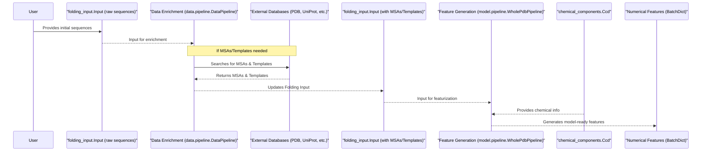

# Chapter 3: Data Pipeline (`WholePdbPipeline`)

Welcome to Chapter 3! In the previous chapters, we learned about [Chapter 1: Folding Input (`folding_input.Input`)](01_folding_input___folding_input_input___.md), which is how you tell AlphaFold 3 *what* to predict, and [Chapter 2: Chemical Component Dictionary (CCD) Handling (`chemical_components.Ccd`)](02_chemical_component_dictionary__ccd__handling___chemical_components_ccd___.md), which is how AlphaFold 3 understands the chemical details of all the molecules involved.

Now, imagine you have your "order form" (`folding_input.Input`) and the "chemical encyclopedia" (CCD). How does AlphaFold 3 take this information and turn it into something its powerful AI brain can actually work with? That's the job of the **Data Pipeline**, with a key component being the `WholePdbPipeline` class.

## What's the Big Deal About the Data Pipeline?

Think of the AlphaFold 3 model as a master chef. You've given the chef a recipe request (your `folding_input.Input`) and a list of special ingredients (defined in the CCD). But the chef doesn't work with raw groceries directly from the market. They need everything to be washed, chopped, measured, and prepped – a "mise en place."

The Data Pipeline is like the highly skilled kitchen crew that does all this prep work. It's an **automated assembly line** that:
1.  Takes your initial request (e.g., protein sequences).
2.  Goes to the "market" (large biological databases) to fetch extra crucial information if you haven't provided it. This includes:
    *   **Multiple Sequence Alignments (MSAs)**: Collections of similar sequences from other species, which give clues about important parts of your molecule. We'll learn more in [Chapter 4: MSA Representation (`msa.Msa`)](04_msa_representation___msa_msa___.md).
    *   **Templates**: Known 3D structures of similar molecules that can act as a starting hint. More on this in [Chapter 5: Template Representation (`templates.Templates`)](05_template_representation___templates_templates___.md).
3.  Uses the "chemical encyclopedia" ([`chemical_components.Ccd`](02_chemical_component_dictionary__ccd__handling___chemical_components_ccd___.md)) to understand any unusual parts like ligands.
4.  Cleans and processes all this information.
5.  Finally, converts everything into a **standardized format of numerical features**. These are numbers arranged in specific ways that the AlphaFold 3 neural network (the "master chef") can understand and learn from. This final bundle of numbers is often called a "batch" of features, which we'll explore in [Chapter 6: Feature Representation (`features.BatchDict`, `feat_batch.Batch`)](06_feature_representation___features_batchdict____feat_batch_batch___.md).

The `WholePdbPipeline` class (from `alphafold3.model.pipeline.pipeline`) is a central engine within this data pipeline, specifically responsible for the final conversion of all gathered and processed information into these numerical features.

## The Two Main Stages of Data Preparation

The overall "Data Pipeline" process, as orchestrated by scripts like `run_alphafold.py`, can be thought of in two main stages:

**Stage 1: Data Enrichment (Gathering Information)**
*   **What it does**: If your initial [Folding Input (`folding_input.Input`)](01_folding_input___folding_input_input___.md) only contains sequences, this stage searches external databases to find MSAs and templates.
*   **Key component**: This is often handled by the `DataPipeline` class found in `alphafold3.data.pipeline`.
*   **Output**: Your `folding_input.Input` object gets updated with new information (paths to MSA files, template data).

**Stage 2: Feature Generation (Turning Everything into Numbers)**
*   **What it does**: This stage takes the (now potentially enriched) `folding_input.Input`, along with information from the [`chemical_components.Ccd`](02_chemical_component_dictionary__ccd__handling___chemical_components_ccd___.md), and performs the final, complex conversion into numerical features.
*   **Key component**: This is where the `WholePdbPipeline` class (from `alphafold3.model.pipeline.pipeline`) plays its main role. It's the powerhouse that actually creates the feature arrays.
*   **Output**: A "batch" of numerical data ready for the AlphaFold 3 model.

Let's visualize this flow:



## How the Pipeline is Used (Simplified from `run_alphafold.py`)

You typically don't call `WholePdbPipeline` directly as a beginner. The main script (`run_alphafold.py`) manages it. Here's a simplified idea:

1.  **You prepare your `folding_input.Input`**:
    ```python
    # (From Chapter 1)
    from alphafold3.common import folding_input
    my_protein_sequence = "MAGAASPCPSPLPFLCLFLWLTLSAGSGALAVLPPTRA"
    protein_chain_A = folding_input.ProteinChain(id="A", sequence=my_protein_sequence)
    my_request = folding_input.Input(name="my_protein", chains=[protein_chain_A], rng_seeds=[42])
    ```

2.  **Stage 1: Data Enrichment (if needed)**:
    The `run_alphafold.py` script can call a data pipeline (e.g., `alphafold3.data.pipeline.DataPipeline`) to find MSAs and templates if you haven't provided them in `my_request`.
    ```python
    # Conceptual: run_alphafold.py might do this
    # from alphafold3.data import pipeline as data_enrichment_pipeline
    # from alphafold3.data import pipeline_config # (This is DataPipelineConfig)
    
    # config_for_enrichment = data_enrichment_pipeline.DataPipelineConfig(...) # paths to DBs, tools
    # enrichment_pipeline = data_enrichment_pipeline.DataPipeline(config_for_enrichment)
    # enriched_request = enrichment_pipeline.process(my_request)
    # Now, enriched_request.chains[0] might have .unpaired_msa, .paired_msa, .templates filled in
    ```
    This `enriched_request` is still a `folding_input.Input` object, but now it's packed with more data.

3.  **Stage 2: Feature Generation using `WholePdbPipeline`**:
    This is typically done through the `featurise_input` function in `alphafold3.data.featurisation.py`, which uses `WholePdbPipeline`.
    ```python
    # Conceptual: run_alphafold.py then calls featurise_input
    # from alphafold3.data import featurisation
    # from alphafold3.constants import chemical_components
    # from alphafold3.model.pipeline import pipeline as model_pipeline # This is WholePdbPipeline's module

    # ccd = chemical_components.cached_ccd() # Load the chemical encyclopedia
    
    # # featurise_input uses WholePdbPipeline internally
    # # Simplified call to featurise_input:
    # # config_for_featurisation = model_pipeline.WholePdbPipeline.Config(...)
    # # whole_pdb_pipeline_instance = model_pipeline.WholePdbPipeline(config=config_for_featurisation)
    # # feature_batch_list = [
    # #     whole_pdb_pipeline_instance.process_item(fold_input=enriched_request, ccd=ccd, ...)
    # # ]

    # # Actual call in run_alphafold.py is to a helper:
    # feature_batch_list = featurisation.featurise_input(
    #     fold_input=enriched_request, # or my_request if enrichment was skipped
    #     ccd=ccd,
    #     # ... other parameters like bucket sizes for padding ...
    # )
    #
    # # feature_batch_list[0] is now a dictionary of NumPy arrays - the model's food!
    ```
    The `featurise_input` function (found in `alphafold3/data/featurisation.py`) sets up and uses `WholePdbPipeline` like this (highly simplified):
    ```python
    # Inside alphafold3/data/featurisation.py (conceptual simplification)
    from alphafold3.model.pipeline import pipeline as model_pipeline # model_pipeline.WholePdbPipeline
    import numpy as np

    def featurise_input(
        fold_input, # This is our (potentially enriched) folding_input.Input
        ccd,        # The chemical component dictionary
        # ... other args ...
    ):
        # 1. Create a configuration for WholePdbPipeline
        config = model_pipeline.WholePdbPipeline.Config(
            # ... various settings for featurisation ...
        )
        
        # 2. Instantiate WholePdbPipeline
        the_featurizer = model_pipeline.WholePdbPipeline(config=config)
        
        batches = []
        for seed in fold_input.rng_seeds: # Process for each random seed
            # 3. Call process_item to get the numerical features
            one_feature_batch = the_featurizer.process_item(
                fold_input=fold_input,
                ccd=ccd,
                random_state=np.random.RandomState(seed) # For reproducibility
            )
            batches.append(one_feature_batch)
            
        return batches # A list of feature dictionaries
    ```
    This `one_feature_batch` is the precious set of numerical data that the AlphaFold 3 AI model will use for prediction. It's a dictionary where keys are feature names (like 'msa', 'template_aatype') and values are NumPy arrays. We'll explore this in detail in [Chapter 6: Feature Representation (`features.BatchDict`, `feat_batch.Batch`)](06_feature_representation___features_batchdict____feat_batch_batch___.md).

## A Peek Inside `WholePdbPipeline.process_item`

So, what magical steps does `WholePdbPipeline` perform in its `process_item` method? Here's a conceptual overview:

1.  **Load and Clean Structure**: It starts by converting your [Folding Input (`folding_input.Input`)](01_folding_input___folding_input_input___.md) into an internal 3D structure representation. Then, it meticulously cleans this structure: removing problematic atoms, fixing inconsistencies, and handling bonds, especially with ligands, using info from the [`chemical_components.Ccd`](02_chemical_component_dictionary__ccd__handling___chemical_components_ccd___.md).

2.  **Tokenization**: The pipeline decides how to break down the entire molecular assembly into a sequence of "tokens." For a standard protein, each amino acid usually becomes one token. For ligands or non-standard residues, it might represent them as a sequence of atom-based tokens. This token sequence is what the main part of AlphaFold 3 (the Evoformer) processes.

3.  **Feature Extraction**: This is the core of the work. For each token, and for pairs of tokens, it calculates a host of numerical properties. These become the actual features. Examples include:
    *   **Sequence Features**: What type of amino acid/nucleotide is this token? What are its neighbors?
    *   **MSA Features**: If MSAs were found, how conserved is this position? What other residues are commonly seen here? (See [Chapter 4: MSA Representation (`msa.Msa`)](04_msa_representation___msa_msa___.md))
    *   **Template Features**: If templates were found, what is the corresponding residue in the template? What are the distances to other residues in the template? (See [Chapter 5: Template Representation (`templates.Templates`)](05_template_representation___templates_templates___.md))
    *   **Atom Features**: For parts of the molecule represented at the atomic level (like ligands), it extracts detailed atom information (types, positions, bonds) using the CCD.
    *   **Positional Features**: Information about the relative positions of tokens in the sequence.

4.  **Padding**: Neural networks usually expect inputs of a fixed size. Since your molecules can vary in length, the pipeline "pads" the feature arrays with placeholder values to make them fit standard "bucket" sizes. This helps with computational efficiency.

5.  **Output**: The result is a dictionary (a `BatchDict`) containing all these numerical features as NumPy arrays, perfectly formatted for the AlphaFold 3 model.

## Why is this Important for You?

As a beginner, you won't typically write code to directly interact with `WholePdbPipeline`'s internals. However, understanding its role is super helpful because:
*   **You know what happens to your input**: It's not black magic! There's a systematic process.
*   **You understand the "why"**: You see why providing MSAs or templates (or letting AlphaFold 3 find them) can be beneficial – they become rich features for the model.
*   **Troubleshooting**: If something goes wrong, knowing that data preparation is a complex step can guide you. For example, if the pipeline can't find necessary databases, it will fail here.
*   **Appreciation**: You can appreciate the amount of sophisticated data engineering that AlphaFold 3 handles for you, turning simple sequences into the complex language the AI understands.

## Conclusion

The Data Pipeline, with `WholePdbPipeline` as its core featurization engine, is the unsung hero that transforms your raw biological data into a format the AlphaFold 3 model can digest. It's an intricate assembly line that enriches your input with information from biological databases (like MSAs and templates) and then meticulously converts everything into a precise set of numerical features. This "mise en place" is essential for AlphaFold 3 to perform its amazing feat of structure prediction.

We've seen that this pipeline gathers various types of information. In the next two chapters, we'll take a closer look at two of the most important types of information it prepares: [Chapter 4: MSA Representation (`msa.Msa`)](04_msa_representation___msa_msa___.md) and then [Chapter 5: Template Representation (`templates.Templates`)](05_template_representation___templates_templates___.md).

---

Generated by [AI Codebase Knowledge Builder](https://github.com/The-Pocket/Tutorial-Codebase-Knowledge)