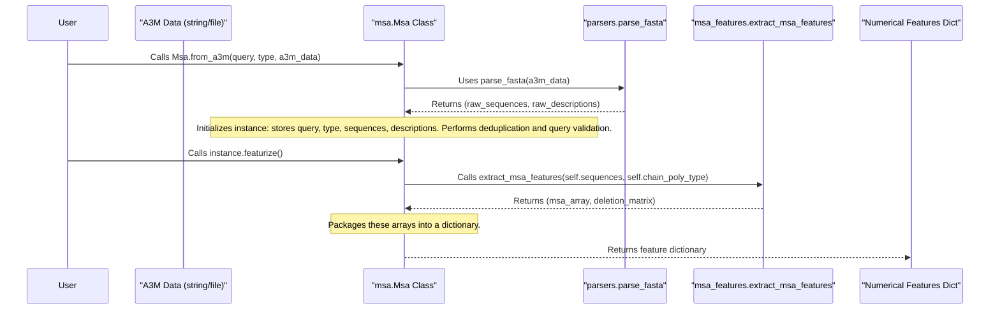

# Chapter 4: MSA Representation (`msa.Msa`)

In [Chapter 3: Data Pipeline (`WholePdbPipeline`)](03_data_pipeline___wholepdbpipeline___.md), we saw how the data pipeline prepares all the necessary information for AlphaFold 3. One of the most vital pieces of information, especially for proteins and RNA, is the Multiple Sequence Alignment, or MSA.

So, what exactly is an MSA, and how does AlphaFold 3 handle it? Let's dive in!

## What's the Big Deal About MSAs?

Imagine you have a protein you want to predict the structure of. This is your "query" sequence. Now, imagine you look through a vast library of known protein sequences from different organisms – humans, mice, bacteria, plants, etc. You'd likely find many sequences that are similar to your query sequence. These similar sequences are its evolutionary relatives.

A **Multiple Sequence Alignment (MSA)** is a way of arranging these related sequences, including your query, by lining them up to highlight their similarities and differences.

Think of it like comparing different versions of the same story passed down through generations.
*   Parts of the story that are crucial (like the main characters or plot points) will likely remain the same across most versions. These are "conserved" regions.
*   Other details (like the color of a minor character's hat) might change. These are "variable" regions.

In an MSA:
*   **Conserved residues** (amino acids or nucleotides) at a particular position across many sequences often indicate that this position is critical for the molecule's structure or function.
*   **Variable residues** suggest positions that can tolerate changes without disrupting the core structure or function.
*   **Correlated mutations**: Sometimes, two positions that are far apart in the sequence might change together in different species. This can be a strong hint that these two positions are close to each other in the 3D structure!

AlphaFold 3 uses this rich evolutionary information from MSAs to get strong clues about which parts of your molecule are likely to interact, which parts are flexible, and which are structurally important.

## The `msa.Msa` Class: Your MSA Manager

While an MSA might sound like just a list of text sequences, managing them properly for a complex AI model requires a bit more sophistication. This is where the `msa.Msa` class in AlphaFold 3 comes into play.

The `msa.Msa` class (found in `alphafold3/data/msa.py`) is like a specialized container and toolkit for these alignments. It's not just a plain list; it's designed to:

1.  **Parse MSA files:** MSAs are often stored in specific file formats, like A3M or FASTA. The `Msa` class can read and understand these files.
2.  **Ensure Query Presence:** It makes sure that your main sequence of interest (the query sequence) is correctly identified and is usually the first sequence in the alignment.
3.  **Deduplicate Sequences:** Sometimes, MSA search tools might return many identical or highly similar sequences. The `Msa` class can clean this up by removing redundant sequences, making the MSA more informative and computationally manageable.
4.  **Prepare for Featurization:** Most importantly, it prepares the MSA data to be converted into numerical arrays (features) that the AlphaFold 3 neural network can understand. This involves converting letters (A, C, G, T, U, etc.) into numbers and handling gaps or insertions in the alignment.

Think of `msa.Msa` as an expert librarian for your evolutionary storybooks. It organizes them, makes sure your main story is on top, removes duplicate copies, and prepares a neat summary (the numerical features) for the "master chef" (the AlphaFold 3 model).

## A Simple Example: Creating an `Msa` Object

Let's say you have a very small MSA in A3M format as a string. The A3M format typically has a description line starting with `>` followed by the sequence itself.

```
>query_protein
MAGAASPCPS
>related_seq1
M-GAASPCPS
>related_seq2
MAGGASCCPS
```
In this tiny example:
*   `query_protein` is our main sequence.
*   `related_seq1` has a gap (`-`) corresponding to the first 'A' in the query.
*   `related_seq2` has 'G' instead of 'A' at the third position and 'C' instead of 'P' at the eighth.

Here's how you might use the `msa.Msa` class to load and represent this:

```python
# Import the Msa class
from alphafold3.data.msa import Msa

# Our query sequence
my_query_sequence = "MAGAASPCPS"
# The polymer type (e.g., protein)
my_chain_poly_type = "polypeptide(L)" # From alphafold3.constants.mmcif_names

# Our MSA data in A3M format as a string
a3m_string_data = """>query_protein
MAGAASPCPS
>related_seq1
M-GAASPCPS
>related_seq2
MAGGASCCPS
"""

# Create an Msa object using from_a3m
# The actual query_sequence is passed to ensure it's correctly handled.
# (The Msa class verifies the first sequence in a3m_string_data matches my_query_sequence)
msa_object = Msa.from_a3m(
    query_sequence=my_query_sequence,
    chain_poly_type=my_chain_poly_type,
    a3m=a3m_string_data,
    deduplicate=True # Default, good practice
)

print(f"MSA loaded with {msa_object.depth} sequences.")
print(f"First sequence description: {msa_object.descriptions[0]}")
print(f"First sequence: {msa_object.sequences[0]}")
```

Running this code would output:
```
MSA loaded with 3 sequences.
First sequence description: query_protein
First sequence: MAGAASPCPS
```
This `msa_object` now holds our alignment, ready for further processing. Notice how `from_a3m` is a `classmethod`, meaning you call it on the class `Msa` itself, not on an instance of it.

## Featurizing the MSA: Turning Sequences into Numbers

The AlphaFold 3 model doesn't understand letters like 'M', 'A', 'G'. It needs numbers. The `msa.Msa` object has a crucial method called `featurize()` that does this conversion.

```python
# (Continuing from the previous example)

# Featurize the MSA
msa_features_dict = msa_object.featurize()

# Let's look at some of the features (simplified)
print(f"\nShape of numerical MSA: {msa_features_dict['msa'].shape}")
print(f"Numerical MSA (first 5 residues of first sequence):\n{msa_features_dict['msa'][0, :5]}")
print(f"\nShape of deletion matrix: {msa_features_dict['deletion_matrix_int'].shape}")
print(f"Deletion matrix (first 5 residues of second sequence):\n{msa_features_dict['deletion_matrix_int'][1, :5]}")
```

This would produce output similar to:
```
Shape of numerical MSA: (3, 10)
Numerical MSA (first 5 residues of first sequence):
[12  0  7  0  0]

Shape of deletion matrix: (3, 10)
Deletion matrix (first 5 residues of second sequence):
[0 1 0 0 0]
```
What does this mean?
*   **`msa` array:** This is the numerical version of your alignment. Each amino acid is replaced by a number (e.g., 'M' might be 12, 'A' might be 0, 'G' might be 7). The shape `(3, 10)` means 3 sequences, each 10 residues long.
*   **`deletion_matrix_int` array:** This matrix keeps track of insertions and deletions. For `related_seq1` (`M-GAASPCPS`), the second sequence in our MSA, `[0 1 0 0 0]` for the first 5 positions means:
    *   Position 0 ('M'): 0 deletions before it.
    *   Position 1 (the gap '-'): This represents that the corresponding 'A' from the query is *deleted* in this sequence, or equivalently, `related_seq1` has an *insertion* if we were aligning it to a shorter query. The `msa_features.extract_msa_features` function (used internally by `msa.Msa.featurize()`) counts lowercase letters in the original A3M as insertions *relative to the uppercase letters*. Since our A3M had an uppercase gap '-', this translates to a deletion count. If `related_seq1` had been `MaGAASPCPS` (lowercase 'a' as an insertion), the deletion matrix logic would capture that. For a simple gap `-` like in `M-GAASPCPS`, after parsing, `extract_msa_features` maps `-` to a gap character ID (21 for proteins) and the deletion matrix logic will reflect how many characters were "skipped" or inserted. In `M-GAASPCPS`, the `-` aligns with the second residue 'A' of the query. The deletion count `1` at the *next aligned residue* 'G' (which is the 1st index in the featurized sequence `MGAASPCPS`) indicates that one character (the '-') was encountered before it.
    *   The featurized sequence `M-GAASPCPS` becomes `[M, G, A, A, S, P, C, P, S]` numerically (length 9, assuming '-' is treated as a gap to be potentially removed or handled in length definition depending on exact `msa_features` logic which aims for consistent length based on query's non-gap residues). The deletion matrix then describes how many characters were "skipped" to align to the query.

These numerical arrays, along with others, are then passed to the [Data Pipeline (`WholePdbPipeline`)](03_data_pipeline___wholepdbpipeline___.md) and eventually to the AlphaFold 3 model.

## Under the Hood: How `msa.Msa` Works

When you create an `Msa` object (e.g., using `Msa.from_a3m`) and then call `featurize()`, several things happen:



1.  **Parsing (e.g., `Msa.from_a3m`)**:
    *   The A3M input string (or file content) is parsed. The `alphafold3/data/parsers.py` module contains functions like `parse_fasta` (A3M is a variant of FASTA) that split the input into individual sequences and their corresponding description lines.
    *   A new `Msa` object is created (its `__init__` method is called).
    ```python
    # Simplified concept from alphafold3/data/msa.py
    # Inside Msa.from_a3m:
    # raw_sequences, raw_descriptions = parsers.parse_fasta(a3m_string_data)
    # ... (checks to ensure query_sequence matches raw_sequences[0]) ...
    # self = cls(query_sequence, chain_poly_type, raw_sequences, raw_descriptions, ...)
    ```

2.  **Initialization (`Msa.__init__`)**:
    *   The `query_sequence`, `chain_poly_type`, `sequences`, and `descriptions` are stored.
    *   **Deduplication**: If `deduplicate=True` (the default), the constructor iterates through the sequences. It typically ignores insertions (often represented by lowercase letters in A3M) when checking for duplicates, ensuring only unique alignments (based on their uppercase letters) are kept.
    *   **Query Validation**: It checks if the first sequence in the processed MSA matches the provided `query_sequence`. This is important because all subsequent processing assumes the query is the reference.
    ```python
    # Simplified concept of Msa.__init__ from alphafold3/data/msa.py
    # def __init__(self, query_sequence, chain_poly_type, sequences, descriptions, deduplicate=True):
    #     self.query_sequence = query_sequence
    #     self.chain_poly_type = chain_poly_type
    #     
    #     if deduplicate:
    #         unique_seqs = set()
    #         self.sequences = []
    #         self.descriptions = []
    #         for seq, desc in zip(sequences, descriptions):
    #             # Create a version of seq without lowercase letters for uniqueness check
    #             # simplified_seq = seq_without_lowercase_letters(seq) 
    #             # if simplified_seq not in unique_seqs:
    #             #    unique_seqs.add(simplified_seq)
    #             #    self.sequences.append(seq)
    #             #    self.descriptions.append(desc)
    #             pass # Actual deduplication logic is more involved
    #     else:
    #         self.sequences = list(sequences)
    #         self.descriptions = list(descriptions)
    #
    #     # Ensure query sequence is consistent with the first MSA sequence
    #     # if not sequences_are_feature_equivalent(self.sequences[0], query_sequence, ...):
    #     #    raise ValueError("First MSA sequence doesn't match query.")
    ```

3.  **Featurization (`Msa.featurize`)**:
    *   This method calls `msa_features.extract_msa_features` (from `alphafold3/data/msa_features.py`).
    *   `extract_msa_features` does the heavy lifting:
        *   It converts each character (amino acid/nucleotide/gap) in each sequence to a specific integer ID based on the `chain_poly_type`. (e.g., 'A' -> 0, 'C' -> 4 for proteins; different mappings for DNA/RNA).
        *   It calculates the `deletion_matrix`. For each position in each sequence, this matrix stores how many insertions (lowercase letters in the original A3M) occurred before that aligned (uppercase) residue.
    *   The `featurize` method then packages these numerical arrays (the MSA itself, the deletion matrix, number of alignments, etc.) into a dictionary.
    ```python
    # Simplified concept of Msa.featurize from alphafold3/data/msa.py
    # import numpy as np
    # from alphafold3.data import msa_features
    #
    # def featurize(self):
    #     msa_arr, deletions_arr = msa_features.extract_msa_features(
    #         msa_sequences=self.sequences, 
    #         chain_poly_type=self.chain_poly_type
    #     )
    #     
    #     # species_ids = msa_features.extract_species_ids(self.descriptions) # Also possible
    #
    #     return {
    #         'msa': msa_arr,
    #         'deletion_matrix_int': deletions_arr,
    #         'num_alignments': np.array(len(self.sequences), dtype=np.int32),
    #         # ... other features like 'msa_species_identifiers'
    #     }
    ```

This dictionary of numerical features is then ready to be used by the rest of the AlphaFold 3 pipeline.

## Where Do MSAs Come From?

You might wonder how you get these MSA files (like A3M) in the first place.
*   **User-Provided**: As shown in [Chapter 1: Folding Input (`folding_input.Input`)](01_folding_input___folding_input_input___.md), you can specify paths to your own MSA files when you define a `ProteinChain` or `RnaChain`.
*   **Found by Data Pipeline**: If you don't provide MSAs, the `DataPipeline` component of AlphaFold 3 (mentioned in [Chapter 3: Data Pipeline (`WholePdbPipeline`)](03_data_pipeline___wholepdbpipeline___.md)) can automatically search for them. It uses external bioinformatics tools (like JackHMMER for proteins, or Nhmmer for RNA/DNA) to query large sequence databases and generate MSAs. The `alphafold3/data/msa.py` file also includes functions like `get_msa_tool` and `get_msa` that are involved in running these external tools.

Regardless of the source, once an A3M string or file path is available, the `msa.Msa` class (or the logic it encapsulates) is key to processing it into a usable format.

## Conclusion

Multiple Sequence Alignments (MSAs) are a cornerstone of modern protein structure prediction, offering deep insights into evolutionary conservation and co-evolution. The `msa.Msa` class in AlphaFold 3 serves as a robust manager for these MSAs. It handles parsing, cleaning (like deduplication and query validation), and crucially, the initial steps of featurization – converting the aligned sequences into numerical representations that the AI model can learn from.

Understanding MSAs and how they are processed helps you appreciate the sophisticated data preparation that underpins AlphaFold 3's predictive power.

MSAs provide evolutionary context. Another source of valuable information comes from experimentally determined structures of related molecules. These are called "templates," and we'll explore how AlphaFold 3 uses them in the next chapter: [Chapter 5: Template Representation (`templates.Templates`)](05_template_representation___templates_templates___.md).

---

Generated by [AI Codebase Knowledge Builder](https://github.com/The-Pocket/Tutorial-Codebase-Knowledge)