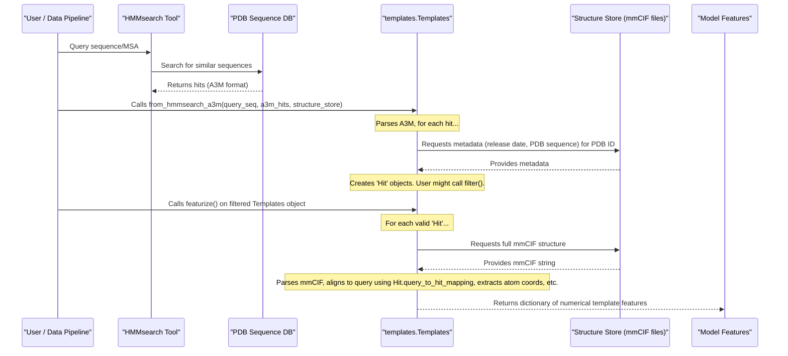

# Chapter 5: Template Representation (`templates.Templates`)

In [Chapter 4: MSA Representation (`msa.Msa`)](04_msa_representation___msa_msa___.md), we learned how AlphaFold 3 uses evolutionary information from Multiple Sequence Alignments (MSAs) to help predict structures. But what if we already have a good idea of what our molecule *should* look like because scientists have already solved the 3D structure of a very similar molecule? This is where "templates" come in!

## What's the Big Deal About Templates?

Imagine you're an architect trying to design a new house. If you know of an existing house that's very similar in style and layout to what you want, wouldn't you look at its blueprints for inspiration? Of course! Those existing blueprints could save you a lot of time and give you a great starting point.

In the world of protein structure prediction, **templates are like those existing blueprints**. They are experimentally determined 3D structures of molecules (usually proteins) that are known to be similar to the molecule you're trying to predict (your "query").

AlphaFold 3 can use these templates to guide its prediction process. If a good template exists, it can significantly improve the accuracy of the predicted structure.

The `templates.Templates` class (found in `alphafold3/data/templates.py`) is AlphaFold 3's way of managing these structural blueprints. It acts like a specialized librarian for templates:
1.  **Manages Search Results**: It takes the raw results from tools that search for similar known structures (like HMMsearch run against a database of PDB structures).
2.  **Filters Blueprints**: Not all blueprints are useful. Some might be too old, not similar enough, or of poor quality. The `Templates` class helps filter these out.
3.  **Prepares for the AI**: It converts the 3D information from the chosen template structures and their alignments to your query sequence into numerical features that the AlphaFold 3 AI model can understand.

## The `Hit` Object: A Single Blueprint Card

Before we dive into the `Templates` class itself, let's look at how AlphaFold 3 represents a single found template. This is done using the `Hit` dataclass (also in `alphafold3/data/templates.py`).

Think of a `Hit` object as a library card for one specific blueprint. It contains key information like:
*   `pdb_id`: The ID of the known structure in the Protein Data Bank (e.g., "4pqx").
*   `auth_chain_id`: The specific chain within that PDB structure (e.g., "A").
*   `hmmsearch_sequence`: The sequence of the template as it aligned to your query in the search (this shows gaps and matches).
*   `structure_sequence`: The actual sequence of that chain as found in the PDB file.
*   `release_date`: When this structure was released.
*   `query_to_hit_mapping`: A crucial piece of information detailing which residue in your query sequence corresponds to which residue in the template structure.

You usually don't create `Hit` objects directly; they are created internally by the `Templates` class when it processes search results.

## The `templates.Templates` Class: Your Blueprint Librarian

The `Templates` class is the main manager. It holds a collection of these `Hit` objects and provides methods to work with them.

### How Templates Are Found and Processed

1.  **Search**: Typically, AlphaFold 3 (or you, using tools like HMMsearch) searches a database of known PDB structures using your query sequence (or an MSA built from it). This search yields a list of potential templates, often in an A3M file format. Each entry in this A3M file describes a "hit" – a PDB chain that looks similar to your query.

2.  **Loading into `Templates`**: The `Templates.from_hmmsearch_a3m()` class method is commonly used. You give it your query sequence, the A3M file from HMMsearch, and access to a "structure store" (a database of PDB mmCIF files).
    ```python
    # Conceptual: How Templates might be created (simplified)
    from alphafold3.data import templates
    from alphafold3.data import msa_config # For HmmsearchConfig
    from alphafold3.data import structure_stores # For StructureStore
    import datetime

    my_query_sequence = "MAGAASPCPSPLPFLCLFLWLTLSAGSGALAVLPPTRA"
    # Imagine a3m_output_from_hmmsearch is a string from HMMsearch results
    a3m_output_from_hmmsearch = """# STOCKHOLM 1.0
#=GS 4pqx_A/2-217 DE [subseq from] mol:protein length:217 Free text
4pqx_A/2-217        MAGAASPCPS------------------------------
#=GS 6xyz_B/1-30 DE [subseq from] mol:protein length:30 Free text
6xyz_B/1-30         M-GAASPCPS------------------------------
#=GF SQ 2
//""" # Simplified A3M-like content for example

    # You'd need a structure store (e.g., pointing to your PDB mmCIF files)
    # and HMMsearch configuration.
    # For this example, we'll skip their actual setup.
    mock_structure_store = None # In reality, a structure_stores.StructureStore object
    
    # This step usually happens inside the Data Pipeline
    # template_hits = templates.Templates.from_hmmsearch_a3m(
    #     query_sequence=my_query_sequence,
    #     a3m=a3m_output_from_hmmsearch,
    #     max_template_date=datetime.date(2024, 1, 1),
    #     structure_store=mock_structure_store, # Provide actual store
    #     # filter_config, query_release_date, chain_poly_type might also be passed
    # )
    # print(f"Found {template_hits.num_hits} potential templates initially.")
    ```
    This code (if run with actual data) would parse the HMMsearch output, look up metadata for each PDB ID from the `structure_store`, and create `Hit` objects. The `template_hits` object would then hold these hits.

3.  **Filtering Templates**: Not all found templates are good. You might want to filter them. The `Templates` class has a `filter()` method.
    ```python
    # (Continuing from above, assuming template_hits is populated)
    
    # filter_config = msa_config.TemplateFilterConfig(
    #     max_template_date=datetime.date(2023, 12, 31), # Only use templates released before 2024
    #     min_align_ratio=0.1,  # Must align to at least 10% of the query
    #     max_hits=4,           # Keep at most 4 best templates
    #     deduplicate_sequences=True,
    #     # ... other filter criteria
    # )
    
    # filtered_templates = template_hits.filter(
    #     max_subsequence_ratio=filter_config.max_subsequence_ratio, # from the config
    #     min_align_ratio=filter_config.min_align_ratio,
    #     min_hit_length=filter_config.min_hit_length,
    #     deduplicate_sequences=filter_config.deduplicate_sequences,
    #     max_hits=filter_config.max_hits
    # )
    # print(f"After filtering, we have {filtered_templates.num_hits} templates.")
    ```
    This applies criteria like release date, how well the template aligns, and limits the total number of templates. The `release_date_cutoff` (derived from `max_template_date` and an optional `query_release_date`) is particularly important for preventing the model from "cheating" by using templates that were released after the query structure might have been solved (if training or benchmarking).

4.  **Featurizing Templates**: Once you have a good set of filtered templates, they need to be converted into numbers (features) for the AlphaFold 3 model. The `featurize()` method does this.
    ```python
    # (Continuing from above, using filtered_templates)

    # template_features_dict = filtered_templates.featurize(
    #     include_ligand_features=True # Optionally include ligand info from templates
    # )

    # if filtered_templates.num_hits > 0:
    #     print("Template features generated!")
    #     # 'template_features_dict' now contains NumPy arrays like:
    #     # template_features_dict['template_aatype']
    #     # template_features_dict['template_all_atom_positions']
    #     # template_features_dict['template_all_atom_masks']
    # else:
    #     print("No templates to featurize.")
    ```
    The `featurize()` method does a lot:
    *   For each valid `Hit`, it fetches the full 3D structure (mmCIF file) from the `structure_store`.
    *   It uses the `hit.query_to_hit_mapping` to know which parts of the template structure correspond to your query sequence.
    *   It extracts the 3D coordinates of atoms (`template_all_atom_positions`), which atoms are present (`template_all_atom_masks`), and the type of each residue (`template_aatype`) for these corresponding parts.
    *   These are all packaged into a dictionary of NumPy arrays, ready to be fed into the AlphaFold 3 model.

These template features provide direct 3D structural hints to the model.

## How `templates.Templates` Works Internally (A Simplified Look)

Let's trace the journey from a template search result to model-ready features.



**Key Steps in `Templates.from_hmmsearch_a3m()`:**
1.  **Parse A3M**: The input A3M string (from HMMsearch) is parsed. Each entry gives a PDB ID, chain, and how it aligns to the query.
    ```python
    # Conceptual: Inside from_hmmsearch_a3m
    # for hit_seq, hit_desc in parsers.lazy_parse_fasta_string(a3m):
    #     pdb_id, auth_chain_id, start, end, length = _parse_hit_description(hit_desc)
    #     # ... get release_date, structure_sequence from structure_store using pdb_id ...
    #     hit_object = Hit(
    #         pdb_id=pdb_id, auth_chain_id=auth_chain_id,
    #         hmmsearch_sequence=hit_seq, structure_sequence=actual_pdb_sequence,
    #         query_sequence=query_sequence, release_date=release_date, ...
    #     )
    #     # Add hit_object to a list
    ```
    The `_parse_hit_description` function extracts PDB ID and chain from the HMMsearch output description line. `_parse_hit_metadata` fetches details like release date and sequence from the `structure_store`.

**Key Step in `Hit` initialization:**
*   The `Hit` object calculates `query_to_hit_mapping`. This mapping is vital. It's a dictionary telling you, for example, that residue 5 of your query aligns with residue 10 of the template `Hit`.
    ```python
    # Conceptual: Inside Hit class or its processing
    # query_to_hit_map = {}
    # q_idx, h_idx = 0, 0
    # for char_in_hmmsearch_seq in self.hmmsearch_sequence:
    #     if char_in_hmmsearch_seq == '-': # Gap in template
    #         q_idx += 1
    #     elif char_in_hmmsearch_seq.islower(): # Insertion in template
    #         h_idx += 1
    #     else: # Match
    #         query_to_hit_map[q_idx] = h_idx # Store mapping
    #         q_idx += 1
    #         h_idx += 1
    # self.query_to_hit_mapping = query_to_hit_map
    ```

**Key Steps in `Templates.featurize()`:**
1.  **Iterate Valid Hits**: It goes through the filtered list of `Hit` objects.
2.  **Fetch Structure**: For each `Hit`, it retrieves the full mmCIF structure string from the `structure_store`.
3.  **Parse Structure**: It parses this mmCIF string into an internal `structure.Structure` object.
4.  **Extract Polymer Features**: It calls `get_polymer_features()` (from `alphafold3/data/templates.py`). This function:
    *   Takes the template `structure.Structure` (filtered to the specific chain of the hit).
    *   Uses the `hit.query_to_hit_mapping`.
    *   Creates empty NumPy arrays for `template_all_atom_positions`, `template_all_atom_masks`, `template_aatype` (sized to your *query* length).
    *   For each query residue that has a mapping to the template:
        *   It finds the corresponding template residue.
        *   It copies the atom positions and mask for that template residue into the correct slot in the NumPy arrays (at the query residue's index).
        *   It records the template residue type.
    ```python
    # Conceptual: Inside get_polymer_features for one hit
    # template_aatype_array = np.zeros(query_sequence_length, dtype=np.int32)
    # template_atom_pos_array = np.zeros((query_sequence_length, num_atom_types, 3))
    # template_atom_mask_array = np.zeros((query_sequence_length, num_atom_types))

    # for query_idx, template_idx in query_to_hit_mapping.items():
    #     # Get atom data from parsed template_structure at template_idx
    #     template_aatype_array[query_idx] = residue_type_of_template_at_idx
    #     template_atom_pos_array[query_idx] = atom_positions_of_template_at_idx
    #     template_atom_mask_array[query_idx] = atom_mask_of_template_at_idx
    ```
5.  **Package Features**: All these arrays (for all featurized templates) are stacked and returned in a dictionary.

The `alphafold3/model/network/template_modules.py` file contains PyTorch modules like `TemplateEmbedding` that then take these numerical features and integrate them into the main AlphaFold 3 network, but this chapter focuses on how the features are *prepared*.

## Why is This Important for You?

As a beginner, you might not directly call `Templates.from_hmmsearch_a3m()` or `featurize()` yourself. This is often handled by the [Data Pipeline (`WholePdbPipeline`)](03_data_pipeline___wholepdbpipeline___.md). However, understanding this process helps you:
*   **Appreciate the data**: You know that AlphaFold 3 can use known structures as powerful guides.
*   **Control the input**: If you provide your own `folding_input.Input` (see [Chapter 1: Folding Input (`folding_input.Input`)](01_folding_input___folding_input_input___.md)), you can choose to provide template information if you have it, or let the pipeline search for it.
*   **Understand parameters**: You'll see settings related to `max_template_date` or number of templates and know why they exist (e.g., to prevent data leakage during training/evaluation or to manage computational resources).
*   **Interpret results**: If AlphaFold 3 uses a template, the prediction might look more like that template in some regions.

## Conclusion

Templates are like structural blueprints from similar, already-solved molecules that can guide AlphaFold 3's predictions. The `templates.Templates` class and its helper `Hit` class are responsible for managing these blueprints. They handle the process of taking raw search results, filtering them for quality and relevance, and then "translating" the 3D structural information from these templates into a numerical language (features) that the AlphaFold 3 AI can understand.

By incorporating information from both evolutionary relatives (MSAs) and known similar structures (templates), AlphaFold 3 gathers a rich set of clues to make its highly accurate predictions.

Now that we've seen how MSAs and Templates are represented and prepared, we're ready to look at how all these different pieces of information are bundled together for the model. That's the topic of our next chapter: [Chapter 6: Feature Representation (`features.BatchDict`, `feat_batch.Batch`)](06_feature_representation___features_batchdict____feat_batch_batch___.md).

---

Generated by [AI Codebase Knowledge Builder](https://github.com/The-Pocket/Tutorial-Codebase-Knowledge)