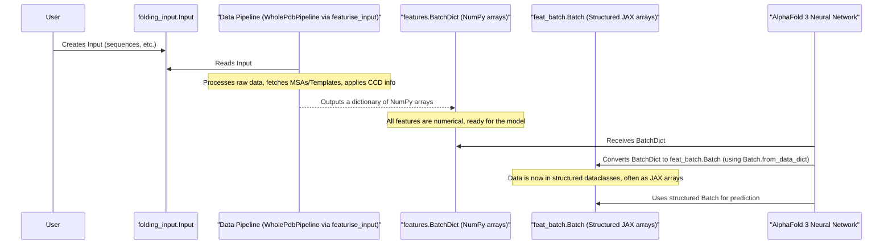

# Chapter 6: Feature Representation (`features.BatchDict`, `feat_batch.Batch`)

Welcome to Chapter 6! In [Chapter 5: Template Representation (`templates.Templates`)](05_template_representation___templates_templates___.md), we saw how AlphaFold 3 uses known 3D structures (templates) as blueprints to guide its predictions. We've also covered how it uses [Multiple Sequence Alignments (MSAs)](04_msa_representation___msa_msa___.md) for evolutionary insights.

Now, all this information, along with the basic sequence data from your [Folding Input (`folding_input.Input`)](01_folding_input___folding_input_input___.md) and chemical details from the [Chemical Component Dictionary (CCD) Handling (`chemical_components.Ccd`)](02_chemical_component_dictionary__ccd__handling___chemical_components_ccd___.md), needs to be packaged up in a way the AlphaFold 3 neural network can actually understand. This is where feature representation comes in, specifically using `features.BatchDict` and `feat_batch.Batch`.

## What's the Big Deal Here? The Model's Diet

Imagine the AlphaFold 3 neural network as a highly specialized, very picky master chef. This chef can create amazing molecular structures, but only if the ingredients are prepared and presented in an *exact* format. You can't just hand the chef a raw protein sequence or a pile of template files.

*   **`features.BatchDict`**: Think of this as the first stage of ingredient preparation. After the [Data Pipeline (`WholePdbPipeline`)](03_data_pipeline___wholepdbpipeline___.md) (our kitchen crew) has processed all the raw inputs (sequences, MSAs, templates, chemical info), it organizes everything into a `BatchDict`. This is essentially a **big dictionary where each entry is a specific "ingredient" (a numerical array, specifically a NumPy array) labeled with its name.** For example, one entry might be the MSA data converted to numbers, another might be the template atom coordinates, and so on.

*   **`feat_batch.Batch`**: This is like the master chef's perfectly organized "recipe card" and "ingredient tray." The `Batch` object takes the `BatchDict` and groups related ingredients into a more structured format. For example, all MSA-related arrays from the `BatchDict` are neatly bundled into an `MSA` section on this tray, all template features into a `Templates` section, etc. The AlphaFold 3 neural network is designed to work directly with this highly organized `feat_batch.Batch` format.

So, `BatchDict` is the standardized "list of prepared ingredients," and `feat_batch.Batch` is the even more structured "chef's personal recipe and prepped tray" that the AI model directly consumes.

## `features.BatchDict`: The Shopping Basket of Numerical Data

After the [Data Pipeline (`WholePdbPipeline`)](03_data_pipeline___wholepdbpipeline___.md) finishes its job (as orchestrated by `featurisation.featurise_input`), it produces a `features.BatchDict`. This is a Python dictionary where:
*   **Keys** are strings that describe the feature (e.g., `'aatype_token'`, `'msa_rows'`, `'template_all_atom_positions'`).
*   **Values** are NumPy arrays containing the actual numerical data for that feature.

Let's imagine a very simplified `BatchDict` for a small protein:
```python
import numpy as np

# Conceptual: This is what a BatchDict might look like after featurisation
# (Actual keys and shapes are more complex and numerous)
batch_dict_example = {
    'aatype_token': np.array([0, 12, 7, ...]),  # Amino acid types for each token (residue/atom)
    'token_mask': np.array([1, 1, 1, ...]),    # Mask indicating which tokens are real
    'msa_rows': np.array([[0, 12, 7, ...],     # MSA sequences (numerical)
                          [0, 12, 6, ...]]),
    'msa_mask': np.array([[1, 1, 1, ...],      # Mask for MSA sequences
                          [1, 1, 1, ...]]),
    'template_aatype': np.array([[0, 0, 0, ...]]), # Template amino acid types
    # ... and many many more features!
}

# The actual BatchDict is created by featurisation.featurise_input
# from alphafold3.data import featurisation
# featurised_examples = featurisation.featurise_input(...)
# one_batch_dict = featurised_examples[0] # This is a features.BatchDict
```
This `batch_dict_example` contains various pieces of information, all as NumPy arrays. The `alphafold3/model/features.py` file implicitly defines the expected keys and structure of these arrays through the dataclasses it contains (which we'll see next).

The `run_alphafold.py` script first calls `featurisation.featurise_input` (from `alphafold3/data/featurisation.py`) which uses the `WholePdbPipeline` to generate this `BatchDict`. This dictionary is then passed to the core AlphaFold 3 model.

## `feat_batch.Batch`: The Chef's Organized Recipe Card

While `BatchDict` contains all the data, it's a bit like a flat list of ingredients. For the model to use it efficiently, it's helpful to group related features. This is what `feat_batch.Batch` (defined in `alphafold3/model/feat_batch.py`) does.

`feat_batch.Batch` is a Python `dataclass`. Think of a dataclass as a custom-made container that holds specific, named items. The `Batch` dataclass has fields like:
*   `msa`: Holds all MSA-related features.
*   `templates`: Holds all template-related features.
*   `token_features`: Holds features for each token (like amino acid type, residue index).
*   And many others for different aspects of the input.

Each of these fields (e.g., `Batch.msa`) is *itself* another dataclass (like `features.MSA`, `features.Templates`, defined in `alphafold3/model/features.py`) that bundles specific NumPy arrays from the original `BatchDict`.

**How it's created:**
Inside the main AlphaFold 3 model (the `Model` class in `alphafold3/model/model.py`), the very first step when it receives a `features.BatchDict` is to convert it into a `feat_batch.Batch` object. This is done using the `Batch.from_data_dict()` method.

```python
# Conceptual: Inside the AlphaFold 3 model's __call__ method
# from alphafold3.model import feat_batch # For Batch
# from alphafold3.model import features   # For BatchDict and sub-feature classes

# model_input_dict: features.BatchDict = ... (this comes from featurisation.featurise_input)

# Convert the flat dictionary into a structured Batch object
# structured_batch: feat_batch.Batch = feat_batch.Batch.from_data_dict(model_input_dict)

# Now the model can easily access grouped features:
# msa_information = structured_batch.msa
# template_information = structured_batch.templates
# token_info = structured_batch.token_features

# For example, to get the MSA sequences (as a NumPy/JAX array):
# msa_sequences_array = msa_information.rows
```
This conversion makes the code within the neural network much cleaner and easier to manage, as it can request, say, `batch.msa.rows` instead of `batch_dict['msa_rows_from_somewhere']`.

## The Journey of Data to the Model

Let's visualize how your input transforms into these feature representations:



1.  You provide your [Folding Input (`folding_input.Input`)](01_folding_input___folding_input_input___.md).
2.  The `featurisation.featurise_input` function (using the [Data Pipeline (`WholePdbPipeline`)](03_data_pipeline___wholepdbpipeline___.md)) processes this, along with info from [CCD (`chemical_components.Ccd`)](02_chemical_component_dictionary__ccd__handling___chemical_components_ccd___.md), [MSA (`msa.Msa`)](04_msa_representation___msa_msa___.md), and [Templates (`templates.Templates`)](05_template_representation___templates_templates___.md), to produce a `features.BatchDict`. This dictionary contains many NumPy arrays.
3.  This `features.BatchDict` is passed to the main AlphaFold 3 `Model` (from `alphafold3/model/model.py`).
4.  Inside the model, the `BatchDict` is immediately converted into a `feat_batch.Batch` object. The NumPy arrays are typically converted to JAX arrays at this stage, as JAX is the framework AlphaFold 3 uses for its neural network computations.
5.  The neural network then works with this structured `feat_batch.Batch` object to make its predictions.

## Under the Hood: `BatchDict` and `Batch`

Let's peek a bit more at their definitions.

**`features.BatchDict`**
This is formally defined as a type alias in `alphafold3/model/features.py`:
```python
# In alphafold3/model/features.py (conceptual)
# import typing
# import numpy as np
# BatchDict = typing.Mapping[str, np.ndarray]
```
It's simply a dictionary mapping string keys to NumPy arrays. The `featurisation.featurise_input` function in `alphafold3/data/featurisation.py` is responsible for creating and returning this `BatchDict`.

**`feat_batch.Batch`**
This is a dataclass defined in `alphafold3/model/feat_batch.py`.

```python
# In alphafold3/model/feat_batch.py (simplified conceptual structure)
# from alphafold3.model import features # For the sub-feature dataclasses
# import chex # For the @chex.dataclass decorator

# @chex.dataclass(mappable_dataclass=False, frozen=True)
# class Batch:
#   msa: features.MSA  # This 'features.MSA' is also a dataclass
#   templates: features.Templates
#   token_features: features.TokenFeatures
#   # ... many other fields, each being a specific feature dataclass
#   # like ref_structure: features.RefStructure, etc.

#   @classmethod
#   def from_data_dict(cls, batch: features.BatchDict) -> 'Batch':
#     return cls(
#         msa=features.MSA.from_data_dict(batch),
#         templates=features.Templates.from_data_dict(batch),
#         token_features=features.TokenFeatures.from_data_dict(batch),
#         # ... and so on for all other fields
#     )
```
The `from_data_dict` class method is key. It constructs a `Batch` object by:
1.  Creating an instance of `features.MSA` (from `alphafold3/model/features.py`) by calling `features.MSA.from_data_dict(batch_dict)`. This `features.MSA` dataclass knows which keys to pick from the `batch_dict` to get its NumPy arrays (e.g., it might pick `batch_dict['msa_rows']`, `batch_dict['msa_mask']`).
2.  Doing the same for `features.Templates`, `features.TokenFeatures`, and all other components of the `Batch`.

So, the `feat_batch.Batch` is a nested structure of dataclasses, where the "leaves" are ultimately JAX arrays (converted from the NumPy arrays in the `BatchDict`) ready for processing by the GPU/TPU.

**Example:** `features.MSA` (the one in `alphafold3/model/features.py`) might look like:
```python
# In alphafold3/model/features.py (simplified conceptual structure)
# import chex
# from alphafold3.model.types import Array # Usually JAX arrays here

# @chex.dataclass(frozen=True)
# class MSA:
#   rows: Array['N_msa N_res']  # The actual MSA sequences as numbers
#   mask: Array['N_msa N_res']  # Mask for the MSA
#   deletion_matrix: Array['N_msa N_res'] # Deletion info
#   profile: Array['N_res C_amino_acid_profile'] # MSA profile
#   # ... other MSA related features

#   @classmethod
#   def from_data_dict(cls, batch: BatchDict) -> 'MSA':
#       # Pseudocode:
#       # return cls(
#       #    rows=batch['msa_numerical_sequences_key'],
#       #    mask=batch['msa_mask_key'],
#       #    ...
#       # )
#       pass # Actual implementation extracts specific keys from BatchDict
```
This `features.MSA` is purely a container for numerical arrays that the model will use, distinct from `alphafold3.data.msa.Msa` (from [Chapter 4: MSA Representation (`msa.Msa`)](04_msa_representation___msa_msa___.md)) which handles parsing and initial processing of MSA files.

## Why is this important?

Understanding `BatchDict` and `feat_batch.Batch` helps you grasp:
*   **The Model's Input Format**: You know exactly what kind of data the AlphaFold 3 neural network expects. It's not just a sequence; it's a rich, structured collection of numerical features.
*   **Data Flow**: You can trace the data from raw input, through pipeline processing, into these standardized formats.
*   **Debugging**: If you ever delve into the model's code or try to understand its intermediate outputs, you'll encounter these structures.
*   **Extensibility (Advanced)**: If you were to modify AlphaFold 3 or adapt it for new types of inputs, you'd need to ensure your new data could be transformed into this `Batch` format.

You, as a beginner user of `run_alphafold.py`, won't typically create or modify these `BatchDict` or `Batch` objects directly. But knowing they exist and what they represent is key to understanding how AlphaFold 3 "thinks."

## Conclusion

The `features.BatchDict` and `feat_batch.Batch` are the crucial data structures that bridge the gap between the data preparation stages and the core AlphaFold 3 neural network.
*   `features.BatchDict` is the immediate output of the data pipeline – a dictionary of NumPy arrays representing all the processed information.
*   `feat_batch.Batch` is a more structured dataclass, created from the `BatchDict` inside the model, which organizes these arrays into logical groups (like MSA features, template features, etc.) making them easy for the neural network components to access and use.

These formats ensure that the AlphaFold 3 model receives its "food" in a consistent, well-organized, and digestible manner, enabling it to perform its complex calculations for structure prediction.

Now that we understand the "ingredients list" (`feat_batch.Batch`) that the AlphaFold 3 model consumes, our next step is to look at the "recipe book" itself – how the model is configured and what its main components are. We'll start this in [Chapter 7: Model Configuration (`model.Model.Config`, `model_config.GlobalConfig`)](07_model_configuration___model_model_config____model_config_globalconfig___.md).

---

Generated by [AI Codebase Knowledge Builder](https://github.com/The-Pocket/Tutorial-Codebase-Knowledge)