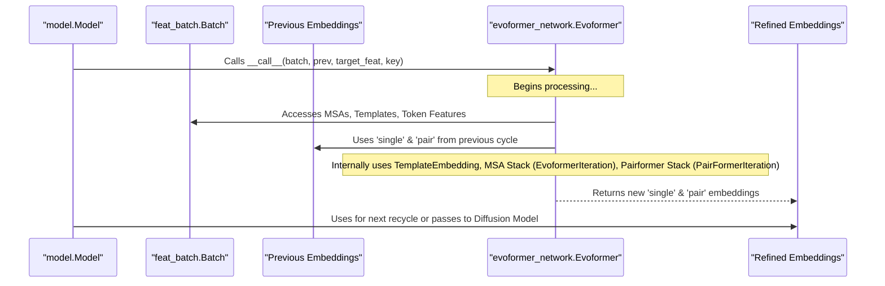

# Chapter 8: Evoformer Network (`evoformer_network.Evoformer`)

In [Chapter 7: Model Configuration (`model.Model.Config`, `model_config.GlobalConfig`)](07_model_configuration___model_model_config____model_config_globalconfig___.md), we learned how AlphaFold 3's "master control panel" (the configuration objects) dictates the architecture and settings for all its components. This setup prepares the stage for the main analytical engine of AlphaFold 3.

Now, it's time to meet that engine: the **Evoformer Network** (`evoformer_network.Evoformer`). This is the "main brain" of AlphaFold 3, responsible for deeply processing all the input features and iteratively building a sophisticated understanding of the molecule(s) you want to predict.

## What's the Big Deal About the Evoformer?

Imagine a brilliant detective working on a complex case. The detective gathers various clues: witness statements (like your input sequences), forensic reports (like MSAs showing evolutionary relatives), and perhaps photos of similar crime scenes (like structural templates). The detective doesn't just look at each clue once. They go over them repeatedly, cross-referencing, looking for hidden connections, and gradually forming a clearer picture of what happened.

The Evoformer Network is like this detective. It takes all the numerical "clues" prepared in [Chapter 6: Feature Representation (`features.BatchDict`, `feat_batch.Batch`)](06_feature_representation___features_batchdict____feat_batch_batch___.md) – information about individual residues, pairs of residues, and Multiple Sequence Alignments (MSAs) – and processes them through many layers of computation.

Its main jobs are to:
1.  **Integrate Diverse Information**: Combine clues from the sequence itself, evolutionary information from MSAs, and (if available) structural hints from templates.
2.  **Find Relationships**: Use special "attention" mechanisms to identify important connections and dependencies between different residues, even if they are far apart in the sequence.
3.  **Iteratively Refine Understanding**: Go through multiple cycles of processing (called "recycling" or "iterations"), where the understanding from one cycle helps improve the next.
4.  **Produce Rich Embeddings**: The final output is a set of highly informative numerical arrays called "embeddings." These embeddings represent a deep, learned understanding of the protein's characteristics, which the next part of AlphaFold 3 will use to predict the 3D structure.

Think of the Evoformer as the part of AlphaFold 3 that does the heavy lifting of "thinking" about the molecule.

## Key Concepts Processed by the Evoformer

The Evoformer works with several key types of information and concepts:

*   **Single Representation (Sequence/Token Features)**: This is information about each individual building block (token) of your molecule, like the type of amino acid or nucleotide.
*   **Pair Representation (Pair Features)**: This captures information about pairs of tokens. For example, initial guesses about how close two amino acids might be, or whether they are likely to interact.
*   **MSA Representation**: The collection of evolutionarily related sequences (MSAs). The Evoformer uses this to understand which parts of your sequence are conserved and which parts might be co-evolving (changing together), hinting at spatial proximity.
*   **(Optional) Template Representation**: If you provide known similar structures (templates), the Evoformer incorporates information from them, like distances between residues in those templates.

The Evoformer uses sophisticated techniques to process these:

*   **Attention Mechanisms**: This is a core idea. Imagine the Evoformer has many "spotlights." It can dynamically focus these spotlights on the most relevant parts of the input data to make decisions.
    *   **MSA Attention**: Looks across different sequences in the MSA for a given position, or across different positions within a sequence, to find patterns.
    *   **Pairwise Attention (Triangle Attention)**: Examines relationships between triplets of residues (e.g., A-B, B-C, and A-C) to build a consistent understanding of pairwise interactions. This is very powerful for inferring 3D geometry.
*   **Iterative Refinement (Recycling)**: The main AlphaFold 3 model often runs the Evoformer multiple times. The output embeddings from one pass are fed back as input (the `prev` argument) to the next pass. Each "recycle" allows the Evoformer to build upon its previous understanding and refine it.

## How is the Evoformer Used?

The `evoformer_network.Evoformer` is a Haiku module, a building block for neural networks in JAX. It's instantiated and used within the main `alphafold3.model.model.Model` class. Its specific architecture and behavior are defined by its configuration object, `Evoformer.Config`, which we saw in [Chapter 7: Model Configuration (`model.Model.Config`, `model_config.GlobalConfig`)](07_model_configuration___model_model_config____model_config_globalconfig___.md).

Here's a conceptual idea of how the main `Model` might use the Evoformer:

```python
# Conceptual: Inside the AlphaFold 3 Model's __call__ method
# (Actual instantiation happens during Model.__init__)
# from alphafold3.model.network import evoformer as evoformer_network
# from alphafold3.model import model_config # For model_config.GlobalConfig
# import haiku as hk # For key and module management

# Assume self.config is the Model.Config and batch is feat_batch.Batch
# evoformer_module = evoformer_network.Evoformer(
#     config=self.config.evoformer, # The specific Evoformer settings
#     global_config=self.config.global_config
# )

# Prepare initial 'previous' embeddings (often zeros for the first pass)
# prev_embeddings = { 'pair': initial_pair_zeros, 'single': initial_single_zeros }
# target_feat = create_target_feat_embedding(batch, ...) # Basic token features

# Call the Evoformer (this might be in a loop for recycles)
# refined_embeddings = evoformer_module(
#     batch=batch,             # Contains MSAs, templates, etc.
#     prev=prev_embeddings,    # Embeddings from previous recycle (or zeros)
#     target_feat=target_feat, # Basic sequence/token features
#     key=hk.next_rng_key()    # For any random operations
# )

# The refined_embeddings dictionary now holds updated 'single' and 'pair' arrays.
# print(f"Evoformer produced embeddings: single shape {refined_embeddings['single'].shape}")
```
When run, this would (if shapes were small and printable):
```
Evoformer produced embeddings: single shape (num_residues, seq_channel_dim)
```
This shows the Evoformer taking the prepared `batch` of features, any `prev`ious refined understanding, and the `target_feat`, then outputting a new, more refined set of `single` and `pair` embeddings.

## Under the Hood: The Evoformer's Workflow

The `evoformer_network.Evoformer`'s `__call__` method orchestrates a sophisticated flow of information. Let's visualize the main players:



Here's a simplified step-by-step breakdown of what happens inside the `Evoformer.__call__` method:

1.  **Initialization & Input Combination**:
    *   The `pair_activations` (pair representation) are initialized. This involves combining:
        *   Information derived from `target_feat` (basic token features).
        *   The `pair` component of `prev` (embeddings from the previous recycle, if any).
    *   Relative positional encodings are added (telling the model how far apart residues are in the sequence).
    *   Bond information (e.g., for ligands) is embedded and added using `_embed_bonds`.
    *   The `single_activations` (single representation) are initialized from `target_feat` and `prev['single']`.

2.  **Template Embedding (via `_embed_template_pair`)**:
    *   If template information is present in `batch.templates`, it's processed by a `template_modules.TemplateEmbedding` sub-module.
    *   This module uses attention to compare the current `pair_activations` with the template data, extracting useful structural hints.
    *   The resulting template embedding is added to `pair_activations`.

3.  **MSA Processing Stack (via `_embed_process_msa`)**:
    *   The MSA data from `batch.msa` is prepared (e.g., shuffled, truncated).
    *   The `msa_activations` and current `pair_activations` are fed into a stack of `modules.EvoformerIteration` blocks. Each of these blocks:
        *   **Outer Product Mean**: Updates `pair_activations` using information from `msa_activations`. (How MSA patterns suggest residue pairs).
        *   **MSA Attention**: Allows different sequences in the MSA to "talk" to each other and to the `pair_activations`. (Refining MSA understanding based on pair context, and vice-versa).
        *   **MSA Transition**: A small neural network to further process each MSA row.
        *   It also includes Triangle Multiplications and Pair Attention (see below) to update the pair representation within this stack.
    *   The primary output from this stack is an updated `pair_activations`.

4.  **Main Pairformer Stack (Trunk)**:
    *   The (now further refined) `pair_activations` and the `single_activations` are processed by a stack of `modules.PairFormerIteration` blocks. This is the core "trunk" of the Evoformer. Each of these blocks performs several key operations:
        *   **Triangle Multiplications (Outgoing and Incoming)**: These are crucial for geometric reasoning. They update the relationship between residue `i` and `j` by considering all intermediate residues `k`. (e.g., if `i` is close to `k`, and `k` is close to `j`, then `i` and `j` are likely related).
        *   **Pairwise Self-Attention (GridSelfAttention)**: Attention is applied along rows and then columns of the `pair_activations` matrix. This allows residues to attend to other residues based on their pairwise relationship.
        *   **Pair Transition**: A small neural network to further process the `pair_activations`.
        *   **Single Representation Update (Optional but typical in Pairformer)**:
            *   **Single Attention**: Updates `single_activations` by allowing each residue to attend to other residues, guided by information from `pair_activations`.
            *   **Single Transition**: A small neural network for `single_activations`.
    *   Both `pair_activations` and `single_activations` are refined through this stack.

5.  **Output**: The Evoformer returns a dictionary containing the final, highly refined `single` and `pair` embeddings, along with the `target_feat`.

Let's look at a very simplified conceptual code flow from `alphafold3/model/network/evoformer.py` for the `Evoformer.__call__` method:
```python
# Conceptual: Simplified flow within Evoformer.__call__

# --- Initial Setup ---
# pair_activations = initialize_pair_from_target_feat_and_prev(target_feat, prev['pair'])
# pair_activations = self._relative_encoding(batch, pair_activations)
# pair_activations = self._embed_bonds(batch, pair_activations) # Add bond info

# --- 1. Template Embedding ---
# pair_activations, key = self._embed_template_pair(batch, pair_activations, ...)
# print("Template info added to pair activations.")

# --- 2. MSA Stack Processing ---
# # _embed_process_msa internally uses a stack of modules.EvoformerIteration blocks
# pair_activations_from_msa_stack, key = self._embed_process_msa(
#     batch.msa, pair_activations, target_feat, ...
# )
# pair_activations = pair_activations_from_msa_stack # Update
# print("MSAs processed, pair activations updated by MSA stack.")

# --- 3. Initialize Single Activations ---
# single_activations = initialize_single_from_target_feat_and_prev(target_feat, prev['single'])
# print("Single activations initialized.")

# --- 4. Main Pairformer Stack (Trunk) ---
# # This stack uses modules.PairFormerIteration blocks
# def pairformer_layer_logic(inputs):
#   pair_input, single_input = inputs
#   # A PairFormerIteration updates both pair and single representations
#   # It contains Triangle Multiplications, Pair Attention, Single Attention, Transitions
#   updated_pair, updated_single = PairFormerIteration_module(pair_input, single_input, ...)
#   return updated_pair, updated_single
#
# pairformer_stack_processor = hk.experimental.layer_stack(num_trunk_layers)(pairformer_layer_logic)
# pair_activations, single_activations = pairformer_stack_processor((pair_activations, single_activations))
# print("Main Evoformer trunk processing done.")

# --- 5. Return Output ---
# final_embeddings = {'single': single_activations, 'pair': pair_activations, 'target_feat': target_feat}
# return final_embeddings
```
This illustrates the journey of the `single` and `pair` representations as they are progressively refined by different components of the Evoformer, integrating various sources of information. Each `EvoformerIteration` or `PairFormerIteration` block is itself a complex module with multiple attention and transition layers, as hinted in the `modules.py` snippets from [Chapter 7: Model Configuration (`model.Model.Config`, `model_config.GlobalConfig`)](07_model_configuration___model_model_config____model_config_globalconfig___.md).

## Conclusion

The Evoformer Network (`evoformer_network.Evoformer`) is the powerful inference engine at the heart of AlphaFold 3. Like a detective meticulously analyzing clues, it uses sophisticated attention mechanisms and iterative refinement to transform raw input features into rich, context-aware `single` and `pair` embeddings. These embeddings encapsulate a deep understanding of the molecular system, including sequence patterns, evolutionary constraints from MSAs, and geometric hints from templates.

These refined embeddings are the crucial "processed ingredients" that the next stage of AlphaFold 3 needs. In [Chapter 9: Diffusion Model (`diffusion_head.DiffusionHead`)](09_diffusion_model___diffusion_head_diffusionhead___.md), we'll see how the Diffusion Model takes these embeddings and uses them to generate the actual 3D coordinates of the atoms, bringing the structure to life.

---

Generated by [AI Codebase Knowledge Builder](https://github.com/The-Pocket/Tutorial-Codebase-Knowledge)