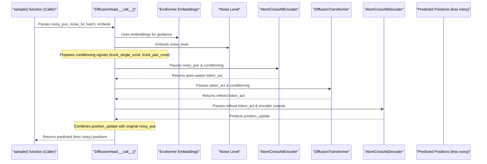

# Chapter 9: Diffusion Model (`diffusion_head.DiffusionHead`)

Welcome to Chapter 9! In [Chapter 8: Evoformer Network (`evoformer_network.Evoformer`)](08_evoformer_network___evoformer_network_evoformer___.md), we saw how the Evoformer acts like a brilliant detective, meticulously analyzing all the input clues (sequences, MSAs, templates) to produce rich, informative "embeddings." These embeddings represent a deep understanding of your molecule. But how do we go from this abstract understanding to an actual 3D shape?

That's where the **Diffusion Model**, specifically the `diffusion_head.DiffusionHead` module, comes into play. This is the "3D sculptor" of AlphaFold 3.

## What's the Big Deal About the Diffusion Model?

Imagine an artist starting with a completely random cloud of dust or a rough, noisy block of stone. The artist has a clear vision in mind (guided by the Evoformer's embeddings). Step by step, the artist refines the noisy material, gradually chipping away or rearranging particles, until a coherent and detailed sculpture emerges.

The `diffusion_head.DiffusionHead` works in a very similar way:
1.  **Starts with Noise**: It begins with a random cloud of 3D points, representing potential atom positions. This is maximum "noise."
2.  **Iterative Refinement (Denoising)**: In a series of steps, it tries to "denoise" this cloud. In each step, it looks at the current noisy arrangement of points and, guided by the Evoformer's embeddings, predicts a slightly cleaner, more structure-like arrangement.
3.  **Guided by Embeddings**: The refined `single` and `pair` embeddings from the [Evoformer Network (`evoformer_network.Evoformer`)](08_evoformer_network___evoformer_network_evoformer___.md) provide the crucial "vision" or "blueprint" that guides this denoising process. They tell the Diffusion Model what a plausible structure should look like.
4.  **Final Output**: After many such refinement steps, the initially random cloud of points converges to the predicted 3D coordinates of the atoms in your molecule.

So, the `diffusion_head.DiffusionHead` is a generative model that "sculpts" the 3D structure from an initial noisy state, using the Evoformer's wisdom as its guide.

## How the Diffusion Model is Used

The `diffusion_head.DiffusionHead` module itself performs *one step* of denoising. The entire iterative sculpting process, from pure noise to the final structure, is orchestrated by a helper function called `diffusion_head.sample()`. This `sample()` function is called by the main AlphaFold 3 `Model` (from `alphafold3/model/model.py`) after the Evoformer has done its work.

Here's a simplified conceptual flow:
1.  The main `Model` gets embeddings from the Evoformer.
2.  It then calls `diffusion_head.sample()`, passing in these embeddings and other necessary information from the [Feature Representation (`features.BatchDict`, `feat_batch.Batch`)](06_feature_representation___features_batchdict____feat_batch_batch___.md).
3.  `diffusion_head.sample()` initializes atom positions to random noise.
4.  It then loops for a pre-defined number of steps (controlled by the model configuration):
    *   In each step, it determines the current "noise level."
    *   It calls the `DiffusionHead` module's `__call__` method (the "denoising_step") with the current noisy positions, the current noise level, and the guiding embeddings.
    *   The `DiffusionHead` module predicts a (slightly) less noisy version of the atom positions.
    *   `sample()` updates the atom positions based on this prediction.
5.  After all steps, `sample()` returns the final refined atom positions.

Let's look at a very conceptual Python snippet illustrating this loop within `diffusion_head.sample()`:
```python
# Conceptual loop inside diffusion_head.sample()

# evoformer_outputs = ... (from Evoformer)
# input_batch_features = ... (from featurisation)
# diffusion_head_module = diffusion_head.DiffusionHead(config, global_config)

# 1. Start with a random cloud of atom positions
# noisy_atom_positions = initialize_with_random_noise_like_a_cloud()

# 2. Define a schedule of decreasing noise levels
# noise_levels_schedule = generate_decreasing_noise_levels() # High to low

# 3. Iteratively denoise
# for current_noise_level in noise_levels_schedule:
#     # diffusion_head_module.__call__ is the core denoising step
#     denoised_prediction = diffusion_head_module(
#         positions_noisy=noisy_atom_positions,
#         noise_level=current_noise_level,
#         batch=input_batch_features,
#         embeddings=evoformer_outputs,
#         use_conditioning=True # Use the Evoformer embeddings
#     )
#     # Update positions for the next iteration
#     noisy_atom_positions = smart_update_based_on_prediction(
#         noisy_atom_positions, denoised_prediction, current_noise_level
#     )

# final_predicted_coordinates = noisy_atom_positions
# print(f"Final coordinates shape: {final_predicted_coordinates.shape}")
```
If you could run this, and `final_predicted_coordinates` were for a small protein, the output might be:
```
Final coordinates shape: (num_residues, max_atoms_per_residue, 3)
```
This indicates that we end up with 3D coordinates (x, y, z) for each atom.

The number of steps in this loop and other parameters of the diffusion process are set in `DiffusionHead.Config.eval` (an instance of `SampleConfig`), which we briefly saw in [Chapter 7: Model Configuration (`model.Model.Config`, `model_config.GlobalConfig`)](07_model_configuration___model_model_config____model_config_globalconfig___.md).

## Under the Hood: A Single Denoising Step (`DiffusionHead.__call__`)

The `DiffusionHead` module's `__call__` method is the heart of the denoising process. Its job is: given the current (noisy) atom positions and the current noise level, predict a cleaner set of positions, guided by the Evoformer embeddings.

Here's a simplified breakdown of what happens inside `DiffusionHead.__call__`:

1.  **Conditioning Signal Preparation (`_conditioning` method)**:
    *   It takes the Evoformer `embeddings` (both `single` and `pair`) and the current `noise_level`.
    *   The `noise_level` itself is converted into an embedding (using `noise_level_embeddings.noise_embeddings`).
    *   These are processed and combined to create `trunk_single_cond` and `trunk_pair_cond`. These are the "guidance" signals derived from Evoformer's wisdom, now aware of how noisy the current structure is.

2.  **Atom Feature Encoding (`atom_cross_attention.atom_cross_att_encoder`)**:
    *   The input `positions_noisy` are first scaled (divided by `sqrt(noise_level**2 + SIGMA_DATA**2)` where `SIGMA_DATA` is a constant like 16.0, representing the typical scale of coordinates).
    *   These scaled, noisy positions, along with the `trunk_single_cond` and `trunk_pair_cond`, are fed into an "Atom Cross-Attention Encoder." This module creates a representation (`enc.token_act`) where each token "knows" about its constituent atoms' noisy positions and the global context from Evoformer.

3.  **Transformer Processing (`diffusion_transformer.Transformer`)**:
    *   The `enc.token_act` from the encoder is further refined by a `diffusion_transformer.Transformer`. This transformer also takes `trunk_single_cond` and `trunk_pair_cond` as conditioning.
    *   This allows information to flow between all tokens, refining the representation in light of the current noise level and overall structural context.

4.  **Atom Position Decoding (`atom_cross_attention.atom_cross_att_decoder`)**:
    *   The output from the transformer is passed to an "Atom Cross-Attention Decoder." This decoder uses the refined token representations to predict an *update* or a target for the atom positions.

5.  **Combining and Returning the Prediction**:
    *   The predicted `position_update` from the decoder is combined with the original `positions_noisy`. The formula is roughly:
        `output = skip_scaling * positions_noisy + out_scaling * position_update`
    *   `skip_scaling` and `out_scaling` are factors derived from `noise_level` and `SIGMA_DATA`. This means the output is a blend of the original noisy input and the network's prediction, carefully weighted by how noisy things are.
    *   The final result is a set of (hopefully) less noisy atom positions.

Let's visualize this one denoising step:


## Under the Hood: The `diffusion_head.sample()` Orchestrator

The `diffusion_head.sample()` function manages the entire iterative process:

1.  **Initialization**: It starts by creating `positions` as random 3D points (Gaussian noise). These initial positions are scaled by the highest noise level defined by `noise_schedule()`.

2.  **Noise Schedule (`noise_schedule(t)`)**: This function defines how the noise level `sigma(t)` decreases as a time-like parameter `t` goes from 0 (start, high noise) to 1 (end, low noise). `SIGMA_DATA = 16.0` is a crucial constant here, setting the overall scale.

3.  **Iteration Loop**: It iterates for a configured number of `steps` (from `SampleConfig`):
    *   **Random Augmentation**: In each step, `random_augmentation()` applies a random rotation and translation to the current `positions`. This makes the model more robust by forcing it to predict structure in different orientations.
    *   **Noise Adjustment (Advanced)**: The exact noise level for the `denoising_step` (`t_hat`) and how positions are perturbed before denoising can involve parameters like `gamma_0` and `noise_scale`. These are details of the specific diffusion sampling algorithm used.
    *   **Call Denoising Step**: It calls the `DiffusionHead.__call__()` method (provided as the `denoising_step` argument to `sample()`) with the current (potentially augmented and re-noised) positions and the target noise level (`t_hat`).
    *   **Update Positions**: The output from `DiffusionHead.__call__()` is used to update the `positions`. A common update rule looks like:
        `grad = (positions_noisy - positions_denoised) / t_hat`
        `positions_next_iteration = positions_noisy + step_scale_factor * (target_next_noise_level - t_hat) * grad`
        This guides the positions from their current noisy state towards the model's denoised prediction.

4.  **Final Output**: After all steps, the `positions` should represent the model's best guess for the 3D atom coordinates.

A simplified look at the `sample` function's core loop:
```python
# Conceptual structure of diffusion_head.sample()

# def sample(denoising_step_fn, batch, key, config: SampleConfig):
#     mask = batch.predicted_structure_info.atom_mask
#     num_samples = config.num_samples # e.g., predict 5 structures

#     # 1. Define noise levels from high to low
#     all_noise_levels = noise_schedule(jnp.linspace(0, 1, config.steps + 1))
#     current_positions = jax.random.normal(key, (num_samples,) + mask.shape + (3,))
#     current_positions *= all_noise_levels[0] # Scale by initial (highest) noise

#     # 2. Loop through noise levels to denoise
#     for i in range(config.steps):
#         noise_level_prev_step = all_noise_levels[i]
#         noise_level_curr_step = all_noise_levels[i+1]
        
#         # Apply random rotations/translations
#         # current_positions = random_augmentation(..., current_positions, ...)
        
#         # Determine target noise for the denoiser call (t_hat)
#         # t_hat = ... (based on noise_level_prev_step and gamma factors)
        
#         # (Potentially add a bit more noise before denoising)
#         # positions_to_denoise = current_positions + some_extra_noise

#         # Call the main DiffusionHead module
#         denoised_target = denoising_step_fn( # This is DiffusionHead.__call__
#             positions_noisy=positions_to_denoise,
#             noise_level=t_hat,
#             # ... other args like batch, embeddings ...
#         )
        
#         # Update current_positions based on denoised_target
#         # current_positions = calculate_next_positions(...)
#     return {'atom_positions': current_positions, 'mask': ...}
```
This `sample` function is powerful because it takes a single-step denoiser (`DiffusionHead.__call__`) and turns it into a full generative process that can create complex structures from scratch.

## Conclusion

The Diffusion Model, implemented in `diffusion_head.DiffusionHead` and orchestrated by `diffusion_head.sample()`, is AlphaFold 3's "3D sculptor." It takes the rich embeddings from the [Evoformer Network (`evoformer_network.Evoformer`)](08_evoformer_network___evoformer_network_evoformer___.md) and, through an iterative process of "denoising" an initially random cloud of points, generates the final 3D atomic coordinates. This generative approach allows AlphaFold 3 to not just understand relationships but to actually build the molecular structure in three-dimensional space.

The final output of this process is a set of 3D coordinates. In the next chapter, we'll explore how AlphaFold 3 represents these coordinates and other structural information: [Chapter 10: Structure Representation (`structure.Structure`)](10_structure_representation___structure_structure___.md).

---

Generated by [AI Codebase Knowledge Builder](https://github.com/The-Pocket/Tutorial-Codebase-Knowledge)