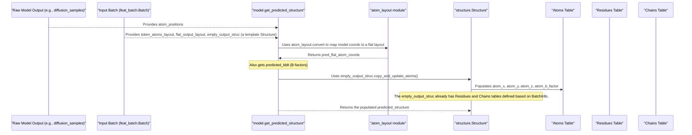

# Chapter 10: Structure Representation (`structure.Structure`)

Welcome to Chapter 10, the final chapter in this part of our AlphaFold 3 tutorial! In [Chapter 9: Diffusion Model (`diffusion_head.DiffusionHead`)](09_diffusion_model___diffusion_head_diffusionhead___.md), we saw how AlphaFold 3's "3D sculptor," the Diffusion Model, takes the rich embeddings from the Evoformer and generates the actual 3D atomic coordinates for your molecule.

But once we have these coordinates, where do they go? How does AlphaFold 3 store not just the (x, y, z) positions, but also all the other vital information that defines a molecule – like which atoms belong to which residues, which residues form chains, how atoms are bonded, and even metadata like a PDB ID or experiment details? This is where the `structure.Structure` object comes in.

## What's the Big Deal About `structure.Structure`?

Imagine you've just received a complex, custom-built machine. You wouldn't just get a pile of parts; you'd get a detailed **3D blueprint and an inventory list**. This blueprint wouldn't just show the final assembled shape; it would also list:
*   Every single component (atoms).
*   How components are grouped into sub-assemblies (residues).
*   How sub-assemblies are connected to form larger units (chains).
*   The connections (bonds) between components.
*   Manufacturer's notes, part numbers, and assembly dates (metadata).

The `structure.Structure` object in AlphaFold 3 is precisely this: **AlphaFold 3's internal "3D blueprint" for a molecule.** It's a comprehensive container that holds all the information needed to fully describe a molecular structure.

It's used for several key purposes:
1.  **Representing Inputs**: When you provide AlphaFold 3 with a known structure as a "template" (see [Chapter 5: Template Representation (`templates.Templates`)](05_template_representation___templates_templates___.md)), that template is often first loaded into a `Structure` object.
2.  **Reference for Training**: During its training, AlphaFold 3 compares its predictions to known, experimentally determined structures. These reference structures are represented as `Structure` objects.
3.  **Holding the Prediction**: Most importantly for us, the final 3D structure predicted by AlphaFold 3 is packaged into a `Structure` object. This is what you ultimately get as the output.

The `structure.Structure` object is designed to be easily converted to and from standard chemical file formats, like mmCIF, making it a versatile workhorse for handling 3D molecular data.

## What's Inside a `structure.Structure` Blueprint?

A `structure.Structure` object (defined in `alphafold3/structure/structure.py`) is more than just a list of atom coordinates. It's a highly organized collection of tables, each holding specific types of information:

*   **`atoms` (an `Atoms` table)**: This is where the core 3D data lives. For each atom, it stores:
    *   Its 3D coordinates (`x`, `y`, `z`).
    *   Its name (e.g., "CA" for alpha-carbon, "O5'" for an oxygen in RNA).
    *   Its element type (e.g., "C", "O", "N").
    *   B-factors (a measure of atomic vibration/uncertainty) and occupancy.
    *   Crucially, it also stores "keys" that link each atom to its parent residue (`res_key`) and chain (`chain_key`).
*   **`residues` (a `Residues` table)**: This table lists all the residues (like amino acids in a protein or nucleotides in DNA/RNA). For each residue, it stores:
    *   Its name (e.g., "ALA" for alanine, "G" for guanine).
    *   Its unique ID within its chain.
    *   A "key" linking it to its parent chain (`chain_key`).
*   **`chains` (a `Chains` table)**: This describes each molecular chain. For each chain, it stores:
    *   Its ID (e.g., "A", "B").
    *   Its type (e.g., protein, DNA, RNA, ligand).
*   **`bonds` (a `Bonds` table)**: This table lists the chemical bonds between atoms, specifying which two atoms are connected and the type of bond.
*   **Global Information**: The `Structure` object also holds metadata about the entire molecule, such as:
    *   `name`: Often the PDB ID if the structure came from the Protein Data Bank.
    *   `release_date`: If applicable.
    *   `experimental_method`: How the structure was determined.

These tables are defined in `alphafold3/structure/structure_tables.py`.

## Using `structure.Structure`: From Model Output to File

As a user of `run_alphafold.py`, your most direct interaction with `structure.Structure` will be when you receive the prediction. The `Model.get_inference_result()` method (in `alphafold3/model/model.py`) prepares the final output, and a key part of this is creating a `structure.Structure` object.

Let's conceptualize how you might get and use a `Structure` object holding a prediction:

```python
# --- Conceptual: This happens inside AlphaFold 3's run script ---
# from alphafold3.model import model # For model.Model and model.get_predicted_structure
# from alphafold3.model import features # For features.BatchDict
# from alphafold3.structure import structure # For structure.Structure

# Assume 'raw_model_output' is the dictionary from the neural network
# and 'input_batch_features' is the feat_batch.Batch object.

# 1. The model's output coordinates and info are converted into a Structure object
# predicted_structure_object: structure.Structure = model.get_predicted_structure(
#     result=raw_model_output,
#     batch=input_batch_features # Contains info to map raw output to Structure
# )
# print(f"Predicted structure name: {predicted_structure_object.name}")

# --- Now you have the predicted_structure_object ---

# 2. Accessing information:
# Let's say you want the x-coordinates of all atoms
# atom_x_coordinates = predicted_structure_object.atoms.x
# print(f"Shape of x-coordinates: {atom_x_coordinates.shape}") # (num_atoms,)

# Get the names of all residues
# residue_names = predicted_structure_object.residues.name
# print(f"First 5 residue names: {residue_names[:5]}")

# Get chain IDs
# chain_ids = predicted_structure_object.chains.id
# print(f"Chain IDs in the structure: {chain_ids}")

# 3. Saving the structure to an mmCIF file (as a string)
# mmcif_string = predicted_structure_object.to_mmcif_string()
# with open("my_prediction.cif", "w") as f:
#     f.write(mmcif_string)
# print("Structure saved to my_prediction.cif")
```
If this code were run:
*   `model.get_predicted_structure` would meticulously assemble a `structure.Structure` object. The `batch` argument contains information about atom types, residue identities, etc., which is used to correctly interpret the raw coordinate outputs from the [Diffusion Model (`diffusion_head.DiffusionHead`)](09_diffusion_model___diffusion_head_diffusionhead___.md).
*   You could then inspect various parts of this `predicted_structure_object`. For example, `predicted_structure_object.atoms` gives you the `Atoms` table, from which you can get `.x`, `.name`, etc.
*   `predicted_structure_object.to_mmcif_string()` converts the entire `Structure` object into the standard mmCIF text format, which you can save to a file and view with molecular visualization software.

You can also create a `structure.Structure` object from an existing mmCIF file, which is useful if you're providing your own templates:
```python
from alphafold3.structure import structure # For structure.from_mmcif
from alphafold3.common import mmcif_parsing # For mmcif_parsing.parse

# Assume 'my_template.cif' is an mmCIF file path
# mmcif_file_content = "" # Load your CIF file content here
# with open("my_template.cif", "r") as f:
#    mmcif_file_content = f.read()

# parsed_mmcif_object = mmcif_parsing.parse(
#     file_id="my_template", mmcif_string=mmcif_file_content
# )

# if parsed_mmcif_object.ok:
#     template_structure: structure.Structure = structure.from_parsed_mmcif(
#         parsed_mmcif_object.mmcif_object
#     )
#     print(f"Loaded template: {template_structure.name} with {template_structure.atoms.size} atoms.")
# else:
#     print(f"Error parsing CIF: {parsed_mmcif_object.error_message}")
```
This demonstrates the versatility of `structure.Structure` for both output and input.

## Under the Hood: Assembling the Blueprint

How is a `structure.Structure` object actually built, for example, from the model's output? It's not just a simple assignment of coordinates. The `model.get_predicted_structure` function carefully uses information from the input `batch` (which contains details from your original [Folding Input (`folding_input.Input`)](01_folding_input___folding_input_input___.md) and the [Chemical Component Dictionary (CCD) Handling (`chemical_components.Ccd`)](02_chemical_component_dictionary__ccd__handling___chemical_components_ccd___.md)) to map the raw predicted coordinates to the correct atoms, residues, and chains.

Let's look at a simplified sequence of how a `Structure` might be assembled from model outputs:

1.  **Model Output**: The neural network (specifically the [Diffusion Model (`diffusion_head.DiffusionHead`)](09_diffusion_model___diffusion_head_diffusionhead___.md)) produces raw `atom_positions` and potentially `predicted_lddt` (for B-factors). These are often in a dense "token-atom" layout that the model works with.
2.  **Layout Conversion**: The `model.get_predicted_structure` function uses helper utilities from `alphafold3.model.atom_layout` (like `atom_layout.compute_gather_idxs` and `atom_layout.convert`). These utilities take the model's output coordinates and rearrange them into a "flat" list of atom coordinates, matching an expected final atom order. This flat order is defined by `batch.convert_model_output.flat_output_layout`, which was determined during the input featurization based on your molecule's sequence and any ligands.
3.  **Populating a Structure**: `batch.convert_model_output.empty_output_struc` is an empty `structure.Structure` object that was also prepared during featurization. It already knows about the chains, residues, and atom names, but its coordinates are all zeros.
    The `get_predicted_structure` function then calls `empty_output_struc.copy_and_update_atoms(...)` to fill in the actual predicted `x, y, z` coordinates and `b_factors` into this structure.
4.  **Result**: The function returns this now-populated `structure.Structure` object.

### The `Structure` Dataclass and its Tables

The `structure.Structure` class itself is a Python dataclass. Here's a very simplified conceptual view:

```python
# Conceptual, simplified representation from alphafold3/structure/structure.py
# from alphafold3.structure import structure_tables
# from alphafold3.structure import bonds as bonds_module
# import dataclasses
# import numpy as np

# @dataclasses.dataclass(frozen=True, kw_only=True)
# class Structure:
#     # Tables holding the detailed data
#     atoms: structure_tables.Atoms
#     residues: structure_tables.Residues
#     chains: structure_tables.Chains
#     bonds: bonds_module.Bonds
#
#     # Global metadata
#     name: str | None = None
#     release_date: str | None = None
#     # ... other global fields like experimental_method, resolution ...
#
#     def to_mmcif_string(self, coords_decimal_places: int = 3) -> str:
#         # ... complex logic to format all tables into mmCIF text ...
#         return "mmCIF formatted string"
#
#     @classmethod
#     def from_parsed_mmcif(cls, mmcif_object, model_id: int = 1) -> 'Structure':
#         # ... complex logic to parse mmcif_object into Atoms, Residues, Chains, Bonds tables ...
#         # atoms_table = structure_tables.Atoms(...)
#         # residues_table = structure_tables.Residues(...)
#         # chains_table = structure_tables.Chains(...)
#         # bonds_table = bonds_module.Bonds(...)
#         # return cls(atoms=atoms_table, ...)
#         pass
```
Each of the tables (`Atoms`, `Residues`, `Chains`, `Bonds`) is also a dataclass, primarily holding NumPy arrays for its columns. For example:

```python
# Conceptual, simplified from alphafold3/structure/structure_tables.py

# @dataclasses.dataclass(frozen=True, kw_only=True)
# class Atoms(table.Table): # Inherits from a base Table class
#     chain_key: np.ndarray  # Foreign key to Chains table
#     res_key: np.ndarray    # Foreign key to Residues table
#     name: np.ndarray       # Atom name, e.g., 'CA', 'N'
#     element: np.ndarray    # Element, e.g., 'C', 'N'
#     x: np.ndarray
#     y: np.ndarray
#     z: np.ndarray
#     b_factor: np.ndarray
#     occupancy: np.ndarray
#     # key: np.ndarray # Primary key for this table

# @dataclasses.dataclass(frozen=True, kw_only=True)
# class Residues(table.Table):
#     chain_key: np.ndarray  # Foreign key to Chains table
#     id: np.ndarray         # Residue ID (number) within its chain
#     name: np.ndarray       # Residue name, e.g., 'ALA', 'G'
#     # key: np.ndarray # Primary key

# @dataclasses.dataclass(frozen=True, kw_only=True)
# class Chains(table.Table):
#     id: np.ndarray         # Chain ID, e.g., 'A', 'B'
#     type: np.ndarray       # protein, rna, dna, ligand
#     # key: np.ndarray # Primary key
```
The `key` field in each table (e.g., `atoms.key`) contains unique integer identifiers for each row in that table. The `chain_key` in `Atoms` and `Residues` tables would contain values from `chains.key`, linking them together. This relational structure allows all the information to be interconnected.

When you call `predicted_structure_object.to_mmcif_string()`, the `Structure` object iterates through its tables and formats their contents according to the mmCIF standard, producing a text string that other molecular software can read.

## Conclusion

The `structure.Structure` object is AlphaFold 3's comprehensive "3D blueprint" for a molecule. It elegantly stores not just the raw atomic coordinates predicted by the model, but also the rich contextual information: how atoms form residues, how residues form chains, their chemical identities, their bonds, and associated metadata.

It serves as the standard way AlphaFold 3 represents structural information, whether it's an input template, a reference structure, or the final predicted output. Its design allows for easy conversion to and from standard file formats like mmCIF, making AlphaFold 3's results readily usable by the wider scientific community.

With this chapter, we've journeyed through the core data representations and processing stages of AlphaFold 3, from defining the input request to generating and representing the final 3D structure. Understanding these components gives you a solid foundation for appreciating how AlphaFold 3 works and for potentially exploring its capabilities further!

---

Generated by [AI Codebase Knowledge Builder](https://github.com/The-Pocket/Tutorial-Codebase-Knowledge)