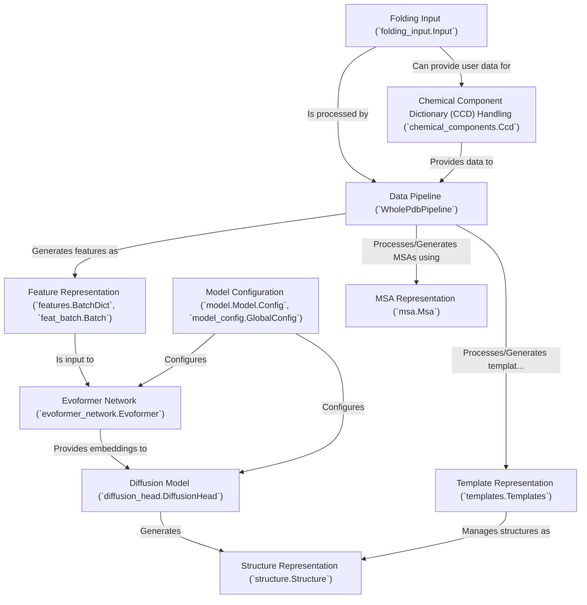

# Tutorial: alphafold3

AlphaFold 3 is a *state-of-the-art AI model* that predicts the **3D structures of proteins, DNA, RNA, and their complexes with small molecules (ligands)**.
It takes user-defined molecular sequences and related biological data as input, processes this information through a sophisticated deep learning network (primarily the *Evoformer* and a *Diffusion Model*), and outputs a predicted 3D atomic model of the complex.

**Source Repository:** [https://github.com/google-deepmind/alphafold3](https://github.com/google-deepmind/alphafold3)

## Chapters

1. [Folding Input (`folding_input.Input`)
](01_folding_input___folding_input_input___.md)
2. [Chemical Component Dictionary (CCD) Handling (`chemical_components.Ccd`)
](02_chemical_component_dictionary__ccd__handling___chemical_components_ccd___.md)
3. [Data Pipeline (`WholePdbPipeline`)
](03_data_pipeline___wholepdbpipeline___.md)
4. [MSA Representation (`msa.Msa`)
](04_msa_representation___msa_msa___.md)
5. [Template Representation (`templates.Templates`)
](05_template_representation___templates_templates___.md)
6. [Feature Representation (`features.BatchDict`, `feat_batch.Batch`)
](06_feature_representation___features_batchdict____feat_batch_batch___.md)
7. [Model Configuration (`model.Model.Config`, `model_config.GlobalConfig`)
](07_model_configuration___model_model_config____model_config_globalconfig___.md)
8. [Evoformer Network (`evoformer_network.Evoformer`)
](08_evoformer_network___evoformer_network_evoformer___.md)
9. [Diffusion Model (`diffusion_head.DiffusionHead`)
](09_diffusion_model___diffusion_head_diffusionhead___.md)
10. [Structure Representation (`structure.Structure`)
](10_structure_representation___structure_structure___.md)

---

Generated by [AI Codebase Knowledge Builder](https://github.com/The-Pocket/Tutorial-Codebase-Knowledge)